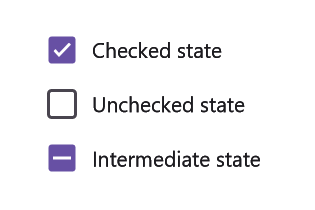

# Events in .NET MAUI CheckBox

## StateChanged event

The `StateChanged` event occurs when the value or state of the [`IsChecked`](https://help.syncfusion.com/cr/maui/Syncfusion.Maui.Buttons.SfCheckBox.html#Syncfusion_Maui_Buttons_SfCheckBox_IsChecked) property is changed, either by interacting with the CheckBox or by setting the value programmatically using XAML or C# code. The event arguments are of type [`StateChangedEventArgs`](https://help.syncfusion.com/cr/maui/Syncfusion.Maui.Buttons.StateChangedEventArgs.html), exposing the following property:

* [`IsChecked`](https://help.syncfusion.com/cr/maui/Syncfusion.Maui.Buttons.SfCheckBox.html#Syncfusion_Maui_Buttons_SfCheckBox_IsChecked) : This represents the new state value of the CheckBox.




<syncfusion:SfCheckBox x:Name="checkBox" Text="Unchecked State" IsThreeState="True" StateChanged="CheckBox_StateChanged"/>




SfCheckBox checkBox = new SfCheckBox();
checkBox.Text = "Unchecked State";
checkBox.IsThreeState = true;
checkBox.StateChanged += CheckBox_StateChanged;
this.Content = checkBox;
	






private void CheckBox_StateChanged(object sender, Syncfusion.Maui.Buttons.StateChangedEventArgs e)
{
    if (e.IsChecked.HasValue && e.IsChecked.Value)
    {
        checkBox.Text = "Checked State";
    }
    else if(e.IsChecked.HasValue && !e.IsChecked.Value)
    {
        checkBox.Text = "Unchecked State";
    }
    else
    {
    checkBox.Text = "Indeterminate State";
    }
}




## StateChanging event

The [StateChanging](https://help.syncfusion.com/cr/maui/Syncfusion.Maui.Buttons.StateChangingEventArgs.html) event is triggered when the state of the [IsChecked](https://help.syncfusion.com/cr/maui/Syncfusion.Maui.Buttons.SfCheckBox.html#Syncfusion_Maui_Buttons_SfCheckBox_IsChecked) property is about to change by tapping the CheckBox control. The event arguments are of type [`StateChangingEventArgs`](https://help.syncfusion.com/cr/maui/Syncfusion.Maui.Buttons.StateChangedEventArgs.html), providing the following properties:

* [IsChecked](https://help.syncfusion.com/cr/maui/Syncfusion.Maui.Buttons.SfCheckBox.html#Syncfusion_Maui_Buttons_SfCheckBox_IsChecked) : Represents the new state value of the CheckBox.
* `Cancel` : Gets or sets a value indicating whether the event should be canceled.




<syncfusion:SfCheckBox x:Name="checkBox" Text="CheckBox" StateChanging="OnStateChanging"/>




SfCheckBox checkBox = new SfCheckBox();
checkBox.Text = "CheckBox";
checkBox.StateChanging += OnStateChanging;
this.Content = checkBox;
	






private void OnStateChanging(object sender, StateChangingEventArgs e)
{
    e.cancel=true;
}


