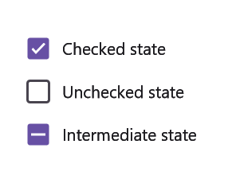

# Events in .NET MAUI CheckBox

The [.NET MAUI CheckBox](https://help.syncfusion.com/cr/maui/Syncfusion.Maui.Buttons.SfCheckBox.html) raises events before and after the state changes.

## Prerequisites

Before using the [SfCheckBox](https://help.syncfusion.com/cr/maui/Syncfusion.Maui.Buttons.SfCheckBox.html), ensure the following NuGet package is installed in your .NET MAUI project:

- `Syncfusion.Maui.Buttons`

For a step-by-step setup, refer to the [Getting Started](https://help.syncfusion.com/maui/checkbox/getting-started) documentation.

## StateChanged event

The [StateChanged](https://help.syncfusion.com/cr/maui/Syncfusion.Maui.Buttons.ToggleButton.html#Syncfusion_Maui_Buttons_ToggleButton_StateChanged) event occurs when the value of the [IsChecked](https://help.syncfusion.com/cr/maui/Syncfusion.Maui.Buttons.SfCheckBox.html#Syncfusion_Maui_Buttons_SfCheckBox_IsChecked) property changes, either by user interaction or programmatically through XAML or C# code. The event arguments are of type [StateChangedEventArgs](https://help.syncfusion.com/cr/maui/Syncfusion.Maui.Buttons.StateChangedEventArgs.html), exposing the following property:

* `IsChecked` (bool?) : The new checked state of the CheckBox. Returns `true` when checked, `false` when unchecked, and `null` when the CheckBox is in an indeterminate state (requires [`IsThreeState`](https://help.syncfusion.com/cr/maui/Syncfusion.Maui.Buttons.SfCheckBox.html#Syncfusion_Maui_Buttons_SfCheckBox_IsThreeState) to be enabled).

N> The example below mutates the CheckBox's `Text` inside the handler to visually demonstrate the new state.




<syncfusion:SfCheckBox x:Name="checkBox" 
                       Text="Unchecked State" 
                       IsThreeState="True" 
                       StateChanged="CheckBox_StateChanged"/>




SfCheckBox checkBox = new SfCheckBox();
checkBox.Text = "Unchecked State";
checkBox.IsThreeState = true;
checkBox.StateChanged += CheckBox_StateChanged;
this.Content = checkBox;
	



The `StateChanged` event can be handled in C# as follows:




private void CheckBox_StateChanged(object sender, Syncfusion.Maui.Buttons.StateChangedEventArgs e)
{
    if (e.IsChecked.HasValue && e.IsChecked.Value)
    {
        checkBox.Text = "Checked State";
    }
    else if (e.IsChecked.HasValue && !e.IsChecked.Value)
    {
        checkBox.Text = "Unchecked State";
    }
    else
    {
        checkBox.Text = "Indeterminate State";
    }
}




## StateChanging event

The [StateChanging](https://help.syncfusion.com/cr/maui/Syncfusion.Maui.Buttons.ToggleButton.html#Syncfusion_Maui_Buttons_ToggleButton_StateChanging) event is triggered when the [IsChecked](https://help.syncfusion.com/cr/maui/Syncfusion.Maui.Buttons.SfCheckBox.html#Syncfusion_Maui_Buttons_SfCheckBox_IsChecked) property is about to change, either by user interaction (tapping) or programmatically. The event arguments are of type [StateChangingEventArgs](https://help.syncfusion.com/cr/maui/Syncfusion.Maui.Buttons.StateChangingEventArgs.html), providing the following properties:

* `IsChecked` (bool?) : Represents the new state value of the CheckBox.
* `Cancel` : Set to `true` to cancel the selection change.




<syncfusion:SfCheckBox x:Name="checkBox" 
                       Text="CheckBox" 
                       StateChanging="OnStateChanging"/>




SfCheckBox checkBox = new SfCheckBox();
checkBox.Text = "CheckBox";
checkBox.StateChanging += OnStateChanging;
this.Content = checkBox;
	



The `StateChanging` event can be handled in C# as follows:




private void OnStateChanging(object sender, StateChangingEventArgs e)
{
    // Cancel the state change.
    e.Cancel = true;
}




## See Also

- [Visual customization in .NET MAUI CheckBox](https://help.syncfusion.com/maui/checkbox/visual-customization)
- [Visual states in .NET MAUI CheckBox](https://help.syncfusion.com/maui/checkbox/visual-states)
- [Multiple choice with .NET MAUI CheckBox](https://help.syncfusion.com/maui/checkbox/multiple-choice)