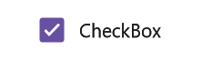
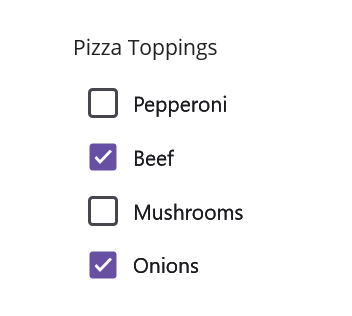

# Getting Started with .NET MAUI CheckBox

This section guides you through setting up and configuring a [CheckBox](https://help.syncfusion.com/cr/maui/Syncfusion.Maui.Buttons.SfCheckBox.html) in your .NET MAUI application. Follow the steps below to add a basic CheckBox to your project.

## Prerequisites

Before proceeding, ensure the following are in place:

    1. Install .NET 7 SDK or later.
    2. Set up a .NET MAUI environment with Visual Studio 2022 (v17.3 or later) or VS Code. For VS Code users, ensure that the .NET MAUI workload  is installed and configured as described here.

To get start quickly with our .NET MAUI CheckBox, you can check the below video.



## Step 1: Create a New MAUI Project

    1. Launch Visual Studio or VS Code.
    2. Navigate to File > New > Project and select the .NET MAUI App template.
    3. Name the project and choose a location, then click Create.

## Step 2: Install the Syncfusion MAUI Buttons NuGet Package

    1. In Solution Explorer, right-click the project and choose Manage NuGet Packages.
    2. Search for Syncfusion.Maui.Buttons and install the latest version.
    3. Ensure the necessary dependencies are installed correctly, and the project is restored.

## step 3: Register the Handler

In the MauiProgram.cs file, register the handler for the Syncfusion core.



using Microsoft.Maui;
using Microsoft.Maui.Hosting;
using Microsoft.Maui.Controls.Compatibility;
using Microsoft.Maui.Controls.Hosting;
using Microsoft.Maui.Controls.Xaml;
using Syncfusion.Maui.Core.Hosting;

namespace ButtonSample
{
    public static class MauiProgram
    {
        public static MauiApp CreateMauiApp()
        {
            var builder = MauiApp.CreateBuilder();
            builder
            .UseMauiApp<App>()
            .ConfigureSyncfusionCore()
            .ConfigureFonts(fonts =>
            {
                fonts.AddFont("OpenSans-Regular.ttf", "OpenSansRegular");
            });

            return builder.Build();
        }      
    }
}   

  

## Step 4 - Add a Basic SfCheckBox

Step 1: Add the NuGet to the project as discussed in the above reference section. 

Step 2: Add the namespace as shown in the following code sample.




    xmlns:syncfusion="clr-namespace:Syncfusion.Maui.Buttons;assembly=Syncfusion.Maui.Buttons"




    using Syncfusion.Maui.Buttons;




Step 3: Set the control to content in `ContentPage`.




    <?xml version="1.0" encoding="utf-8" ?>
    <ContentPage xmlns="http://xamarin.com/schemas/2014/forms"
                 xmlns:x="http://schemas.microsoft.com/winfx/2009/xaml"
                 xmlns:local="clr-namespace:GettingStarted"
	             xmlns:syncfusion="clr-namespace:Syncfusion.Maui.Buttons;assembly=Syncfusion.Maui.Buttons"             
	             x:Class="GettingStarted.MainPage">
        <ContentPage.Content>
            <StackLayout>
                  <syncfusion:SfCheckBox x:Name="checkBox"/>
            </StackLayout>
        </ContentPage.Content>
    </ContentPage>




    using Syncfusion.Maui.Buttons;

    namespace GettingStarted
    {
        public partial class MainPage : ContentPage
        {
            public MainPage()
            {
                InitializeComponent();
                StackLayout stackLayout = new StackLayout();
                SfCheckBox checkBox = new SfCheckBox();
                stackLayout.Children.Add(checkbox);
                this.Content = stackLayout;
            }
        }
    }




## Set the CheckBox caption

You can set the caption of the CheckBox using the [Text]((https://help.syncfusion.com/cr/maui/Syncfusion.Maui.Buttons.ToggleButton.html#Syncfusion_Maui_Buttons_ToggleButton_Text)) property.This caption typically describes the meaning of the check box and is displayed next to the check box.




    <syncfusion:SfCheckBox x:Name="checkBox" IsChecked="True" Text="CheckBox"/>




    SfCheckBox checkBox = new SfCheckBox();
    checkBox.IsChecked = true;
    checkBox.Text = "CheckBox";
    this.Content = checkBox;




 

## Change the check box state

The three visual states of [`SfCheckBox`](https://help.syncfusion.com/cr/maui/Syncfusion.Maui.Buttons.SfCheckBox.html) are: 

* Checked
* Unchecked
* Indeterminate

 

You can change the state of the check box using the [`IsChecked`](https://help.syncfusion.com/cr/maui/Syncfusion.Maui.Buttons.SfCheckBox.html#Syncfusion_Maui_Buttons_SfCheckBox_IsChecked) [`SfCheckBox`](https://help.syncfusion.com/cr/maui/Syncfusion.Maui.Buttons.SfCheckBox.html). In the checked state, a tick mark is added to the visualization of the check box.

<table>
<tr>
<td>
<b>State</b>
</td>
<td>
<b>Property</b>
</td>
<td>
<b>Value</b>
</td>
</tr>
<tr>
<td>
checked
</td>
<td>
IsChecked
</td>
<td>
true
</td>
</tr>
<tr>
<td>
unchecked
</td>
<td>
IsChecked
</td>
<td>
false
</td>
</tr>
<tr>
<td>
indeterminate
</td>
<td>
IsChecked
</td>
<td>
null
</td>
</tr>
</table>

N> For the check box, to report the indeterminate state, set the [`IsThreeState`](https://help.syncfusion.com/cr/maui/Syncfusion.Maui.Buttons.SfCheckBox.html#Syncfusion_Maui_Buttons_SfCheckBox_IsThreeState) property to true.

The check box can be used as a single or as a group. A single check box mostly used for a binary yes/no choice, such as "Remember me?", login scenario, or a terms of service agreement.




    <syncfusion:SfCheckBox x:Name="checkBox" Text="I agree to the terms of services for this site" IsChecked="True"/> 




    SfCheckBox checkBox = new SfCheckBox();
    checkBox.Text = "I agree to the terms of services for this site";
    checkBox.IsChecked = true;
    this.Content = checkBox;




## Using Multiple CheckBoxes

Multiple checkboxes can be used as a group for multi-select scenarios in which a user selects one or more items from the choices that are not mutually exclusive.




    <StackLayout Padding="20">
        <Label x:Name="label" Text="Pizza Toppings" Margin="0,10"/>
        <syncfusion:SfCheckBox x:Name="pepperoni" Text="Pepperoni"/>
        <syncfusion:SfCheckBox x:Name="beef" Text="Beef" IsChecked="True"/>
        <syncfusion:SfCheckBox x:Name="mushroom" Text="Mushrooms"/>
        <syncfusion:SfCheckBox x:Name="onion" Text="Onions" IsChecked="True"/>
    </StackLayout>




        StackLayout stackLayout = new StackLayout() { Padding = 20 };
        Label label = new Label();
        label.Text = "Pizza Toppings";
        label.Margin = new Thickness(0,10);
        SfCheckBox pepperoni = new SfCheckBox();
        pepperoni.Text = "Pepperoni";
        SfCheckBox beef = new SfCheckBox();
        beef.Text = "Beef";
        beef.IsChecked = true;
        SfCheckBox mushroom = new SfCheckBox();
        mushroom.Text = "Mushrooms";
        SfCheckBox onion = new SfCheckBox();
        onion.Text = "Pepperoni";
        onion.IsChecked = true;
        stackLayout.Children.Add(label);
        stackLayout.Children.Add(pepperoni);
        stackLayout.Children.Add(beef);
        stackLayout.Children.Add(mushroom);
        stackLayout.Children.Add(onion);
        this.Content = stackLayout;




## Intermediate

The [SfCheckBox](https://help.syncfusion.com/cr/maui/Syncfusion.Maui.Buttons.SfCheckBox.html) allows an Intermediate state in addition to the checked and unchecked state. The Intermediate state of the check box is enabled by setting the [IsThreeState](https://help.syncfusion.com/cr/maui/Syncfusion.Maui.Buttons.SfCheckBox.html#Syncfusion_Maui_Buttons_SfCheckBox_IsThreeState) property of the control to `True`.

N> When the [IsThreeState](https://help.syncfusion.com/cr/maui/Syncfusion.Maui.Buttons.SfCheckBox.html#Syncfusion_Maui_Buttons_SfCheckBox_IsThreeState) property is set to `False` and [IsChecked](https://help.syncfusion.com/cr/maui/Syncfusion.Maui.Buttons.SfCheckBox.html#Syncfusion_Maui_Buttons_SfCheckBox_IsChecked) property is set to `null` then the check box will be in unchecked state.

The Intermediate state is used when a group of sub-choices has both checked and unchecked states. In the following example, the "Select all" checkbox has the [IsThreeState](https://help.syncfusion.com/cr/maui/Syncfusion.Maui.Buttons.SfCheckBox.html#Syncfusion_Maui_Buttons_SfCheckBox_IsThreeState) property set to `true`. The "Select all" checkbox is checked if all child elements are checked, unchecked if all the child elements are unchecked, and Intermediate otherwise.




    <StackLayout Padding="20">
        <Label x:Name="label" Margin="10" Text="Pizza Toppings"/>
        <syncfusion:SfCheckBox x:Name="selectAll" Text="Select All" StateChanged="SelectAll_StateChanged"/>
        <syncfusion:SfCheckBox x:Name="pepperoni" Text="Pepperoni" StateChanged="CheckBox_StateChanged" Margin="30,0"/>
        <syncfusion:SfCheckBox x:Name="beef" Text="Beef" IsChecked="True" StateChanged="CheckBox_StateChanged" Margin="30,0"/>
        <syncfusion:SfCheckBox x:Name="mushroom" Text="Mushrooms" StateChanged="CheckBox_StateChanged" Margin="30,0"/>
        <syncfusion:SfCheckBox x:Name="onion" Text="Onions" IsChecked="True" StateChanged="CheckBox_StateChanged" Margin="30,0"/>
    </StackLayout>




    StackLayout stackLayout = new StackLayout() { Padding = 20 };
    SfCheckBox selectAll, pepperoni, beef, mushroom, onion;
    Label label = new Label();
    label.Text = "Pizza Toppings";
    label.Margin = new Thickness(10);
    selectAll = new SfCheckBox();
    selectAll.StateChanged += SelectAll_StateChanged;
    selectAll.Text = "Select All";
    pepperoni = new SfCheckBox();
    pepperoni.StateChanged += CheckBox_StateChanged;
    pepperoni.Text = "Pepperoni";
    pepperoni.Margin = new Thickness(30, 0);
    beef = new SfCheckBox();
    beef.StateChanged += CheckBox_StateChanged;
    beef.Text = "Beef";
    beef.IsChecked = true;
    beef.Margin = new Thickness(30, 0);
    mushroom = new SfCheckBox();
    mushroom.StateChanged += CheckBox_StateChanged;
    mushroom.Text = "Mushrooms";
    mushroom.Margin = new Thickness(30, 0);
    onion = new SfCheckBox();
    onion.StateChanged += CheckBox_StateChanged;
    onion.Text = "Onions";
    onion.Margin = new Thickness(30, 0);
    onion.IsChecked = true;
    stackLayout.Children.Add(label);
    stackLayout.Children.Add(selectAll);
    stackLayout.Children.Add(pepperoni);
    stackLayout.Children.Add(beef);
    stackLayout.Children.Add(mushroom);
    stackLayout.Children.Add(onion);
    this.Content = stackLayout;







    bool skip = false;
    private void SelectAll_StateChanged(object sender, Syncfusion.Maui.Buttons.StateChangedEventArgs e)
    {
        if (!skip)
        {
           skip = true;
           pepperoni.IsChecked = beef.IsChecked = mushroom.IsChecked = onion.IsChecked = e.IsChecked;
           skip = false;
        }
    }

    private void CheckBox_StateChanged(object sender, Syncfusion.Maui.Buttons.StateChangedEventArgs e)
    {
        if (!skip)
        {
           skip = true;
           if (pepperoni.IsChecked.Value && beef.IsChecked.Value && mushroom.IsChecked.Value && onion.IsChecked.Value)
               selectAll.IsChecked = true;
           else if (!pepperoni.IsChecked.Value && !beef.IsChecked.Value && !mushroom.IsChecked.Value && !onion.IsChecked.Value)
	           selectAll.IsChecked = false;
           else
               selectAll.IsChecked = null;
           skip = false;
        }
    }
		



You can find the complete getting started sample of the .NET MAUI CheckBox from this [link.](https://github.com/SyncfusionExamples/maui-checkbox-samples)