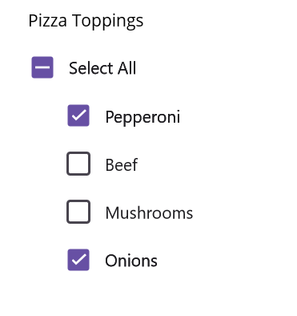
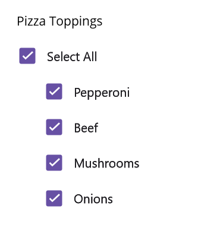

# Multiple Choice with .NET MAUI CheckBox (SfCheckBox)

**Requirements:** .NET MAUI workload installed; `Syncfusion.Maui.Buttons` NuGet package added to the project; Syncfusion .NET MAUI controls registered via `.ConfigureSyncfusionCore()` / `UseSyncfusion*()` in `MauiProgram.cs`. Targets: .NET MAUI 7.0+ and Syncfusion® Essential Studio® MAUI `Syncfusion.Maui.Buttons` package.

The [`SfCheckBox`](https://help.syncfusion.com/cr/maui/Syncfusion.Maui.Buttons.SfCheckBox.html) can be used as a single CheckBox or as part of a group. A single CheckBox is typically used for a binary yes/no choice, such as a "Remember me?" option, a login scenario, or a terms-of-service agreement.

XAML requires the `buttons` namespace:

xmlns:buttons="clr-namespace:Syncfusion.Maui.Buttons;assembly=Syncfusion.Maui.Buttons"

C# requires the following imports:

using Syncfusion.Maui.Buttons;
using Microsoft.Maui.Controls;

## Single CheckBox




<buttons:SfCheckBox x:Name="checkBox" Text="I agree to the terms of services for this site" IsChecked="True"/>




SfCheckBox checkBox = new SfCheckBox();
checkBox.Text = "I agree to the terms of services for this site";
checkBox.IsChecked = true;
this.Content = checkBox;




## Multi-select group

Multiple CheckBoxes can be used as a group for multi-select scenarios where a user selects one or more of several non-mutually-exclusive options. `SfCheckBox` itself is a single-value control; group behavior is implemented by your code, by binding to a collection, or by hosting the CheckBoxes in a layout.




<StackLayout Padding="20">
    <Label x:Name="label" Text="Pizza Toppings" Margin="0,10"/>
    <buttons:SfCheckBox x:Name="pepperoni" Text="Pepperoni"/>
    <buttons:SfCheckBox x:Name="beef" Text="Beef" IsChecked="True"/>
    <buttons:SfCheckBox x:Name="mushroom" Text="Mushrooms"/>
    <buttons:SfCheckBox x:Name="onion" Text="Onions" IsChecked="True"/>
</StackLayout>




StackLayout stackLayout = new StackLayout() { Padding = 20 };
Label label = new Label();
label.Text = "Pizza Toppings";
label.Margin = new Thickness(0, 10);
SfCheckBox pepperoni = new SfCheckBox();
pepperoni.Text = "Pepperoni";
SfCheckBox beef = new SfCheckBox();
beef.Text = "Beef";
beef.IsChecked = true;
SfCheckBox mushroom = new SfCheckBox();
mushroom.Text = "Mushrooms";
SfCheckBox onion = new SfCheckBox();
onion.Text = "Onions";
onion.IsChecked = true;
stackLayout.Children.Add(label);
stackLayout.Children.Add(pepperoni);
stackLayout.Children.Add(beef);
stackLayout.Children.Add(mushroom);
stackLayout.Children.Add(onion);
this.Content = stackLayout;




## Intermediate state

The [`SfCheckBox`](https://help.syncfusion.com/cr/maui/Syncfusion.Maui.Buttons.SfCheckBox.html) supports an indeterminate (intermediate) state in addition to checked and unchecked. The indeterminate state is enabled by setting the [`IsThreeState`](https://help.syncfusion.com/cr/maui/Syncfusion.Maui.Buttons.SfCheckBox.html#Syncfusion_Maui_Buttons_SfCheckBox_IsThreeState) property to `true`. When `IsThreeState` is `true`, the [`IsChecked`](https://help.syncfusion.com/cr/maui/Syncfusion.Maui.Buttons.SfCheckBox.html#Syncfusion_Maui_Buttons_SfCheckBox_IsChecked) property is treated as `bool?` so it can hold a third `null` value.

N> When the [`IsThreeState`](https://help.syncfusion.com/cr/maui/Syncfusion.Maui.Buttons.SfCheckBox.html#Syncfusion_Maui_Buttons_SfCheckBox_IsThreeState) property is set to `false` and the [`IsChecked`](https://help.syncfusion.com/cr/maui/Syncfusion.Maui.Buttons.SfCheckBox.html#Syncfusion_Maui_Buttons_SfCheckBox_IsChecked) property is set to `null`, the CheckBox displays in the unchecked state.

The indeterminate state indicates that a group of sub-choices contains both checked and unchecked items. In the following example, the "Select all" CheckBox has the [`IsThreeState`](https://help.syncfusion.com/cr/maui/Syncfusion.Maui.Buttons.SfCheckBox.html#Syncfusion_Maui_Buttons_SfCheckBox_IsThreeState) property set to `true`. The "Select all" CheckBox is checked if all child items are checked, unchecked if all child items are unchecked, and indeterminate otherwise.

The example listens to the [`StateChanged`](https://help.syncfusion.com/cr/maui/Syncfusion.Maui.Buttons.ToggleButton.html#Syncfusion_Maui_Buttons_ToggleButton_StateChanged) event to keep the parent in sync. A shared `skip` flag is used to prevent the cascading `StateChanged` events raised by programmatic child updates from re-entering the handlers.




<StackLayout Padding="20">
    <Label x:Name="label" Margin="10" Text="Pizza Toppings"/>
    <buttons:SfCheckBox x:Name="selectAll" Text="Select All" IsThreeState="True" IsChecked="{x:Null}" StateChanged="SelectAll_StateChanged"/>
    <buttons:SfCheckBox x:Name="pepperoni" Text="Pepperoni" StateChanged="CheckBox_StateChanged" Margin="30,0"/>
    <buttons:SfCheckBox x:Name="beef" Text="Beef" IsChecked="True" StateChanged="CheckBox_StateChanged" Margin="30,0"/>
    <buttons:SfCheckBox x:Name="mushroom" Text="Mushrooms" StateChanged="CheckBox_StateChanged" Margin="30,0"/>
    <buttons:SfCheckBox x:Name="onion" Text="Onions" IsChecked="True" StateChanged="CheckBox_StateChanged" Margin="30,0"/>
</StackLayout>




public partial class MainPage : ContentPage
{
    // Field shared by both event handlers to guard against re-entrant StateChanged calls.
    bool skip = false;
    SfCheckBox selectAll, pepperoni, beef, mushroom, onion;

    public MainPage()
    {
        InitializeComponent();
        StackLayout stackLayout = new StackLayout() { Padding = 20 };
        Label label = new Label();
        label.Text = "Pizza Toppings";
        label.Margin = new Thickness(10);
        selectAll = new SfCheckBox();
        pepperoni = new SfCheckBox();
        beef = new SfCheckBox();
        onion = new SfCheckBox();
        mushroom = new SfCheckBox();

        pepperoni.StateChanged += CheckBox_StateChanged;
        pepperoni.Text = "Pepperoni";
        pepperoni.Margin = new Thickness(30, 0);

        beef.StateChanged += CheckBox_StateChanged;
        beef.Text = "Beef";
        beef.IsChecked = true;
        beef.Margin = new Thickness(30, 0);

        mushroom.StateChanged += CheckBox_StateChanged;
        mushroom.Text = "Mushrooms";
        mushroom.Margin = new Thickness(30, 0);

        onion.StateChanged += CheckBox_StateChanged;
        onion.Text = "Onions";
        onion.Margin = new Thickness(30, 0);
        onion.IsChecked = true;

        selectAll.StateChanged += SelectAll_StateChanged;
        selectAll.Text = "Select All";
        selectAll.IsThreeState = true;
        selectAll.IsChecked = null;

        stackLayout.Children.Add(label);
        stackLayout.Children.Add(selectAll);
        stackLayout.Children.Add(pepperoni);
        stackLayout.Children.Add(beef);
        stackLayout.Children.Add(mushroom);
        stackLayout.Children.Add(onion);
        this.Content = stackLayout;
    }
}







// When the "Select all" CheckBox changes, mirror its state to every child CheckBox.
private void SelectAll_StateChanged(object sender, Syncfusion.Maui.Buttons.StateChangedEventArgs e)
{
    if (!skip)
    {
        skip = true;
        pepperoni.IsChecked = beef.IsChecked = mushroom.IsChecked = onion.IsChecked = e.IsChecked;
        skip = false;
    }
}

// When any child CheckBox changes, update the "Select all" CheckBox to reflect the group state.
private void CheckBox_StateChanged(object sender, Syncfusion.Maui.Buttons.StateChangedEventArgs e)
{
    if (!skip)
    {
        skip = true;
        bool allChecked = pepperoni.IsChecked == true && beef.IsChecked == true && mushroom.IsChecked == true && onion.IsChecked == true;
        bool allUnchecked = pepperoni.IsChecked == false && beef.IsChecked == false && mushroom.IsChecked == false && onion.IsChecked == false;
        if (allChecked)
            selectAll.IsChecked = true;
        else if (allUnchecked)
            selectAll.IsChecked = false;
        else
            selectAll.IsChecked = null;
        skip = false;
    }
}




You can download the multiple-choice checkbox project for this demo from [GitHub](https://github.com/SyncfusionExamples/Getting-Started-with-.NET-MAUI-CheckBox).

N> Troubleshooting: if events don't fire, verify the `xmlns:buttons` namespace maps to `Syncfusion.Maui.Buttons`, confirm Syncfusion is registered in `MauiProgram.cs`, and ensure `IsThreeState` is `true` before assigning `IsChecked = null` for the indeterminate state. Wrap handler logic in a try/catch so that an error in the handler does not interrupt the CheckBox state update.

## See also

- [How to achieve intermediate state in .NET MAUI CheckBox using MVVM?](https://support.syncfusion.com/kb/article/16162/how-to-achieve-intermediate-state-in-net-maui-checkbox-using-mvvm) — MVVM pattern for indeterminate state.
- [How to set intermediate state in the .NET MAUI CheckBox?](https://support.syncfusion.com/kb/article/14110/how-to-set-intermediate-state-in-the-net-maui-checkbox) — Programmatically set the indeterminate state.