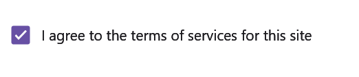
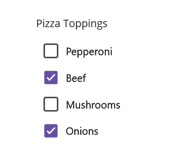
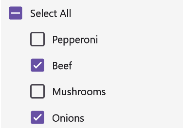
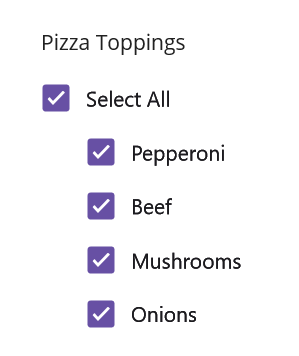

# Multiple Choice with .NET MAUI CheckBox (SfCheckBox)

The [CheckBox](https://help.syncfusion.com/cr/maui/Syncfusion.Maui.Buttons.SfCheckBox.html) can be used as a single or as a group. A single CheckBox is mostly used for a binary yes/no choice, such as "Remember me?", login scenario, or a terms of service agreement.




    <buttons:SfCheckBox x:Name="checkBox" Text="I agree to the terms of services for this site" IsChecked="True"/> 




    SfCheckBox checkBox = new SfCheckBox();
    checkBox.Text = "I agree to the terms of services for this site";
    checkBox.IsChecked = true;
    this.Content = checkBox;




Multiple CheckBoxes can be used as a group for multi-select scenarios where a user selects one or more items from the choices that are not mutually exclusive.




    <StackLayout Padding="20">
        <Label x:Name="label" Text="Pizza Toppings" Margin="0,10"/>
        <buttons:SfCheckBox x:Name="pepperoni" Text="Pepperoni"/>
        <buttons:SfCheckBox x:Name="beef" Text="Beef" IsChecked="True"/>
        <buttons:SfCheckBox x:Name="mushroom" Text="Mushrooms"/>
        <buttons:SfCheckBox x:Name="onion" Text="Onions" IsChecked="True"/>
    </StackLayout>




    StackLayout stackLayout = new StackLayout() { Padding = 20 };
    Label label = new Label();
    label.Text = "Pizza Toppings";
    label.Margin = new Thickness(0,10);
    SfCheckBox pepperoni = new SfCheckBox();
    pepperoni.Text = "Pepperoni";
    SfCheckBox beef = new SfCheckBox();
    beef.Text = "Beef";
    beef.IsChecked = true;
    SfCheckBox mushroom = new SfCheckBox();
    mushroom.Text = "Mushrooms";
    SfCheckBox onion = new SfCheckBox();
    onion.Text = "Pepperoni";
    onion.IsChecked = true;
    stackLayout.Children.Add(label);
    stackLayout.Children.Add(pepperoni);
    stackLayout.Children.Add(beef);
    stackLayout.Children.Add(mushroom);
    stackLayout.Children.Add(onion);
    this.Content = stackLayout;




## Intermediate

The [SfCheckBox](https://help.syncfusion.com/cr/maui/Syncfusion.Maui.Buttons.SfCheckBox.html) allows an Intermediate state in addition to the checked and unchecked state. The Intermediate state is enabled by setting the [IsThreeState](https://help.syncfusion.com/cr/maui/Syncfusion.Maui.Buttons.SfCheckBox.html#Syncfusion_Maui_Buttons_SfCheckBox_IsThreeState) property of the control to `True`.

N> When the [IsThreeState](https://help.syncfusion.com/cr/maui/Syncfusion.Maui.Buttons.SfCheckBox.html#Syncfusion_Maui_Buttons_SfCheckBox_IsThreeState) property is set to `False` and [IsChecked](https://help.syncfusion.com/cr/maui/Syncfusion.Maui.Buttons.SfCheckBox.html#Syncfusion_Maui_Buttons_SfCheckBox_IsChecked) property is set to `null`, the CheckBox will be in unchecked state.

The Intermediate state is used when a group of sub-choices has both checked and unchecked states. In the following example, the "Select all" CheckBox has the [IsThreeState](https://help.syncfusion.com/cr/maui/Syncfusion.Maui.Buttons.SfCheckBox.html#Syncfusion_Maui_Buttons_SfCheckBox_IsThreeState) property set to `true`. The "Select all" CheckBox is checked if all child elements are checked, unchecked if all the child elements are unchecked, and Intermediate otherwise.




    <StackLayout Padding="20">
        <Label x:Name="label" Margin="10" Text="Pizza Toppings"/>
        <buttons:SfCheckBox x:Name="selectAll" Text="Select All" IsThreeState="True" IsChecked="{x:Null}" StateChanged="SelectAll_StateChanged"/>
        <buttons:SfCheckBox x:Name="pepperoni" Text="Pepperoni" StateChanged="CheckBox_StateChanged" Margin="30,0"/>
        <buttons:SfCheckBox x:Name="beef" Text="Beef" IsChecked="True" StateChanged="CheckBox_StateChanged" Margin="30,0"/>
        <buttons:SfCheckBox x:Name="mushroom" Text="Mushrooms" StateChanged="CheckBox_StateChanged" Margin="30,0"/>
        <buttons:SfCheckBox x:Name="onion" Text="Onions" IsChecked="True" StateChanged="CheckBox_StateChanged" Margin="30,0"/>
    </StackLayout>




SfCheckBox selectAll, pepperoni, beef, mushroom, onion;
public MainPage()
{
    InitializeComponent();
    StackLayout stackLayout = new StackLayout() { Padding = 20 };
    Label label = new Label();
    label.Text = "Pizza Toppings";
    label.Margin = new Thickness(10);
    selectAll = new SfCheckBox();
    pepperoni = new SfCheckBox();
    beef = new SfCheckBox();
    onion = new SfCheckBox();
    mushroom = new SfCheckBox();

    pepperoni.StateChanged += CheckBox_StateChanged;
    pepperoni.Text = "Pepperoni";
    pepperoni.Margin = new Thickness(30, 0);

    beef.StateChanged += CheckBox_StateChanged;
    beef.Text = "Beef";
    beef.IsChecked = true;
    beef.Margin = new Thickness(30, 0);

    mushroom.StateChanged += CheckBox_StateChanged;
    mushroom.Text = "Mushrooms";
    mushroom.Margin = new Thickness(30, 0);

    onion.StateChanged += CheckBox_StateChanged;
    onion.Text = "Onions";
    onion.Margin = new Thickness(30, 0);
    onion.IsChecked = true;

    selectAll.StateChanged += SelectAll_StateChanged;
    selectAll.Text = "Select All";
    selectAll.IsThreeState = true;
    selectAll.IsChecked = null;

    stackLayout.Children.Add(label);
    stackLayout.Children.Add(selectAll);
    stackLayout.Children.Add(pepperoni);
    stackLayout.Children.Add(beef);
    stackLayout.Children.Add(mushroom);
    stackLayout.Children.Add(onion);
    this.Content = stackLayout;
}







    bool skip = false;
    private void SelectAll_StateChanged(object sender, Syncfusion.Maui.Buttons.StateChangedEventArgs e)
    {
        if (!skip)
        {
            skip = true;
            pepperoni.IsChecked = beef.IsChecked = mushroom.IsChecked = onion.IsChecked = e.IsChecked;
            skip = false;
        }
    }

    private void CheckBox_StateChanged(object sender, Syncfusion.Maui.Buttons.StateChangedEventArgs e)
    {
        if (!skip)
        {
            skip = true;
            if (pepperoni.IsChecked.Value && beef.IsChecked.Value && mushroom.IsChecked.Value && onion.IsChecked.Value)
                selectAll.IsChecked = true;
            else if (!pepperoni.IsChecked.Value && !beef.IsChecked.Value && !mushroom.IsChecked.Value && !onion.IsChecked.Value)
                selectAll.IsChecked = false;
            else
                selectAll.IsChecked = null;
            skip = false;
        }
    }
        



You can download the getting started project of this demo from [GitHub](https://github.com/SyncfusionExamples/Getting-Started-with-.NET-MAUI-CheckBox)

## See also 

[How to achieve intermediate state in .NET MAUI CheckBox using MVVM?](https://support.syncfusion.com/kb/article/16162/how-to-achieve-intermediate-state-in-net-maui-checkbox-using-mvvm)

[How to set intermediate state in the .NET MAUI CheckBox?](https://support.syncfusion.com/kb/article/14110/how-to-set-intermediate-state-in-the-net-maui-checkbox)