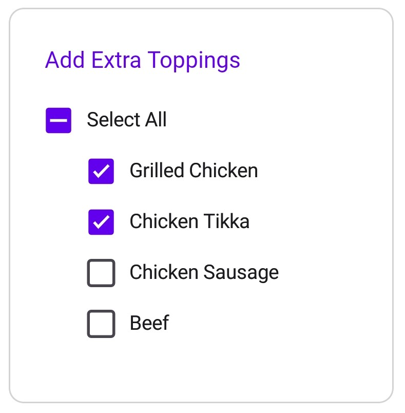

# Overview of .NET MAUI CheckBox (SfCheckBox)

The [.NET MAUI CheckBox](https://help.syncfusion.com/cr/maui/Syncfusion.Maui.Buttons.SfCheckBox.html) is a selection control with UI customization features. It allows you to choose one or more options from a set and customize the appearance for different visual states using the Visual State Manager.

## Key features

 * Supports three states.
 * Allows users to select and clear the control by tapping.
 * Offers customization options for checkbox color, shape, and label text.

