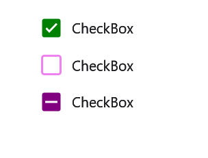
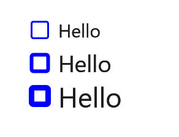
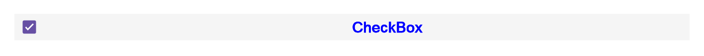

# Visual Customization in .NET MAUI CheckBox (SfCheckBox)

## Customizing a shape

The check box shape can be customized using the [`CornerRadius`] property. This property specifies the uniform radius value to the every corner of the check box.




    <syncfusion:SfCheckBox x:Name="checkBox" Text="CheckBox" IsChecked="True" CornerRadius="5.0"/>
    



    SfCheckBox checkBox = new SfCheckBox();
    checkBox.Text = "CheckBox";
    checkBox.IsChecked = true;
    checkBox.CornerRadius = 5.0f;
    this.Content = checkBox;




## Customizing a state color

The default state colors can be customized using the [`CheckedColor`] and [`UncheckedColor`] properties. The checked or indeterminate state color is updated to the [`CheckedColor`] property value when the state is changed to the checked or indeterminate.The unchecked state color is updated to [`UncheckedColor`] property value when the state is changed to unchecked. 




    <StackLayout>
        <syncfusion:SfCheckBox x:Name="check" Text="CheckBox" IsChecked="True" CheckedColor="Green"/>
        <syncfusion:SfCheckBox x:Name="unCheck" Text="CheckBox" UncheckedColor="Violet"/>
        <syncfusion:SfCheckBox x:Name="intermediate " Text="CheckBox" IsThreeState="True" IsChecked="{x:Null}" CheckedColor="Purple"/> 
    </Stacklayout>




    StackLayout stackLayout = new StackLayout();
    SfCheckBox check = new SfCheckBox();
    check.Text = "CheckBox";
    check.IsChecked = true;
    check.CheckedColor = Colors.Green;
    SfCheckBox uncheck = new SfCheckBox();
    uncheck.Text = "CheckBox";
    uncheck.UncheckedColor = Colors.Violet;
    SfCheckBox intermediate = new SfCheckBox();
    intermediate.IsChecked = null;
    intermediate.IsThreeState = true;
    intermediate.Text = "CheckBox";
    intermediate.CheckedColor = Colors.Purple;
    stackLayout.Children.Add(check);
    stackLayout.Children.Add(uncheck);
    stackLayout.Children.Add(intermediate);
    this.Content = stackLayout;




## StrokeThickness

The tick box stroke thickness of the checkbox control can be customized using the [`StrokeThickness`] property.  




    <StackLayout>
        <syncfusion:SfCheckBox Text="Hello" StrokeThickness="2" UncheckedColor="Blue" FontSize="20"/>
        <syncfusion:SfCheckBox Text="Hello" StrokeThickness="4" UncheckedColor="Blue" FontSize="25"/>
        <syncfusion:SfCheckBox Text="Hello" StrokeThickness="6" UncheckedColor="Blue" FontSize="30"/>
    </StackLayout>




    StackLayout stackLayout = new StackLayout();
    SfCheckBox check1 = new SfCheckBox();
    check1.Text = "Hello";
    check1.StrokeThickness = 2;
    check1.FontSize = 20;
    check1.UncheckedColor = Colors.Blue;
    SfCheckBox check2 = new SfCheckBox();
    check2.Text = "Hello";
    check2.StrokeThickness = 4;
    check2.FontSize = 25;
    check2.UncheckedColor = Colors.Blue;
    SfCheckBox check3 = new SfCheckBox();
    check3.Text = "Hello";
    check3.StrokeThickness = 6;
    check3.FontSize = 30;
    check3.UncheckedColor = Colors.Blue;
    stackLayout.Children.Add(check1);
    stackLayout.Children.Add(check2);
    stackLayout.Children.Add(check3);
    this.Content = stackLayout;




## Setting a caption text appearance

You can customize the display text appearance of the [`SfCheckBox`] control using the following properties:

* [`TextColor`]: Changes the color of the text.
* [`HorizontalTextAlignment`]: Changes the horizontal alignment of the caption text.
* [`FontFamily`]: Changes the font family of the caption text.
* [`FontAttributes`]: Sets font attributes(bold/italic/none) of the caption text.
* [`FontSize`]: Sets font size of the caption text.




    <syncfusion:SfCheckBox x:Name="caption" Text="CheckBox" IsChecked="True" TextColor="Violet" HorizontalTextAlignment="End" FontFamily="Arial" FontAttributes="Bold" FontSize="20"/>           




    SfCheckBox caption = new SfCheckBox();
    caption.IsChecked = true;
    caption.Text = "CheckBox";
    caption.TextColor = Color.Violet;
    caption.HorizontalTextAlignment = TextAlignment.End;
    caption.FontFamily = "Arial";
    caption.FontAttributes = FontAttributes.Bold;
    caption.FontSize = 20;
    this.Content = caption;




 
## TickColor Customization

The [`TickColor`] property customizes the color of the tick in [`SfCheckBox`] control using the following properties:




    <ContentPage xmlns="http://xamarin.com/schemas/2014/forms"
                 xmlns:x="http://schemas.microsoft.com/winfx/2009/xaml"
                 xmlns:syncfusion="clr-namespace:Syncfusion.Maui.Buttons;assembly=Syncfusion.Maui.Buttons" 
                 x:Class="CheckBoxCustomization.checkbox">
         <ContentPage.Content>
                <StackLayout>
                    <syncfusion:SfCheckBox x:Name="checkBox" IsChecked="True" CheckedColor="Aqua" TickColor="Fuchsia" Text="CheckBox" />
                </StackLayout>
         </ContentPage.Content>
    </ContentPage>




    using System;
    using Syncfusion.Maui.Buttons;

    namespace CheckBoxCustomization
    {
        public partial class MainPage : ContentPage
        {
            public MainPage()
            {
                InitializeComponent();
                StackLayout stackLayout = new StackLayout();
                SfCheckBox checkBox = new SfCheckBox();
                checkBox.IsChecked = true;
                checkBox.Text = "CheckBox";
                checkBox.CheckedColor = Color.Aqua;
                checkBox.TickColor = Color.Fuchsia;
                stackLayout.Children.Add(checkBox);
                this.Content = stackLayout;
            }
        }
    }




