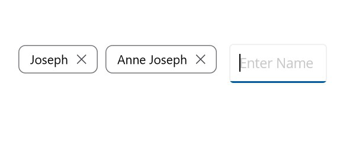
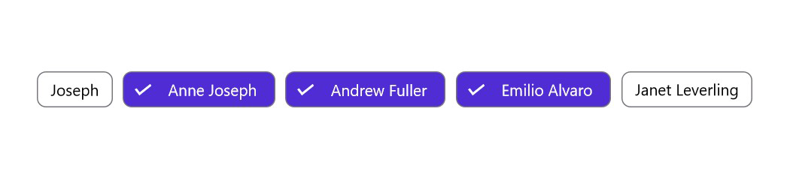
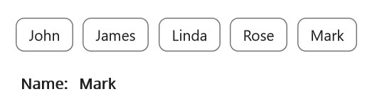

# Chips Types in .NET MAUI Chips

## Input

Arranges the chips in a layout and enables the close button for each chip. Using the close button, a chip can be removed from children and layout as well. Additionally, it has support to add an option at the end of the layout, from which users can obtain the chip text for creating a chip at run time.

The following code illustrates how to get an input type chip.




<chip:SfChipGroup 
                     Margin="200,100,0,0"  
                     ItemsSource="{Binding Employees}" 
                     DisplayMemberPath="Name" 
                     ChipType="Input">
<chip:SfChipGroup.InputView>
<Entry x:Name="entry"
			VerticalOptions="Center" HeightRequest="40"
			FontSize="15" 
			WidthRequest="110" 
			Completed="Entry_Completed"
			>
</Entry>
</chip:SfChipGroup.InputView>

</chip:SfChipGroup>





[MainPage.cs]

using Syncfusion.Maui.Core;

    SfChipGroup chipGroup = new SfChipGroup();
    var entry= new Entry { Margin = new Thickness(10, 10, 0, 0), WidthRequest = 110, HeightRequest = 40 };
    chipGroup.InputView = entry;
    entry.Completed += Entry_Completed;
    this.BindingContext = new ViewModel();
    chipGroup.SetBinding(SfChipGroup.ItemsSourceProperty, "Employees");
    chipGroup.DisplayMemberPath = "Name";
    chipGroup.ChipType = SfChipsType.Input;
   

private void Entry_Completed(object sender, EventArgs e)
{
    var viewModel = this.BindingContext as EmployeeViewModel;
    var name = (sender as InputView).Text;
    viewModel.Employees.Add(new Employee() { Name = name });
    entry.Text = "";    
}
..
[Model]

public class Employee
{
    public string Name { get; set; }
}

[ViewModel]

public class EmployeeViewModel : INotifyPropertyChanged
{

    private ObservableCollection<Employee> employees;

    public event PropertyChangedEventHandler PropertyChanged;

    public ObservableCollection<Employee> Employees
    {
        get
        {

         return employees;

        }
        set
        {
            employees = value;
            OnPropertyChanged(nameof(Employees));
        }

    }

    private string result;
    public string Result
    {
        get { return result; }
        set { result = value; OnPropertyChanged(); }
    }

     public void OnPropertyChanged([CallerMemberName] string name = null) =>

     PropertyChanged?.Invoke(this, new PropertyChangedEventArgs(name));

    public EmployeeViewModel()
    {
        this.Employees = new ObservableCollection<Employee>();

        Employees.Add(new Employee() { Name = "Joseph" });
        Employees.Add(new Employee() { Name = "Anne Joseph" });
        Employees.Add(new Employee() { Name = "Andrew Fuller  " });
        Employees.Add(new Employee() { Name = "Emilio Alvaro" });
        Employees.Add(new Employee() { Name = "Janet Leverling" });
    }

}





## Choice

Allows users to select a single chip from a group of items. Selecting a chip will automatically deselect the previously selected chips. 

Here, we should add visual states to set ChipType to Choice.

The following code illustrates how to get choice typed ChipGroup.




<chip:SfChipGroup    x:Name="sfChipGroup"
                     Margin="200,100,0,0"  
                     ItemsSource="{Binding Employees}" 
                     DisplayMemberPath="Name" 
                     ChipType="Choice">
			
<VisualStateManager.VisualStateGroups>
    <VisualStateGroup x:Name="CommonStates">
        <VisualState x:Name="Normal">
            <VisualState.Setters>
                <Setter Property="ChipTextColor" Value="Black" />
                <Setter Property="ChipBackground" Value="white" />
            </VisualState.Setters>
        </VisualState>
        <VisualState x:Name="Selected">
            <VisualState.Setters>
                <Setter Property="ChipTextColor" Value="White" />
                <Setter Property="ChipBackground" Value="#512dcd" />
            </VisualState.Setters>
        </VisualState>
    </VisualStateGroup>
</VisualStateManager.VisualStateGroups>
</chip:SfChipGroup>





using Syncfusion.Maui.Core;

public MainPage()
	{
		InitializeComponent();

        SfChipGroup chipGroup = new SfChipGroup();
        this.BindingContext = new ViewModel();
        chipGroup.SetBinding(SfChipGroup.ItemsSourceProperty, "Employees");
        chipGroup.DisplayMemberPath = "Name";
        chipGroup.ChipType = SfChipsType.Choice;

        VisualStateGroupList visualStateGroupList = new VisualStateGroupList();
        VisualState normalState = new VisualState() { Name="Normal"};

        VisualStateGroup commonStateGroup = new VisualStateGroup();
        if (sfChipGroup.ChipType == SfChipsType.Choice)
        {
            
            normalState.Setters.Add(new Setter { Property = SfChipGroup.ChipTextColorProperty, Value = Colors.Black });
            normalState.Setters.Add(new Setter { Property = SfChipGroup.ChipBackgroundProperty, Value = Colors.White });
        }

        VisualState selectedState = new VisualState
        {
            Name = "Selected"
        };
        selectedState.Setters.Add(new Setter { Property = SfChipGroup.ChipTextColorProperty, Value = Colors.Green });
        selectedState.Setters.Add(new Setter { Property = SfChipGroup.ChipBackgroundProperty, Value = Colors.Violet });

        commonStateGroup.States.Add(normalState);
        commonStateGroup.States.Add(selectedState);
        visualStateGroupList.Add(commonStateGroup);

        VisualStateManager.SetVisualStateGroups(sfChipGroup, visualStateGroupList);

        }







[Model]

public class Employee
{

    public string Name { get; set; }

}

[ViewModel]

public class EmployeeViewModel : INotifyPropertyChanged
{

    private ObservableCollection<Employee> employees;

    public event PropertyChangedEventHandler PropertyChanged;

    public ObservableCollection<Employee> Employees
    {
        get { return employees; }
        set
        {
            employees = value;
            OnPropertyChanged(nameof(Employees));
        }

    }

    public void OnPropertyChanged([CallerMemberName] string name = null) =>

    PropertyChanged?.Invoke(this, new PropertyChangedEventArgs(name));

    public EmployeeViewModel()
    {
        this.Employees = new ObservableCollection<Employee>();

        Employees.Add(new Employee() { Name = "Joseph" });
        Employees.Add(new Employee() { Name = "Anne Joseph" });
        Employees.Add(new Employee() { Name = "Andrew Fuller  " });
        Employees.Add(new Employee() { Name = "Emilio Alvaro" });
        Employees.Add(new Employee() { Name = "Janet Leverling" });

    }

}



### ChoiceMode

[`Single`] - At least, one item must be in selected state and the selected item cannot be deselected, if [`ChoiceMode`] is Single.

[`SingleOrNone`] - Unlike [`Single`] it is possible to deselect the selected item and keep all the items in deselected state.





<ContentPage
    xmlns:chip ="clr-namespace:Syncfusion.Maui.Core;assembly=Syncfusion.Maui.Core" >
<ContentPage.Content>
		<chip:SfChipGroup ChipType="Choice" ChoiceMode="SingleOrNone">
			<chip.SfChipGroup.Items>
				<chip:SfChip Text="Extra Small"/>
				<chip:SfChip Text="Small"/>
				<chip:SfChip Text="Medium"/>
				<chip:SfChip Text="Large"/>
				<chip:SfChip Text="Extra Large"/>
			</chip:SfChipGroup.Items>
		</chip:SfChipGroup>
	</ContentPage.Content>
</ContentPage>





using Syncfusion.Maui.Core;

namespace Chips
{
	public partial class GettingStarted: ContentPage
	{
		public GettingStarted()
		{
			InitializeComponent();
			Grid grid = new Grid();
			var chipGroup = new SfChipGroup(){ChipType = SfChipsType.Choice, ChoiceMode = ChoiceMode.SingleOrNone};
			grid.Children.Add(chipGroup);
   			chipGroup.HeightRequest = 40;
			chipGroup.Items.Add(new SfChip(){Text="Extra Small"});
			chipGroup.Items.Add(new SfChip(){Text="Small"});
			chipGroup.Items.Add(new SfChip(){Text="Medium"});
			chipGroup.Items.Add(new SfChip(){Text="Large"});
			chipGroup.Items.Add(new SfChip(){Text="Extra Large"});
			this.Content = grid;
		}
	}
}





## Filter

Allows users to select more than one chip in a group of chips. The selected chips are indicated by selection indicator in this type. The selection indicator can be customized using the [`SelectionIndicatorColor`] property. Use the [`SelectedItem`] property to get the list of selected chips.

This selection changes are notified by using [SelectionChanging] and [SelectionChanged] events.

Here, Add visual states to set the ChipType to Filter.

The following code illustrates how to get filter typed ChipGroup.





<chip:SfChipGroup    x:Name="sfChipGroup"
                     Margin="200,100,0,0"  
                     ItemsSource="{Binding Employees}"
                     SelectionIndicatorColor="White" 
                     ChipType="Filter" 
                     DisplayMemberPath="Name" >
					 
<VisualStateManager.VisualStateGroups>
    <VisualStateGroup x:Name="CommonStates">
        <VisualState x:Name="Normal">
            <VisualState.Setters>
                <Setter Property="ChipTextColor" Value="Black" />
                <Setter Property="ChipBackground" Value="white" />
            </VisualState.Setters>
        </VisualState>
        <VisualState x:Name="Selected">
            <VisualState.Setters>
                <Setter Property="ChipTextColor" Value="White" />
                <Setter Property="ChipBackground" Value="#512dcd" />
            </VisualState.Setters>
        </VisualState>
    </VisualStateGroup>
</VisualStateManager.VisualStateGroups>
</chip:SfChipGroup>





using Syncfusion.Maui.Core;

public MainPage()
	{
		InitializeComponent();

        SfChipGroup chipGroup = new SfChipGroup();
        this.BindingContext = new ViewModel();
        chipGroup.SetBinding(SfChipGroup.ItemsSourceProperty, "Employees");
        chipGroup.DisplayMemberPath = "Name";
        chipGroup.SelectionIndicatorColor = Colors.White;
        chipGroup.ChipType = SfChipsType.Filter;

        VisualStateGroupList visualStateGroupList = new VisualStateGroupList();
        VisualState normalState = new VisualState() { Name="Normal"};

        VisualStateGroup commonStateGroup = new VisualStateGroup();
        if (sfChipGroup.ChipType == SfChipsType.Filter)
        {
            normalState.Setters.Add(new Setter { Property = SfChipGroup.ChipTextColorProperty, Value = Colors.Black });
            normalState.Setters.Add(new Setter { Property = SfChipGroup.ChipBackgroundProperty, Value = Colors.White });
        }

        VisualState selectedState = new VisualState
        {
            Name = "Selected"
        };
        selectedState.Setters.Add(new Setter { Property = SfChipGroup.ChipTextColorProperty, Value = Colors.Green });
        selectedState.Setters.Add(new Setter { Property = SfChipGroup.ChipBackgroundProperty, Value = Colors.Violet });

        commonStateGroup.States.Add(normalState);
        commonStateGroup.States.Add(selectedState);
        visualStateGroupList.Add(commonStateGroup);

        VisualStateManager.SetVisualStateGroups(sfChipGroup, visualStateGroupList);

    }







[Model]

public class Employee
{

    public string Name { get; set; }

}

[ViewModel]

public class EmployeeViewModel : INotifyPropertyChanged
{

    private ObservableCollection<Employee> employees;

    public event PropertyChangedEventHandler PropertyChanged;

    private ObservableCollection<string> items = new() { "Joseph", "Alazari", "Rocketuh", "Raja" };
    public ObservableCollection<string> Items
    {
        get { return items; }
        set
        {
            items = value;
            OnPropertyChanged(nameof(Items));
        }
    }

    public ObservableCollection<Employee> Employees
    {
        get { return employees; }
        set
        {
            employees = value;
            OnPropertyChanged(nameof(Employees));
        }

    }

    public void OnPropertyChanged([CallerMemberName] string name = null) =>

    PropertyChanged?.Invoke(this, new PropertyChangedEventArgs(name));

    public EmployeeViewModel()
    {
        this.Employees = new ObservableCollection<Employee>();

        Employees.Add(new Employee() { Name = "Joseph" });
        Employees.Add(new Employee() { Name = "Anne Joseph" });
        Employees.Add(new Employee() { Name = "Andrew Fuller  " });
        Employees.Add(new Employee() { Name = "Emilio Alvaro" });
        Employees.Add(new Employee() { Name = "Janet Leverling" });

    }

}



## Action

Action type of [`SfChipGroup`] executes the [`Command`] when clicking the chip in [`SfChipGroup`]. On its [`Command`] action, you can do our desired action.

The [`Command`] will execute only for action typed [`SfChipGroup`].

The following code illustrates how to get action typed ChipGroup.




<ContentPage.BindingContext>
        <local:ViewModel/>
</ContentPage.BindingContext>
<chip:SfChipGroup
    Command="{Binding ActionCommand}" 
    ItemsSource="{Binding Employees}"
    DisplayMemberPath="Name"
    CloseButtonColor="Black"
    ChipType="Action">
</chip:SfChipGroup>
<StackLayout Orientation="Horizontal">
<Label Margin="10,60,0,0"
	                Text="Name:" 
				    FontAttributes="Bold" 
				    FontSize="14" />
<Label Margin="10,60,0,0"
				Text="{Binding Result}"
				FontAttributes="Bold" 
				FontSize="14" />
</StackLayout>




using Syncfusion.Maui.Core;

    ViewModel viewModel = new ViewModel();
        SfChipGroup chipGroup = new SfChipGroup()
        {
            ItemsSource = viewModel.Employees,
            DisplayMemberPath = "Name",
            CloseButtonColor = Colors.Black,
            ChipType = SfChipsType.Action,
            
        };
        StackLayout stackLayout = new StackLayout()
        {
            Orientation = StackOrientation.Horizontal
        };
        Label nameLabel = new Label()
        {
            Margin = new Thickness(10, 60, 0, 0),
            Text = "Name:",
            FontAttributes = FontAttributes.Bold,
            FontSize = 14
        };
        Label resultLabel = new Label()
        {
            Margin = new Thickness(10, 60, 0, 0),
            FontAttributes = FontAttributes.Bold,
            FontSize = 14,
            
        };
        this.BindingContext = viewModel;
        chipGroup.SetBinding(SfChipGroup.CommandProperty,new Binding( "ActionCommand"));
        resultLabel.SetBinding(Label.TextProperty, new Binding("Result"));
        StackLayout stackLayout2 = new StackLayout();
        stackLayout.Children.Add(nameLabel);
        stackLayout.Children.Add(resultLabel);
        stackLayout2.Children.Add(chipGroup);
        stackLayout2.Children.Add(stackLayout);
        this.Content = stackLayout2;

[Model]

public class Person
{
    public string Name
    {
        get;
        set;
    }
}

[ViewModel]

public class ViewModel : INotifyPropertyChanged
{
    private ICommand actionCommand;

    private ObservableCollection<Person> employees;

    private string result;

    public ICommand ActionCommand
    {
        get { return actionCommand; }
        set { actionCommand = value; }
    }
    
    public ObservableCollection<Person> Employees
    {
        get { return employees; }
        set
        {
            Employees = value;
            OnPropertyChanged("Employees");
        }
    }

    public string Result
    {
        get { return result; }
        set
        {
            result = value;
            OnPropertyChanged("Result");
        }
    }

    public ViewModel()
    {
        ActionCommand = new Command(HandleAction);
        employees = new ObservableCollection<Person>();
        employees.Add(new Person() { Name = "John" });
        employees.Add(new Person() { Name = "James" });
        employees.Add(new Person() { Name = "Linda" });
        employees.Add(new Person() { Name = "Rose" });
        employees.Add(new Person() { Name = "Mark" });
    }

    public event PropertyChangedEventHandler PropertyChanged;

    public void OnPropertyChanged(string property)
    {
        if (PropertyChanged != null)
        {
            PropertyChanged(this, new PropertyChangedEventArgs(property));
        }
    }

    private void HandleAction(object obj)
    {
        Result = (obj as Person).Name.ToString();
    }
}





