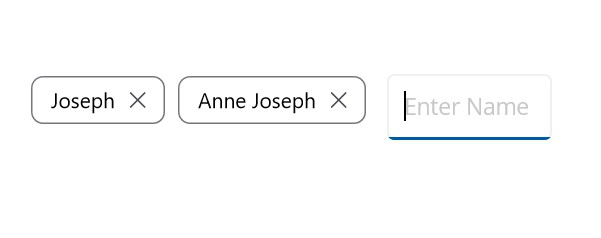
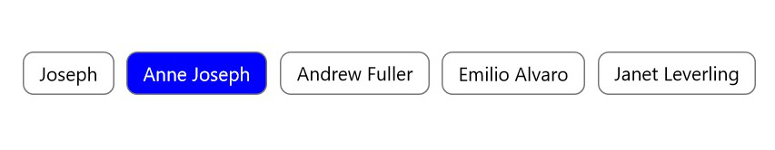
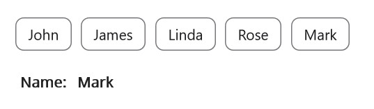

# Chips Types in .NET MAUI Chips (SfChipGroup)

[`SfChipGroup`](https://help.syncfusion.com/cr/maui/Syncfusion.Maui.Core.SfChipGroup.html) supports four `ChipType` values that determine how users interact with the chips. Use the table below to choose the type that matches your scenario.

| ChipType | Use when | Key properties |
|----------|----------|----------------|
| `Input` | Users add and remove chips at runtime; an embedded `InputView` (such as an `Entry`) lets users type a new chip's text. | `InputView`, `ItemsSource`, `DisplayMemberPath` |
| `Choice` | Users select a single chip from a group; selecting another chip deselects the previous one. | `ChoiceMode` (`Single` or `SingleOrNone`) |
| `Filter` | Users select one or more chips; a check mark (selection indicator) marks the selected chips. | `SelectionIndicatorColor`, `SelectedItem`, `SelectedItems` |
| `Action` | Each chip acts like a button; the `Command` is invoked when a chip is clicked. | `Command`, `CommandParameter` |

## Prerequisites

Before using the [SfChip](https://help.syncfusion.com/cr/maui/Syncfusion.Maui.Core.SfChip.html), ensure the following NuGet package is installed in your .NET MAUI project:

- `Syncfusion.Maui.Core`

For a step-by-step setup, refer to the [Getting Started](https://help.syncfusion.com/maui/chips/getting-started) documentation.

## Input

The `Input` [`ChipType`](https://help.syncfusion.com/cr/maui/Syncfusion.Maui.Core.SfChipsType.html) arranges the [.NET MAUI Chips](https://www.syncfusion.com/maui-controls/maui-chips) in a layout, enables a close button for each chip, and provides an embedded `InputView` (an `Entry` in the example below) where users can type the text for a new chip.

### XAML




<chip:SfChipGroup ItemsSource="{Binding Employees}"
                  DisplayMemberPath="Name"
                  ChipType="Input">
    <chip:SfChipGroup.InputView>
        <Entry x:Name="entry"
               VerticalOptions="Center"
               HeightRequest="40"
               FontSize="15"
               WidthRequest="110"
               Completed="OnEntryCompleted" />
    </chip:SfChipGroup.InputView>
</chip:SfChipGroup>




### Code-behind

The following C# code wires up the `Completed` event so a new chip is added when the user presses Enter on the `Entry`. Required `using` directives: `Microsoft.Maui.Controls`, `Syncfusion.Maui.Core`, and your project's `EmployeeViewModel` namespace.




using Microsoft.Maui.Controls;
using Syncfusion.Maui.Core;

namespace ChipsSample;

public partial class MainPage : ContentPage
{
    public MainPage()
    {
        InitializeComponent();
        var entry = new Entry
        {
            VerticalOptions = LayoutOptions.Center,
            FontSize = 15,
            WidthRequest = 110,
            HeightRequest = 40
        };
        entry.Completed += OnEntryCompleted;
        SfChipGroup chipGroup = new SfChipGroup()
        {
            InputView = entry,
            DisplayMemberPath = "Name",
            ChipType = SfChipsType.Input,
        };
        chipGroup.SetBinding(SfChipGroup.ItemsSourceProperty, "Employees");
        this.Content = chipGroup;
        BindingContext = new EmployeeViewModel();
    }

    private void OnEntryCompleted(object sender, EventArgs e)
    {
        if (sender is not Entry entry) return;
        if (BindingContext is not EmployeeViewModel viewModel) return;

        var name = entry.Text;
        if (!string.IsNullOrWhiteSpace(name))
        {
            viewModel.Employees.Add(new Employee { Name = name });
        }
        entry.Text = string.Empty;
    }
}





public class Employee
{
    public string Name { get; set; }
}

public class EmployeeViewModel : INotifyPropertyChanged
{
    private ObservableCollection<Employee> employees;

    public event PropertyChangedEventHandler PropertyChanged;

    public ObservableCollection<Employee> Employees
    {
        get => employees;
        set
        {
            employees = value;
            OnPropertyChanged();
        }
    }

    public EmployeeViewModel()
    {
        Employees = new ObservableCollection<Employee>
        {
            new Employee { Name = "Joseph" },
            new Employee { Name = "Anne Joseph" },
            new Employee { Name = "Andrew Fuller" },
            new Employee { Name = "Emilio Alvaro" },
            new Employee { Name = "Janet Leverling" }
        };
    }

    public void OnPropertyChanged([CallerMemberName] string name = null) =>
        PropertyChanged?.Invoke(this, new PropertyChangedEventArgs(name));
}




The following image illustrates the `Input` `ChipType`:

## Choice

The `Choice` `ChipType` allows users to select a single chip from a group. Selecting a chip automatically deselects the previously selected chip. The visual treatment for the selected state is set via the `Selected` visual state in the `VisualStateManager`.

### XAML




<chip:SfChipGroup x:Name="sfChipGroup"
                  ItemsSource="{Binding Employees}"
                  DisplayMemberPath="Name"
                  HeightRequest="50"
                  ChipType="Choice">
    <VisualStateManager.VisualStateGroups>
        <VisualStateGroup x:Name="CommonStates">
            <VisualState x:Name="Normal">
                <VisualState.Setters>
                    <Setter Property="ChipTextColor" Value="Black" />
                    <Setter Property="ChipBackground" Value="White" />
                </VisualState.Setters>
            </VisualState>
            <VisualState x:Name="Selected">
                <VisualState.Setters>
                    <Setter Property="ChipTextColor" Value="White" />
                    <Setter Property="ChipBackground" Value="#512dcd" />
                </VisualState.Setters>
            </VisualState>
        </VisualStateGroup>
    </VisualStateManager.VisualStateGroups>
</chip:SfChipGroup>




using Microsoft.Maui.Controls;
using Microsoft.Maui.Graphics;
using Syncfusion.Maui.Core;

SfChipGroup sfChipGroup = new SfChipGroup
{
    DisplayMemberPath = "Name",
    HeightRequest = 50,
    ChipType = SfChipsType.Choice
};
sfChipGroup.SetBinding(SfChipGroup.ItemsSourceProperty, "Employees");

var visualStateGroupList = new VisualStateGroupList();
var commonStateGroup = new VisualStateGroup();

var normalState = new VisualState { Name = "Normal" };
normalState.Setters.Add(new Setter { Property = SfChipGroup.ChipTextColorProperty, Value = Colors.Black });
normalState.Setters.Add(new Setter { Property = SfChipGroup.ChipBackgroundProperty, Value = Colors.White });

var selectedState = new VisualState { Name = "Selected" };
selectedState.Setters.Add(new Setter { Property = SfChipGroup.ChipTextColorProperty, Value = Colors.White });
selectedState.Setters.Add(new Setter { Property = SfChipGroup.ChipBackgroundProperty, Value = Color.FromArgb("#512dcd") });

commonStateGroup.States.Add(normalState);
commonStateGroup.States.Add(selectedState);
visualStateGroupList.Add(commonStateGroup);

VisualStateManager.SetVisualStateGroups(sfChipGroup, visualStateGroupList);
this.Content = sfChipGroup;
BindingContext = new EmployeeViewModel();





public class Employee
{
    public string Name { get; set; }
}

public class EmployeeViewModel : INotifyPropertyChanged
{
    private ObservableCollection<Employee> employees;

    public event PropertyChangedEventHandler PropertyChanged;

    public ObservableCollection<Employee> Employees
    {
        get => employees;
        set
        {
            employees = value;
            OnPropertyChanged();
        }
    }

    public EmployeeViewModel()
    {
        Employees = new ObservableCollection<Employee>
        {
            new Employee { Name = "Joseph" },
            new Employee { Name = "Anne Joseph" },
            new Employee { Name = "Andrew Fuller" },
            new Employee { Name = "Emilio Alvaro" },
            new Employee { Name = "Janet Leverling" }
        };
    }

    public void OnPropertyChanged([CallerMemberName] string name = null) =>
        PropertyChanged?.Invoke(this, new PropertyChangedEventArgs(name));
}




The following image illustrates the `Choice` `ChipType`:

### ChoiceMode

The [`ChoiceMode`](https://help.syncfusion.com/cr/maui/Syncfusion.Maui.Core.SfChipGroup.html#Syncfusion_Maui_Core_SfChipGroup_ChoiceMode) property controls selection behavior for the `Choice` `ChipType`. The following values are available:

| ChoiceMode | Behavior |
|------------|----------|
| `Single` | At least one chip must be selected; the selected chip cannot be deselected by the user. |
| `SingleOrNone` | At most one chip is selected; the user can deselect the selected chip, leaving the group with no selection. |




<chip:SfChipGroup ChipType="Choice" HeightRequest="50" ChoiceMode="SingleOrNone">
    <chip:SfChip Text="Extra Small" />
    <chip:SfChip Text="Small" />
    <chip:SfChip Text="Medium" />
    <chip:SfChip Text="Large" />
    <chip:SfChip Text="Extra Large" />
</chip:SfChipGroup>




using Syncfusion.Maui.Core;

SfChipGroup chipGroup = new SfChipGroup
{
    ChipType = SfChipsType.Choice,
    HeightRequest = 50,
    ChoiceMode = ChoiceMode.SingleOrNone
};
chipGroup.Items.Add(new SfChip { Text = "Extra Small" });
chipGroup.Items.Add(new SfChip { Text = "Small" });
chipGroup.Items.Add(new SfChip { Text = "Medium" });
chipGroup.Items.Add(new SfChip { Text = "Large" });
chipGroup.Items.Add(new SfChip { Text = "Extra Large" });
this.Content = chipGroup;




## Filter

The `Filter` `ChipType` allows users to select one or more chips in a group. Selected chips are indicated by a check mark (the selection indicator). The indicator color can be customized using the [`SelectionIndicatorColor`](https://help.syncfusion.com/cr/maui/Syncfusion.Maui.Core.SfChipGroup.html#Syncfusion_Maui_Core_SfChipGroup_SelectionIndicatorColor) property. The currently selected chips are exposed through the [`SelectedItem`](https://help.syncfusion.com/cr/maui/Syncfusion.Maui.Core.SfChipGroup.html#Syncfusion_Maui_Core_SfChipGroup_SelectedItem) and `SelectedItems` properties, and selection changes are notified through the [`SelectionChanging`](https://help.syncfusion.com/cr/maui/Syncfusion.Maui.Core.SfChipGroup.html#Syncfusion_Maui_Core_SfChipGroup_SelectionChanging) and [`SelectionChanged`](https://help.syncfusion.com/cr/maui/Syncfusion.Maui.Core.SfChipGroup.html#Syncfusion_Maui_Core_SfChipGroup_SelectionChanged) events.

### XAML




<chip:SfChipGroup x:Name="sfChipGroup"
                 ItemsSource="{Binding Employees}"
                 HeightRequest="50"
                 SelectionIndicatorColor="White"
                 ChipType="Filter"
                 DisplayMemberPath="Name">
    <VisualStateManager.VisualStateGroups>
        <VisualStateGroup x:Name="CommonStates">
            <VisualState x:Name="Normal">
                <VisualState.Setters>
                    <Setter Property="ChipTextColor" Value="Black" />
                    <Setter Property="ChipBackground" Value="White" />
                </VisualState.Setters>
            </VisualState>
            <VisualState x:Name="Selected">
                <VisualState.Setters>
                    <Setter Property="ChipTextColor" Value="White" />
                    <Setter Property="ChipBackground" Value="#512dcd" />
                </VisualState.Setters>
            </VisualState>
        </VisualStateGroup>
    </VisualStateManager.VisualStateGroups>
</chip:SfChipGroup>




using Microsoft.Maui.Controls;
using Microsoft.Maui.Graphics;
using Syncfusion.Maui.Core;

SfChipGroup sfChipGroup = new SfChipGroup
{
    DisplayMemberPath = "Name",
    SelectionIndicatorColor = Colors.White,
    HeightRequest = 50,
    ChipType = SfChipsType.Filter
};
sfChipGroup.SetBinding(SfChipGroup.ItemsSourceProperty, "Employees");

var visualStateGroupList = new VisualStateGroupList();
var commonStateGroup = new VisualStateGroup();

var normalState = new VisualState { Name = "Normal" };
normalState.Setters.Add(new Setter { Property = SfChipGroup.ChipTextColorProperty, Value = Colors.Black });
normalState.Setters.Add(new Setter { Property = SfChipGroup.ChipBackgroundProperty, Value = Colors.White });

var selectedState = new VisualState { Name = "Selected" };
selectedState.Setters.Add(new Setter { Property = SfChipGroup.ChipTextColorProperty, Value = Colors.White });
selectedState.Setters.Add(new Setter { Property = SfChipGroup.ChipBackgroundProperty, Value = Color.FromArgb("#512dcd") });

commonStateGroup.States.Add(normalState);
commonStateGroup.States.Add(selectedState);
visualStateGroupList.Add(commonStateGroup);

VisualStateManager.SetVisualStateGroups(sfChipGroup, visualStateGroupList);
this.Content = sfChipGroup;
BindingContext = new EmployeeViewModel();





public class Employee
{
    public string Name { get; set; }
}

public class EmployeeViewModel : INotifyPropertyChanged
{
    private ObservableCollection<Employee> employees;

    public event PropertyChangedEventHandler PropertyChanged;

    public ObservableCollection<Employee> Employees
    {
        get => employees;
        set
        {
            employees = value;
            OnPropertyChanged();
        }
    }

    public EmployeeViewModel()
    {
        Employees = new ObservableCollection<Employee>
        {
            new Employee { Name = "Joseph" },
            new Employee { Name = "Anne Joseph" },
            new Employee { Name = "Andrew Fuller" },
            new Employee { Name = "Emilio Alvaro" },
            new Employee { Name = "Janet Leverling" }
        };
    }

    public void OnPropertyChanged([CallerMemberName] string name = null) =>
        PropertyChanged?.Invoke(this, new PropertyChangedEventArgs(name));
}




## Action

The `Action` `ChipType` of [`SfChipGroup`](https://help.syncfusion.com/cr/maui/Syncfusion.Maui.Core.SfChipGroup.html) executes the [`Command`](https://help.syncfusion.com/cr/maui/Syncfusion.Maui.Core.SfChipGroup.html#Syncfusion_Maui_Core_SfChipGroup_Command) when the user clicks a chip. The command only fires for the `Action` `ChipType`. You can pass a `CommandParameter` to the `Command` to provide context to the handler (for example, the clicked `Person`).

### XAML




<VerticalStackLayout>
    <chip:SfChipGroup Command="{Binding ActionCommand}"
                      ItemsSource="{Binding Employees}"
                      DisplayMemberPath="Name"
                      CloseButtonColor="Black"
                      ChipType="Action" />
    <HorizontalStackLayout Margin="0,60,0,0" Spacing="10">
        <Label Text="Name:"
               FontAttributes="Bold"
               FontSize="14" />
        <Label Text="{Binding Result}"
               FontAttributes="Bold"
               FontSize="14" />
    </HorizontalStackLayout>
</VerticalStackLayout>




using Microsoft.Maui.Controls;
using Syncfusion.Maui.Core;

namespace ChipsSample;

public partial class MainPage : ContentPage
{
    public MainPage()
    {
        InitializeComponent();
        var viewModel = new ChipsViewModel();
        BindingContext = viewModel;

        var chipGroup = new SfChipGroup
        {
            ChipType = SfChipsType.Action,
            DisplayMemberPath = nameof(Person.Name),
            CloseButtonColor = Colors.Black,
            ItemsSource = viewModel.Employees
        };

        chipGroup.SetBinding(
            SfChipGroup.CommandProperty,
            nameof(ChipsViewModel.ActionCommand));

        var titleLabel = new Label
        {
            Text = "Name:",
            FontAttributes = FontAttributes.Bold,
            FontSize = 14
        };

        var resultLabel = new Label
        {
            FontAttributes = FontAttributes.Bold,
            FontSize = 14
        };

        resultLabel.SetBinding(
            Label.TextProperty,
            nameof(ChipsViewModel.Result));

        var resultLayout = new HorizontalStackLayout
        {
            Margin = new Thickness(0, 60, 0, 0),
            Spacing = 10,
            Children =
            {
                titleLabel,
                resultLabel
            }
        };

        Content = new VerticalStackLayout
        {
            Children =
            {
                chipGroup,
                resultLayout
            }
        };
    }
}




public class ChipsViewModel : INotifyPropertyChanged
{
    private string result;

    public ICommand ActionCommand { get; }
    public ObservableCollection<Person> Employees { get; }

    public string Result
    {
        get => result;
        set
        {
            result = value;
            OnPropertyChanged();
        }
    }

    public ChipsViewModel()
    {
        ActionCommand = new Command(HandleAction);
        Employees = new ObservableCollection<Person>
        {
            new Person { Name = "John" },
            new Person { Name = "James" },
            new Person { Name = "Linda" },
            new Person { Name = "Rose" },
            new Person { Name = "Mark" }
        };
    }

    private void HandleAction(object obj)
    {
        if (obj is Person person)
        {
            Result = person.Name;
        }
    }

    public event PropertyChangedEventHandler PropertyChanged;
    public void OnPropertyChanged([CallerMemberName] string name = null) =>
        PropertyChanged?.Invoke(this, new PropertyChangedEventArgs(name));
}

public class Person
{
    public string Name { get; set; }
}




The following image illustrates the `Action` `ChipType`:

## Compatibility

| Platform | Notes |
|----------|-------|
| .NET MAUI | Requires .NET MAUI 7.0 or later. |
| iOS, macOS, Android, Windows | `SfChipGroup` is supported on all .NET MAUI target platforms. |

## Troubleshooting

| Issue | Possible cause | Fix |
|------|---------------|-----|
| Chips do not appear on the page. | The `BindingContext` is not set, or the `ItemsSource` is empty. | Set `BindingContext` to the ViewModel and ensure the collection is populated. |
| The `Command` does not fire when a chip is clicked. | `ChipType` is not set to `Action`, or the `Command` property is not bound. | Set `ChipType="Action"` and confirm the `Command` binding path matches a public `ICommand` on the ViewModel. |
| Visual states do not change when a chip is selected. | The `VisualStateManager` groups were set on a different `SfChipGroup` instance than the one displayed. | Call `VisualStateManager.SetVisualStateGroups` on the same `SfChipGroup` you add to the visual tree. |
| `ChoiceMode` has no effect. | The `ChoiceMode` property is set, but `ChipType` is not `Choice`. | Set `ChipType="Choice"` in addition to `ChoiceMode`. |
| The `Completed` event of the input `Entry` does not add a new chip. | The `BindingContext` is not the ViewModel, or the `Entry` is replaced by another control. | Verify the page's `BindingContext` is the ViewModel and the `Entry` is the one declared in the `InputView`. |

## See Also

- [Getting Started](https://help.syncfusion.com/maui/chips/getting-started)
- [Customization](https://help.syncfusion.com/maui/chips/customization)
- [Events](https://help.syncfusion.com/maui/chips/events)
