# Customization in .NET MAUI Chips (SfChip and SfChipGroup)

The [.NET MAUI Chips](https://www.syncfusion.com/maui-controls/maui-chips) controls support customizing the background color, border color, close button color, selection indicator, text, icons, and more. This page documents the customization properties for both [`SfChip`](https://help.syncfusion.com/cr/maui/Syncfusion.Maui.Core.SfChip.html) and [`SfChipGroup`](https://help.syncfusion.com/cr/maui/Syncfusion.Maui.Core.SfChipGroup.html).

## Prerequisites

Before using the [SfChip](https://help.syncfusion.com/cr/maui/Syncfusion.Maui.Core.SfChip.html), ensure the following NuGet package is installed in your .NET MAUI project:

- `Syncfusion.Maui.Core`

For a step-by-step setup, refer to the [Getting Started](https://help.syncfusion.com/maui/chips/getting-started) documentation.

- For `SfChipGroup` samples that bind `ItemsSource` to `Employees`, set the page's `BindingContext` to a ViewModel that exposes an `ObservableCollection<Employee>` (see the [Populating Items](https://help.syncfusion.com/maui/chips/populating-items) page for a complete model and ViewModel).
- For samples that reference an image (e.g., `ChipUserContact.png`, `lion.png`, `jhon.png`), add the image to the `Resources/Images` folder of your .NET MAUI project and register it as a `MauiImage` in the `.csproj` file.

## SfChip Customization

The following properties customize the appearance of an individual `SfChip`.

### ShowCloseButton

The [`ShowCloseButton`](https://help.syncfusion.com/cr/maui/Syncfusion.Maui.Core.SfChip.html#Syncfusion_Maui_Core_SfChip_ShowCloseButton) property sets the visibility of the close button in `SfChip`. The default value is `false`.




<chip:SfChip Text="James"
             ShowCloseButton="True" />




using Syncfusion.Maui.Core;

SfChip chip = new SfChip
{
    Text = "James",
    ShowCloseButton = true
};




### ShowSelectionIndicator

The [`ShowSelectionIndicator`](https://help.syncfusion.com/cr/maui/Syncfusion.Maui.Core.SfChip.html#Syncfusion_Maui_Core_SfChip_ShowSelectionIndicator) property sets the visibility of the selection indicator in `SfChip`. The default value is `false`.




<chip:SfChip Text="James"
             ShowSelectionIndicator="True" />




using Syncfusion.Maui.Core;

SfChip chip = new SfChip
{
    Text = "James",
    ShowSelectionIndicator = true
};




### CloseButtonColor

The [`CloseButtonColor`](https://help.syncfusion.com/cr/maui/Syncfusion.Maui.Core.SfChip.html#Syncfusion_Maui_Core_SfChip_CloseButtonColor) property customizes the color of the close button in `SfChip`. The default value is `Color.FromArgb("#49454E")`.




<chip:SfChip Text="James"
             ShowCloseButton="True"
             CloseButtonColor="Red" />




using Microsoft.Maui.Graphics;
using Syncfusion.Maui.Core;

SfChip chip = new SfChip
{
    Text = "James",
    ShowCloseButton = true,
    CloseButtonColor = Colors.Red
};




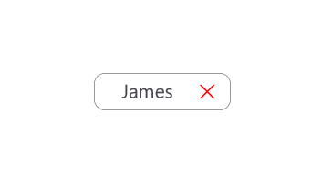

### SelectionIndicatorColor

The [`SelectionIndicatorColor`](https://help.syncfusion.com/cr/maui/Syncfusion.Maui.Core.SfChip.html#Syncfusion_Maui_Core_SfChip_SelectionIndicatorColor) property customizes the selection indicator color in `SfChip`. The default value is `Color.FromRgb(30, 25, 43)`.




<chip:SfChip Text="James"
             ShowSelectionIndicator="True"
             SelectionIndicatorColor="Yellow" />




using Microsoft.Maui.Graphics;
using Syncfusion.Maui.Core;

SfChip chip = new SfChip
{
    Text = "James",
    ShowSelectionIndicator = true,
    SelectionIndicatorColor = Colors.Yellow
};




### Background

The [`Background`](https://help.syncfusion.com/cr/maui/Syncfusion.Maui.Core.ButtonBase.html#Syncfusion_Maui_Core_ButtonBase_Background) property customizes the background color of `SfChip`.




<chip:SfChip Text="James"
             Background="LightCoral" />




using Microsoft.Maui.Graphics;
using Syncfusion.Maui.Core;

SfChip chip = new SfChip
{
    Text = "James",
    Background = Colors.LightCoral
};




### Stroke

The [`Stroke`](https://help.syncfusion.com/cr/maui/Syncfusion.Maui.Core.ButtonBase.html#Syncfusion_Maui_Core_ButtonBase_Stroke) property customizes the border color of `SfChip`.




<chip:SfChip Text="James"
             Stroke="Black" />




using Microsoft.Maui.Graphics;
using Syncfusion.Maui.Core;

SfChip chip = new SfChip
{
    Text = "James",
    Stroke = Colors.Black
};




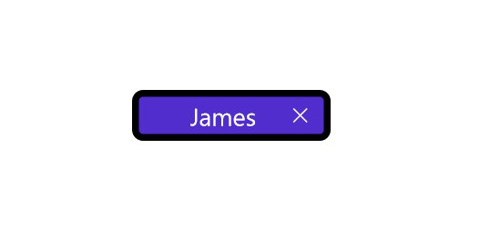

### StrokeThickness

The [`StrokeThickness`](https://help.syncfusion.com/cr/maui/Syncfusion.Maui.Core.ButtonBase.html#Syncfusion_Maui_Core_ButtonBase_StrokeThickness) property customizes the border thickness of `SfChip` on all four sides.




<chip:SfChip Text="James"
             StrokeThickness="7"
             Stroke="Black" />




using Microsoft.Maui.Graphics;
using Syncfusion.Maui.Core;

SfChip chip = new SfChip
{
    Text = "James",
    StrokeThickness = 7,
    Stroke = Colors.Black
};




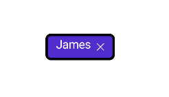

### CornerRadius

The [`CornerRadius`](https://help.syncfusion.com/cr/maui/Syncfusion.Maui.Core.ButtonBase.html#Syncfusion_Maui_Core_ButtonBase_CornerRadius) property customizes the corner radius of `SfChip`. The default value is `new Thickness(8)`.




<chip:SfChip Text="James"
             CornerRadius="25"
             Stroke="Black" />




using Microsoft.Maui.Graphics;
using Syncfusion.Maui.Core;

SfChip chip = new SfChip
{
    Text = "James",
    CornerRadius = 25,
    Stroke = Colors.Black
};




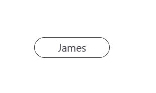

### FontAttributes

The [`FontAttributes`](https://help.syncfusion.com/cr/maui/Syncfusion.Maui.Core.ButtonBase.html#Syncfusion_Maui_Core_ButtonBase_FontAttributes) property customizes the font style of the text in `SfChip`.




<chip:SfChip Text="James"
             FontAttributes="Italic" />




using Syncfusion.Maui.Core;

SfChip chip = new SfChip
{
    Text = "James",
    FontAttributes = FontAttributes.Italic
};




### FontFamily

The [`FontFamily`](https://help.syncfusion.com/cr/maui/Syncfusion.Maui.Core.ButtonBase.html#Syncfusion_Maui_Core_ButtonBase_FontFamily) property customizes the font family of the text in `SfChip`.




<chip:SfChip Text="James"
             FontFamily="Times New Roman" />




using Syncfusion.Maui.Core;

SfChip chip = new SfChip
{
    Text = "James",
    FontFamily = "Times New Roman"
};




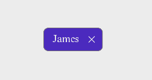

### FontSize

The [`FontSize`](https://help.syncfusion.com/cr/maui/Syncfusion.Maui.Core.ButtonBase.html#Syncfusion_Maui_Core_ButtonBase_FontSize) property customizes the size of the text in `SfChip`. The default value is `14d`.




<chip:SfChip Text="James"
             FontSize="15" />




using Syncfusion.Maui.Core;

SfChip chip = new SfChip
{
    Text = "James",
    FontSize = 15
};




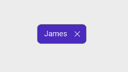

### TextColor

The [`TextColor`](https://help.syncfusion.com/cr/maui/Syncfusion.Maui.Core.ButtonBase.html#Syncfusion_Maui_Core_ButtonBase_TextColor) property customizes the color of the text in `SfChip`. The default value is `Color.FromArgb("#1C1B1F")`.




<chip:SfChip Text="James"
             TextColor="Red" />




using Microsoft.Maui.Graphics;
using Syncfusion.Maui.Core;

SfChip chip = new SfChip
{
    Text = "James",
    TextColor = Colors.Red
};




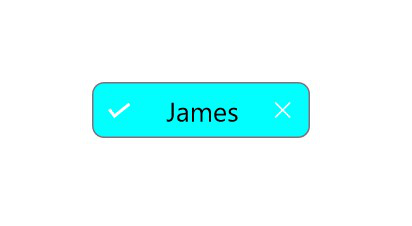

### TextAlignment

The [`HorizontalTextAlignment`](https://help.syncfusion.com/cr/maui/Syncfusion.Maui.Core.ButtonBase.html#Syncfusion_Maui_Core_ButtonBase_HorizontalTextAlignment) and [`VerticalTextAlignment`](https://help.syncfusion.com/cr/maui/Syncfusion.Maui.Core.ButtonBase.html#Syncfusion_Maui_Core_ButtonBase_VerticalTextAlignment) properties customize the alignment of the text in `SfChip`. The default values for both are `TextAlignment.Center`.




<chip:SfChip Text="James"
             ShowCloseButton="True"
             HorizontalTextAlignment="Start"
             VerticalTextAlignment="Center" />




using Syncfusion.Maui.Core;

SfChip chip = new SfChip
{
    Text = "James",
    ShowCloseButton = true,
    HorizontalTextAlignment = TextAlignment.Start,
    VerticalTextAlignment = TextAlignment.Center
};




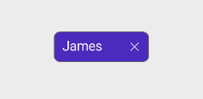

### ShowIcon

The [`ShowIcon`](https://help.syncfusion.com/cr/maui/Syncfusion.Maui.Core.ButtonBase.html#Syncfusion_Maui_Core_ButtonBase_ShowIcon) property specifies whether the image set in `ImageSource` is displayed in the `SfChip`. The default value is `false`.




<chip:SfChip Text="James"
             ImageSource="ChipUserContact.png"
             ShowIcon="True" />




using Microsoft.Maui.Controls;
using Syncfusion.Maui.Core;

SfChip chip = new SfChip
{
    Text = "James",
    ImageSource = ImageSource.FromFile("ChipUserContact.png"),
    ShowIcon = true
};




### ImageSource

The [`ImageSource`](https://help.syncfusion.com/cr/maui/Syncfusion.Maui.Core.ButtonBase.html#Syncfusion_Maui_Core_ButtonBase_ImageSource) property customizes the icon image of `SfChip` by adding a custom image. `ShowIcon` must be `true` for the image to render.




<chip:SfChip Text="James"
             ImageSource="ChipUserContact.png"
             ShowIcon="True" />




using Microsoft.Maui.Controls;
using Syncfusion.Maui.Core;

SfChip chip = new SfChip
{
    Text = "James",
    ImageSource = ImageSource.FromFile("ChipUserContact.png"),
    ShowIcon = true
};




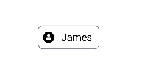

### ImageSize

The [`ImageSize`](https://help.syncfusion.com/cr/maui/Syncfusion.Maui.Core.ButtonBase.html#Syncfusion_Maui_Core_ButtonBase_ImageSize) property customizes the size of the icon image in `SfChip`. `ShowIcon` must be `true` for the size to apply. The default value is `18d`.




<chip:SfChip Text="James"
             ImageSource="ChipUserContact.png"
             ImageSize="30"
             ShowIcon="True" />




using Microsoft.Maui.Controls;
using Syncfusion.Maui.Core;

SfChip chip = new SfChip
{
    Text = "James",
    ImageSource = ImageSource.FromFile("ChipUserContact.png"),
    ImageSize = 30,
    ShowIcon = true
};




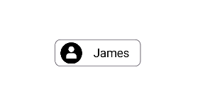

### ImageAlignment

The [`ImageAlignment`](https://help.syncfusion.com/cr/maui/Syncfusion.Maui.Core.ButtonBase.html#Syncfusion_Maui_Core_ButtonBase_ImageAlignment) property customizes the alignment of the icon image in `SfChip`. The default value is `Alignment.Start`.




<chip:SfChip Text="James"
             ImageSource="ChipUserContact.png"
             ImageAlignment="End"
             ShowIcon="True" />




using Microsoft.Maui.Controls;
using Syncfusion.Maui.Core;

SfChip chip = new SfChip
{
    Text = "James",
    ImageSource = ImageSource.FromFile("ChipUserContact.png"),
    ImageAlignment = Alignment.End,
    ShowIcon = true
};




### BackgroundImageSource

The [`BackgroundImageSource`](https://help.syncfusion.com/cr/maui/Syncfusion.Maui.Core.ButtonBase.html#Syncfusion_Maui_Core_ButtonBase_BackgroundImageSource) property customizes the background image of `SfChip`. The image is rendered in the chip's bounds using the default `Aspect` (`AspectFit`).




<chip:SfChip BackgroundImageSource="lion.png" />




using Microsoft.Maui.Controls;
using Syncfusion.Maui.Core;

SfChip chip = new SfChip
{
    BackgroundImageSource = ImageSource.FromFile("lion.png")
};




### Command

The [`Command`](https://help.syncfusion.com/cr/maui/Syncfusion.Maui.Core.ButtonBase.html#Syncfusion_Maui_Core_ButtonBase_Command) property associates a command with an instance of `SfChip`. This property is most often set with the MVVM pattern to bind callbacks back into the ViewModel. You can also pass a `CommandParameter`. The default value is `null`.




<ContentPage.BindingContext>
    <local:CommandDemoViewModel />
</ContentPage.BindingContext>

<chip:SfChip x:Name="Chip"
             Text="James"
             WidthRequest="120"
             Background="{Binding Background}"
             Command="{Binding ButtonCommand}" />




using System.ComponentModel;
using System.Runtime.CompilerServices;
using System.Windows.Input;
using Microsoft.Maui.Graphics;

namespace ChipsSample;

public class CommandDemoViewModel : INotifyPropertyChanged
{
    private Color _background = Colors.Violet;

    public Color Background
    {
        get => _background;
        set
        {
            _background = value;
            OnPropertyChanged();
        }
    }

    public ICommand ButtonCommand => new Command(ToggleBackground);

    public CommandDemoViewModel() => Background = Colors.Violet;

    private void ToggleBackground()
    {
        Background = Background == Colors.DeepSkyBlue ? Colors.Violet : Colors.DeepSkyBlue;
    }

    public event PropertyChangedEventHandler PropertyChanged;
    public void OnPropertyChanged([CallerMemberName] string name = "") =>
        PropertyChanged?.Invoke(this, new PropertyChangedEventArgs(name));
}




## SfChipGroup Customization

The chip group supports customizing the chip's background color, border color, text color, and more. The chip group can be customized using the following properties.

### InputView

The [`InputView`](https://help.syncfusion.com/cr/maui/Syncfusion.Maui.Core.SfChipGroup.html#Syncfusion_Maui_Core_SfChipGroup_InputView) property provides a view to the input chip. In this example, an `Entry` is added as the `InputView` so users can type a new chip's text. The `InputView` is only visible for the `Input` `ChipType`. The default value is `null`.




<chip:SfChipGroup x:Name="chipGroup"
                  ItemsSource="{Binding Employees}"
                  ChipPadding="8,8,0,0"
                  ChipType="Input"
                  DisplayMemberPath="Name">
    <chip:SfChipGroup.InputView>
        <Entry x:Name="entry"
               Placeholder="Enter Name"
               Margin="10,10,0,0"
               WidthRequest="110" />
    </chip:SfChipGroup.InputView>
</chip:SfChipGroup>




using Microsoft.Maui.Controls;
using Microsoft.Maui.Graphics;
using Syncfusion.Maui.Core;

namespace ChipsSample;

public partial class MainPage : ContentPage
{
    public MainPage()
    {
        InitializeComponent();
        BindingContext = new ChipsViewModel();

        var entry = new Entry
        {
            Placeholder = "Enter Name",
            Margin = new Thickness(10, 10, 0, 0),
            WidthRequest = 110
        };

        var chipGroup = new SfChipGroup
        {
            InputView = entry,
            DisplayMemberPath = "Name",
            ChipPadding = new Thickness(8, 8, 0, 0),
            ChipType = SfChipsType.Input
        };
        BindingContext = new EmployeeViewModel();
        chipGroup.SetBinding(SfChipGroup.ItemsSourceProperty, "Employees");

        Content = chipGroup;
    }
}





public class Employee
{
    public string Name { get; set; }
}

public class EmployeeViewModel : INotifyPropertyChanged
{
    private ObservableCollection<Employee> employees;

    public event PropertyChangedEventHandler PropertyChanged;

    public ObservableCollection<Employee> Employees
    {
        get => employees;
        set
        {
            employees = value;
            OnPropertyChanged();
        }
    }

    public EmployeeViewModel()
    {
        Employees = new ObservableCollection<Employee>
        {
            new Employee { Name = "Joseph" },
            new Employee { Name = "Anne Joseph" },
            new Employee { Name = "Andrew Fuller" },
            new Employee { Name = "Emilio Alvaro" },
            new Employee { Name = "Janet Leverling" }
        };
    }

    public void OnPropertyChanged([CallerMemberName] string name = null) =>
        PropertyChanged?.Invoke(this, new PropertyChangedEventArgs(name));
}




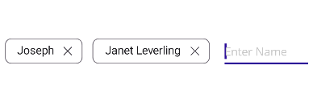

### ChipBackground

The [`ChipBackground`](https://help.syncfusion.com/cr/maui/Syncfusion.Maui.Core.SfChipGroup.html#Syncfusion_Maui_Core_SfChipGroup_ChipBackground) property customizes the background color of the unselected chips in `SfChipGroup`. The default value is `Colors.Transparent`.




<chip:SfChipGroup ItemsSource="{Binding Employees}"
                  DisplayMemberPath="Name"
                  ChipTextColor="White"
                  CloseButtonColor="White"
                  ChipBackground="#512dcd" />




using Microsoft.Maui.Controls;
using Microsoft.Maui.Graphics;
using Syncfusion.Maui.Core;

SfChipGroup chipGroup = new SfChipGroup
{
    DisplayMemberPath = "Name",
    ChipBackground = Color.FromArgb("#512dcd"),
    ChipTextColor = Colors.White,
    CloseButtonColor = Colors.White
};
BindingContext = new EmployeeViewModel();
chipGroup.SetBinding(SfChipGroup.ItemsSourceProperty, "Employees");
this.Content = chipGroup;




public class Employee
{
    public string Name { get; set; }
}

public class EmployeeViewModel : INotifyPropertyChanged
{
    private ObservableCollection<Employee> employees;

    public event PropertyChangedEventHandler PropertyChanged;

    public ObservableCollection<Employee> Employees
    {
        get => employees;
        set
        {
            employees = value;
            OnPropertyChanged();
        }
    }

    public EmployeeViewModel()
    {
        Employees = new ObservableCollection<Employee>
        {
            new Employee { Name = "Joseph" },
            new Employee { Name = "Anne Joseph" },
            new Employee { Name = "Andrew Fuller" },
            new Employee { Name = "Emilio Alvaro" },
            new Employee { Name = "Janet Leverling" }
        };
    }

    public void OnPropertyChanged([CallerMemberName] string name = null) =>
        PropertyChanged?.Invoke(this, new PropertyChangedEventArgs(name));
}




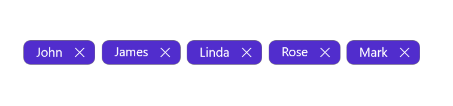

To customize the background color of the **selected** chip, set `ChipType="Choice"` or `ChipType="Filter"` and use the `VisualStateManager`:




<chip:SfChipGroup ItemsSource="{Binding Employees}"
                  DisplayMemberPath="Name"
                  ChipType="Choice">
    <VisualStateManager.VisualStateGroups>
        <VisualStateGroup x:Name="CommonStates">
            <VisualState x:Name="Normal">
                <VisualState.Setters>
                    <Setter Property="ChipBackground" Value="White" />
                </VisualState.Setters>
            </VisualState>
            <VisualState x:Name="Selected">
                <VisualState.Setters>
                    <Setter Property="ChipBackground" Value="#502cd5" />
                </VisualState.Setters>
            </VisualState>
        </VisualStateGroup>
    </VisualStateManager.VisualStateGroups>
</chip:SfChipGroup>




using Microsoft.Maui.Controls;
using Microsoft.Maui.Graphics;
using Syncfusion.Maui.Core;

SfChipGroup chipGroup = new SfChipGroup
{
    DisplayMemberPath = "Name",
    ChipType = SfChipsType.Choice
};
BindingContext = new EmployeeViewModel();
chipGroup.SetBinding(SfChipGroup.ItemsSourceProperty, "Employees");

var visualStateGroupList = new VisualStateGroupList();
var commonStateGroup = new VisualStateGroup();

var normalState = new VisualState { Name = "Normal" };
normalState.Setters.Add(new Setter { Property = SfChipGroup.ChipBackgroundProperty, Value = Colors.White });

var selectedState = new VisualState { Name = "Selected" };
selectedState.Setters.Add(new Setter { Property = SfChipGroup.ChipBackgroundProperty, Value = Color.FromArgb("#502cd5") });

commonStateGroup.States.Add(normalState);
commonStateGroup.States.Add(selectedState);
visualStateGroupList.Add(commonStateGroup);
VisualStateManager.SetVisualStateGroups(chipGroup, visualStateGroupList);
Content = chipGroup;




public class Employee
{
    public string Name { get; set; }
}

public class EmployeeViewModel : INotifyPropertyChanged
{
    private ObservableCollection<Employee> employees;

    public event PropertyChangedEventHandler PropertyChanged;

    public ObservableCollection<Employee> Employees
    {
        get => employees;
        set
        {
            employees = value;
            OnPropertyChanged();
        }
    }

    public EmployeeViewModel()
    {
        Employees = new ObservableCollection<Employee>
        {
            new Employee { Name = "Joseph" },
            new Employee { Name = "Anne Joseph" },
            new Employee { Name = "Andrew Fuller" },
            new Employee { Name = "Emilio Alvaro" },
            new Employee { Name = "Janet Leverling" }
        };
    }

    public void OnPropertyChanged([CallerMemberName] string name = null) =>
        PropertyChanged?.Invoke(this, new PropertyChangedEventArgs(name));
}




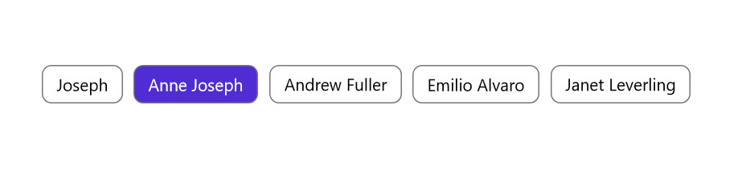

### SelectedChipBackground

The [`SelectedChipBackground`](https://help.syncfusion.com/cr/maui/Syncfusion.Maui.Core.SfChipGroup.html#Syncfusion_Maui_Core_SfChipGroup_SelectedChipBackground) property customizes the background color of the selected chips in `Filter` and `Choice` `ChipType` values, without using a `VisualState`.




<chip:SfChipGroup ItemsSource="{Binding Employees}"
                  DisplayMemberPath="Name"
                  ChipTextColor="White"
                  ChipBackground="#512dcd"
                  ChipType="Filter"
                  SelectedChipBackground="#E8DEF8" />




using Microsoft.Maui.Controls;
using Microsoft.Maui.Graphics;
using Syncfusion.Maui.Core;

SfChipGroup chipGroup = new SfChipGroup
{
    DisplayMemberPath = "Name",
    ChipBackground = Color.FromArgb("#512dcd"),
    ChipTextColor = Colors.White,
    ChipType = SfChipsType.Filter,
    SelectedChipBackground = Color.FromArgb("#E8DEF8")
};
BindingContext = new EmployeeViewModel();
chipGroup.SetBinding(SfChipGroup.ItemsSourceProperty, "Employees");
Content = chipGroup;




public class Employee
{
    public string Name { get; set; }
}

public class EmployeeViewModel : INotifyPropertyChanged
{
    private ObservableCollection<Employee> employees;

    public event PropertyChangedEventHandler PropertyChanged;

    public ObservableCollection<Employee> Employees
    {
        get => employees;
        set
        {
            employees = value;
            OnPropertyChanged();
        }
    }

    public EmployeeViewModel()
    {
        Employees = new ObservableCollection<Employee>
        {
            new Employee { Name = "Joseph" },
            new Employee { Name = "Anne Joseph" },
            new Employee { Name = "Andrew Fuller" },
            new Employee { Name = "Emilio Alvaro" },
            new Employee { Name = "Janet Leverling" }
        };
    }

    public void OnPropertyChanged([CallerMemberName] string name = null) =>
        PropertyChanged?.Invoke(this, new PropertyChangedEventArgs(name));
}




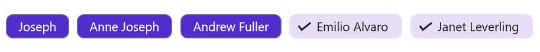

### ChipTextColor

The [`ChipTextColor`](https://help.syncfusion.com/cr/maui/Syncfusion.Maui.Core.SfChipGroup.html#Syncfusion_Maui_Core_SfChipGroup_ChipTextColor) property customizes the text color of the unselected chips in `SfChipGroup`. The default value is `Color.FromArgb("#1C1B1F")`.




<chip:SfChipGroup ItemsSource="{Binding Employees}"
                  DisplayMemberPath="Name"
                  ChipTextColor="Red" />




using Microsoft.Maui.Controls;
using Microsoft.Maui.Graphics;
using Syncfusion.Maui.Core;

SfChipGroup chipGroup = new SfChipGroup
{
    DisplayMemberPath = "Name",
    ChipTextColor = Colors.Red
};
BindingContext = new EmployeeViewModel();
chipGroup.SetBinding(SfChipGroup.ItemsSourceProperty, "Employees");
Content = chipGroup;




public class Employee
{
    public string Name { get; set; }
}

public class EmployeeViewModel : INotifyPropertyChanged
{
    private ObservableCollection<Employee> employees;

    public event PropertyChangedEventHandler PropertyChanged;

    public ObservableCollection<Employee> Employees
    {
        get => employees;
        set
        {
            employees = value;
            OnPropertyChanged();
        }
    }

    public EmployeeViewModel()
    {
        Employees = new ObservableCollection<Employee>
        {
            new Employee { Name = "Joseph" },
            new Employee { Name = "Anne Joseph" },
            new Employee { Name = "Andrew Fuller" },
            new Employee { Name = "Emilio Alvaro" },
            new Employee { Name = "Janet Leverling" }
        };
    }

    public void OnPropertyChanged([CallerMemberName] string name = null) =>
        PropertyChanged?.Invoke(this, new PropertyChangedEventArgs(name));
}




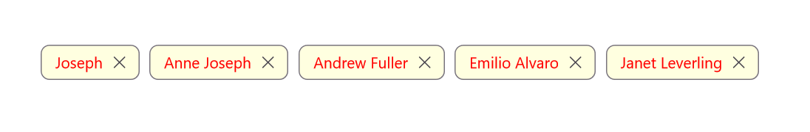

To customize the text color of the **selected** chip, set `ChipType="Choice"` or `ChipType="Filter"` and use the `VisualStateManager`:




<chip:SfChipGroup ItemsSource="{Binding Employees}"
                  DisplayMemberPath="Name"
                  ChipType="Choice">
    <VisualStateManager.VisualStateGroups>
        <VisualStateGroup x:Name="CommonStates">
            <VisualState x:Name="Normal">
                <VisualState.Setters>
                    <Setter Property="ChipTextColor" Value="Black" />
                </VisualState.Setters>
            </VisualState>
            <VisualState x:Name="Selected">
                <VisualState.Setters>
                    <Setter Property="ChipTextColor" Value="Green" />
                </VisualState.Setters>
            </VisualState>
        </VisualStateGroup>
    </VisualStateManager.VisualStateGroups>
</chip:SfChipGroup>




using Microsoft.Maui.Controls;
using Microsoft.Maui.Graphics;
using Syncfusion.Maui.Core;

SfChipGroup chipGroup = new SfChipGroup
{
    DisplayMemberPath = "Name",
    ChipType = SfChipsType.Choice
};
BindingContext = new EmployeeViewModel();
chipGroup.SetBinding(SfChipGroup.ItemsSourceProperty, "Employees");

var visualStateGroupList = new VisualStateGroupList();
var commonStateGroup = new VisualStateGroup();

var normalState = new VisualState { Name = "Normal" };
normalState.Setters.Add(new Setter { Property = SfChipGroup.ChipTextColorProperty, Value = Colors.Black });

var selectedState = new VisualState { Name = "Selected" };
selectedState.Setters.Add(new Setter { Property = SfChipGroup.ChipTextColorProperty, Value = Colors.Green });

commonStateGroup.States.Add(normalState);
commonStateGroup.States.Add(selectedState);
visualStateGroupList.Add(commonStateGroup);
VisualStateManager.SetVisualStateGroups(chipGroup, visualStateGroupList);
Content = chipGroup;




public class Employee
{
    public string Name { get; set; }
}

public class EmployeeViewModel : INotifyPropertyChanged
{
    private ObservableCollection<Employee> employees;

    public event PropertyChangedEventHandler PropertyChanged;

    public ObservableCollection<Employee> Employees
    {
        get => employees;
        set
        {
            employees = value;
            OnPropertyChanged();
        }
    }

    public EmployeeViewModel()
    {
        Employees = new ObservableCollection<Employee>
        {
            new Employee { Name = "Joseph" },
            new Employee { Name = "Anne Joseph" },
            new Employee { Name = "Andrew Fuller" },
            new Employee { Name = "Emilio Alvaro" },
            new Employee { Name = "Janet Leverling" }
        };
    }

    public void OnPropertyChanged([CallerMemberName] string name = null) =>
        PropertyChanged?.Invoke(this, new PropertyChangedEventArgs(name));
}




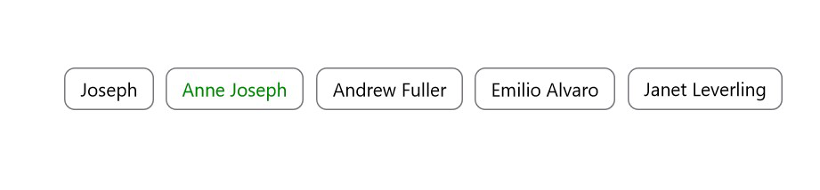

### SelectedChipTextColor

The [`SelectedChipTextColor`](https://help.syncfusion.com/cr/maui/Syncfusion.Maui.Core.SfChipGroup.html#Syncfusion_Maui_Core_SfChipGroup_SelectedChipTextColor) property customizes the text color of the selected chips in `Filter` and `Choice` `ChipType` values, without using a `VisualState`. The default value is `Color.White`.




<chip:SfChipGroup ItemsSource="{Binding Employees}"
                  DisplayMemberPath="Name"
                  ChipBackground="LightGray"
                  ChipType="Filter"
                  SelectionIndicatorColor="White"
                  SelectedChipBackground="#512dcd"
                  SelectedChipTextColor="White" />




using Microsoft.Maui.Controls;
using Microsoft.Maui.Graphics;
using Syncfusion.Maui.Core;

SfChipGroup chipGroup = new SfChipGroup
{
    DisplayMemberPath = "Name",
    ChipBackground = Colors.LightGray,
    ChipType = SfChipsType.Filter,
    SelectionIndicatorColor = Colors.White,
    SelectedChipBackground = Color.FromArgb("#512dcd"),
    SelectedChipTextColor = Colors.White
};
BindingContext = new EmployeeViewModel();
chipGroup.SetBinding(SfChipGroup.ItemsSourceProperty, "Employees");
Content = chipGroup;




public class Employee
{
    public string Name { get; set; }
}

public class EmployeeViewModel : INotifyPropertyChanged
{
    private ObservableCollection<Employee> employees;

    public event PropertyChangedEventHandler PropertyChanged;

    public ObservableCollection<Employee> Employees
    {
        get => employees;
        set
        {
            employees = value;
            OnPropertyChanged();
        }
    }

    public EmployeeViewModel()
    {
        Employees = new ObservableCollection<Employee>
        {
            new Employee { Name = "Joseph" },
            new Employee { Name = "Anne Joseph" },
            new Employee { Name = "Andrew Fuller" },
            new Employee { Name = "Emilio Alvaro" },
            new Employee { Name = "Janet Leverling" }
        };
    }

    public void OnPropertyChanged([CallerMemberName] string name = null) =>
        PropertyChanged?.Invoke(this, new PropertyChangedEventArgs(name));
}




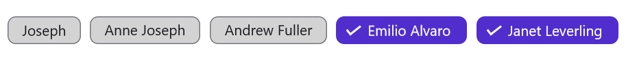

### ChipStroke

The [`ChipStroke`](https://help.syncfusion.com/cr/maui/Syncfusion.Maui.Core.SfChipGroup.html#Syncfusion_Maui_Core_SfChipGroup_ChipStroke) property customizes the border color of the chips in `SfChipGroup`. The default value is `Color.FromArgb("#79747E")`.




<chip:SfChipGroup ItemsSource="{Binding Employees}"
                  DisplayMemberPath="Name"
                  ChipStroke="Red"
                  ChipBackground="LightYellow" />




using Microsoft.Maui.Controls;
using Microsoft.Maui.Graphics;
using Syncfusion.Maui.Core;

SfChipGroup chipGroup = new SfChipGroup
{
    DisplayMemberPath = "Name",
    ChipStroke = Colors.Red,
    ChipBackground = Colors.LightYellow
};
BindingContext = new EmployeeViewModel();
chipGroup.SetBinding(SfChipGroup.ItemsSourceProperty, "Employees");
Content = chipGroup;




public class Employee
{
    public string Name { get; set; }
}

public class EmployeeViewModel : INotifyPropertyChanged
{
    private ObservableCollection<Employee> employees;

    public event PropertyChangedEventHandler PropertyChanged;

    public ObservableCollection<Employee> Employees
    {
        get => employees;
        set
        {
            employees = value;
            OnPropertyChanged();
        }
    }

    public EmployeeViewModel()
    {
        Employees = new ObservableCollection<Employee>
        {
            new Employee { Name = "Joseph" },
            new Employee { Name = "Anne Joseph" },
            new Employee { Name = "Andrew Fuller" },
            new Employee { Name = "Emilio Alvaro" },
            new Employee { Name = "Janet Leverling" }
        };
    }

    public void OnPropertyChanged([CallerMemberName] string name = null) =>
        PropertyChanged?.Invoke(this, new PropertyChangedEventArgs(name));
}




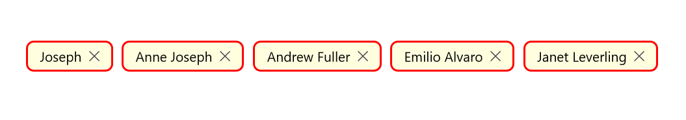

### ChipTextSize

The [`ChipTextSize`](https://help.syncfusion.com/cr/maui/Syncfusion.Maui.Core.SfChipGroup.html#Syncfusion_Maui_Core_SfChipGroup_ChipTextSize) property customizes the text size of the chips in `SfChipGroup`. The default value is `14d`.




<chip:SfChipGroup ItemsSource="{Binding Employees}"
                  DisplayMemberPath="Name"
                  ChipTextSize="10" />




using Microsoft.Maui.Controls;
using Syncfusion.Maui.Core;

SfChipGroup chipGroup = new SfChipGroup
{
    DisplayMemberPath = "Name",
    ChipTextSize = 10
};
BindingContext = new EmployeeViewModel();
chipGroup.SetBinding(SfChipGroup.ItemsSourceProperty, "Employees");
Content = chipGroup;




public class Employee
{
    public string Name { get; set; }
}

public class EmployeeViewModel : INotifyPropertyChanged
{
    private ObservableCollection<Employee> employees;

    public event PropertyChangedEventHandler PropertyChanged;

    public ObservableCollection<Employee> Employees
    {
        get => employees;
        set
        {
            employees = value;
            OnPropertyChanged();
        }
    }

    public EmployeeViewModel()
    {
        Employees = new ObservableCollection<Employee>
        {
            new Employee { Name = "Joseph" },
            new Employee { Name = "Anne Joseph" },
            new Employee { Name = "Andrew Fuller" },
            new Employee { Name = "Emilio Alvaro" },
            new Employee { Name = "Janet Leverling" }
        };
    }

    public void OnPropertyChanged([CallerMemberName] string name = null) =>
        PropertyChanged?.Invoke(this, new PropertyChangedEventArgs(name));
}




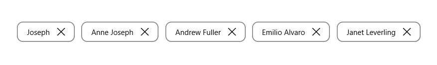

### ChipFontAttributes

The `ChipFontAttributes` property customizes the font style of the chip text in `SfChipGroup`. The default value is `FontAttributes.None`.




<chip:SfChipGroup ItemsSource="{Binding Employees}"
                  DisplayMemberPath="Name"
                  ChipFontAttributes="Bold"
                  ChipType="Choice" />




using Microsoft.Maui.Controls;
using Syncfusion.Maui.Core;

SfChipGroup chipGroup = new SfChipGroup
{
    DisplayMemberPath = "Name",
    ChipType = SfChipsType.Choice,
    ChipFontAttributes = FontAttributes.Bold
};
BindingContext = new EmployeeViewModel();
chipGroup.SetBinding(SfChipGroup.ItemsSourceProperty, "Employees");
Content = chipGroup;




public class Employee
{
    public string Name { get; set; }
}

public class EmployeeViewModel : INotifyPropertyChanged
{
    private ObservableCollection<Employee> employees;

    public event PropertyChangedEventHandler PropertyChanged;

    public ObservableCollection<Employee> Employees
    {
        get => employees;
        set
        {
            employees = value;
            OnPropertyChanged();
        }
    }

    public EmployeeViewModel()
    {
        Employees = new ObservableCollection<Employee>
        {
            new Employee { Name = "Joseph" },
            new Employee { Name = "Anne Joseph" },
            new Employee { Name = "Andrew Fuller" },
            new Employee { Name = "Emilio Alvaro" },
            new Employee { Name = "Janet Leverling" }
        };
    }

    public void OnPropertyChanged([CallerMemberName] string name = null) =>
        PropertyChanged?.Invoke(this, new PropertyChangedEventArgs(name));
}




### ChipFontFamily

The [`ChipFontFamily`](https://help.syncfusion.com/cr/maui/Syncfusion.Maui.Core.SfChipGroup.html#Syncfusion_Maui_Core_SfChipGroup_ChipFontFamily) property customizes the font family of the chip text in `SfChipGroup`. The default value is `string.Empty`.




<chip:SfChipGroup ItemsSource="{Binding Employees}"
                  DisplayMemberPath="Name"
                  ChipFontFamily="OpenSans-Semibold" />




using Microsoft.Maui.Controls;
using Syncfusion.Maui.Core;

SfChipGroup chipGroup = new SfChipGroup
{
    DisplayMemberPath = "Name",
    ChipFontFamily = "OpenSans-Semibold"
};
BindingContext = new EmployeeViewModel();
chipGroup.SetBinding(SfChipGroup.ItemsSourceProperty, "Employees");
Content = chipGroup;




public class Employee
{
    public string Name { get; set; }
}

public class EmployeeViewModel : INotifyPropertyChanged
{
    private ObservableCollection<Employee> employees;

    public event PropertyChangedEventHandler PropertyChanged;

    public ObservableCollection<Employee> Employees
    {
        get => employees;
        set
        {
            employees = value;
            OnPropertyChanged();
        }
    }

    public EmployeeViewModel()
    {
        Employees = new ObservableCollection<Employee>
        {
            new Employee { Name = "Joseph" },
            new Employee { Name = "Anne Joseph" },
            new Employee { Name = "Andrew Fuller" },
            new Employee { Name = "Emilio Alvaro" },
            new Employee { Name = "Janet Leverling" }
        };
    }

    public void OnPropertyChanged([CallerMemberName] string name = null) =>
        PropertyChanged?.Invoke(this, new PropertyChangedEventArgs(name));
}




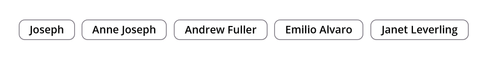

### ChipPadding

The [`ChipPadding`](https://help.syncfusion.com/cr/maui/Syncfusion.Maui.Core.SfChipGroup.html#Syncfusion_Maui_Core_SfChipGroup_ChipPadding) property sets the spacing between each chip in `SfChipGroup`. The default value is `new Thickness(5d, 0, 0, 0)`.




<chip:SfChipGroup ItemsSource="{Binding Employees}"
                  DisplayMemberPath="Name"
                  ChipPadding="8,0,0,0" />




using Microsoft.Maui.Controls;
using Microsoft.Maui.Graphics;
using Syncfusion.Maui.Core;

SfChipGroup chipGroup = new SfChipGroup
{
    ChipPadding = new Thickness(8, 0, 0, 0),
    DisplayMemberPath = "Name"
};
BindingContext = new EmployeeViewModel();
chipGroup.SetBinding(SfChipGroup.ItemsSourceProperty, "Employees");
Content = chipGroup;




public class Employee
{
    public string Name { get; set; }
}

public class EmployeeViewModel : INotifyPropertyChanged
{
    private ObservableCollection<Employee> employees;

    public event PropertyChangedEventHandler PropertyChanged;

    public ObservableCollection<Employee> Employees
    {
        get => employees;
        set
        {
            employees = value;
            OnPropertyChanged();
        }
    }

    public EmployeeViewModel()
    {
        Employees = new ObservableCollection<Employee>
        {
            new Employee { Name = "Joseph" },
            new Employee { Name = "Anne Joseph" },
            new Employee { Name = "Andrew Fuller" },
            new Employee { Name = "Emilio Alvaro" },
            new Employee { Name = "Janet Leverling" }
        };
    }

    public void OnPropertyChanged([CallerMemberName] string name = null) =>
        PropertyChanged?.Invoke(this, new PropertyChangedEventArgs(name));
}




### ChipStrokeThickness

The [`ChipStrokeThickness`](https://help.syncfusion.com/cr/maui/Syncfusion.Maui.Core.SfChipGroup.html#Syncfusion_Maui_Core_SfChipGroup_ChipStrokeThickness) property customizes the border width of the chips in `SfChipGroup`. The default value is `2d`.




<chip:SfChipGroup ItemsSource="{Binding Employees}"
                  ChipStrokeThickness="7"
                  DisplayMemberPath="Name"
                  ChipStroke="Red" />




using Microsoft.Maui.Controls;
using Microsoft.Maui.Graphics;
using Syncfusion.Maui.Core;

SfChipGroup chipGroup = new SfChipGroup
{
    ChipStrokeThickness = 7,
    DisplayMemberPath = "Name",
    ChipStroke = Colors.Red
};
BindingContext = new EmployeeViewModel();
chipGroup.SetBinding(SfChipGroup.ItemsSourceProperty, "Employees");
Content = chipGroup;




public class Employee
{
    public string Name { get; set; }
}

public class EmployeeViewModel : INotifyPropertyChanged
{
    private ObservableCollection<Employee> employees;

    public event PropertyChangedEventHandler PropertyChanged;

    public ObservableCollection<Employee> Employees
    {
        get => employees;
        set
        {
            employees = value;
            OnPropertyChanged();
        }
    }

    public EmployeeViewModel()
    {
        Employees = new ObservableCollection<Employee>
        {
            new Employee { Name = "Joseph" },
            new Employee { Name = "Anne Joseph" },
            new Employee { Name = "Andrew Fuller" },
            new Employee { Name = "Emilio Alvaro" },
            new Employee { Name = "Janet Leverling" }
        };
    }

    public void OnPropertyChanged([CallerMemberName] string name = null) =>
        PropertyChanged?.Invoke(this, new PropertyChangedEventArgs(name));
}




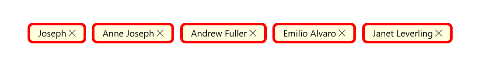

### ChipLayout

The `SfChipGroup` creates a chip for each item and arranges the chips in a `StackLayout` with horizontal orientation by default. Use the `ChipLayout` property to provide a custom layout (such as a `FlexLayout`) for the chips.




<ContentPage.Content>
    <Grid>
        <chip:SfChipGroup DisplayMemberPath="Name" ItemsSource="{Binding Employees}">
            <chip:SfChipGroup.ChipLayout>
                <FlexLayout HorizontalOptions="Start"
                            VerticalOptions="Center" />
            </chip:SfChipGroup.ChipLayout>
        </chip:SfChipGroup>
    </Grid>
</ContentPage.Content>




using Microsoft.Maui.Controls;
using Syncfusion.Maui.Core;

namespace ChipsSample;

public partial class MainPage : ContentPage
{
    public MainPage()
    {
        InitializeComponent();

        var layout = new FlexLayout
        {
            HorizontalOptions = LayoutOptions.Start,
            VerticalOptions = LayoutOptions.Center
        };

        var chipGroup = new SfChipGroup
        {
            DisplayMemberPath = "Name",
            ChipLayout = layout
        };
        BindingContext = new EmployeeViewModel();
        chipGroup.SetBinding(SfChipGroup.ItemsSourceProperty, "Employees");

        Content = new Grid
        {
            Children = { chipGroup }
        };
    }
}




public class Employee
{
    public string Name { get; set; }
}

public class EmployeeViewModel : INotifyPropertyChanged
{
    private ObservableCollection<Employee> employees;

    public event PropertyChangedEventHandler PropertyChanged;

    public ObservableCollection<Employee> Employees
    {
        get => employees;
        set
        {
            employees = value;
            OnPropertyChanged();
        }
    }

    public EmployeeViewModel()
    {
        Employees = new ObservableCollection<Employee>
        {
            new Employee { Name = "Joseph" },
            new Employee { Name = "Anne Joseph" },
            new Employee { Name = "Andrew Fuller" },
            new Employee { Name = "Emilio Alvaro" },
            new Employee { Name = "Janet Leverling" }
        };
    }

    public void OnPropertyChanged([CallerMemberName] string name = null) =>
        PropertyChanged?.Invoke(this, new PropertyChangedEventArgs(name));
}




### ItemHeight

The [`ItemHeight`](https://help.syncfusion.com/cr/maui/Syncfusion.Maui.Core.SfChipGroup.html#Syncfusion_Maui_Core_SfChipGroup_ItemHeight) property customizes the height of the items in `SfChipGroup`. The default value is `double.NaN` (the chip uses its measured height).




<chip:SfChipGroup ItemsSource="{Binding Employees}"
                  ItemHeight="60"
                  DisplayMemberPath="Name" />




using Microsoft.Maui.Controls;
using Syncfusion.Maui.Core;

BindingContext = new EmployeeViewModel();
SfChipGroup chipGroup = new SfChipGroup
{
    ItemHeight = 60,
    DisplayMemberPath = "Name"
};
chipGroup.SetBinding(SfChipGroup.ItemsSourceProperty, "Employees");
Content = chipGroup;




public class Employee
{
    public string Name { get; set; }
}

public class EmployeeViewModel : INotifyPropertyChanged
{
    private ObservableCollection<Employee> employees;

    public event PropertyChangedEventHandler PropertyChanged;

    public ObservableCollection<Employee> Employees
    {
        get => employees;
        set
        {
            employees = value;
            OnPropertyChanged();
        }
    }

    public EmployeeViewModel()
    {
        Employees = new ObservableCollection<Employee>
        {
            new Employee { Name = "Joseph" },
            new Employee { Name = "Anne Joseph" },
            new Employee { Name = "Andrew Fuller" },
            new Employee { Name = "Emilio Alvaro" },
            new Employee { Name = "Janet Leverling" }
        };
    }

    public void OnPropertyChanged([CallerMemberName] string name = null) =>
        PropertyChanged?.Invoke(this, new PropertyChangedEventArgs(name));
}




### ShowIcon

The [`ShowIcon`](https://help.syncfusion.com/cr/maui/Syncfusion.Maui.Core.SfChipGroup.html#Syncfusion_Maui_Core_SfChipGroup_ShowIcon) property specifies whether the image set in `ImageMemberPath` is displayed on the chips in `SfChipGroup`. The default value is `false`.




<chip:SfChipGroup ItemsSource="{Binding Employees}"
                  ChipPadding="8,8,0,0"
                  ImageMemberPath="Image"
                  ChipImageSize="30"
                  ShowIcon="True"
                  DisplayMemberPath="Name" />




### Model and ViewModel for the ShowIcon sample




using System.Collections.ObjectModel;
using System.ComponentModel;
using System.Runtime.CompilerServices;

namespace ChipsSample;

public class Person
{
    public string Name { get; set; }
    public string Image { get; set; }
}

public class ChipsViewModel : INotifyPropertyChanged
{
    private ObservableCollection<Person> employees;

    public ObservableCollection<Person> Employees
    {
        get => employees;
        set
        {
            employees = value;
            OnPropertyChanged();
        }
    }

    public ChipsViewModel()
    {
        Employees = new ObservableCollection<Person>
        {
            new Person { Image = "jhon.png", Name = "John" },
            new Person { Image = "james.png", Name = "James" },
            new Person { Image = "alexandar.png", Name = "Alexandar" },
            new Person { Image = "liam.png", Name = "Liam" }
        };
    }

    public event PropertyChangedEventHandler PropertyChanged;
    public void OnPropertyChanged([CallerMemberName] string name = null) =>
        PropertyChanged?.Invoke(this, new PropertyChangedEventArgs(name));
}




using Microsoft.Maui.Controls;
using Syncfusion.Maui.Core;

SfChipGroup chipGroup = new SfChipGroup
{
    DisplayMemberPath = "Name",
    ImageMemberPath = "Image",
    ChipImageSize = 30,
    ShowIcon = true,
    ChipPadding = new Thickness(8, 8, 0, 0)
};
BindingContext = new EmployeeViewModel();
chipGroup.SetBinding(SfChipGroup.ItemsSourceProperty, "Employees");




### CloseButtonColor

The [`CloseButtonColor`](https://help.syncfusion.com/cr/maui/Syncfusion.Maui.Core.SfChipGroup.html#Syncfusion_Maui_Core_SfChipGroup_CloseButtonColor) property customizes the color of the close button in `SfChipGroup`. The default value is `Color.FromArgb("#49454E")`.




<chip:SfChipGroup ItemsSource="{Binding Employees}"
                  CloseButtonColor="Red"
                  ChipBackground="LightYellow"
                  DisplayMemberPath="Name" />




using Microsoft.Maui.Controls;
using Microsoft.Maui.Graphics;
using Syncfusion.Maui.Core;

SfChipGroup chipGroup = new SfChipGroup
{
    DisplayMemberPath = "Name",
    CloseButtonColor = Colors.Red
};
BindingContext = new EmployeeViewModel();
chipGroup.SetBinding(SfChipGroup.ItemsSourceProperty, "Employees");
Content = chipGroup;




public class Employee
{
    public string Name { get; set; }
}

public class EmployeeViewModel : INotifyPropertyChanged
{
    private ObservableCollection<Employee> employees;

    public event PropertyChangedEventHandler PropertyChanged;

    public ObservableCollection<Employee> Employees
    {
        get => employees;
        set
        {
            employees = value;
            OnPropertyChanged();
        }
    }

    public EmployeeViewModel()
    {
        Employees = new ObservableCollection<Employee>
        {
            new Employee { Name = "Joseph" },
            new Employee { Name = "Anne Joseph" },
            new Employee { Name = "Andrew Fuller" },
            new Employee { Name = "Emilio Alvaro" },
            new Employee { Name = "Janet Leverling" }
        };
    }

    public void OnPropertyChanged([CallerMemberName] string name = null) =>
        PropertyChanged?.Invoke(this, new PropertyChangedEventArgs(name));
}




### SelectionIndicatorColor

The [`SelectionIndicatorColor`](https://help.syncfusion.com/cr/maui/Syncfusion.Maui.Core.SfChipGroup.html#Syncfusion_Maui_Core_SfChipGroup_SelectionIndicatorColor) property customizes the selection indicator color in `SfChipGroup`. The default value is `Color.FromRgb(30, 25, 43)`.




<chip:SfChipGroup x:Name="sfChipGroup"
                  ItemsSource="{Binding Employees}"
                  SelectionIndicatorColor="White"
                  DisplayMemberPath="Name" />




using Microsoft.Maui.Controls;
using Microsoft.Maui.Graphics;
using Syncfusion.Maui.Core;

SfChipGroup chipGroup = new SfChipGroup
{
    DisplayMemberPath = "Name",
    SelectionIndicatorColor = Colors.White
};
BindingContext = new EmployeeViewModel();
chipGroup.SetBinding(SfChipGroup.ItemsSourceProperty, "Employees");
Content = chipGroup;




public class Employee
{
    public string Name { get; set; }
}

public class EmployeeViewModel : INotifyPropertyChanged
{
    private ObservableCollection<Employee> employees;

    public event PropertyChangedEventHandler PropertyChanged;

    public ObservableCollection<Employee> Employees
    {
        get => employees;
        set
        {
            employees = value;
            OnPropertyChanged();
        }
    }

    public EmployeeViewModel()
    {
        Employees = new ObservableCollection<Employee>
        {
            new Employee { Name = "Joseph" },
            new Employee { Name = "Anne Joseph" },
            new Employee { Name = "Andrew Fuller" },
            new Employee { Name = "Emilio Alvaro" },
            new Employee { Name = "Janet Leverling" }
        };
    }

    public void OnPropertyChanged([CallerMemberName] string name = null) =>
        PropertyChanged?.Invoke(this, new PropertyChangedEventArgs(name));
}




### ChipImageSize

The [`ChipImageSize`](https://help.syncfusion.com/cr/maui/Syncfusion.Maui.Core.SfChipGroup.html#Syncfusion_Maui_Core_SfChipGroup_ChipImageSize) property customizes the size of the icon image in `SfChipGroup`. The default value is `18d`.




<chip:SfChipGroup ItemsSource="{Binding Employees}"
                  ImageMemberPath="Image"
                  ChipImageSize="50"
                  ShowIcon="True"
                  DisplayMemberPath="Name" />




using Microsoft.Maui.Controls;
using Syncfusion.Maui.Core;

SfChipGroup chipGroup = new SfChipGroup
{
    DisplayMemberPath = "Name",
    ImageMemberPath = "Image",
    ChipImageSize = 50,
    ShowIcon = true
};
BindingContext = new EmployeeViewModel();
chipGroup.SetBinding(SfChipGroup.ItemsSourceProperty, "Employees");
Content = chipGroup;





public class Employee
{
    public string Name { get; set; }
}

public class EmployeeViewModel : INotifyPropertyChanged
{
    private ObservableCollection<Employee> employees;

    public event PropertyChangedEventHandler PropertyChanged;

    public ObservableCollection<Employee> Employees
    {
        get => employees;
        set
        {
            employees = value;
            OnPropertyChanged();
        }
    }

    public EmployeeViewModel()
    {
        Employees = new ObservableCollection<Employee>
        {
            new Employee { Name = "Joseph" },
            new Employee { Name = "Anne Joseph" },
            new Employee { Name = "Andrew Fuller" },
            new Employee { Name = "Emilio Alvaro" },
            new Employee { Name = "Janet Leverling" }
        };
    }

    public void OnPropertyChanged([CallerMemberName] string name = null) =>
        PropertyChanged?.Invoke(this, new PropertyChangedEventArgs(name));
}




### IsSelected

The [`IsSelected`](https://help.syncfusion.com/cr/maui/Syncfusion.Maui.Core.SfChip.html#Syncfusion_Maui_Core_SfChip_IsSelected) property of `SfChip` indicates whether a chip is selected in the `Choice` and `Filter` `ChipType` values. Set `IsSelected="True"` to mark a chip as selected by default.

## Compatibility

| Platform | Notes |
|----------|-------|
| .NET MAUI | Requires .NET MAUI 7.0 or later. |
| iOS, macOS, Android, Windows | `SfChip` and `SfChipGroup` are supported on all .NET MAUI target platforms. |

## Troubleshooting

| Issue | Possible cause | Fix |
|------|---------------|-----|
| The chip group is empty on the page. | The `BindingContext` is not set, or `Employees` is empty. | Set `BindingContext` to the ViewModel and populate the collection. |
| The image does not appear on the chip. | `ShowIcon` is `false`, or the image is not registered as a `MauiImage`. | Set `ShowIcon="True"` and add the image to `Resources/Images` with a `MauiImage` entry in the `.csproj`. |
| The custom `ChipLayout` is not applied. | The `ChipLayout` property was assigned after the chips were generated. | Assign `ChipLayout` before adding the chip group to the visual tree, or call the appropriate reset method. |
| The `Command` does not fire. | The binding path is wrong, or the `Command` is `null` on the ViewModel. | Verify the binding path and that the ViewModel exposes a public `ICommand` property. |
| The selected-chip color does not change. | `ChipType` is not `Choice` or `Filter`, or the `VisualStateManager` is not attached. | Set `ChipType="Choice"` or `ChipType="Filter"`, and use either a `VisualState` or the `SelectedChipBackground`/`SelectedChipTextColor` properties. |
| `Colors.X` errors out in C# with a string color. | `Colors.X` only accepts the named-color constants; use `Color.FromArgb("#...")` for custom colors. | Use `Color.FromArgb("#512dcd")` for the literal hex value, or `Colors.Red` for the named color. |

## See Also

- [Getting Started](Getting-Started.md)
- [Chips Types](Chips-Types.md)
- [Events](Events.md)

