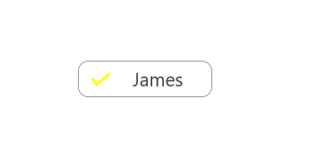
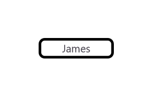
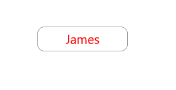
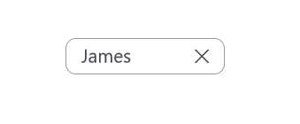
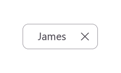
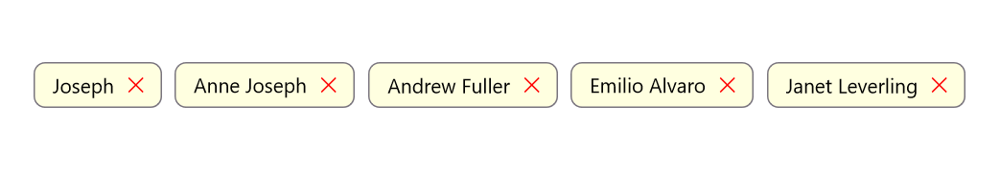

# Customization in .NET MAUI Chips

The [.NET MAUI Chips](https://www.syncfusion.com/maui-controls/maui-chips) control supports to customize the background color, border color, close button color, and more. The chip control can be customized using the following properties:

## ShowCloseButton

The [`ShowCloseButton`](https://help.syncfusion.com/cr/maui/Syncfusion.Maui.Core.SfChip.html#Syncfusion_Maui_Core_SfChip_ShowCloseButton) property sets the visible state of close button in SfChip.




  
<ContentPage.Content>
    <StackLayout Margin="8,8,8,8" >
        <chip:SfChip     Text="James" 
                        WidthRequest="100"
                        HeightRequest="34"
                        HorizontalOptions="Center"
                        VerticalOptions="Center"
                        ShowCloseButton="true" >
        </chip:SfChip>  
    </StackLayout>
</ContentPage.Content>
    
</ContentPage>





using Syncfusion.Maui.Core;

    StackLayout stackLayout = new StackLayout();
    SfChip chip = new SfChip();
    chip.Text = "James";
    chip.WidthRequest = 100;
    chip.WidthRequest = 34;
    chip.HorizontalOptions = LayoutOptions.Center;
    chip.VerticalOptions = LayoutOptions.Center;
    chip.ShowCloseButton = true;
    stackLayout.Children.Add(chip);
    this.Content = stackLayout;
        




N> The default value of ShowCloseButton is [`false`].

## ShowSelectionIndicator

The [`ShowSelectionIndicator`](https://help.syncfusion.com/cr/maui/Syncfusion.Maui.Core.SfChip.html#Syncfusion_Maui_Core_SfChip_ShowSelectionIndicator) property sets the visible state of selection indicator in SfChip.




  
   <ContentPage.Content>
        <StackLayout Margin="8,8,8,8" >
           <chip:SfChip     WidthRequest="100"
                            HorizontalOptions="Center"
                            VerticalOptions="Center"
                            ShowSelectionIndicator="true"
                            >
           </chip:SfChip>  
        </StackLayout>
    </ContentPage.Content>
    




using Syncfusion.Maui.Core;

   StackLayout stackLayout = new StackLayout();
   SfChip chip = new SfChip();
   chip.WidthRequest = 100;
   chip.HorizontalOptions = LayoutOptions.Center;
   chip.VerticalOptions = LayoutOptions.Center;
   chip.ShowSelectionIndicator = true;
   stackLayout.Children.Add(chip);
   this.Content = stackLayout;         
     




N> The default value of ShowSelectionIndicator is [`false`].

## CloseButtonColor

The [`CloseButtonColor`](https://help.syncfusion.com/cr/maui/Syncfusion.Maui.Core.SfChip.html#Syncfusion_Maui_Core_SfChip_CloseButtonColor) property customizes the color of the close button in SfChip.





<ContentPage.Content>
    <StackLayout Margin="8,8,8,8" >
        <chip:SfChip     WidthRequest="100"
                        HorizontalOptions="Center"
                        VerticalOptions="Center"
                        ShowCloseButton="true"
                        CloseButtonColor="Red"
                        >
        </chip:SfChip>  
    </StackLayout>
</ContentPage.Content>





using Syncfusion.Maui.Core;

    StackLayout stackLayout = new StackLayout();
    SfChip chip = new SfChip();
    chip.WidthRequest = 100;
    chip.HorizontalOptions = LayoutOptions.Center;
    chip.VerticalOptions = LayoutOptions.Center;
    chip.ShowCloseButton = true;
    chip.CloseButtonColor = Colors.Red;
    stackLayout.Children.Add(chip);
    this.Content = stackLayout;
        




N> The Default value of CloseButtonColor is [`Color.FromArgb("#49454E")`].

## SelectionIndicatorColor

The [`SelectionIndicatorColor`](https://help.syncfusion.com/cr/maui/Syncfusion.Maui.Core.SfChip.html#Syncfusion_Maui_Core_SfChip_SelectionIndicatorColor) property customizes the selection indicator color in SfChip.





<ContentPage.Content>
    <StackLayout Margin="8,8,8,8" >
        <chip:SfChip     WidthRequest="100"
                        HorizontalOptions="Center"
                        VerticalOptions="Center"
                        ShowSelectionIndicator="true"
                        SelectionIndicatorColor = "Yellow"
                        >
        </chip:SfChip>  
    </StackLayout>
</ContentPage.Content>





using Syncfusion.Maui.Core;

    StackLayout stackLayout = new StackLayout();
    SfChip chip = new SfChip();
    chip.WidthRequest = 100;
    chip.HorizontalOptions = LayoutOptions.Center;
    chip.VerticalOptions = LayoutOptions.Center;
    chip.ShowSelectionIndicator = true;
    chip.SelectionIndicatorColor = Colors.Yellow;
    stackLayout.Children.Add(chip);
    this.Content = stackLayout;
        




N> The default value of SelectionIndicatorColor is [`Color.FromRgb(30, 25, 43)`].

## Background Color

The [`Background`](https://help.syncfusion.com/cr/maui/Syncfusion.Maui.Core.ButtonBase.html#Syncfusion_Maui_Core_ButtonBase_Background) property customizes the background color of SfChip.





<ContentPage.Content>
    <StackLayout Margin="8,8,8,8" >
        <chip:SfChip     WidthRequest="100"
                        HorizontalOptions="Center"
                        VerticalOptions="Center"
                        Background="LightCoral"
                        >
        </chip:SfChip>  
    </StackLayout>
</ContentPage.Content>





using Syncfusion.Maui.Core;

    StackLayout stackLayout = new StackLayout();
    SfChip chip = new SfChip();
    chip.WidthRequest = 100;
    chip.HorizontalOptions = LayoutOptions.Center;
    chip.VerticalOptions = LayoutOptions.Center;
    chip.Background = Colors.LightCoral;
    stackLayout.Children.Add(chip);
    this.Content = stackLayout;
        




## Stroke

The [`Stroke`](https://help.syncfusion.com/cr/maui/Syncfusion.Maui.Core.ButtonBase.html#Syncfusion_Maui_Core_ButtonBase_Stroke) property customizes the color of border in SfChip.





<ContentPage.Content>
    <StackLayout Margin="8,8,8,8" >
        <chip:SfChip     WidthRequest="100"
                        HorizontalOptions="Center"
                        VerticalOptions="Center"
                        Stroke="Black"
                        >
        </chip:SfChip>  
    </StackLayout>
</ContentPage.Content>





using Syncfusion.Maui.Core;

    StackLayout stackLayout = new StackLayout();
    SfChip chip = new SfChip();
    chip.WidthRequest = 100;
    chip.HorizontalOptions = LayoutOptions.Center;
    chip.VerticalOptions = LayoutOptions.Center;
    chip.Stroke = Colors.Black;
    stackLayout.Children.Add(chip);
    this.Content = stackLayout;
        




## StrokeThickness

The [`StrokeThickness`](https://help.syncfusion.com/cr/maui/Syncfusion.Maui.Core.ButtonBase.html#Syncfusion_Maui_Core_ButtonBase_StrokeThickness) property is used to customizes the border thickness of the SfChip on four sides.





<ContentPage.Content>
    <StackLayout Margin="8,8,8,8" >
        <chip:SfChip     WidthRequest="100"
                        HorizontalOptions="Center"
                        VerticalOptions="Center"
                        StrokeThickness="7"
                        Stroke = "Black" 
                        >
        </chip:SfChip>  
    </StackLayout>
</ContentPage.Content>
    




using Syncfusion.Maui.Core;

    StackLayout stackLayout = new StackLayout();
    SfChip chip = new SfChip();
    chip.WidthRequest = 100;
    chip.HorizontalOptions = LayoutOptions.Center;
    chip.VerticalOptions = LayoutOptions.Center;
    chip.StrokeThickness = 5;
    chip.Stroke = Colors.Black;
    stackLayout.Children.Add(chip);
    this.Content = stackLayout;
        




## CornerRadius

The [`CornerRadius`](https://help.syncfusion.com/cr/maui/Syncfusion.Maui.Core.ButtonBase.html#Syncfusion_Maui_Core_ButtonBase_CornerRadius) property is used to customize the rounded edges in SfChip as demonstrated in the following code sample.





<ContentPage.Content>
    <StackLayout Margin="8,8,8,8" >
        <chip:SfChip     WidthRequest="100"
                        HorizontalOptions="Center"
                        VerticalOptions="Center"
                        CornerRadius = "25"
                        Stroke="Black"
                        >
        </chip:SfChip>  
    </StackLayout>
</ContentPage.Content>





using Syncfusion.Maui.Core;

    StackLayout stackLayout = new StackLayout();
    SfChip chip = new SfChip();
    chip.WidthRequest = 100;
    chip.HorizontalOptions = LayoutOptions.Center;
    chip.VerticalOptions = LayoutOptions.Center;
    chip.CornerRadius = 25;
    chip.Stroke = Colors.Black;
    stackLayout.Children.Add(chip);
    this.Content = stackLayout;
            




N> The default value of CornerRadius is [`Thickness(8)`].

## FontAttributes

The [`FontAttributes`](https://help.syncfusion.com/cr/maui/Syncfusion.Maui.Core.ButtonBase.html#Syncfusion_Maui_Core_ButtonBase_FontAttributes) property customizes the font style of text in SfChip.





<ContentPage.Content>
    <StackLayout Margin="8,8,8,8" >
        <chip:SfChip     WidthRequest="100"
                        HorizontalOptions="Center"
                        VerticalOptions="Center"
                        FontAttributes="Italic" >
        </chip:SfChip>  
    </StackLayout>
</ContentPage.Content>





using Syncfusion.Maui.Core;

    StackLayout stackLayout = new StackLayout();
    SfChip chip = new SfChip();
    chip.WidthRequest = 100;
    chip.HorizontalOptions = LayoutOptions.Center;
    chip.VerticalOptions = LayoutOptions.Center;
    chip.FontAttributes = FontAttributes.Italic;
    stackLayout.Children.Add(chip);
    this.Content = stackLayout;
    




## FontFamily

The [`FontFamily`](https://help.syncfusion.com/cr/maui/Syncfusion.Maui.Core.ButtonBase.html#Syncfusion_Maui_Core_ButtonBase_FontFamily) property customizes the font family of text in SfChip.





<ContentPage.Content>
    <StackLayout Margin="8,8,8,8" >
        <chip:SfChip     WidthRequest="100"
                        HorizontalOptions="Center"
                        VerticalOptions="Center"
                        FontFamily="times new roman"
                        >
        </chip:SfChip>  
    </StackLayout>
</ContentPage.Content>





using Syncfusion.Maui.Core;

    StackLayout stackLayout = new StackLayout();
    SfChip chip = new SfChip();
    chip.WidthRequest = 100;
    chip.HorizontalOptions = LayoutOptions.Center;
    chip.VerticalOptions = LayoutOptions.Center;
    chip.FontFamily = "times new roman";
    stackLayout.Children.Add(chip);
    this.Content = stackLayout;
        




## FontSize

The [`FontSize`](https://help.syncfusion.com/cr/maui/Syncfusion.Maui.Core.ButtonBase.html#Syncfusion_Maui_Core_ButtonBase_FontSize) property customizes the size of text in SfChip.





<ContentPage.Content>
    <StackLayout Margin="8,8,8,8" >
    <chip:SfChip        Text="James"
                        WidthRequest="100"
                        HorizontalOptions="Center"
                        VerticalOptions="Center"
                        FontSize = "15"
                        >
        </chip:SfChip>  
    </StackLayout>
</ContentPage.Content>





using Syncfusion.Maui.Core;

    StackLayout stackLayout = new StackLayout();
    SfChip chip = new SfChip();
    chip.Text = "James";
    chip.WidthRequest = 100;
    chip.HorizontalOptions = LayoutOptions.Center;
    chip.VerticalOptions = LayoutOptions.Center;
    chip.FontSize = 15;
    stackLayout.Children.Add(chip);
    this.Content = stackLayout;
        




N> Default Value of FontSize is [`14d`]
   
## TextColor

The [`TextColor`](https://help.syncfusion.com/cr/maui/Syncfusion.Maui.Core.ButtonBase.html#Syncfusion_Maui_Core_ButtonBase_TextColor) property customizes the color of text in SfChip.





<ContentPage.Content>
    <StackLayout Margin="8,8,8,8" >
        <chip:SfChip     Text="James"
                        WidthRequest="100"
                        HorizontalOptions="Center"
                        VerticalOptions="Center"
                        Background="Aqua"
                        TextColor="Red"
                        >
        </chip:SfChip>  
    </StackLayout>
</ContentPage.Content>
    




using Syncfusion.Maui.Core;

    StackLayout stackLayout = new StackLayout();
    SfChip chip = new SfChip();
    chip.Text = "James";
    chip.WidthRequest = 100;
    chip.HorizontalOptions = LayoutOptions.Center;
    chip.VerticalOptions = LayoutOptions.Center;
    chip.Background = Colors.Aqua;
    chip.TextColor = Colors.Red;
    stackLayout.Children.Add(chip);
    this.Content = stackLayout;
        




N> The default value of TextColor is [`Color.FromArgb("#1C1B1F")`].

## TextAlignment

The [`HorizontalTextAlignment`](https://help.syncfusion.com/cr/maui/Syncfusion.Maui.Core.ButtonBase.html#Syncfusion_Maui_Core_ButtonBase_HorizontalTextAlignment) and [`VerticalTextAlignment`](https://help.syncfusion.com/cr/maui/Syncfusion.Maui.Core.ButtonBase.html#Syncfusion_Maui_Core_ButtonBase_VerticalTextAlignment) properties customize the alignment of text in SfChip.





<ContentPage.Content>
    <StackLayout Margin="8,8,8,8" >
        <chip:SfChip     Text="James"
                        WidthRequest="120"
                        HorizontalOptions="Center"
                        VerticalOptions="Center"
                        HorizontalTextAlignment="Start"
                        VerticalTextAlignment="Center"
                        >
        </chip:SfChip>  
    </StackLayout>
</ContentPage.Content>





using Syncfusion.Maui.Core;

    StackLayout stackLayout = new StackLayout();
    SfChip chip = new SfChip();
    chip.WidthRequest = 120;
    chip.Text = "James";
    chip.HorizontalOptions = LayoutOptions.Center;
    chip.VerticalOptions = LayoutOptions.Center;
    chip.HorizontalTextAlignment = TextAlignment.Start;
    chip.VerticalTextAlignment = TextAlignment.Center;
    stackLayout.Children.Add(chip);
    this.Content = stackLayout;
        




N> The default values of HorizontalTextAlignment and VerticalTextAlignment are [`TextAlignment.Center`].

## ShowIcon

You can enable the icon image using the [`ShowIcon`](https://help.syncfusion.com/cr/maui/Syncfusion.Maui.Core.SfChip.html#Syncfusion_Maui_Core_SfChip_ShowIcon) property to know whether any image appears to the SfChip.





<ContentPage.Content>
    <StackLayout Margin="8,8,8,8" >
        <chip:SfChip     WidthRequest="100"
                        HorizontalOptions="Center"
                        VerticalOptions="Center"
                        ImageSource="ChipUserContact.png"
                        ShowIcon="true"
                        >
        </chip:SfChip>  
    </StackLayout>
</ContentPage.Content>
    




using Syncfusion.Maui.Core;

    StackLayout stackLayout = new StackLayout();
    SfChip chip = new SfChip();
    chip.WidthRequest = 150;
    chip.HorizontalOptions = LayoutOptions.Center;
    chip.VerticalOptions = LayoutOptions.Center;
    chip.ImageSource = "ChipUserContact.png";
    chip.ShowIcon = true;
    stackLayout.Children.Add(chip);
    this.Content = stackLayout;
        




N> The default value of ShowIcon is [`false`].

## BackgroundImageSource

The [`BackgroundImageSource`](https://help.syncfusion.com/cr/maui/Syncfusion.Maui.Core.SfChip.html#Syncfusion_Maui_Core_SfChip_BackgroundImageSource) property is used to customize the aspect for the image of SfChip.





<ContentPage.Content>
    <StackLayout Margin="8,8,8,8" >
        <chip:SfChip     WidthRequest="100"
                        HorizontalOptions="Center"
                        VerticalOptions="Center"
                        BackgroundImageSource="lion.png">
        </chip:SfChip>             
    </StackLayout>
</ContentPage.Content>





using Syncfusion.Maui.Core;

    StackLayout stackLayout = new StackLayout();
    SfChip chip = new SfChip();
    chip.WidthRequest = 100;
    chip.HorizontalOptions = LayoutOptions.Center;
    chip.VerticalOptions = LayoutOptions.Center;
    chip.BackgroundImageSource="lion.png";
    stackLayout.Children.Add(chip);
    this.Content = stackLayout;
        




## ImageSource

The [`ImageSource`](https://help.syncfusion.com/cr/maui/Syncfusion.Maui.Core.ButtonBase.html#Syncfusion_Maui_Core_ButtonBase_ImageSource) property customizes the icon image of SfChip by adding a custom image.





<ContentPage.Content>
    <StackLayout Margin="8,8,8,8" >
        <chip:SfChip     WidthRequest="100"
                        HorizontalOptions="Center"
                        VerticalOptions="Center"
                        ImageSource="ChipUserContact.png"
                        ShowIcon="true"
                        >
        </chip:SfChip>  
    </StackLayout>
</ContentPage.Content>
    




using Syncfusion.Maui.Core;

    StackLayout stackLayout = new StackLayout();
    SfChip chip = new SfChip();
    chip.WidthRequest = 100;
    chip.HorizontalOptions = LayoutOptions.Center;
    chip.VerticalOptions = LayoutOptions.Center;
    chip.ImageSource = "ChipUserContact.png";
    chip.ShowIcon = true;
    stackLayout.Children.Add(chip);
    this.Content = stackLayout;
        




N> Enable the [`ShowIcon`] property to enable the [`ImageSource`] property.

## ImageSize

The [`ImageSize`](https://help.syncfusion.com/cr/maui/Syncfusion.Maui.Core.SfChip.html#Syncfusion_Maui_Core_SfChip_ImageSize) property customizes the width and height of icon image in SfChip.





<ContentPage.Content>
    <StackLayout Margin="8,8,8,8" >
        <chip:SfChip     WidthRequest="120"
                        HorizontalOptions="Center"
                        VerticalOptions="Center"
                        ImageSource="ChipUserContact.png"
                        ImageSize="30"
                        ShowIcon="true"
                        >
        </chip:SfChip>  
    </StackLayout>
</ContentPage.Content>





using Syncfusion.Maui.Core;

    StackLayout stackLayout = new StackLayout();
    SfChip chip = new SfChip();
    chip.WidthRequest = 120;
    chip.HorizontalOptions = LayoutOptions.Center;
    chip.VerticalOptions = LayoutOptions.Center;
    chip.ImageSource = "ChipUserContact.png";
    chip.ImageSize = 30;
    chip.ShowIcon = true;
    stackLayout.Children.Add(chip);
    this.Content = stackLayout;
        




N> The default value of ImageSize is [`18d`].

## ImageAlignment 

The [`ImageAlignment`](https://help.syncfusion.com/cr/maui/Syncfusion.Maui.Core.ButtonBase.html#Syncfusion_Maui_Core_ButtonBase_ImageAlignment) property customizes the alignment of icon image in SfChip.





<ContentPage.Content>
    <StackLayout Margin="8,8,8,8" >
        <chip:SfChip  
                        WidthRequest="100"
                        HorizontalOptions="Center"
                        VerticalOptions="Center"
                        ImageSource="ChipUserContact.png"
                        ImageAlignment="End"
                        ShowIcon="true"
                        >
        </chip:SfChip>  
    </StackLayout>
</ContentPage.Content>





using Syncfusion.Maui.Core;

    StackLayout stackLayout = new StackLayout();
    SfChip chip = new SfChip();
    chip.WidthRequest = 100;
    chip.HorizontalOptions = LayoutOptions.Center;
    chip.VerticalOptions = LayoutOptions.Center;
    chip.ImageSource = "ChipUserContact.png";
    chip.ImageAlignment = Alignment.End;
    chip.ShowIcon = true;
    stackLayout.Children.Add(chip);
    this.Content = stackLayout;
        




N> The default value of ImageAlignment is [`Alignment.Start`].

## Command

The [`Command`](https://help.syncfusion.com/cr/maui/Syncfusion.Maui.Core.ButtonBase.html#Syncfusion_Maui_Core_ButtonBase_Command) property associates a command with an instance of SfChip. This property is most often set with MVVM pattern to bind callbacks back into the ViewModel.





<ContentPage.BindingContext>
    <local:CommandDemoViewModel />
</ContentPage.BindingContext>

<ContentPage.Content>
    <StackLayout Margin="8,8,0,0">
        <chip:SfChip x:Name="Chip" 
                        HorizontalOptions="Center"
                        VerticalOptions="Center"
                        WidthRequest="120"
                        Background="{Binding Background}"
                        Command="{Binding ButtonCommand}">
        </chip:SfChip>  
    </StackLayout>
</ContentPage.Content>
    




// ViewModel class for Command Demo.

public class CommandDemoViewModel : INotifyPropertyChanged
{

    private Color _background = Colors.Violet;

    public Color Background
    {
        get { return _background; }
        set { _background = value; NotifyPropertyChanged(); }
    }

    private void NotifyPropertyChanged([CallerMemberName] String propertyName = "")
    {
        PropertyChanged?.Invoke(this, new PropertyChangedEventArgs(propertyName));
    }

    public event PropertyChangedEventHandler PropertyChanged;

    public CommandDemoViewModel()
    {
        BackgroundColor();
        this.Background = Colors.Violet;
    }

    private void BackgroundColor()
    {
        this.Background = this.Background == Colors.DeepSkyBlue ? Colors.Violet : Colors.DeepSkyBlue;
    }

    public ICommand ButtonCommand => new Command(BackgroundColor);

}





N> The default value of Command is [`null`].

## Customization of SfChipGroup

The chip group supports to customize the chip's background color, border color, text color, and more. The chip group can be customized using the following properties:

## InputView

The [`InputView`](https://help.syncfusion.com/cr/maui/Syncfusion.Maui.Core.SfChipGroup.html#Syncfusion_Maui_Core_SfChipGroup_InputView) property allows to provide a view to the input chip. In this example, the input chip is used to add an employee at run time. To get the employee name as input, an entry is added as InputView.





<ContentPage.BindingContext>
    <local:ViewModel x:Name="viewModel"/>
</ContentPage.BindingContext>
<ContentPage.Content>
<chip:SfChipGroup 
    x:Name="chipGroup" 
    ItemsSource="{Binding Employees}"
    ChipPadding="8,8,0,0" 
    ChipType="Input"
    DisplayMemberPath="Name">
    <chip:SfChipGroup.InputView>
        <Entry x:Name="entry" 
            Placeholder="Enter Name"
            Margin="10,10,0,0" 
            VerticalOptions="Center" 
            WidthRequest="110"
            />
    </chip:SfChipGroup.InputView>
</chip:SfChipGroup>
</ContentPage.Content>





using Syncfusion.Maui.Core;

    SfChipGroup chipGroup = new SfChipGroup();
    var entry= new Entry { Margin = new Thickness(10, 10, 0, 0), WidthRequest = 110 };
    chipGroup.InputView = entry;
    this.BindingContext = new ViewModel();
    chipGroup.SetBinding(SfChipGroup.ItemsSourceProperty, "Employees");
    chipGroup.DisplayMemberPath = "Name";
    chipGroup.ChipPadding = new Thickness(8, 8, 0, 0);
    chipGroup.ChipType = SfChipsType.Input;
    




N> The InputView is visible only in the Input type. The default value of InputView is [`null`].

## ChipBackground

The [`ChipBackground`](https://help.syncfusion.com/cr/maui/Syncfusion.Maui.Core.SfChipGroup.html#Syncfusion_Maui_Core_SfChipGroup_ChipBackground) property customizes the background color of the SfChipGroup.





    <ContentPage.BindingContext>
        <local:ViewModel/>
    </ContentPage.BindingContext>
    <ContentPage.Content>
        <StackLayout Margin="10,10,10,10">
            <chip:SfChipGroup
                ItemsSource="{Binding Employees}"
                DisplayMemberPath="Name"
                ChipBackground="#512dcd"
                >
            </chip:SfChipGroup>
        </StackLayout>  
    </ContentPage.Content>
    




using Syncfusion.Maui.Core;

    StackLayout stack = new StackLayout();
    SfChipGroup chipGroup = new SfChipGroup();
    stack.Children.Add(chipGroup);
    this.BindingContext = new ViewModel();
    chipGroup.SetBinding(SfChipGroup.ItemsSourceProperty, "Employees");
    chipGroup.DisplayMemberPath = "Name";
    chipGroup.ChipBackground = Colors.Violet;
    this.Content = stack;
        




N> The default value of ChipBackground is [`Colors.Transparent`].

The [`ChipBackground`](https://help.syncfusion.com/cr/maui/Syncfusion.Maui.Core.SfChipGroup.html#Syncfusion_Maui_Core_SfChipGroup_ChipBackground) property customizes the background color of the selected chip.

So, Add visual states to enable selected chip background color also set the ChipType to Choice or Filter.





<ContentPage.BindingContext>
    <local:ViewModel/>
</ContentPage.BindingContext>
<ContentPage.Content>
    <StackLayout Margin="10,10,10,10">
        <chip:SfChipGroup x:Name="sfChipGroup"
            ItemsSource="{Binding Employees}"
            DisplayMemberPath="Name"
            ChipType="Choice">
            <VisualStateManager.VisualStateGroups>
                <VisualStateGroup x:Name="CommonStates">
                    <VisualState x:Name="Normal">
                        <VisualState.Setters>
                            <Setter Property="ChipBackground" Value="white" />
                        </VisualState.Setters>
                    </VisualState>
                    <VisualState x:Name="Selected">
                        <VisualState.Setters>
                            <Setter Property="ChipBackground" Value="#502cd5" />
                            </VisualState.Setters>
                    </VisualState>
                </VisualStateGroup>
            </VisualStateManager.VisualStateGroups>
        </chip:SfChipGroup>
        </chip:SfChipGroup>
    </StackLayout>  
</ContentPage.Content>
    




using Syncfusion.Maui.Core;

public MainPage()
	{
		InitializeComponent();

        StackLayout stack = new StackLayout();
        SfChipGroup chipGroup = new SfChipGroup();
        stack.Children.Add(chipGroup);
        this.BindingContext = new ViewModel();
        chipGroup.SetBinding(SfChipGroup.ItemsSourceProperty, "Employees");
        chipGroup.DisplayMemberPath = "Name";
        chipGroup.ChipType = SfChipsType.Choice;
        this.Content = stack;

        VisualStateGroupList visualStateGroupList = new VisualStateGroupList();
        VisualState normalState = new VisualState() { Name="Normal"};

        VisualStateGroup commonStateGroup = new VisualStateGroup();
        if (chipGroup.ChipType == SfChipsType.Choice)
        {
            normalState.Setters.Add(new Setter { Property = SfChipGroup.ChipBackgroundProperty, Value = Colors.White });
        }

        VisualState selectedState = new VisualState
        {
            Name = "Selected"
        };
        selectedState.Setters.Add(new Setter { Property = SfChipGroup.ChipBackgroundProperty, Value = Colors.Violet });

        commonStateGroup.States.Add(normalState);
        commonStateGroup.States.Add(selectedState);
        visualStateGroupList.Add(commonStateGroup);

        VisualStateManager.SetVisualStateGroups(chipGroup, visualStateGroupList);

    }





## SelectedChipBackground

The [SelectedChipBackground](https://help.syncfusion.com/cr/maui/Syncfusion.Maui.Core.SfChipGroup.html#Syncfusion_Maui_Core_SfChipGroup_SelectedChipBackground) property customizes the background color of the selected chips.





<ContentPage.BindingContext>
    <local:EmployeeViewModel/>
</ContentPage.BindingContext>
<StackLayout Margin="10,10,10,10" VerticalOptions="Center" HorizontalOptions="Center">
    <chip:SfChipGroup ItemsSource="{Binding Employees}"
                      DisplayMemberPath="Name"
                      ChipTextColor="White"
                      ChipBackground="#512dcd"
                      ChipType="Filter"
                      SelectedChipBackground="#E8DEF8"/>
</StackLayout>
    




using Syncfusion.Maui.Core;

    SfChipGroup chipGroup = new SfChipGroup();
    this.BindingContext = new ViewModel();
    chipGroup.SetBinding(SfChipGroup.ItemsSourceProperty, "Employees");
    chipGroup.DisplayMemberPath = "Name";
    chipGroup.ChipBackground = Color.FromHex("#512dcd");
    chipGroup.ChipTextColor = Colors.White;
    chipGroup.ChipType = SfChipsType.Filter;
    chipGroup.SelectedChipBackground = Color.FromHex("#E8DEF8");
        




## ChipTextColor

The [`ChipTextColor`](https://help.syncfusion.com/cr/maui/Syncfusion.Maui.Core.SfChipGroup.html#Syncfusion_Maui_Core_SfChipGroup_ChipTextColor) property customizes the text color of the SfChipGroup.





<ContentPage.BindingContext>
    <local:ViewModel/>
</ContentPage.BindingContext>
<ContentPage.Content>
    <StackLayout Margin="10,10,10,10">
        <chip:SfChipGroup
            ItemsSource="{Binding Employees}"
            DisplayMemberPath="Name"
            ChipTextColor="Red">
        </chip:SfChipGroup>
    </StackLayout>  
</ContentPage.Content>





using Syncfusion.Maui.Core;

    StackLayout stack = new StackLayout();
    SfChipGroup chipGroup = new SfChipGroup();
    stack.Children.Add(chipGroup);
    this.BindingContext = new ViewModel();
    chipGroup.SetBinding(SfChipGroup.ItemsSourceProperty, "Employees");
    chipGroup.DisplayMemberPath = "Name";
    chipGroup.ChipTextColor = Colors.Blue;
    this.Content = stack;
        




N> The default value of ChipTextColor is [`Color.FromArgb("#1C1B1F")`].

The [`ChipTextColor`](https://help.syncfusion.com/cr/maui/Syncfusion.Maui.Core.SfChipGroup.html#Syncfusion_Maui_Core_SfChipGroup_ChipTextColor) property customizes the text color of the selected chip.

So, Add visual states to enable selected chip text color also set the ChipType to Choice or Filter.





<ContentPage.BindingContext>
    <local:ViewModel/>
</ContentPage.BindingContext>
<ContentPage.Content>
    <StackLayout Margin="10,10,10,10">
        <chip:SfChipGroup x:Name="sfChipGroup"
            ItemsSource="{Binding Employees}"
            DisplayMemberPath="Name"
            ChipBackground="White"
            ChipTextColor="Green"
            ChipType="Choice">
        <VisualStateManager.VisualStateGroups>
                <VisualStateGroup x:Name="CommonStates">
                    <VisualState x:Name="Normal">
                        <VisualState.Setters>
                            <Setter Property="ChipTextColor" Value="Black" />
                        </VisualState.Setters>
                    </VisualState>
                    <VisualState x:Name="Selected">
                        <VisualState.Setters>
                            <Setter Property="ChipTextColor" Value="Green" />
                            </VisualState.Setters>
                    </VisualState>
                </VisualStateGroup>
            </VisualStateManager.VisualStateGroups>
        </chip:SfChipGroup>
    </StackLayout>  
</ContentPage.Content>





using Syncfusion.Maui.Core;

public MainPage()
	{
		InitializeComponent();

        StackLayout stack = new StackLayout();
        SfChipGroup chipGroup = new SfChipGroup();
        stack.Children.Add(chipGroup);
        this.BindingContext = new ViewModel();
        chipGroup.SetBinding(SfChipGroup.ItemsSourceProperty, "Employees");
        chipGroup.DisplayMemberPath = "Name";
        chipGroup.ChipBackground = Colors.White;
        chipGroup.ChipType = SfChipsType.Choice;
        this.Content = stack;

        VisualStateGroupList visualStateGroupList = new VisualStateGroupList();
        VisualState normalState = new VisualState() { Name="Normal"};

        VisualStateGroup commonStateGroup = new VisualStateGroup();
        if (chipGroup.ChipType == SfChipsType.Choice)
        {
            normalState.Setters.Add(new Setter { Property = SfChipGroup.ChipTextColorProperty, Value = Colors.Black });
        }

        VisualState selectedState = new VisualState
        {
            Name = "Selected"
        };
        selectedState.Setters.Add(new Setter { Property = SfChipGroup.ChipTextColorProperty, Value = Colors.Green });
        
        commonStateGroup.States.Add(normalState);
        commonStateGroup.States.Add(selectedState);
        visualStateGroupList.Add(commonStateGroup);

        VisualStateManager.SetVisualStateGroups(chipGroup, visualStateGroupList);

    }





N> The default value of SelectedChipTextColor is [`Color.White`].

## SelectedChipTextColor

The [SelectedChipTextColor](https://help.syncfusion.com/cr/maui/Syncfusion.Maui.Core.SfChipGroup.html#Syncfusion_Maui_Core_SfChipGroup_SelectedChipTextColor) property customizes the text color of the selected chips.





<ContentPage.BindingContext>
    <local:EmployeeViewModel/>
</ContentPage.BindingContext>
<chip:SfChipGroup ItemsSource="{Binding Employees}"
                  DisplayMemberPath="Name"
                  ChipBackground="LightGray"
                  ChipType="Filter"
                  SelectionIndicatorColor="White"
                  SelectedChipBackground="#512dcd"
                  SelectedChipTextColor="White"/>
    




using Syncfusion.Maui.Core;

    SfChipGroup chipGroup = new SfChipGroup();
    this.BindingContext = new ViewModel();
    chipGroup.SetBinding(SfChipGroup.ItemsSourceProperty, "Employees");
    chipGroup.DisplayMemberPath = "Name";
    chipGroup.ChipBackground = Colors.LightGray;
    chipGroup.ChipType = SfChipsType.Filter;
    chipGroup.SelectionIndicatorColor = Colors.White;
    chipGroup.SelectedChipBackground = Color.FromHex("#512dcd");
    chipGroup.SelectedChipTextColor = Colors.White;
    this.Content = chipGroup;
        




## ChipStroke

The [`ChipStroke`](https://help.syncfusion.com/cr/maui/Syncfusion.Maui.Core.SfChipGroup.html#Syncfusion_Maui_Core_SfChipGroup_ChipStroke) property customizes the border color of the SfChipGroup.





<ContentPage.BindingContext>
    <local:ViewModel/>
</ContentPage.BindingContext>
<ContentPage.Content>
    <StackLayout Margin="10,10,10,10">
        <chip:SfChipGroup
            ItemsSource="{Binding Employees}"
            DisplayMemberPath="Name"
            ChipStroke="Red"
            ChipBackground="LightYellow">
        </chip:SfChipGroup>
    </StackLayout>  
</ContentPage.Content>





using Syncfusion.Maui.Core;

    StackLayout stack = new StackLayout();
    SfChipGroup chipGroup = new SfChipGroup();
    stack.Children.Add(chipGroup);
    this.BindingContext = new ViewModel();
    chipGroup.SetBinding(SfChipGroup.ItemsSourceProperty, "Employees");
    chipGroup.DisplayMemberPath = "Name";
    chipGroup.ChipStroke = Colors.Red;
    chipGroup.ChipBackground = Colors.LightYellow;
    this.Content = stack;
        




N> The default value of ChipBorderColor is [`Color.FromArgb("#79747E")`].

## ChipTextSize

The [`ChipTextSize`](https://help.syncfusion.com/cr/maui/Syncfusion.Maui.Core.SfChipGroup.html#Syncfusion_Maui_Core_SfChipGroup_ChipTextSize) property customizes the text size of the SfChipGroup.





<ContentPage.BindingContext>
    <local:ViewModel/>
</ContentPage.BindingContext>
<ContentPage.Content>
    <StackLayout Margin="8,8,0,0">
        <chip:SfChipGroup
            ItemsSource="{Binding Employees}"
            DisplayMemberPath="Name"
            ChipTextSize="10">
        </chip:SfChipGroup>
    </StackLayout>  
</ContentPage.Content>
    




using Syncfusion.Maui.Core;

    StackLayout stack = new StackLayout();
    SfChipGroup chipGroup = new SfChipGroup();
    stack.Children.Add(chipGroup);
    this.BindingContext = new ViewModel();
    chipGroup.SetBinding(SfChipGroup.ItemsSourceProperty, "Employees");
    chipGroup.DisplayMemberPath = "Name";
    chipGroup.ChipTextSize = 10;
    this.Content = stack;
        




N> The default value of ChipTextSize is [`14d`].

## ChipFontAttribute

The `ChipFontAttribute` property customizes the font style of text in SfChipGroup.





 <ContentPage.BindingContext>
    <local:ViewModel/>
</ContentPage.BindingContext>
<ContentPage.Content>
    <StackLayout Margin="8,8,0,0">
        <chip:SfChipGroup
            ItemsSource="{Binding Employees}"
            DisplayMemberPath="Name"
            ChipFontAttributes="Bold"
            ChipType="Choice">
        </chip:SfChipGroup>
    </StackLayout>  
</ContentPage.Content>
    




using Syncfusion.Maui.Core;

    StackLayout stack = new StackLayout();
    SfChipGroup chipGroup = new SfChipGroup();
    stack.Children.Add(chipGroup);
    this.BindingContext = new ViewModel();
    chipGroup.SetBinding(SfChipGroup.ItemsSourceProperty, "Employees");
    chipGroup.DisplayMemberPath = "Name";
    chipGroup.ChipType = SfChipsType.Choice;
    chipGroup.ChipFontAttributes = FontAttributes.Bold;
    this.Content = stack;
        




N> The default value of ChipFontAttribute is [`FontAttributes.None`].

## ChipFontFamily

The [`ChipFontFamily`] property customizes the font family of text in SfChipGroup.





<ContentPage.BindingContext>
    <local:ViewModel/>
</ContentPage.BindingContext>
<ContentPage.Content>
    <StackLayout Margin="8,8,0,0">
        <chip:SfChipGroup
            ItemsSource="{Binding Employees}"
            DisplayMemberPath="Name"
            ChipFontFamily="OpenSans-Semibold">
        </chip:SfChipGroup>
    </StackLayout>  
</ContentPage.Content>
    




using Syncfusion.Maui.Core;

    StackLayout stack = new StackLayout();
    SfChipGroup chipGroup = new SfChipGroup();
    stack.Children.Add(chipGroup);
    this.BindingContext = new ViewModel();
    chipGroup.SetBinding(SfChipGroup.ItemsSourceProperty, "Employees");
    chipGroup.DisplayMemberPath = "Name";
    chipGroup..ChipFontFamily = "OpenSans-Semibold";
    this.Content = stack;
        




N> The default value of ChipFontFamily is [`string.Empty`].

## ChipPadding

The [`ChipPadding`](https://help.syncfusion.com/cr/maui/Syncfusion.Maui.Core.SfChipGroup.html#Syncfusion_Maui_Core_SfChipGroup_ChipPadding) property sets spacing between each chip.





<ContentPage.BindingContext>
    <local:ViewModel/>
</ContentPage.BindingContext>
<ContentPage.Content>
    <StackLayout Margin="8,8,0,0">
        <chip:SfChipGroup
            ItemsSource="{Binding Employees}"
            DisplayMemberPath="Name"
            ChipPadding="8,0,0,0">
        </chip:SfChipGroup>
    </StackLayout>  
</ContentPage.Content>





using Syncfusion.Maui.Core;

    StackLayout stack = new StackLayout();
    SfChipGroup chipGroup = new SfChipGroup();
    stack.Children.Add(chipGroup);
    this.BindingContext = new ViewModel();
    chipGroup.SetBinding(SfChipGroup.ItemsSourceProperty, "Employees");
    chipGroup.ChipPadding = new Thickness(8, 0, 0, 0);
    chipGroup.DisplayMemberPath = "Name";
    this.Content = stack;
        




	
N> The default value of ChipPadding is [`Thickness(5d, 0, 0, 0)`].

## ChipStrokeThickness

The [`ChipStrokeThickness`](https://help.syncfusion.com/cr/maui/Syncfusion.Maui.Core.SfChipGroup.html#Syncfusion_Maui_Core_SfChipGroup_ChipStrokeThickness) property customizes the border width of the SfChipGroup.





<ContentPage.BindingContext>
    <local:ViewModel/>
</ContentPage.BindingContext>
<ContentPage.Content>
    <StackLayout Margin="8,8,0,0">
        <chip:SfChipGroup
            ItemsSource="{Binding Employees}"
            ChipStrokeThickness="7"
            DisplayMemberPath="Name"
            ChipStroke="Red">
        </chip:SfChipGroup>
    </StackLayout>  
</ContentPage.Content>
    




using Syncfusion.Maui.Core;

    StackLayout stack = new StackLayout();
    SfChipGroup chipGroup = new SfChipGroup();
    stack.Children.Add(chipGroup);
    this.BindingContext = new ViewModel();
    chipGroup.SetBinding(SfChipGroup.ItemsSourceProperty, "Employees");
    chipGroup.ChipStrokeThickness = 7;
    chipGroup.ChipStroke = Colors.Red;
    chipGroup.DisplayMemberPath = "Name";
    this.Content = stack;
        




N> The default value of ChipStrokeThickness is [`2d`].

## ItemHeight

The [`ItemHeight`](https://help.syncfusion.com/cr/maui/Syncfusion.Maui.Core.SfChipGroup.html#Syncfusion_Maui_Core_SfChipGroup_ItemHeight) property customizes the height of the items in the SfChipGroup.





<ContentPage.BindingContext>
    <local:ViewModel/>
</ContentPage.BindingContext>
<ContentPage.Content>
    <StackLayout Margin="8,8,0,0">
        <chip:SfChipGroup
            ItemsSource="{Binding Employees}"
            ItemHeight="60"
            DisplayMemberPath="Name"
            >
        </chip:SfChipGroup>
    </StackLayout>  
</ContentPage.Content>





using Syncfusion.Maui.Core;

    StackLayout stack = new StackLayout();
    SfChipGroup chipGroup = new SfChipGroup();
    stack.Children.Add(chipGroup);
    this.BindingContext = new ViewModel();
    chipGroup.SetBinding(SfChipGroup.ItemsSourceProperty, "Employees");
    chipGroup.ItemHeight = 60;
    chipGroup.DisplayMemberPath = "Name";
    this.Content = stack;
        




N> The default value of ItemHeight is [`double.NaN`].

## ShowIcon

You can enable the icon image using the [`ShowIcon`](https://help.syncfusion.com/cr/maui/Syncfusion.Maui.Core.SfChipGroup.html#Syncfusion_Maui_Core_SfChipGroup_ShowIcon) property to know whether any image appears on the SfChipGroup.





<ContentPage.BindingContext>
    <local:ViewModel x:Name="viewModel"/>
</ContentPage.BindingContext>
<ContentPage.Content>
        <chip:SfChipGroup 
            ItemsSource="{Binding Employees}" 
            ChipPadding="8,8,0,0" 
            ImageMemberPath="Image"
            ChipImageSize="30"
            ShowIcon="true"
            DisplayMemberPath="Name">
            </chip:SfChipGroup>  
</ContentPage.Content>





using Syncfusion.Maui.Core;

    StackLayout stack = new StackLayout();
    SfChipGroup chipGroup = new SfChipGroup();
    stack.Children.Add(chipGroup);
    this.BindingContext = new ViewModel();
    chipGroup.SetBinding(SfChipGroup.ItemsSourceProperty, "Employees");
    chipGroup.DisplayMemberPath = "Name";
    chipGroup.ImageMemberPath = "Image";
    chipGroup.ChipImageSize = 30;
    chipGroup.ShowIcon = true;
    chipGroup.ChipPadding = new Thickness(8, 8, 0, 0);
    this.Content = stack;
    
[Model]
public class Person
{
    public string Name
    {
        get;
        set;
    }

    public string Image
    {
        get;
        set;
    }
}
[ViewModel]
public class ViewModel : INotifyPropertyChanged
{
    private ObservableCollection<Person> employees;
    public ObservableCollection<Person> Employees
    {
        get { return employees; }
        set { Employees = value; OnPropertyChanged("Employees"); }
    }

    public ViewModel()
    {
        employees = new ObservableCollection<Person>();
        employees.Add(new Person() { Image = "jhon.png", Name = "John" });
        employees.Add(new Person() { Image = "james.png", Name = "James" });
        employees.Add(new Person() { Image = "alexandar.png", Name = "Alexandar" });
        employees.Add(new Person() { Image = "liam.png", Name = "Liam" });
    }

    public event PropertyChangedEventHandler PropertyChanged;

    public void OnPropertyChanged(string property)
    {
        if (PropertyChanged != null)
        {
            PropertyChanged(this, new PropertyChangedEventArgs(property));
        }
    }
}





## CloseButtonColor

The [`CloseButtonColor`](https://help.syncfusion.com/cr/maui/Syncfusion.Maui.Core.SfChipGroup.html#Syncfusion_Maui_Core_SfChipGroup_CloseButtonColor) property customizes the color of close button in the SfChipGroup.





<ContentPage.BindingContext>
    <local:ViewModel x:Name="viewModel"/>
</ContentPage.BindingContext>
<ContentPage.Content>
    <StackLayout Margin="8,8,0,0">
        <chip:SfChipGroup 
            ItemsSource="{Binding Employees}" 
            CloseButtonColor="Red"
            ChipBackground = "LightYellow"
            DisplayMemberPath="Name">
        </chip:SfChipGroup>  
    </StackLayout>
</ContentPage.Content>
    




using Syncfusion.Maui.Core;

    StackLayout stack = new StackLayout();
    SfChipGroup chipGroup = new SfChipGroup();
    stack.Children.Add(chipGroup);
    this.BindingContext = new ViewModel();
    chipGroup.SetBinding(SfChipGroup.ItemsSourceProperty, "Employees");
    chipGroup.DisplayMemberPath = "Name";
    chipGroup.CloseButtonColor = Colors.Red;
    this.Content = stack;
        




N> The default value of CloseButtonColor is [`Color.FromArgb("#49454E")`].

## SelectionIndicatorColor

The [`SelectionIndicatorColor`](https://help.syncfusion.com/cr/maui/Syncfusion.Maui.Core.SfChipGroup.html#Syncfusion_Maui_Core_SfChipGroup_SelectionIndicatorColor) property customizes the selection indicator color of the SfChipGroup.





<ContentPage.BindingContext>
    <local:ViewModel x:Name="viewModel"/>
</ContentPage.BindingContext>
<ContentPage.Content>
    <StackLayout Margin="8,8,0,0">
        <chip:SfChipGroup x:Name="sfChipGroup"
            ItemsSource="{Binding Employees}" 
            SelectionIndicatorColor="White"
            DisplayMemberPath="Name">
        </chip:SfChipGroup>  
    </StackLayout>
</ContentPage.Content>





using Syncfusion.Maui.Core;

    StackLayout stack = new StackLayout();
    SfChipGroup chipGroup = new SfChipGroup();
    stack.Children.Add(chipGroup);
    this.BindingContext = new ViewModel();
    chipGroup.SetBinding(SfChipGroup.ItemsSourceProperty, "Employees");
    chipGroup.DisplayMemberPath = "Name";
    chipGroup.SelectionIndicatorColor = Colors.White;
    this.Content = stack;
        




N> The default value of SelectionIndicatorColor is [`Color.FromRgb(30, 25, 43)`].

## ChipImageSize

The [ChipImageSize](https://help.syncfusion.com/cr/maui/Syncfusion.Maui.Core.SfChipGroup.html#Syncfusion_Maui_Core_SfChipGroup_ChipImageSize) property customizes the width of icon image in the SfChipGroup.





<ContentPage.BindingContext>
    <local:ViewModel x:Name="viewModel"/>
</ContentPage.BindingContext>
<ContentPage.Content>
    <StackLayout Margin="8,8,0,0">
        <chip:SfChipGroup 
            ItemsSource="{Binding Employees}" 
            ImageMemberPath="Image"
            ChipImageSize="50"
            ShowIcon="true"
            DisplayMemberPath="Name">
        </chip:SfChipGroup>  
    </StackLayout>
</ContentPage.Content>
    




using Syncfusion.Maui.Core;

    StackLayout stack = new StackLayout();
    SfChipGroup chipGroup = new SfChipGroup();
    stack.Children.Add(chipGroup);
    this.BindingContext = new ViewModel();
    chipGroup.SetBinding(SfChipGroup.ItemsSourceProperty, "Employees");
    chipGroup.DisplayMemberPath = "Name";
    chipGroup.ImageMemberPath = "Image";
    chipGroup.ChipImageSize = 50;
    chipGroup.ShowIcon = true;
    this.Content = stack;
            




N> The default value of ChipImageSize is [`18d`].

## IsSelected

The [IsSelected](https://help.syncfusion.com/cr/maui/Syncfusion.Maui.Core.SfChip.html#Syncfusion_Maui_Core_SfChip_IsSelected) property in the [SfChip](https://help.syncfusion.com/cr/maui/Syncfusion.Maui.Core.SfChip.html) is used to indicate whether a chip has been selected in `choice` and `filter` types.
