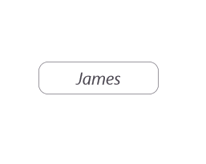
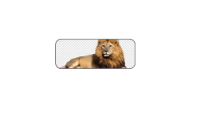

# Customization in .NET MAUI Chips

The [.NET MAUI Chips](https://www.syncfusion.com/maui-controls/maui-chips) control supports customization of background color, border color, close button color, and more. The chip control can be customized using the following properties:

## ShowCloseButton

The [`ShowCloseButton`](https://help.syncfusion.com/cr/maui/Syncfusion.Maui.Core.SfChip.html#Syncfusion_Maui_Core_SfChip_ShowCloseButton) property sets the visibility of the close button in `SfChip`.




  
<chip:SfChip Text="James" 
            ShowCloseButton="true" >
</chip:SfChip>  
    





SfChip chip = new SfChip()
{
    Text = "James",
    ShowCloseButton = true,
};
        




> Note: The default value of `ShowCloseButton` is `false`.

## ShowSelectionIndicator

The [`ShowSelectionIndicator`](https://help.syncfusion.com/cr/maui/Syncfusion.Maui.Core.SfChip.html#Syncfusion_Maui_Core_SfChip_ShowSelectionIndicator) property sets the visibility of the selection indicator in `SfChip`.




  

<chip:SfChip Text="James"
            ShowSelectionIndicator="true">
</chip:SfChip>  

    




SfChip chip = new SfChip()
{
    Text = "James",
    ShowSelectionIndicator = true,
};        
     




> Note: The default value of `ShowSelectionIndicator` is `false`.

## CloseButtonColor

The [`CloseButtonColor`](https://help.syncfusion.com/cr/maui/Syncfusion.Maui.Core.SfChip.html#Syncfusion_Maui_Core_SfChip_CloseButtonColor) property customizes the color of the close button in `SfChip`.





<chip:SfChip Text="James" 
            ShowCloseButton="true"
            CloseButtonColor="Red">
</chip:SfChip>  





SfChip chip = new SfChip()
{
    Text = "James",
    ShowCloseButton = true,
    CloseButtonColor = Colors.Red,
};
   
        




> Note: The default value of `CloseButtonColor` is `Color.FromArgb("#49454E")`.

## SelectionIndicatorColor

The [`SelectionIndicatorColor`](https://help.syncfusion.com/cr/maui/Syncfusion.Maui.Core.SfChip.html#Syncfusion_Maui_Core_SfChip_SelectionIndicatorColor) property customizes the selection indicator color in `SfChip`.





<chip:SfChip Text="James" 
            ShowSelectionIndicator="true"
            SelectionIndicatorColor = "Yellow">
</chip:SfChip>  
  





SfChip chip = new SfChip()
{
    Text = "James",
    ShowSelectionIndicator = true,
    SelectionIndicatorColor = Colors.Yellow
};
        




> Note: The default value of `SelectionIndicatorColor` is `Color.FromRgb(30, 25, 43)`.

## Background Color

The [`Background`](https://help.syncfusion.com/cr/maui/Syncfusion.Maui.Core.ButtonBase.html#Syncfusion_Maui_Core_ButtonBase_Background) property customizes the background color of `SfChip`.





<chip:SfChip Text="James"
            Background="LightCoral" >
</chip:SfChip>  





SfChip chip = new SfChip()
{
    Text = "James",
    Background = Colors.LightCoral
};
        




## Stroke

The [`Stroke`](https://help.syncfusion.com/cr/maui/Syncfusion.Maui.Core.ButtonBase.html#Syncfusion_Maui_Core_ButtonBase_Stroke) property customizes the color of the border in `SfChip`.





<chip:SfChip Text="James"
            Stroke="Black" >
</chip:SfChip>  





SfChip chip = new SfChip()
{
    Text="James",
    Stroke = Colors.Black
};
        




## StrokeThickness

The [`StrokeThickness`](https://help.syncfusion.com/cr/maui/Syncfusion.Maui.Core.ButtonBase.html#Syncfusion_Maui_Core_ButtonBase_StrokeThickness) property customizes the border thickness of `SfChip` on all sides.





<chip:SfChip Text="James"
            StrokeThickness="7"
            Stroke = "Black" >
</chip:SfChip>  

    




SfChip chip = new SfChip()
{
    Text="James",
    StrokeThickness = 7,
    Stroke = Colors.Black
};
        




## CornerRadius

The [`CornerRadius`](https://help.syncfusion.com/cr/maui/Syncfusion.Maui.Core.ButtonBase.html#Syncfusion_Maui_Core_ButtonBase_CornerRadius) property customizes the rounded edges of `SfChip`.





<chip:SfChip Text="James"
            CornerRadius = "25"
            Stroke="Black" >
</chip:SfChip>  





SfChip chip = new SfChip()
{
    Text="James",
    CornerRadius = 25,
    Stroke = Colors.Black
};





> Note: The default value of `CornerRadius` is `Thickness(8)`.

## FontAttributes

The [`FontAttributes`](https://help.syncfusion.com/cr/maui/Syncfusion.Maui.Core.ButtonBase.html#Syncfusion_Maui_Core_ButtonBase_FontAttributes) property customizes the font style of text in `SfChip`.





<chip:SfChip Text="James"
            FontAttributes="Italic" >
</chip:SfChip>  





SfChip chip = new SfChip()
{
    Text="James",
    FontAttributes = FontAttributes.Italic
};
    




## FontFamily

The [`FontFamily`](https://help.syncfusion.com/cr/maui/Syncfusion.Maui.Core.ButtonBase.html#Syncfusion_Maui_Core_ButtonBase_FontFamily) property customizes the font family of text in `SfChip`.





<chip:SfChip Text="James"
            FontFamily="times new roman" >
</chip:SfChip>  





SfChip chip = new SfChip()
{
    Text="James",
    FontFamily = "times new roman"
};





## FontSize

The [`FontSize`](https://help.syncfusion.com/cr/maui/Syncfusion.Maui.Core.ButtonBase.html#Syncfusion_Maui_Core_ButtonBase_FontSize) property customizes the size of text in `SfChip`.





<chip:SfChip Text="James"
            FontSize = "15" >
</chip:SfChip>  





SfChip chip = new SfChip()
{
    Text = "James",
    FontSize = 15
};
        




> Note: The default value of `FontSize` is `14d`.
   
## TextColor

The [`TextColor`](https://help.syncfusion.com/cr/maui/Syncfusion.Maui.Core.ButtonBase.html#Syncfusion_Maui_Core_ButtonBase_TextColor) property customizes the color of the text in `SfChip`.





<chip:SfChip Text="James"
            TextColor="Red" >
</chip:SfChip>  
    




SfChip chip = new SfChip()
{
    Text = "James",
    TextColor = Colors.Red
};
  
        




> Note: The default value of `TextColor` is `Color.FromArgb("#1C1B1F")`.

## TextAlignment

The [`HorizontalTextAlignment`](https://help.syncfusion.com/cr/maui/Syncfusion.Maui.Core.ButtonBase.html#Syncfusion_Maui_Core_ButtonBase_HorizontalTextAlignment) and [`VerticalTextAlignment`](https://help.syncfusion.com/cr/maui/Syncfusion.Maui.Core.ButtonBase.html#Syncfusion_Maui_Core_ButtonBase_VerticalTextAlignment) properties customize the alignment of text in `SfChip`.





<chip:SfChip Text="James"
            ShowCloseButton="True"
            HorizontalTextAlignment="Start"
            VerticalTextAlignment="Center" >
</chip:SfChip>  





SfChip chip = new SfChip()
{
    Text = "James",
    ShowCloseButton = true,
    HorizontalTextAlignment = TextAlignment.Start,
    VerticalTextAlignment = TextAlignment.Center
};
        




> Note: The default values of `HorizontalTextAlignment` and `VerticalTextAlignment` are `TextAlignment.Center`.

## ShowIcon

The [`ShowIcon`](https://help.syncfusion.com/cr/maui/Syncfusion.Maui.Core.SfChip.html#Syncfusion_Maui_Core_SfChip_ShowIcon) property enables the display of an icon image in `SfChip`.





<chip:SfChip Text="James"
            ImageSource="ChipUserContact.png"
            ShowIcon="true" >
</chip:SfChip>  
    




SfChip chip = new SfChip()
{
    Text = "James",
    ImageSource = "ChipUserContact.png",
    ShowIcon = true
};
        




> Note: The default value of `ShowIcon` is `false`.

## BackgroundImageSource

The [`BackgroundImageSource`](https://help.syncfusion.com/cr/maui/Syncfusion.Maui.Core.SfChip.html#Syncfusion_Maui_Core_SfChip_BackgroundImageSource) property customizes the background image of `SfChip`.





<chip:SfChip BackgroundImageSource="lion.png">
</chip:SfChip>             





SfChip chip = new SfChip();
chip.BackgroundImageSource = "lion.png";
        




## ImageSource

The [`ImageSource`](https://help.syncfusion.com/cr/maui/Syncfusion.Maui.Core.ButtonBase.html#Syncfusion_Maui_Core_ButtonBase_ImageSource) property customizes the icon image in `SfChip`.





<chip:SfChip Text="James"
            ImageSource="ChipUserContact.png"
            ShowIcon="true" >
</chip:SfChip>  
    



    
SfChip chip = new SfChip()
{
    Text = "James",
    ImageSource = "ChipUserContact.png",
    ShowIcon = true
};
   




> Note: Enable the [`ShowIcon`] property to enable the [`ImageSource`] property.

## ImageSize

The [`ImageSize`](https://help.syncfusion.com/cr/maui/Syncfusion.Maui.Core.SfChip.html#Syncfusion_Maui_Core_SfChip_ImageSize) property customizes the width and height of the icon image in `SfChip`.





<chip:SfChip Text="James"
            ImageSource="ChipUserContact.png"
            ImageSize="30"
            ShowIcon="true">
</chip:SfChip>  





SfChip chip = new SfChip()
{
    Text = "James",
    ImageSource = "ChipUserContact.png",
    ImageSize = 30,
    ShowIcon = true
};
        




> Note: The default value of `ImageSize` is `18d`.

## ImageAlignment 

The [`ImageAlignment`](https://help.syncfusion.com/cr/maui/Syncfusion.Maui.Core.ButtonBase.html#Syncfusion_Maui_Core_ButtonBase_ImageAlignment) property customizes the alignment of the icon image in `SfChip`.





<chip:SfChip Text="James"
            ImageSource="ChipUserContact.png"
            ImageAlignment="End"
            ShowIcon="true" >
</chip:SfChip>  





SfChip chip = new SfChip()
{
    Text = "James",
    ImageSource = "ChipUserContact.png",
    ImageAlignment = Alignment.End,
    ShowIcon = true
};
  




> Note: The default value of `ImageAlignment` is `Alignment.Start`.

## Command

The [`Command`](https://help.syncfusion.com/cr/maui/Syncfusion.Maui.Core.ButtonBase.html#Syncfusion_Maui_Core_ButtonBase_Command) property associates a command with an instance of `SfChip`. It is commonly used to bind callbacks to a ViewModel using the MVVM pattern.





<ContentPage.BindingContext>
    <local:CommandDemoViewModel />
</ContentPage.BindingContext>

<chip:SfChip x:Name="Chip" Text="James"
            WidthRequest="120"
            Background="{Binding Background}"
            Command="{Binding ButtonCommand}">
</chip:SfChip>  
    




// ViewModel class for Command Demo.

public class CommandDemoViewModel : INotifyPropertyChanged
{

    private Color _background = Colors.Violet;

    public Color Background
    {
        get { return _background; }
        set { _background = value; NotifyPropertyChanged(); }
    }

    private void NotifyPropertyChanged([CallerMemberName] String propertyName = "")
    {
        PropertyChanged?.Invoke(this, new PropertyChangedEventArgs(propertyName));
    }

    public event PropertyChangedEventHandler PropertyChanged;

    public CommandDemoViewModel()
    {
        BackgroundColor();
        this.Background = Colors.Violet;
    }

    private void BackgroundColor()
    {
        this.Background = this.Background == Colors.DeepSkyBlue ? Colors.Violet : Colors.DeepSkyBlue;
    }

    public ICommand ButtonCommand => new Command(BackgroundColor);

}





> Note: The default value of `Command` is `null`.

## Customization of SfChipGroup

The chip group supports customization of chip attributes such as background color, border color, text color, and more. These attributes can be customized using the following properties:

## InputView

The [`InputView`](https://help.syncfusion.com/cr/maui/Syncfusion.Maui.Core.SfChipGroup.html#Syncfusion_Maui_Core_SfChipGroup_InputView) property allows providing a view to the input chip, enabling runtime addition of items. In this example, an `Entry` is added as `InputView` to input employee names.





<chip:SfChipGroup 
    x:Name="chipGroup" 
    ItemsSource="{Binding Employees}"
    ChipPadding="8,8,0,0" 
    ChipType="Input"
    DisplayMemberPath="Name">
    <chip:SfChipGroup.InputView>
        <Entry x:Name="entry" 
            Placeholder="Enter Name"
            Margin="10,10,0,0" 
            WidthRequest="110"/>
    </chip:SfChipGroup.InputView>
</chip:SfChipGroup>





this.BindingContext = new ViewModel();
Entry entry = new Entry
{
    Margin = new Thickness(10, 10, 0, 0),
    WidthRequest = 110
};
SfChipGroup chipGroup = new SfChipGroup
{
    InputView = entry,
    DisplayMemberPath = "Name",
    ChipPadding = new Thickness(8, 8, 0, 0),
    ChipType = SfChipsType.Input
};
chipGroup.SetBinding(SfChipGroup.ItemsSourceProperty, new Binding("Employees"));
    




> Note: The `InputView` is visible only in the `Input` type. The default value of `InputView` is `null`.

## ChipBackground

The [`ChipBackground`](https://help.syncfusion.com/cr/maui/Syncfusion.Maui.Core.SfChipGroup.html#Syncfusion_Maui_Core_SfChipGroup_ChipBackground) property customizes the background color of the SfChipGroup.





<chip:SfChipGroup ItemsSource="{Binding Employees}"
    DisplayMemberPath="Name"
    ChipTextColor="White"
    CloseButtonColor="White"
    ChipBackground="#512dcd">
</chip:SfChipGroup>





SfChipGroup chipGroup = new SfChipGroup
{
    DisplayMemberPath = "Name",
    ChipBackground = Color.FromHex("#512dcd"),
    ChipTextColor = Colors.White,
    CloseButtonColor = Colors.White
};
chipGroup.SetBinding(SfChipGroup.ItemsSourceProperty, new Binding("Employees"));
        




N> The default value of ChipBackground is [`Colors.Transparent`].

The [`ChipBackground`](https://help.syncfusion.com/cr/maui/Syncfusion.Maui.Core.SfChipGroup.html#Syncfusion_Maui_Core_SfChipGroup_ChipBackground) property customizes the background color of the selected chip.

So, Add visual states to enable selected chip background color also set the ChipType to Choice or Filter.





<chip:SfChipGroup x:Name="sfChipGroup"
    ItemsSource="{Binding Employees}"
    DisplayMemberPath="Name"
    ChipType="Choice">
    <VisualStateManager.VisualStateGroups>
        <VisualStateGroup x:Name="CommonStates">
            <VisualState x:Name="Normal">
                <VisualState.Setters>
                    <Setter Property="ChipBackground" Value="white" />
                </VisualState.Setters>
            </VisualState>
            <VisualState x:Name="Selected">
                <VisualState.Setters>
                    <Setter Property="ChipBackground" Value="#502cd5" />
                    </VisualState.Setters>
            </VisualState>
        </VisualStateGroup>
    </VisualStateManager.VisualStateGroups>
</chip:SfChipGroup>
    




SfChipGroup chipGroup = new SfChipGroup();
chipGroup.SetBinding(SfChipGroup.ItemsSourceProperty, "Employees");
chipGroup.DisplayMemberPath = "Name";
chipGroup.ChipType = SfChipsType.Choice;

VisualStateGroupList visualStateGroupList = new VisualStateGroupList();
VisualState normalState = new VisualState() { Name="Normal"};
VisualStateGroup commonStateGroup = new VisualStateGroup();
if (chipGroup.ChipType == SfChipsType.Choice)
{
    normalState.Setters.Add(new Setter { Property = SfChipGroup.ChipBackgroundProperty, Value = Colors.White });
}
VisualState selectedState = new VisualState
{
    Name = "Selected"
};
selectedState.Setters.Add(new Setter { Property = SfChipGroup.ChipBackgroundProperty, Value = Colors.Violet });

commonStateGroup.States.Add(normalState);
commonStateGroup.States.Add(selectedState);
visualStateGroupList.Add(commonStateGroup);
VisualStateManager.SetVisualStateGroups(chipGroup, visualStateGroupList);





## SelectedChipBackground

The [SelectedChipBackground](https://help.syncfusion.com/cr/maui/Syncfusion.Maui.Core.SfChipGroup.html#Syncfusion_Maui_Core_SfChipGroup_SelectedChipBackground) property customizes the background color of the selected chips.





<chip:SfChipGroup ItemsSource="{Binding Employees}"
                DisplayMemberPath="Name"
                ChipTextColor="White"
                ChipBackground="#512dcd"
                ChipType="Filter"
                SelectedChipBackground="#E8DEF8"/>
    




SfChipGroup chipGroup = new SfChipGroup()
{
    DisplayMemberPath = "Name",
    ChipBackground = Color.FromHex("#512dcd"),
    ChipTextColor = Colors.White,
    ChipType = SfChipsType.Filter,
    SelectedChipBackground = Color.FromHex("#E8DEF8")
};
chipGroup.SetBinding(SfChipGroup.ItemsSourceProperty, "Employees");
        




## ChipTextColor

The [`ChipTextColor`](https://help.syncfusion.com/cr/maui/Syncfusion.Maui.Core.SfChipGroup.html#Syncfusion_Maui_Core_SfChipGroup_ChipTextColor) property customizes the text color of the SfChipGroup.





<chip:SfChipGroup
    ItemsSource="{Binding Employees}"
    DisplayMemberPath="Name"
    ChipTextColor="Red">
</chip:SfChipGroup>





SfChipGroup chipGroup = new SfChipGroup()
{
    DisplayMemberPath = "Name",
    ChipTextColor = Colors.Red
};
chipGroup.SetBinding(SfChipGroup.ItemsSourceProperty, "Employees");
        




N> The default value of ChipTextColor is [`Color.FromArgb("#1C1B1F")`].

The [`ChipTextColor`](https://help.syncfusion.com/cr/maui/Syncfusion.Maui.Core.SfChipGroup.html#Syncfusion_Maui_Core_SfChipGroup_ChipTextColor) property customizes the text color of the selected chip.

So, Add visual states to enable selected chip text color also set the ChipType to Choice or Filter.





<chip:SfChipGroup x:Name="sfChipGroup"
    ItemsSource="{Binding Employees}"
    DisplayMemberPath="Name"
    ChipBackground="White"
    ChipTextColor="Green"
    ChipType="Choice">
<VisualStateManager.VisualStateGroups>
        <VisualStateGroup x:Name="CommonStates">
            <VisualState x:Name="Normal">
                <VisualState.Setters>
                    <Setter Property="ChipTextColor" Value="Black" />
                </VisualState.Setters>
            </VisualState>
            <VisualState x:Name="Selected">
                <VisualState.Setters>
                    <Setter Property="ChipTextColor" Value="Green" />
                    </VisualState.Setters>
            </VisualState>
        </VisualStateGroup>
    </VisualStateManager.VisualStateGroups>
</chip:SfChipGroup>





SfChipGroup chipGroup = new SfChipGroup()
{
    DisplayMemberPath = "Name",
    ChipBackground = Colors.White,
    ChipTextColor= Colors.Green,
    ChipType = SfChipsType.Choice,
};
chipGroup.SetBinding(SfChipGroup.ItemsSourceProperty, "Employees");

VisualStateGroupList visualStateGroupList = new VisualStateGroupList();
VisualState normalState = new VisualState() { Name="Normal"};
VisualStateGroup commonStateGroup = new VisualStateGroup();
if (chipGroup.ChipType == SfChipsType.Choice)
{
    normalState.Setters.Add(new Setter { Property = SfChipGroup.ChipTextColorProperty, Value = Colors.Black });
}
VisualState selectedState = new VisualState
{
    Name = "Selected"
};
selectedState.Setters.Add(new Setter { Property = SfChipGroup.ChipTextColorProperty, Value = Colors.Green });
commonStateGroup.States.Add(normalState);
commonStateGroup.States.Add(selectedState);
visualStateGroupList.Add(commonStateGroup);
VisualStateManager.SetVisualStateGroups(chipGroup, visualStateGroupList);





N> The default value of SelectedChipTextColor is [`Color.White`].

## SelectedChipTextColor

The [SelectedChipTextColor](https://help.syncfusion.com/cr/maui/Syncfusion.Maui.Core.SfChipGroup.html#Syncfusion_Maui_Core_SfChipGroup_SelectedChipTextColor) property customizes the text color of the selected chips.





<chip:SfChipGroup ItemsSource="{Binding Employees}"
                DisplayMemberPath="Name"
                ChipBackground="LightGray"
                ChipType="Filter"
                SelectionIndicatorColor="White"
                SelectedChipBackground="#512dcd"
                SelectedChipTextColor="White"/>
    




SfChipGroup chipGroup = new SfChipGroup()
{
    DisplayMemberPath = "Name",
    ChipBackground = Colors.LightGray,
    ChipType = SfChipsType.Filter,
    SelectionIndicatorColor = Colors.White,
    SelectedChipBackground = Color.FromHex("#512dcd"),
    SelectedChipTextColor = Colors.White,
};
chipGroup.SetBinding(SfChipGroup.ItemsSourceProperty, "Employees");
        




## ChipStroke

The [`ChipStroke`](https://help.syncfusion.com/cr/maui/Syncfusion.Maui.Core.SfChipGroup.html#Syncfusion_Maui_Core_SfChipGroup_ChipStroke) property customizes the border color of the SfChipGroup.





<chip:SfChipGroup
    ItemsSource="{Binding Employees}"
    DisplayMemberPath="Name"
    ChipStroke="Red"
    ChipBackground="LightYellow">
</chip:SfChipGroup>





SfChipGroup chipGroup = new SfChipGroup()
{
    DisplayMemberPath = "Name",
    ChipStroke = Colors.Red,
    ChipBackground = Colors.LightYellow
};
chipGroup.SetBinding(SfChipGroup.ItemsSourceProperty, "Employees");
        




N> The default value of ChipBorderColor is [`Color.FromArgb("#79747E")`].

## ChipTextSize

The [`ChipTextSize`](https://help.syncfusion.com/cr/maui/Syncfusion.Maui.Core.SfChipGroup.html#Syncfusion_Maui_Core_SfChipGroup_ChipTextSize) property customizes the text size of the SfChipGroup.





<chip:SfChipGroup
    ItemsSource="{Binding Employees}"
    DisplayMemberPath="Name"
    ChipTextSize="10">
</chip:SfChipGroup>
    




SfChipGroup chipGroup = new SfChipGroup()
{
    DisplayMemberPath = "Name",
    ChipTextSize = 10
};
chipGroup.SetBinding(SfChipGroup.ItemsSourceProperty, "Employees");
        




N> The default value of ChipTextSize is [`14d`].

## ChipFontAttribute

The `ChipFontAttribute` property customizes the font style of text in SfChipGroup.





<chip:SfChipGroup
    ItemsSource="{Binding Employees}"
    DisplayMemberPath="Name"
    ChipFontAttributes="Bold"
    ChipType="Choice">
</chip:SfChipGroup>
    




SfChipGroup chipGroup = new SfChipGroup()
{
    DisplayMemberPath = "Name",
    ChipType = SfChipsType.Choice,
    ChipFontAttributes = FontAttributes.Bold
};
chipGroup.SetBinding(SfChipGroup.ItemsSourceProperty, "Employees");
  




N> The default value of ChipFontAttribute is [`FontAttributes.None`].

## ChipFontFamily

The [`ChipFontFamily`] property customizes the font family of text in SfChipGroup.





<chip:SfChipGroup
    ItemsSource="{Binding Employees}"
    DisplayMemberPath="Name"
    ChipFontFamily="OpenSans-Semibold">
</chip:SfChipGroup>
    




SfChipGroup chipGroup = new SfChipGroup()
{
    DisplayMemberPath = "Name",
    ChipFontFamily = "OpenSans-Semibold"
};
chipGroup.SetBinding(SfChipGroup.ItemsSourceProperty, "Employees");
    




N> The default value of ChipFontFamily is [`string.Empty`].

## ChipPadding

The [`ChipPadding`](https://help.syncfusion.com/cr/maui/Syncfusion.Maui.Core.SfChipGroup.html#Syncfusion_Maui_Core_SfChipGroup_ChipPadding) property sets spacing between each chip.





<chip:SfChipGroup
    ItemsSource="{Binding Employees}"
    DisplayMemberPath="Name"
    ChipPadding="8,0,0,0">
</chip:SfChipGroup>





SfChipGroup chipGroup = new SfChipGroup()
{
    ChipPadding = new Thickness(8, 0, 0, 0),
    DisplayMemberPath = "Name"
};
chipGroup.SetBinding(SfChipGroup.ItemsSourceProperty, "Employees");
   




	
N> The default value of ChipPadding is [`Thickness(5d, 0, 0, 0)`].

## ChipStrokeThickness

The [`ChipStrokeThickness`](https://help.syncfusion.com/cr/maui/Syncfusion.Maui.Core.SfChipGroup.html#Syncfusion_Maui_Core_SfChipGroup_ChipStrokeThickness) property customizes the border width of the SfChipGroup.





<chip:SfChipGroup
    ItemsSource="{Binding Employees}"
    ChipStrokeThickness="7"
    DisplayMemberPath="Name"
    ChipStroke="Red">
</chip:SfChipGroup>
    




SfChipGroup chipGroup = new SfChipGroup()
{
    ChipStrokeThickness = 7,
    DisplayMemberPath = "Name",
    ChipStroke = Colors.Red,
};
chipGroup.SetBinding(SfChipGroup.ItemsSourceProperty, "Employees");
        




N> The default value of ChipStrokeThickness is [`2d`].

## ItemHeight

The [`ItemHeight`](https://help.syncfusion.com/cr/maui/Syncfusion.Maui.Core.SfChipGroup.html#Syncfusion_Maui_Core_SfChipGroup_ItemHeight) property customizes the height of the items in the SfChipGroup.





<chip:SfChipGroup
    ItemsSource="{Binding Employees}"
    ItemHeight="60"
    DisplayMemberPath="Name">
</chip:SfChipGroup>





SfChipGroup chipGroup = new SfChipGroup()
{
    ItemHeight = 60,
    DisplayMemberPath = "Name",
};
chipGroup.SetBinding(SfChipGroup.ItemsSourceProperty, "Employees");
        




N> The default value of ItemHeight is [`double.NaN`].

## ShowIcon

You can enable the icon image using the [`ShowIcon`](https://help.syncfusion.com/cr/maui/Syncfusion.Maui.Core.SfChipGroup.html#Syncfusion_Maui_Core_SfChipGroup_ShowIcon) property to know whether any image appears on the SfChipGroup.





<chip:SfChipGroup 
    ItemsSource="{Binding Employees}" 
    ChipPadding="8,8,0,0" 
    ImageMemberPath="Image"
    ChipImageSize="30"
    ShowIcon="true"
    DisplayMemberPath="Name">
</chip:SfChipGroup>  





SfChipGroup chipGroup = new SfChipGroup()
{
    DisplayMemberPath = "Name",
    ImageMemberPath = "Image",
    ChipImageSize = 30,
    ShowIcon = true,
    ChipPadding = new Thickness(8, 8, 0, 0)
};
chipGroup.SetBinding(SfChipGroup.ItemsSourceProperty, "Employees");
    
[Model]
public class Person
{
    public string Name
    {
        get;
        set;
    }

    public string Image
    {
        get;
        set;
    }
}
[ViewModel]
public class ViewModel : INotifyPropertyChanged
{
    private ObservableCollection<Person> employees;
    public ObservableCollection<Person> Employees
    {
        get { return employees; }
        set { Employees = value; OnPropertyChanged("Employees"); }
    }

    public ViewModel()
    {
        employees = new ObservableCollection<Person>();
        employees.Add(new Person() { Image = "jhon.png", Name = "John" });
        employees.Add(new Person() { Image = "james.png", Name = "James" });
        employees.Add(new Person() { Image = "alexandar.png", Name = "Alexandar" });
        employees.Add(new Person() { Image = "liam.png", Name = "Liam" });
    }

    public event PropertyChangedEventHandler PropertyChanged;

    public void OnPropertyChanged(string property)
    {
        if (PropertyChanged != null)
        {
            PropertyChanged(this, new PropertyChangedEventArgs(property));
        }
    }
}





## CloseButtonColor

The [`CloseButtonColor`](https://help.syncfusion.com/cr/maui/Syncfusion.Maui.Core.SfChipGroup.html#Syncfusion_Maui_Core_SfChipGroup_CloseButtonColor) property customizes the color of close button in the SfChipGroup.





<chip:SfChipGroup 
    ItemsSource="{Binding Employees}" 
    CloseButtonColor="Red"
    ChipBackground = "LightYellow"
    DisplayMemberPath="Name">
</chip:SfChipGroup>  
    




SfChipGroup chipGroup = new SfChipGroup()
{
    DisplayMemberPath = "Name",
    CloseButtonColor = Colors.Red 
};
chipGroup.SetBinding(SfChipGroup.ItemsSourceProperty, "Employees");
        




N> The default value of CloseButtonColor is [`Color.FromArgb("#49454E")`].

## SelectionIndicatorColor

The [`SelectionIndicatorColor`](https://help.syncfusion.com/cr/maui/Syncfusion.Maui.Core.SfChipGroup.html#Syncfusion_Maui_Core_SfChipGroup_SelectionIndicatorColor) property customizes the selection indicator color of the SfChipGroup.





<chip:SfChipGroup x:Name="sfChipGroup"
                ItemsSource="{Binding Employees}" 
                SelectionIndicatorColor="White"
                DisplayMemberPath="Name">
</chip:SfChipGroup>  





SfChipGroup chipGroup = new SfChipGroup()
{
    DisplayMemberPath = "Name",
    SelectionIndicatorColor = Colors.White
};
chipGroup.SetBinding(SfChipGroup.ItemsSourceProperty, "Employees");
        




N> The default value of SelectionIndicatorColor is [`Color.FromRgb(30, 25, 43)`].

## ChipImageSize

The [ChipImageSize](https://help.syncfusion.com/cr/maui/Syncfusion.Maui.Core.SfChipGroup.html#Syncfusion_Maui_Core_SfChipGroup_ChipImageSize) property customizes the width of icon image in the SfChipGroup.





<chip:SfChipGroup 
    ItemsSource="{Binding Employees}" 
    ImageMemberPath="Image"
    ChipImageSize="50"
    ShowIcon="true"
    DisplayMemberPath="Name">
</chip:SfChipGroup>  
    




SfChipGroup chipGroup = new SfChipGroup()
{
    DisplayMemberPath = "Name",
    ImageMemberPath = "Image",
    ChipImageSize = 50,
    ShowIcon = true
};
chipGroup.SetBinding(SfChipGroup.ItemsSourceProperty, "Employees");
            




N> The default value of ChipImageSize is [`18d`].

## IsSelected

The [IsSelected](https://help.syncfusion.com/cr/maui/Syncfusion.Maui.Core.SfChip.html#Syncfusion_Maui_Core_SfChip_IsSelected) property in the [SfChip](https://help.syncfusion.com/cr/maui/Syncfusion.Maui.Core.SfChip.html) is used to indicate whether a chip has been selected in `choice` and `filter` types.
