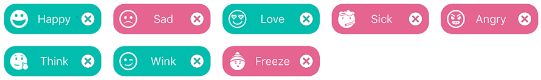

# DataTemplateSelector in .NET MAUI SfChipGroup

Use a [DataTemplateSelector](https://learn.microsoft.com/en-us/dotnet/api/microsoft.maui.controls.datatemplateselector) to choose a different [DataTemplate](https://learn.microsoft.com/en-us/dotnet/api/microsoft.maui.controls.datatemplate) for each item rendered by [SfChipGroup](https://help.syncfusion.com/cr/maui/Syncfusion.Maui.Core.SfChipGroup.html). This is useful when each chip needs to render different visuals based on the underlying data.

## Prerequisites

Before using the [SfChip](https://help.syncfusion.com/cr/maui/Syncfusion.Maui.Core.SfChip.html), ensure the following NuGet package is installed in your .NET MAUI project:

- `Syncfusion.Maui.Core`

For a step-by-step setup, refer to the [Getting Started](https://help.syncfusion.com/maui/chips/getting-started) documentation.

## Create the model and view model

Define a `ChipModel` class with `Text`, `CanSelect`, and `ImageSource` properties, then populate an `ObservableCollection<ChipModel>` in a view model.




using System.Collections.ObjectModel;
using Microsoft.Maui.Controls;

public class ChipModel
{
    public string Text { get; set; } = string.Empty;
    public bool CanSelect { get; set; }
    public ImageSource ImageSource { get; set; } = string.Empty;
}

public class ChipViewModel
{
    public ObservableCollection<ChipModel> Data { get; set; } = new()
    {
        new ChipModel { Text = "Happy", CanSelect = true, ImageSource = "Happy.png" },
        new ChipModel { Text = "Sad", CanSelect = false, ImageSource = "Sad.png" },
        new ChipModel { Text = "Love", CanSelect = true, ImageSource = "Love.png" },
        new ChipModel { Text = "Sick", CanSelect = false, ImageSource = "Sick.png" },
        new ChipModel { Text = "Angry", CanSelect = false, ImageSource = "Angry.png" },
        new ChipModel { Text = "Think", CanSelect = true, ImageSource = "Thinking.png" },
        new ChipModel { Text = "Wink", CanSelect = true, ImageSource = "Wink.png" },
        new ChipModel { Text = "Freeze", CanSelect = false, ImageSource = "Freezing.png" }
    };
}




N> The image file names used for `ImageSource` must be added to the `Resources/Images` folder of your .NET MAUI project and registered as `MauiImage` items in the `.csproj`. For example: `<MauiImage Include="Resources\Images\Happy.png" />`.

## Create a data template selector

Subclass `DataTemplateSelector` and override the [OnSelectTemplate](https://learn.microsoft.com/en-us/dotnet/api/microsoft.maui.controls.datatemplateselector.onselecttemplate) method to return a different `DataTemplate` based on the item.

### Override Reference

| Member | Type | Description |
|--------|------|-------------|
| `OnSelectTemplate(object item, BindableObject container)` | `DataTemplate` | Invoked once per item. The `item` parameter is the data object (e.g., a `ChipModel`). Return the `DataTemplate` to apply. |

### Custom Selector Example

The following selector exposes two templates — `HappyEmojiTemplate` for chips that can be selected, and `SadEmojiTemplate` for those that cannot.



public class ChipDataTemplateSelector : DataTemplateSelector
{
    public DataTemplate HappyEmojiTemplate { get; set; } = new DataTemplate();
    public DataTemplate SadEmojiTemplate { get; set; } = new DataTemplate();

    protected override DataTemplate OnSelectTemplate(object item, BindableObject container)
    {
        return (item as ChipModel)?.CanSelect == true ? HappyEmojiTemplate : SadEmojiTemplate;
    }
}



N> The properties on the selector (e.g., `HappyEmojiTemplate`) are populated from XAML using `StaticResource` references to the `DataTemplate` resources.

## Apply the selector

Assign the `ChipDataTemplateSelector` to the [`ItemTemplate`](https://help.syncfusion.com/cr/maui/Syncfusion.Maui.Core.SfChipGroup.html#Syncfusion_Maui_Core_SfChipGroup_ItemTemplate) property of `SfChipGroup`.




<ContentPage.Resources>
    <ResourceDictionary>
        <DataTemplate x:Key="happyTemplate">
            <chip:SfChip HeightRequest="40"
                            WidthRequest="120"
                            Text="{Binding Text}"
                            BackgroundColor="#00bdae"
                            ShowIcon="True"
                            ImageSource="{Binding ImageSource}"
                            ShowCloseButton="True"
                            ShowSelectionIndicator="False"
                            ImageAlignment="Left"
                            CloseButtonColor="White" />
        </DataTemplate>

        <DataTemplate x:Key="sadTemplate">
            <chip:SfChip HeightRequest="40"
                            WidthRequest="120"
                            Text="{Binding Text}"
                            BackgroundColor="#e56590"
                            ShowIcon="True"
                            ImageSource="{Binding ImageSource}"
                            ShowCloseButton="True"
                            ShowSelectionIndicator="False"
                            ImageAlignment="Left"
                            CloseButtonColor="White" />
        </DataTemplate>

        <local:ChipDataTemplateSelector x:Key="selector"
                                        HappyEmojiTemplate="{StaticResource happyTemplate}"
                                        SadEmojiTemplate="{StaticResource
                                        sadTemplate}" />
    </ResourceDictionary>
</ContentPage.Resources>

<chip:SfChipGroup x:Name="chipGroup"
                    ChipBackground="Transparent"
                    ItemsSource="{Binding Data}"
                    ItemTemplate="{StaticResource selector}" />




var selector = new ChipDataTemplateSelector
{
    HappyEmojiTemplate = new DataTemplate(() =>
    {
        var chip = new SfChip
        {
            HeightRequest = 40,
            WidthRequest = 120,
            BackgroundColor = Color.FromArgb("#00bdae"),
            ShowIcon = true,
            ShowCloseButton = true,
            ShowSelectionIndicator = false,
            ImageAlignment = Alignment.Start,
            CloseButtonColor = Colors.White
        };
        chip.SetBinding(SfChip.TextProperty, nameof(ChipModel.Text));
        chip.SetBinding(SfChip.ImageSourceProperty, nameof(ChipModel.ImageSource));
        return chip;
    }),
    SadEmojiTemplate = new DataTemplate(() =>
    {
        var chip = new SfChip
        {
            HeightRequest = 40,
            WidthRequest = 120,
            BackgroundColor = Color.FromArgb("#e56590"),
            ShowIcon = true,
            ShowCloseButton = true,
            ShowSelectionIndicator = false,
            ImageAlignment = Alignment.Start,
            CloseButtonColor = Colors.White
        };
        chip.SetBinding(SfChip.TextProperty, nameof(ChipModel.Text));
        chip.SetBinding(SfChip.ImageSourceProperty, nameof(ChipModel.ImageSource));
        return chip;
    })
};

var chipViewModel = new ChipViewModel();

var chipGroup = new SfChipGroup
{
    BindingContext = chipViewModel,
    ChipBackground = Colors.Transparent,
    ItemsSource = chipViewModel.Data,
    ItemTemplate = selector
};

Content = chipGroup;




public class ChipViewModel
{
    public ObservableCollection<ChipModel> Data { get; set; }

    public ChipViewModel()
    {
        Data = new ObservableCollection<ChipModel>()
            {
            new ChipModel(){Text ="Happy", CanSelect = true, ImageSource="dotnet_bot.png"},
            new ChipModel(){Text ="Sad", CanSelect = false,ImageSource = "dotnet_bot.png"},
            new ChipModel(){Text ="Love", CanSelect = true,ImageSource = "dotnet_bot.png"},
            new ChipModel(){Text ="Sick", CanSelect = false,ImageSource="dotnet_bot.png"},
            new ChipModel(){Text ="Angry", CanSelect = false, ImageSource ="dotnet_bot.png"},
            new ChipModel(){Text ="Think", CanSelect = true,ImageSource="dotnet_bot.png"},
            new ChipModel(){Text ="Wink", CanSelect = true,ImageSource="dotnet_bot.png"},
            new ChipModel(){Text ="Freeze", CanSelect = false,ImageSource="dotnet_bot.png"},
            };
    }

}

public class ChipModel
{
    public bool CanSelect { get; set; }
    public string Text { get; set; }
    public ImageSource ImageSource { get; set; }
}




## Expected Behavior

| `ChipModel.CanSelect` | Selected Template |
|-----------------------|-------------------|
| `true` | `HappyEmojiTemplate` (cyan) |
| `false` | `SadEmojiTemplate` (pink) |

## Troubleshooting

| Issue | Possible Cause | Recommended Action |
|-------|----------------|--------------------|
| The wrong template is selected for an item. | The selector's `OnSelectTemplate` returns the wrong template, or the property being tested has the wrong value. | Add a breakpoint or `Debug.WriteLine` in `OnSelectTemplate` to verify the values returned for each item. |
| The chips render but contain no data. | The `DataTemplate` does not bind to the item's properties, or the `BindingContext` is not propagated. | Use `SetBinding(SfChip.TextProperty, nameof(ChipModel.Text))` in C#, or `{Binding Text}` in XAML inside the `DataTemplate`. |
| `local:ChipDataTemplateSelector` cannot be resolved. | The `xmlns:local` namespace does not match the namespace that contains `ChipDataTemplateSelector`. | Match `xmlns:local="clr-namespace:YourNamespace"` to the C# namespace where the selector class is declared. |
| `local:ChipViewModel` cannot be resolved. | The `xmlns:local` namespace does not match the namespace of the view model. | Place `ChipViewModel` and `ChipDataTemplateSelector` in the same namespace, or use a separate `xmlns:vm` declaration. |

## See Also

- [Customization](https://help.syncfusion.com/maui/chips/customization)
- [MAUI DataTemplateSelector](https://learn.microsoft.com/en-us/dotnet/api/microsoft.maui.controls.datatemplateselector)
- [MAUI DataTemplate](https://learn.microsoft.com/en-us/dotnet/api/microsoft.maui.controls.datatemplate)
