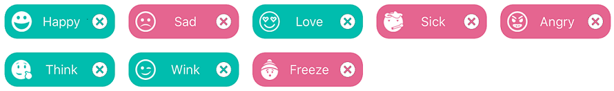

# DataTemplateSelector in .NET MAUI SfChipGroup

Use a [DataTemplateSelector](https://learn.microsoft.com/en-us/dotnet/api/microsoft.maui.controls.datatemplateselector) to choose a different `DataTemplate` for each item rendered by [SfChipGroup](https://help.syncfusion.com/cr/maui/Syncfusion.Maui.Core.SfChipGroup.html). This is useful when each chip needs to render different visuals based on the underlying data.

## Prerequisites

Before using the [SfChip](https://help.syncfusion.com/cr/maui/Syncfusion.Maui.Core.SfChip.html), ensure the following NuGet package is installed in your .NET MAUI project:

- `Syncfusion.Maui.Core`

For a step-by-step setup, refer to the [Getting Started](https://help.syncfusion.com/maui/chips/getting-started) documentation.

## Create the model and view model

Define a `ChipModel` class with `Text`, `CanSelect`, and `ImageSource` properties, then populate an `ObservableCollection<ChipModel>` in a view model.




public class ChipModel
{
    public string Text { get; set; } = string.Empty;
    public bool CanSelect { get; set; }
    public ImageSource ImageSource { get; set; } = string.Empty;
}

public class ChipViewModel
{
    public ObservableCollection<ChipModel> Data { get; set; } 
    
    public ChipViewModel()
    {
        Data = new ObservableCollection<ChipModel>()
        {
        new ChipModel { Text = "Happy", CanSelect = true, ImageSource = "Happy.png" },
        new ChipModel { Text = "Sad", CanSelect = false, ImageSource = "Sad.png" },
        new ChipModel { Text = "Love", CanSelect = true, ImageSource = "Love.png" },
        new ChipModel { Text = "Sick", CanSelect = false, ImageSource = "Sick.png" },
        new ChipModel { Text = "Angry", CanSelect = false, ImageSource = "Angry.png" },
        new ChipModel { Text = "Think", CanSelect = true, ImageSource = "Thinking.png" },
        new ChipModel { Text = "Wink", CanSelect = true, ImageSource = "Wink.png" },
        new ChipModel { Text = "Freeze", CanSelect = false, ImageSource = "Freezing.png" }
        };
    }
}




## Create a data template selector

Create a custom class by inheriting `DataTemplateSelector` and override the [OnSelectTemplate](https://learn.microsoft.com/en-us/dotnet/api/microsoft.maui.controls.datatemplateselector.onselecttemplate) method to return a different `DataTemplate` based on the item. At runtime, the SfChipGroup invokes the OnSelectTemplate method for each item and passes the data object as parameter.

The following selector exposes two templates - `HappyEmojiTemplate` for chips that can be selected, and `SadEmojiTemplate` for those that cannot.




public class ChipDataTemplateSelector : DataTemplateSelector
{
    public DataTemplate HappyEmojiTemplate { get; set; } = new DataTemplate();
    public DataTemplate SadEmojiTemplate { get; set; } = new DataTemplate();

    protected override DataTemplate OnSelectTemplate(object item, BindableObject container)
    {
        return (item as ChipModel)?.CanSelect == true ? HappyEmojiTemplate : SadEmojiTemplate;
    }
}




## Apply the selector

The properties on the selector (e.g., `HappyEmojiTemplate`) are populated from XAML using `StaticResource` references to the `DataTemplate` resources.




<ContentPage.Resources>
    <ResourceDictionary>
        <DataTemplate x:Key="happyTemplate">
            <chip:SfChip HeightRequest="40"
                         WidthRequest="120"
                         Text="{Binding Text}"
                         BackgroundColor="#00bdae"
                         ShowIcon="True"
                         ImageSource="{Binding ImageSource}"
                         ShowCloseButton="True"
                         ShowSelectionIndicator="False"
                         ImageAlignment="Left"
                         CloseButtonColor="White" />
        </DataTemplate>

        <DataTemplate x:Key="sadTemplate">
            <chip:SfChip HeightRequest="40"
                         WidthRequest="120"
                         Text="{Binding Text}"
                         BackgroundColor="#e56590"
                         ShowIcon="True"
                         ImageSource="{Binding ImageSource}"
                         ShowCloseButton="True"
                         ShowSelectionIndicator="False"
                         ImageAlignment="Left"
                         CloseButtonColor="White" />
        </DataTemplate>

        <local:ChipDataTemplateSelector x:Key="selector"
                                        HappyEmojiTemplate="{StaticResource happyTemplate}"
                                        SadEmojiTemplate="{StaticResource
                                        sadTemplate}" />
    </ResourceDictionary>
</ContentPage.Resources>




Assign the `ChipDataTemplateSelector` to the [`ItemTemplate`](https://help.syncfusion.com/cr/maui/Syncfusion.Maui.Core.SfChipGroup.html#Syncfusion_Maui_Core_SfChipGroup_ItemTemplate) property of `SfChipGroup`.




<chip:SfChipGroup x:Name="chipGroup"
                  ChipBackground="Transparent"
                  ItemsSource="{Binding Data}"
                  ItemTemplate="{StaticResource selector}" />




var selector = new ChipDataTemplateSelector
{
    HappyEmojiTemplate = new DataTemplate(() =>
    {
        var chip = new SfChip
        {
            HeightRequest = 40,
            WidthRequest = 120,
            BackgroundColor = Color.FromArgb("#00bdae"),
            ShowIcon = true,
            ShowCloseButton = true,
            ShowSelectionIndicator = false,
            ImageAlignment = Alignment.Start,
            CloseButtonColor = Colors.White
        };
        chip.SetBinding(SfChip.TextProperty, "Text");
        chip.SetBinding(SfChip.ImageSourceProperty, "ImageSource");
        return chip;
    }),
    SadEmojiTemplate = new DataTemplate(() =>
    {
        var chip = new SfChip
        {
            HeightRequest = 40,
            WidthRequest = 120,
            BackgroundColor = Color.FromArgb("#e56590"),
            ShowIcon = true,
            ShowCloseButton = true,
            ShowSelectionIndicator = false,
            ImageAlignment = Alignment.Start,
            CloseButtonColor = Colors.White
        };
        chip.SetBinding(SfChip.TextProperty, "Text");
        chip.SetBinding(SfChip.ImageSourceProperty, "ImageSource");
        return chip;
    })
};

var chipViewModel = new ChipViewModel();

var chipGroup = new SfChipGroup
{
    BindingContext = chipViewModel,
    ChipBackground = Colors.Transparent,
    ItemsSource = chipViewModel.Data,
    ItemTemplate = selector
};

Content = chipGroup;




## See Also

- [Customization](https://help.syncfusion.com/maui/chips/customization)
- [Chip Types](https://help.syncfusion.com/maui/chips/chips-types)
