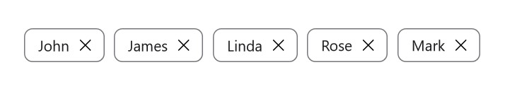

# Getting Started with .NET MAUI Chips

This section guides you through setting up and configuring a [Chips](https://help.syncfusion.com/cr/maui/Syncfusion.Maui.Core.SfChip.html) in your .NET MAUI application. Follow the steps below to add a basic Chips to your project.

To quickly get started with the .NET MAUI Chips, watch this video.






## Prerequisites

Before proceeding, ensure the following are in place:

1. Install [.NET 9 SDK](https://dotnet.microsoft.com/en-us/download/dotnet/9.0) or later.
2. Set up a .NET MAUI environment with Visual Studio 2022 v17.12 or later.

## Step 1: Create a New MAUI Project

1. Go to **File > New > Project** and choose the **.NET MAUI App** template.
2. Name the project and choose a location. Then, click **Next**.
3. Select the .NET framework version and click **Create**.

## Step 2: Install the Syncfusion® MAUI Core NuGet Package

1. In **Solution Explorer**, right-click the project and choose **Manage NuGet Packages**.
2. Search for [Syncfusion.Maui.Core](https://www.nuget.org/packages/Syncfusion.Maui.Core) and install the latest version.
3. Ensure the necessary dependencies are installed correctly, and the project is restored.

## Step 3: Register the Handler 

[Syncfusion.Maui.Core](https://www.nuget.org/packages/Syncfusion.Maui.Core) nuget is a dependent package for all Syncfusion® controls of .NET MAUI. In the **MauiProgram.cs file**, register the handler for Syncfusion® core.


using Microsoft.Maui;
using Microsoft.Maui.Hosting;
using Microsoft.Maui.Controls.Compatibility;
using Microsoft.Maui.Controls.Hosting;
using Microsoft.Maui.Controls.Xaml;
using Syncfusion.Maui.Core.Hosting;

namespace AutocompleteSample
{
    public static class MauiProgram
    {
        public static MauiApp CreateMauiApp()
        {
            var builder = MauiApp.CreateBuilder();
            builder
            .UseMauiApp<App>()
            .ConfigureSyncfusionCore()
            .ConfigureFonts(fonts =>
            {
                fonts.AddFont("OpenSans-Regular.ttf", "OpenSansRegular");
            });

            return builder.Build();
        }      
    }
}   

 

## Step 4: Add a Basic Chips control

Step 1: Add the namespace as shown in the following code snippet





    xmlns:chip="clr-namespace:Syncfusion.Maui.Core;assembly=Syncfusion.Maui.Core"
	




    using Syncfusion.Maui.Core;





Step 2: Set the control to content in `ContentPage.`

**For SfChip**





<ContentPage.Content>    
    <chip:SfChip x:Name="chips" />
</ContentPage.Content>




          
SfChip chips = new SfChip(); 
Content = chips;  





**For SfChipGroup**

Initialize an empty [`SfChipGroup`] as shown in the following code snippet





<ContentPage.Content>
	<Grid>
		<chip:SfChipGroup/>
	</Grid>
</ContentPage.Content>





using Syncfusion.Maui.Core;

	Grid grid = new Grid();
	SfChipGroup chipGroup = new SfChipGroup();
	grid.Children.Add(chipGroup);
	this.Content = grid;
		







## Prerequisites

Before proceeding, ensure the following are set up:

1. Install [.NET 9 SDK](https://dotnet.microsoft.com/en-us/download/dotnet/9.0) or later.
2. Set up a .NET MAUI environment with Visual Studio Code.
3. Ensure that the .NET MAUI workloads are installed and configured as described [here](https://learn.microsoft.com/en-us/dotnet/maui/get-started/installation?view=net-maui-9.0&tabs=visual-studio-code).

## Step 1: Create a New MAUI Project

1. Open the Command Palette by pressing **Ctrl+Shift+P** and type **.NET:New Project** and press Enter.
2. Choose the **.NET MAUI App** template.
3. Select the project location, type the project name and press Enter.
4. Then choose **Create project**

## Step 2: Install the Syncfusion® MAUI Core NuGet Package

1. Press <kbd>Ctrl</kbd> + <kbd>`</kbd> (backtick) to open the integrated terminal in Visual Studio Code.
2. Ensure you're in the project root directory where your .csproj file is located.
3. Run the command `dotnet add package Syncfusion.Maui.Core` to install the Syncfusion® .NET MAUI Core package.
4. To ensure all dependencies are installed, run `dotnet restore`.

## Step 3: Register the Handler 

[Syncfusion.Maui.Core](https://www.nuget.org/packages/Syncfusion.Maui.Core) nuget is a dependent package for all Syncfusion® controls of .NET MAUI. In the **MauiProgram.cs file**, register the handler for Syncfusion® core.


using Microsoft.Maui;
using Microsoft.Maui.Hosting;
using Microsoft.Maui.Controls.Compatibility;
using Microsoft.Maui.Controls.Hosting;
using Microsoft.Maui.Controls.Xaml;
using Syncfusion.Maui.Core.Hosting;

namespace AutocompleteSample
{
    public static class MauiProgram
    {
        public static MauiApp CreateMauiApp()
        {
            var builder = MauiApp.CreateBuilder();
            builder
            .UseMauiApp<App>()
            .ConfigureSyncfusionCore()
            .ConfigureFonts(fonts =>
            {
                fonts.AddFont("OpenSans-Regular.ttf", "OpenSansRegular");
            });

            return builder.Build();
        }      
    }
}   

 

## Step 4: Add a Basic Chips control

Step 1: Add the NuGet to the project

Step 2: Add the namespace as shown in the following code snippet





    xmlns:chip="clr-namespace:Syncfusion.Maui.Core;assembly=Syncfusion.Maui.Core"
	




    using Syncfusion.Maui.Core;





Step 3: Set the control to content in `ContentPage.`

**For SfChip**





<ContentPage.Content>    
    <chip:SfChip x:Name="chips" />
</ContentPage.Content>




          
SfChip chips = new SfChip(); 
Content = chips;  





**For SfChipGroup**

Initialize an empty [`SfChipGroup`] as shown in the following code snippet





<ContentPage.Content>
	<Grid>
		<chip:SfChipGroup/>
	</Grid>
</ContentPage.Content>





using Syncfusion.Maui.Core;

	Grid grid = new Grid();
	SfChipGroup chipGroup = new SfChipGroup();
	grid.Children.Add(chipGroup);
	this.Content = grid;
		








## Prerequisites

Before proceeding, ensure the following are set up:

1. Install [.NET 9 SDK](https://dotnet.microsoft.com/en-us/download/dotnet/9.0) or later.
2. Set up a .NET MAUI environment with JetBrains Rider 2024.3 or later.
3. Make sure the MAUI workloads are installed and configured as described [here.](https://www.jetbrains.com/help/rider/MAUI.html#before-you-start)

## Step 1: Create a new .NET MAUI project

1. Go to **File > New Solution**, select .NET (C#) and choose the **.NET MAUI App** template.
2. Enter the Project Name, Solution Name, and Location.
3. Select the .NET framework version and click **Create**.

## Step 2: Install the Syncfusion® MAUI Core NuGet package

1. In **Solution Explorer**, right-click the project and choose **Manage NuGet Packages**.
2. Search for [Syncfusion.Maui.Core](https://www.nuget.org/packages/Syncfusion.Maui.Core/) and install the latest version.
3. Ensure the necessary dependencies are installed correctly, and the project is restored. If not, open the terminal in Rider and manually run: `dotnet restore`.

## Step 3: Register the Handler 

[Syncfusion.Maui.Core](https://www.nuget.org/packages/Syncfusion.Maui.Core) nuget is a dependent package for all Syncfusion® controls of .NET MAUI. In the **MauiProgram.cs file**, register the handler for Syncfusion® core.


using Microsoft.Maui;
using Microsoft.Maui.Hosting;
using Microsoft.Maui.Controls.Compatibility;
using Microsoft.Maui.Controls.Hosting;
using Microsoft.Maui.Controls.Xaml;
using Syncfusion.Maui.Core.Hosting;

namespace AutocompleteSample
{
    public static class MauiProgram
    {
        public static MauiApp CreateMauiApp()
        {
            var builder = MauiApp.CreateBuilder();
            builder
            .UseMauiApp<App>()
            .ConfigureSyncfusionCore()
            .ConfigureFonts(fonts =>
            {
                fonts.AddFont("OpenSans-Regular.ttf", "OpenSansRegular");
            });

            return builder.Build();
        }      
    }
}   

 

## Step 4: Add a Basic Chips control

Step 1: Add the NuGet to the project

Step 2: Add the namespace as shown in the following code snippet





    xmlns:chip="clr-namespace:Syncfusion.Maui.Core;assembly=Syncfusion.Maui.Core"
	




    using Syncfusion.Maui.Core;





Step 3: Set the control to content in `ContentPage.`

**For SfChip**





<ContentPage.Content>    
    <chip:SfChip x:Name="chips" />
</ContentPage.Content>




          
SfChip chips = new SfChip(); 
Content = chips;  





**For SfChipGroup**

Initialize an empty [`SfChipGroup`] as shown in the following code snippet





<ContentPage.Content>
	<Grid>
		<chip:SfChipGroup/>
	</Grid>
</ContentPage.Content>





using Syncfusion.Maui.Core;

	Grid grid = new Grid();
	SfChipGroup chipGroup = new SfChipGroup();
	grid.Children.Add(chipGroup);
	this.Content = grid;
		








## Step 5: Define the view model

Now, define a simple data model of person with the name properties.




//Model class for chips
public class Person
{
	public string Name
	{
		get;
		set;
	}
}




Next, create a view model class and initialize a collection of persons as shown in the following code sample.




//View model class for chips
public class ViewModel : INotifyPropertyChanged
{
	private ObservableCollection<Person> employees;
	public ObservableCollection<Person> Employees
	{
		get { return employees; }
		set { Employees = value; OnPropertyChanged("Employees"); }
	}

	public ViewModel()
	{
		employees = new ObservableCollection<Person>();
		employees.Add(new Person() { Name = "John" });
		employees.Add(new Person() { Name = "James" });
		employees.Add(new Person() { Name = "Linda" });
		employees.Add(new Person() { Name = "Rose" });
		employees.Add(new Person() { Name = "Mark" });
	}

	public event PropertyChangedEventHandler PropertyChanged;

	public void OnPropertyChanged(string property)
	{
		if (PropertyChanged != null)
		{
			PropertyChanged(this, new PropertyChangedEventArgs(property));
		}
	}
}




## Step 6: Populate Chip with data

Create an instance of ViewModel class,and then set it as the `BindingContext`. Bind the `ItemsSource` property with a collection, and then set the `DisplayMemberPath` property:





<ContentPage.BindingContext>
	<local:ViewModel x:Name="viewModel"/>
</ContentPage.BindingContext>
<ContentPage.Content>
	<Grid>
		<chip:SfChipGroup 
			ItemsSource="{Binding Employees}" 
			ChipPadding="8,8,0,0" 
			DisplayMemberPath="Name"
			ChipBackground="white"
			ChipTextColor="Black"
			HorizontalOptions="Start" 
			VerticalOptions="Center">
		</chip:SfChipGroup>  
	</Grid>
</ContentPage.Content>





this.BindingContext = new ViewModel();
Grid grid = new Grid();
SfChipGroup chipGroup = new SfChipGroup()
{
	DisplayMemberPath = "Name",
	HorizontalOptions = LayoutOptions.Start,
	VerticalOptions = LayoutOptions.Center,
	ChipTextColor = Colors.Black,
	ChipBackground = Colors.White,
	ChipPadding = new Thickness(8, 8, 0, 0),
};
chipGroup.SetBinding(SfChipGroup.ItemsSourceProperty, "Employees");
grid.Children.Add(chipGroup);
this.Content = grid;
		




The following screenshot illustrates the result of the above code.

You can download the getting started project of this demo from [GitHub](https://github.com/SyncfusionExamples/Getting-Started-with-.NET-MAUI-Chips)

N> When publishing in AOT mode on iOS, ensure [Preserve(AllMembers = true)] is added to the model class to maintain DisplayMemberPath binding

N> You can refer to our [.NET MAUI Chips](https://www.syncfusion.com/maui-controls/maui-chips) feature tour page for its groundbreaking feature representations. You can also explore our [.NET MAUI Chips Example](https://github.com/syncfusion/maui-demos/tree/master/MAUI/Chips) that shows you how to render the Chips in .NET MAUI.
