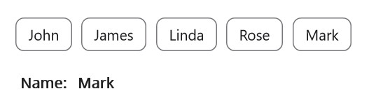

# Getting Started with .NET MAUI Chips

This section explains the steps required to create chips and arrange them in a layout for performing action. This section covers only the minimal features that you needed to know to get started with the chips.

## Assembly deployment

After installing [Essential Studio for .NET MAUI](https://www.syncfusion.com/downloads/maui), you can find all the required assemblies in the installation folders, {Syncfusion Essential Studio Installed location} \Essential Studio\\{Version #}\.NET MAUI\lib.

E.g.: C:\Program Files (x86) \Syncfusion\Essential Studio\19.1.0.54\.NET MAUI\lib

N> Assemblies can be found in unzipped package location(Documents/Syncfusion/{Version #}/.NET MAUI/lib) in Mac.

## Adding .NET MAUI Chips reference

Syncfusion .NET MAUI components are available in [nuget.org](https://www.nuget.org/). To add Chips to your project, open the NuGet package manager in Visual Studio, search for [Syncfusion.Maui.Core](https://www.nuget.org/packages/Syncfusion.Maui.Core), and then install it.

## Handler Registration

In the MauiProgram.cs file, register the handler for Syncfusion core.


using Microsoft.Maui;
using Microsoft.Maui.Hosting;
using Microsoft.Maui.Controls.Compatibility;
using Microsoft.Maui.Controls.Hosting;
using Microsoft.Maui.Controls.Xaml;
using Syncfusion.Maui.Core.Hosting;

namespace AutocompleteSample
{
    public static class MauiProgram
    {
        public static MauiApp CreateMauiApp()
        {
            var builder = MauiApp.CreateBuilder();
            builder
            .UseMauiApp<App>()
            .ConfigureSyncfusionCore()
            .ConfigureFonts(fonts =>
            {
                fonts.AddFont("OpenSans-Regular.ttf", "OpenSansRegular");
            });

            return builder.Build();
        }      
    }
}   

 

### Adding the .NET MAUI Chips control

Step 1: Add the NuGet to the project

Step 2: Add the namespace as shown in the following code snippet





    xmlns:chip="clr-namespace:Syncfusion.Maui.Core;assembly=Syncfusion.Maui.Core"
	




    using Syncfusion.Maui.Core;





Step 3: Set the control to content in `ContentPage.`

## For SfChip





<ContentPage.Content>    
    <chip:SfChip x:Name="chips" />
</ContentPage.Content>




          
SfChip chips = new SfChip(); 
Content = chips;  





## For SfChipGroup

Initialize an empty [`SfChipGroup`] as shown in the following code snippet





<ContentPage
    xmlns="http://schemas.microsoft.com/dotnet/2021/maui"
	xmlns:x="http://schemas.microsoft.com/winfx/2009/xaml"
    xmlns:chip="clr-namespace:Syncfusion.Maui.Core;assembly=Syncfusion.Maui.Core"
    xmlns:x="http://schemas.microsoft.com/winfx/2009/xaml"
    xmlns:local="clr-namespace:Chips"
    x:Class="Chips.GettingStarted">
	<ContentPage.Content>
		<Grid>
			<chip:SfChipGroup/>
		</Grid>
	</ContentPage.Content>
</ContentPage>





using Syncfusion.Maui.Core;

namespace Chips
{
	public partial class GettingStarted: ContentPage
	{
		public GettingStarted()
		{
			InitializeComponent();
			Grid grid = new Grid();
			SfChipGroup chipGroup = new SfChipGroup();
			grid.Children.Add(chipGroup);
			this.Content = grid;
		}
	}
}





## Set layout for the control

The chips control creates chip for each object and arranges chips in a StackLayout with horizontal orientation. Any layout can be used to arrange the chips in the chips control.In the following example, the `FlexLayout` has been used. 





<ContentPage
	xmlns="http://schemas.microsoft.com/dotnet/2021/maui"
	xmlns:x="http://schemas.microsoft.com/winfx/2009/xaml"
    xmlns:chip="clr-namespace:Syncfusion.Maui.Core;assembly=Syncfusion.Maui.Core"
    xmlns:x="http://schemas.microsoft.com/winfx/2009/xaml"
    xmlns:local="clr-namespace:Chips"
    x:Class="Chips.GettingStarted">
	<ContentPage.Content>
		<Grid>
			<chip:SfChipGroup DisplayMemberPath="Name">
				<chip:SfChipGroup.ChipLayout>
					<FlexLayout 
						HorizontalOptions="Start" 
						VerticalOptions="Center" 
						/> 
                </chip:SfChipGroup.ChipLayout>
			</chip:SfChipGroup> 
		</Grid>
	</ContentPage.Content>
</ContentPage >
	




using Syncfusion.Maui.Core;

namespace Chips
{
	public partial class GettingStarted: ContentPage
	{
		public GettingStarted()
		{
			InitializeComponent();
			Grid grid = new Grid();
			SfChipGroup chipGroup = new SfChipGroup();
			chipGroup.DispalyMemberpath="Name",
			grid.Children.Add(chipGroup);
			FlexLayout layout = new FlexLayout()
			{
				HorizontalOptions = LayoutOptions.Start,
				VerticalOptions = LayoutOptions.Center,
			};
			chipGroup.ChipLayout = layout;
			this.Content = grid;
		}
	}
}





## Populating business objects

Now, define a simple data model of person with the name and image properties. Create a view model class and initialize a collection of persons as shown in the following code sample.



namespace Chips
{
	//Model class for chips
	public class Person
	{
		public string Name
		{
			get;
			set;
		}
	}
}





using System.Collections.ObjectModel;
using System.ComponentModel;
namespace Chips
{
	//View model class for chips
	public class ViewModel : INotifyPropertyChanged
	{
		private ObservableCollection<Person> employees;
		public ObservableCollection<Person> Employees
		{
			get
			{
				return employees;
			}
			set
			{
				Employees = value;
				OnPropertyChanged("Employees");
			}
		}

		public ViewModel()
		{
			employees = new ObservableCollection<Person>();
			employees.Add(new Person() { Name = "John" });
			employees.Add(new Person() { Name = "James" });
			employees.Add(new Person() { Name = "Linda" });
			employees.Add(new Person() { Name = "Rose" });
			employees.Add(new Person() { Name = "Mark" });
		}

		public event PropertyChangedEventHandler PropertyChanged;

		public void OnPropertyChanged(string property)
		{
			if (PropertyChanged != null)
			{
				PropertyChanged(this, new PropertyChangedEventArgs(property));
			}
		}
	}
}



Create an instance of ViewModel class,and then set it as the `BindingContext`. Bind the `ItemsSource` property with a collection, and then set the `DisplayMemberPath` property:





<ContentPage
	xmlns="http://schemas.microsoft.com/dotnet/2021/maui"
	xmlns:x="http://schemas.microsoft.com/winfx/2009/xaml"
    xmlns:chip="clr-namespace:Syncfusion.Maui.Core;assembly=Syncfusion.Maui.Core"
    xmlns:x="http://schemas.microsoft.com/winfx/2009/xaml"
    xmlns:local="clr-namespace:Chips"
    x:Class="Chips.GettingStarted">
	<ContentPage.BindingContext>
		<local:ViewModel x:Name="viewModel"/>
	</ContentPage.BindingContext>
	<ContentPage.Content>
		<Grid>
			<chip:SfChipGroup 
				ItemsSource="{Binding Employees}" 
				ChipPadding="8,8,0,0" 
				DisplayMemberPath="Name"
				ChipBackground="white"
            	ChipTextColor="Black"
				HorizontalOptions="Start" 
				VerticalOptions="Center">
			</chip:SfChipGroup>  
		</Grid>
	</ContentPage.Content>
</ContentPage>




using Syncfusion.Maui.Core;
using System.Collections.ObjectModel;
using System.ComponentModel;
namespace Chips
{
	public partial class GettingStarted: ContentPage
	{
		public GettingStarted()
		{
			InitializeComponent();
			Grid grid = new Grid();
			SfChipGroup chipGroup = new SfChipGroup();
			grid.Children.Add(chipGroup);
			this.BindingContext = new ViewModel();
			chipGroup.SetBinding(SfChipGroup.ItemsSourceProperty, "Employees");
			chipGroup.DisplayMemberPath = "Name";
			chipGroup.HorizontalOptions = LayoutOptions.Start;
			chipGroup.VerticalOptions = LayoutOptions.Center;
			chipGroup.ChipTextColor = Colors.Black;
			chipGroup.ChiBackground = Colors.White;
			chipGroup.ChipPadding = new Thickness(8, 8, 0, 0);
			this.Content = grid;
		}
	}
}





## Set types of chip group

The functionality of chips control differ based on its [`ChipType`] property.
By default type of chips control have Input type. Input chip types have close button, using it chip can be can removed dynamically from children and the layout.

The following code example uses the [`Action`] type. In Action type, [`Command`] property of [`SfChipGroup`] is executed when any chip in the group is tapped. Here the Employee name of corresponding chip is set as label text when the Command is executed.





<ContentPage
    xmlns="http://schemas.microsoft.com/dotnet/2021/maui"
    xmlns:x="http://schemas.microsoft.com/winfx/2009/xaml"
    xmlns:chip="clr-namespace:Syncfusion.Maui.Core;assembly=Syncfusion.Maui.Core"
    xmlns:x="http://schemas.microsoft.com/winfx/2009/xaml"
    xmlns:local="clr-namespace:Chips"
    x:Class="Chips.GettingStarted">
	<ContentPage.BindingContext>
		<local:ViewModel/>
	</ContentPage.BindingContext>
	<ContentPage.Content>
		<StackLayout>
			<chip:SfChipGroup
				Command="{Binding ActionCommand}" 
				ItemsSource="{Binding Employees}"
				DisplayMemberPath="Name"
				ChipType="Action">
			</chip:SfChipGroup>
			<StackLayout Orientation="Horizontal">
			<Label 
				Text="Name:" 
				FontAttributes="Bold" 
				FontSize="14" />
			<Label 
				Text="{Binding Result}"
				FontAttributes="Bold" 
				FontSize="14" />
			</StackLayout>
		</StackLayout>  
	</ContentPage.Content>
</ContentPage>





using System;
using System.Collections.Generic;
using System.Collections.ObjectModel;
using System.ComponentModel;
using System.Windows.Input;

namespace Chips
{
	public class ViewModel :INotifyPropertyChanged
	{
		private ICommand actionCommand;

		private ObservableCollection<Person> employees;

		private string result;

		public ICommand ActionCommand
    	{
			get { return actionCommand; }
			set { actionCommand = value; }
    	}
    
    	public ObservableCollection<Person> Employees
    	{
        	get { return employees; }
        	set
        	{
            	Employees = value;
            	OnPropertyChanged("Employees");
        	}
    	}

		public string Result
		{
			get { return result; }
			set 
			{
				result = value;
				OnPropertyChanged("Result");
			}
		}

		public ViewModel()
		{
			ActionCommand = new Command(HandleAction);
			employees = new ObservableCollection<Person>();
			employees.Add(new Person() { Name = "John" });
			employees.Add(new Person() { Name = "James" });
			employees.Add(new Person() { Name = "Linda" });
			employees.Add(new Person() { Name = "Rose" });
			employees.Add(new Person() { Name = "Mark" });
		}

		public event PropertyChangedEventHandler PropertyChanged;

		public void OnPropertyChanged(string property)
		{
			if (PropertyChanged != null)
			{
				PropertyChanged(this, new PropertyChangedEventArgs(property));
			}
		}

		private void HandleAction(object obj)
		{
			Result = (obj as Person).Name.ToString();
		}
	}
}





