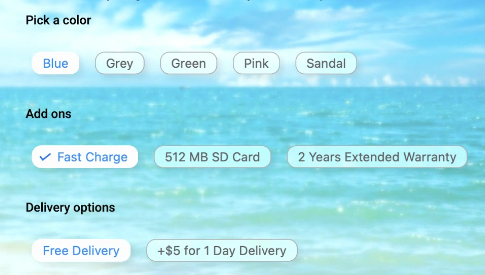

# Liquid Glass Effect in .NET MAUI Chips (SfChip)

The Liquid Glass Effect introduces a modern, translucent design with adaptive color tinting and light refraction, creating a sleek, glass like user experience that remains clear and accessible. This section explains how to enable and customize the effect in the Syncfusion® .NET MAUI Chips (SfChip) control.

## Apply liquid glass effect

Follow these steps to enable and configure the Liquid Glass Effect in the Chips control:

### Step 1: Enable the liquid glass effect on Chips

Set the `EnableLiquidGlassEffect` property to `true` in the `SfChip` control to apply the Liquid Glass Effect. When enabled, the effect is also applied to its dependent controls and provides responsive interaction for a smooth and engaging user experience.

### Step 3: Customize the background

To achieve a glass like background in the Chips, set the `Background` property to `Transparent`. The background will then be treated as a tinted color, ensuring a consistent glass effect across the controls.

The following code snippet demonstrates how to apply the Liquid Glass Effect to the `SfChip` control:


    <Grid>
    <Image Source="Wallpaper.png" Aspect="AspectFill">
        <core:SfChipGroup
            x:Name="FilterChips"
            EnableLiquidGlassEffect="True">
            <chip:SfChipGroup.Items>
                <chip:SfChip Text="Extra Small"/>
                <chip:SfChip Text="Small" />
                <chip:SfChip Text="Medium" />
                <chip:SfChip Text="Large"/>
                <chip:SfChip Text="Extra Large"/>
            </chip:SfChipGroup.Items>
        </core:SfChipGroup>
    </Grid>



using Syncfusion.Maui.Core;

    var grid = new Grid();
    var image = new Image
    {
        Source = "Wallpaper.png",
        Aspect = Aspect.AspectFill
    };
    grid.Children.Add(image);

    var FilterChips = new SfChipGroup
    {
        EnableLiquidGlassEffect = true
    };

    FilterChips.Items.Add(new SfChip { Text = "Extra Small" });
    FilterChips.Items.Add(new SfChip { Text = "Small" });
    FilterChips.Items.Add(new SfChip { Text = "Medium" });
    FilterChips.Items.Add(new SfChip { Text = "Large" });
    FilterChips.Items.Add(new SfChip { Text = "Extra Large" });

    grid.Children.Add(FilterChips);
    Content = grid;




The following screenshot illustrates SfChipGroup with the built-in glass effect enabled via EnableLiquidGlassEffect, displayed over a wallpaper background.

N>
This feature is supported only on .NET 10 along with iOS 26 and macOS 26 