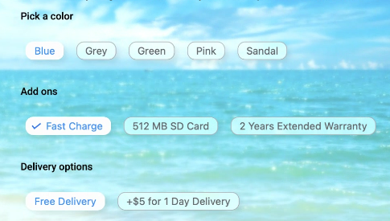

# Liquid Glass Effect in .NET MAUI SfChipGroup

The Liquid Glass Effect introduces a modern, translucent design with adaptive color tinting and light refraction, creating a sleek, glass-like user experience that remains clear and accessible. This page explains how to enable and customize the effect in the Syncfusion® .NET MAUI [SfChipGroup](https://help.syncfusion.com/cr/maui/Syncfusion.Maui.Core.SfChipGroup.html) control.

## Prerequisites

Before using the [SfChip](https://help.syncfusion.com/cr/maui/Syncfusion.Maui.Core.SfChip.html), ensure the following NuGet package is installed in your .NET MAUI project:

- `Syncfusion.Maui.Core`

For a step-by-step setup, refer to the [Getting Started](https://help.syncfusion.com/maui/chips/getting-started) documentation.

## Property Reference

| Property | Type | Default | Description |
|----------|------|---------|-------------|
| [EnableLiquidGlassEffect](https://help.syncfusion.com/cr/maui/Syncfusion.Maui.Core.SfChipGroup.html#Syncfusion_Maui_Core_SfChipGroup_EnableLiquidGlassEffect) | `bool` | `false` | When `true`, applies the Liquid Glass Effect to the `SfChipGroup` and its child chips. The dependent controls (for example, the close button on `Input` chips) also receive the effect. |

## Apply the Liquid Glass Effect

Follow these steps to enable and configure the Liquid Glass Effect in the `SfChipGroup`:

### Step 1: Enable the effect

Set the `EnableLiquidGlassEffect` property to `true` on the [SfChipGroup](https://help.syncfusion.com/cr/maui/Syncfusion.Maui.Core.SfChipGroup.html). When enabled, the effect is applied to the chips and to dependent controls (such as the close button on `Input`-type chips).

### Step 2: Set a transparent background

To achieve a glass-like background on the `SfChipGroup`, set its `Background` property to `Transparent`. The background is then treated as a tinted color, ensuring a consistent glass effect across the controls.

### Step 3: Place the control over a colorful image or gradient

The effect relies on the pixels behind the control. Place the `SfChipGroup` over a wallpaper, gradient, or other colorful content to see the tinting and refraction.

## Example

The following example shows an `SfChipGroup` with the Liquid Glass Effect enabled, placed over a wallpaper image.




<Grid>
    <Image Source="Wallpaper.png" Aspect="AspectFill" />
    <chip:SfChipGroup x:Name="filterChips"
                        EnableLiquidGlassEffect="True"
                        Background="Transparent">
        <chip:SfChip Text="Extra Small" />
        <chip:SfChip Text="Small" />
        <chip:SfChip Text="Medium" />
        <chip:SfChip Text="Large" />
        <chip:SfChip Text="Extra Large" />
    </chip:SfChipGroup>
</Grid>





var grid = new Grid();
grid.Children.Add(new Image
{
    Source = "Wallpaper.png",
    Aspect = Aspect.AspectFill
});

var filterChips = new SfChipGroup
{
    EnableLiquidGlassEffect = true,
    Background = Colors.Transparent
};

filterChips.Items.Add(new SfChip { Text = "Extra Small" });
filterChips.Items.Add(new SfChip { Text = "Small" });
filterChips.Items.Add(new SfChip { Text = "Medium" });
filterChips.Items.Add(new SfChip { Text = "Large" });
filterChips.Items.Add(new SfChip { Text = "Extra Large" });

grid.Children.Add(filterChips);
Content = grid;




The following screenshot illustrates `SfChipGroup` with the Liquid Glass Effect enabled via `EnableLiquidGlassEffect`, displayed over a wallpaper background.

N> This feature is supported only on .NET 10 along with iOS 26 and macOS 26.

## Troubleshooting

| Issue | Possible Cause | Recommended Action |
|-------|----------------|--------------------|
| The Liquid Glass Effect is not visible. | The platform does not support the effect, or `EnableLiquidGlassEffect` is `false`. | Confirm the target platform is .NET 10 with iOS 26 or macOS 26, and set `EnableLiquidGlassEffect = true`. |
| The chips appear opaque, not translucent. | The `Background` is not `Transparent`, or the control is not placed over a colorful surface. | Set `Background="Transparent"` (XAML) or `Background = Colors.Transparent` (C#) and place the control over an image or gradient. |
| The dependent controls (for example, the close button) are not glassy. | The effect was disabled at the platform level, or the dependent control is rendered with an explicit background. | Verify the platform support and remove any explicit background brushes on the dependent controls. |

## See Also

- [Getting Started with .NET MAUI SfChipGroup](https://help.syncfusion.com/maui/chips/getting-started)
- [Customization](https://help.syncfusion.com/maui/chips/customization)
- [Chip Types](https://help.syncfusion.com/maui/chips/chips-types)