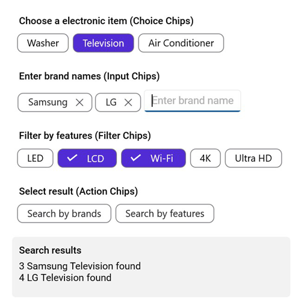

# Overview in .NET MAUI Chips

The [.NET MAUI Chips](https://www.syncfusion.com/maui-controls/maui-chips) control is a versatile and feature-rich component that allows you to present information in an interactive and customizable layout. It enables you to arrange multiple chips in a layout and group them, making a selection and interaction seamless.

## Business use cases

- Applications that require **tag or category selection for filtering and classification**.  
- Search interfaces that use **filter chips to refine results dynamically**.  
- E-commerce apps that allow users to **select product attributes such as size, color, or category**.  
- Mobile and business apps that need **compact selectable UI elements for quick interactions**.  

## Key features

- **Flexible layout options** allow arranging chips using layouts such as stack, flex, and other configurable arrangements.  
- **Text-to-chip conversion** allows transforming text values into compact chip representations for better readability.  
- **Background customization** allows adding background images to enhance chip visuals.  
- **Comprehensive styling support** allows modifying text color, background color, border color, border thickness, and selection color for a consistent UI design. 

    

## Globalization

The following table summarizes the globalization support available in the [SfChip](https://www.syncfusion.com/maui-controls/maui-chips) control.

 Full Support  
 Not Applicable

<table>
<tr>
<th align="center">Control</th>
<th align="center">Localization</th>
<th align="center">RTL</th>
<th align="center">Time zone</th>
<th align="center">Screen reader</th>
<th align="center">Keyboard navigation</th>
</tr>
<tr>
<td><a href="/maui/chips/overview">Chips</a></td>
<td align="center"></td>
<td align="center"></td>
<td align="center"></td>
<td align="center"></td>
<td align="center"></td>
</tr>
</table>

## Related controls

- **[CheckBox](https://help.syncfusion.com/maui/checkbox/overview)** for implementing multi-selection using checkbox controls.  
- **[ComboBox](https://help.syncfusion.com/maui/combobox/overview)** for selection from dropdown-based inputs.  
- **[Autocomplete](https://help.syncfusion.com/maui/autocomplete/overview)** for searchable and suggestion-based inputs.  

## Next steps

Explore further resources:

- [Getting Started](https://help.syncfusion.com/maui/chips/getting-started) - step-by-step guide to begin using the Chips control.
- [Chip Types](https://help.syncfusion.com/maui/chips/chips-types) – explore different chip variations such as input, choice, filter, and action chips, and learn how each type can be used to represent data or user actions.  
- [Customization](https://help.syncfusion.com/maui/chips/customization) – personalize chip appearance by modifying styles, colors, icons, and templates to match your application’s design and improve usability. 
- [UI Kit](https://www.syncfusion.com/demos/maui#maui-ui-control) - explore interactive demos and ready‑made UI examples.

## Learnings

<!-- Card 1 -->
<a href="https://www.syncfusion.com/blogs/category/net-maui" class="form-card" target="_blank">
  

    <h3 class="form-title">Explore Blogs</h3>
    

      Read insights, tutorials, and developer journeys.
    

  

</a>
<!-- Card 2 -->
<a href="https://support.syncfusion.com/kb/cross-platforms/category/76" class="form-card" target="_blank">
  

    <h3 class="form-title">Explore KB's</h3>
    

      Find quick solutions and step‑by‑step guidance.
    

  

</a>
<!-- Card 3 -->
<a href="https://www.syncfusion.com/maui-controls/maui-chips" class="form-card" target="_blank">
  

    <h3 class="form-title">Feature Tour</h3>
    

      Walk through highlights and core capabilities.
    

  

</a>
<!-- Card 4 -->
<a href="https://github.com/syncfusion/maui-demos/tree/master/MAUI/Chips" class="form-card" target="_blank">
  

    <h3 class="form-title">Showcase Samples</h3>
    

      Explore sample scenarios for real apps.
    

  

</a>
<!-- Card 5 -->
<a href="https://www.syncfusion.com/tutorial-videos/maui/chips" class="form-card" target="_blank">
  

    <h3 class="form-title">Tutorial Videos</h3>
    

      Step‑by‑step guidance through video tutorials.
    

  

</a>
