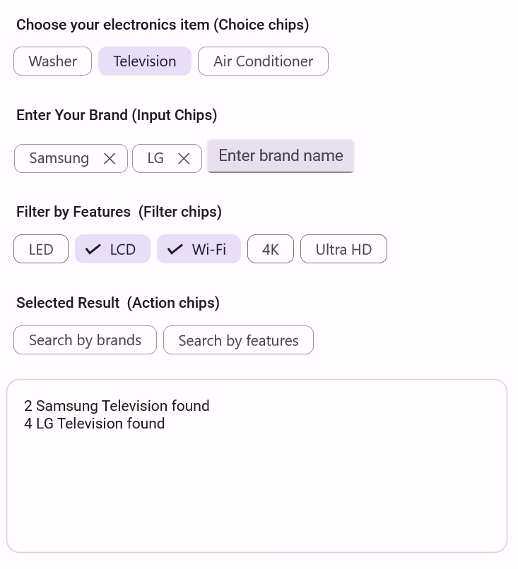

> **Notice**: As of **Volume 1 2025 (mid-March 2025)**, updates, bug fixes, and feature enhancements for this control will no longer be available in the Syncfusion® package. Please switch to the **Syncfusion® Toolkit for .NET MAUI** for continued support. For a smooth transition, refer to this [migration document](https://help.syncfusion.com/maui-toolkit/migration).

# Overview of .NET MAUI Chips

The [.NET MAUI Chips](https://www.syncfusion.com/maui-controls/maui-chips) control is a versatile and feature-rich component that enables the presentation of information in an interactive and customizable layout. It allows multiple chips to be arranged within a layout and grouped, facilitating seamless selection and interaction.

## Key Features

* Choose from various layout options, such as stack, flex, and others, to arrange the chips according to your specifications.
* Transform text into compact chips, offering a concise way to display information.
* Customize the appearance of chips by adding background images.
* Easily adjust the text color, background color, border color, border thickness, and selection color of the MAUI Chips to ensure a cohesive and aesthetically pleasing design.

