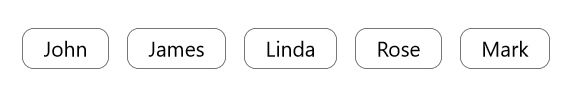
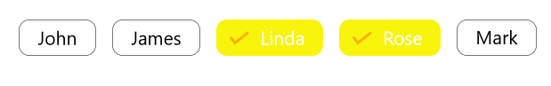

# Visual States in .NET MAUI ChipGroup

Visual states let you change the appearance of the [`.NET MAUI ChipGroup`](https://help.syncfusion.com/cr/maui/Syncfusion.Maui.Chips.SfChipGroup.html) in response to user interaction. Use them to apply different colors, backgrounds, borders, or other properties for each state without writing code-behind handlers.

`SfChipGroup` supports the following visual states through the `VisualStateManager`:

* `Normal` - The default resting state of the ChipGroup.
* `Selected` - A chip is selected within the ChipGroup.
* `Disabled` - The ChipGroup is disabled (`IsEnabled` is `false`).

## Prerequisites

Before using the [SfChip](https://help.syncfusion.com/cr/maui/Syncfusion.Maui.Core.SfChip.html), ensure the following NuGet package is installed in your .NET MAUI project:

- `Syncfusion.Maui.Core`

For a step-by-step setup, refer to the [Getting Started](https://help.syncfusion.com/maui/chips/getting-started) documentation.

## Defining visual states

`SfChipGroup` exposes its states through a single `VisualStateGroup` named `CommonStates`. Each `VisualState` contains a list of `Setter` objects that target bindable properties on the ChipGroup.

Common target properties include `ChipBackground`, `ChipTextColor`, `ChipStroke`, `SelectedChipBackground`, `SelectedChipTextColor`, `SelectionIndicatorColor`, and `CloseButtonColor`.




<chip:SfChipGroup ItemsSource="{Binding Employees}" 
        ChipPadding="8,8,0,0" 
        DisplayMemberPath="Name"
        ChipBackground="white"
        ChipTextColor="Black"
        HorizontalOptions="Start" 
        VerticalOptions="Center">
    <chip:SfChipGroup.BindingContext>
        <local:ViewModel x:Name="viewModel"/>
    </chip:SfChipGroup.BindingContext>
    <VisualStateManager.VisualStateGroups>
        <VisualStateGroup x:Name="CommonStates">
            <VisualState x:Name="Normal">
                <VisualState.Setters>
                    <Setter Property="ChipTextColor" Value="Black" />
                    <Setter Property="ChipStroke" Value="#48494b" />
                    <Setter Property="SelectedChipBackground" Value="#6750A4" />
                    <Setter Property="SelectedChipTextColor" Value="White" />
                    <Setter Property="SelectionIndicatorColor"  Value="#48494b" />
                    <Setter Property="CloseButtonColor" Value="#48494b" />
                </VisualState.Setters>
            </VisualState>
            <VisualState x:Name="Selected">
                <VisualState.Setters>
                    <Setter Property="ChipTextColor" Value="Black" />
                    <Setter Property="ChipStroke" Value="#fcb000" />
                    <Setter Property="SelectedChipBackground" Value="#f8f40c" />
                    <Setter Property="SelectedChipTextColor" Value="White" />
                    <Setter Property="SelectionIndicatorColor" Value="#fcb000" />
                    <Setter Property="CloseButtonColor" Value="#fcb000" />
                </VisualState.Setters>
            </VisualState>
            <VisualState x:Name="Disabled">
                <VisualState.Setters>
                    <Setter Property="ChipTextColor" Value="Black" />
                    <Setter Property="ChipStroke" Value="#D6D6D6" />
                    <Setter Property="SelectedChipBackground" Value="#E0E0E0" />
                    <Setter Property="SelectedChipTextColor" Value="#9E9E9E" />
                    <Setter Property="SelectionIndicatorColor"  Value="#BDBDBD" />
                    <Setter Property="CloseButtonColor" Value="#BDBDBD" />
                </VisualState.Setters>
            </VisualState>
        </VisualStateGroup>
    </VisualStateManager.VisualStateGroups>
</chip:SfChipGroup>




SfChipGroup chipGroup = new SfChipGroup();

chipGroup.Chips.Add(new SfChip() { Text = "Apple" });
chipGroup.Chips.Add(new SfChip() { Text = "Orange" });
chipGroup.Chips.Add(new SfChip() { Text = "Mango" });

VisualStateGroupList visualStateGroupList = new VisualStateGroupList();
VisualStateGroup commonStateGroup = new VisualStateGroup { Name = "CommonStates" };

VisualState normalState = new VisualState { Name = "Normal" };
normalState.Setters.Add(new Setter { Property = SfChipGroup.ChipBackgroundProperty, Value = Color.FromArgb("#F8F9FA") });
normalState.Setters.Add(new Setter { Property = SfChipGroup.ChipTextColorProperty, Value = Color.FromArgb("#212121") });
normalState.Setters.Add(new Setter { Property = SfChipGroup.ChipStrokeProperty, Value = Color.FromArgb("#D0D5DD") });

VisualState selectedState = new VisualState { Name = "Selected" };
selectedState.Setters.Add(new Setter { Property = SfChipGroup.SelectedChipBackgroundProperty, Value = Color.FromArgb("#6750A4") });
selectedState.Setters.Add(new Setter { Property = SfChipGroup.SelectedChipTextColorProperty, Value = Colors.White });
selectedState.Setters.Add(new Setter { Property = SfChipGroup.SelectionIndicatorColorProperty, Value = Colors.White });

VisualState disabledState = new VisualState { Name = "Disabled" };
disabledState.Setters.Add(new Setter { Property = SfChipGroup.ChipBackgroundProperty, Value = Color.FromArgb("#F5F5F5") });
disabledState.Setters.Add(new Setter { Property = SfChipGroup.ChipTextColorProperty, Value = Color.FromArgb("#9E9E9E") });
disabledState.Setters.Add(new Setter { Property = SfChipGroup.ChipStrokeProperty, Value = Color.FromArgb("#D6D6D6") });

commonStateGroup.States.Add(normalState);
commonStateGroup.States.Add(selectedState);
commonStateGroup.States.Add(disabledState);

visualStateGroupList.Add(commonStateGroup);
VisualStateManager.SetVisualStateGroups(chipGroup, visualStateGroupList);

Content = chipGroup;




### Normal visual state

### Selected visual state

### Disabled visual state

## See Also

- [Getting Started with .NET MAUI Chips](https://help.syncfusion.com/maui/chips/getting-started)
- [Chip Types](https://help.syncfusion.com/maui/chips/chips-types)
- [Customization](https://help.syncfusion.com/maui/chips/customization)

