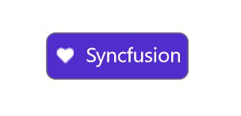

# Setting a font icon on SfChip

[SfChip](https://help.syncfusion.com/cr/maui/Syncfusion.Maui.Core.SfChip.html) supports displaying a font icon by assigning a [FontImageSource](https://learn.microsoft.com/en-us/dotnet/api/microsoft.maui.controls.fontimagesource) to its [ImageSource](https://help.syncfusion.com/cr/maui/Syncfusion.Maui.Core.SfChip.html#Syncfusion_Maui_Core_SfChip_ImageSource) property.

## Prerequisites

Before using the [SfChip](https://help.syncfusion.com/cr/maui/Syncfusion.Maui.Core.SfChip.html), ensure the following NuGet package is installed in your .NET MAUI project:

- `Syncfusion.Maui.Core`

For a step-by-step setup, refer to the [Getting Started](https://help.syncfusion.com/maui/chips/getting-started) documentation.

## Property Reference

| Property | Type | Default | Description |
|----------|------|---------|-------------|
| [ImageSource](https://help.syncfusion.com/cr/maui/Syncfusion.Maui.Core.SfChip.html#Syncfusion_Maui_Core_SfChip_ImageSource) | `ImageSource` | `null` | The image displayed inside the chip. Accepts any MAUI `ImageSource`, including `FontImageSource`. |
| `ShowIcon` | `bool` | `false` | When `true`, the chip reserves space for and renders the icon defined by `ImageSource`. |
| `ImageSize` | `double` | `16` | The size (in device-independent units) of the icon area inside the chip. |

`FontImageSource` exposes the following properties:

| Property | Type | Description |
|----------|------|-------------|
| `Glyph` | `string` | The Unicode character (for example `"\uEB52"`) that represents the icon. |
| `Size` | `double` | The font size used to render the glyph (affects the visual icon size). |
| `Color` | `Color` | The tint color of the glyph. |
| `FontFamily` | `string` | The font family that contains the glyph (for example `Segoe MDL2 Assets`, `Material Design Icons`). |

### Set the FontImageSource

Create a `FontImageSource`, set its `Glyph`, `Size`, `Color`, and `FontFamily`, then assign it to `SfChip.ImageSource`. Also set `ShowIcon="True"` to ensure the chip renders the icon.




<ContentPage xmlns="http://schemas.microsoft.com/dotnet/2021/maui"
             xmlns:x="http://schemas.microsoft.com/winfx/2009/xaml"
             xmlns:chip="clr-namespace:Syncfusion.Maui.Core;assembly=Syncfusion.Maui.Core">
    <chip:SfChip x:Name="chip"
                 Text="Syncfusion"
                 ShowIcon="True"
                 FontSize="17"
                 TextColor="White"
                 Background="#512dcd"
                 WidthRequest="120"
                 HeightRequest="40"
                 ImageSize="15"
                 Padding="0,0,0,2">
        <chip:SfChip.ImageSource>
            <FontImageSource Glyph="&#xEB52;"
                             Size="12"
                             Color="White"
                             FontFamily="Segoe MDL2 Assets" />
        </chip:SfChip.ImageSource>
    </chip:SfChip>
</ContentPage>




using Microsoft.Maui;
using Microsoft.Maui.Controls;
using Syncfusion.Maui.Core;

var fontImageSource = new FontImageSource
{
    Glyph = "\uEB52",
    Size = 12,
    Color = Colors.White,
    FontFamily = "Segoe MDL2 Assets"
};

var chip = new SfChip
{
    ShowIcon = true,
    Text = "Syncfusion",
    FontSize = 17,
    TextColor = Colors.White,
    Background = Color.FromArgb("#512dcd"),
    WidthRequest = 120,
    HeightRequest = 40,
    ImageSize = 15,
    Padding = new Thickness(0, 0, 0, 2),
    ImageSource = fontImageSource
};




## Troubleshooting

| Issue | Possible Cause | Recommended Action |
|-------|----------------|--------------------|
| The icon does not appear. | `ShowIcon` is `false`, or `ImageSource` is `null`. | Set `ShowIcon = true` and assign a non-null `ImageSource`. |
| The icon appears as a square or blank box on iOS/Android. | The font (for example, `Segoe MDL2 Assets`) is not registered or is not available on the platform. | Embed a cross-platform font (such as `Material Design Icons`) in `Resources/Fonts` and register it in the `.csproj`. |
| The glyph is the wrong character. | The Unicode code point does not match the expected icon. | Verify the glyph against the font's character map. For the Segoe MDL2 Assets glyphs, see the [Microsoft documentation](https://learn.microsoft.com/en-us/windows/uwp/design/style/segoe-ui-symbol-font). |
| The icon is too large or too small. | `ImageSize` (chip) or `Size` (FontImageSource) is set incorrectly. | Adjust `ImageSize` to reserve the right space in the chip, and `Size` to scale the glyph. |

## See Also

- [Getting Started with .NET MAUI SfChip](https://help.syncfusion.com/maui/chips/getting-started)
- [Customization](https://help.syncfusion.com/maui/chips/customization)
- [MAUI FontImageSource](https://learn.microsoft.com/en-us/dotnet/api/microsoft.maui.controls.fontimagesource)
- [MAUI fonts documentation](https://learn.microsoft.com/en-us/dotnet/maui/user-interface/fonts)
