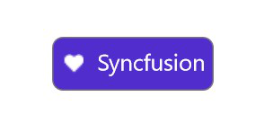

# How to Set a Font Icon in .NET MAUI Chips

[Chips](https://help.syncfusion.com/cr/maui/Syncfusion.Maui.Core.SfChip.html) supports displaying a font icon by assigning a [FontImageSource](https://learn.microsoft.com/en-us/dotnet/api/microsoft.maui.controls.fontimagesource) to its [ImageSource](https://help.syncfusion.com/cr/maui/Syncfusion.Maui.Core.SfChip.html#Syncfusion_Maui_Core_SfChip_ImageSource) property.

## Prerequisites

Before using the [SfChip](https://help.syncfusion.com/cr/maui/Syncfusion.Maui.Core.SfChip.html), ensure the following NuGet package is installed in your .NET MAUI project:

- `Syncfusion.Maui.Core`

For a step-by-step setup, refer to the [Getting Started](https://help.syncfusion.com/maui/chips/getting-started) documentation.

## Property Reference

| Property | Type | Default | Description |
|----------|------|---------|-------------|
| [ImageSource](https://help.syncfusion.com/cr/maui/Syncfusion.Maui.Core.SfChip.html#Syncfusion_Maui_Core_SfChip_ImageSource) | `ImageSource` | `null` | The image displayed inside the chip. Accepts any MAUI `ImageSource`, including `FontImageSource`. |
| `ShowIcon` | `bool` | `false` | When `true`, the chip reserves space for and renders the icon defined by `ImageSource`. |
| `ImageSize` | `double` | `18` | The size (in device-independent units) of the icon area inside the chip. |

### Set the FontImageSource

Create a `FontImageSource`, set its `Glyph`, `Size`, `Color`, and `FontFamily`, then assign it to `SfChip.ImageSource`. Also set `ShowIcon="True"` to ensure the chip renders the icon.




<chip:SfChip x:Name="chip"
             Text="Syncfusion"
             ShowIcon="True"
             FontSize="17"
             TextColor="White"
             Background="#512dcd"
             WidthRequest="120"
             HeightRequest="40"
             ImageSize="15"
             Padding="0,0,0,2">
    <chip:SfChip.ImageSource>
        <FontImageSource Glyph="&#xEB52;"
                         Size="12"
                         Color="White"
                         FontFamily="Segoe MDL2 Assets" />
    </chip:SfChip.ImageSource>
</chip:SfChip>




var fontImageSource = new FontImageSource
{
    Glyph = "\uEB52",
    Size = 12,
    Color = Colors.White,
    FontFamily = "Segoe MDL2 Assets"
};

var chip = new SfChip
{
    ShowIcon = true,
    Text = "Syncfusion",
    FontSize = 17,
    TextColor = Colors.White,
    Background = Color.FromArgb("#512dcd"),
    WidthRequest = 120,
    HeightRequest = 40,
    ImageSize = 15,
    Padding = new Thickness(0, 0, 0, 2),
    ImageSource = fontImageSource
};




## See Also

- [Customization](https://help.syncfusion.com/maui/chips/customization)
- [Chips Types](https://help.syncfusion.com/maui/chips/chips-types)
