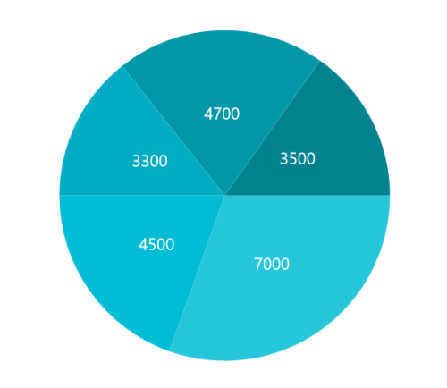

# Appearance in .NET MAUI Circular Chart

The appearance of the [SfCircularChart](https://help.syncfusion.com/cr/maui/Syncfusion.Maui.Charts.SfCircularChart.html) can be customized by using the predefined palettes, custom palettes, and gradient which allows enriching the application.

## Custom PaletteBrushes

The [SfCircularChart](https://help.syncfusion.com/cr/maui/Syncfusion.Maui.Charts.SfCircularChart.html) provides support to define own brushes for series with preferred order by using the [PaletteBrushes](https://help.syncfusion.com/cr/maui/Syncfusion.Maui.Charts.ChartSeries.html#Syncfusion_Maui_Charts_ChartSeries_PaletteBrushes) property as shown in the following code example.





<chart:SfCircularChart>
	. . .
	<chart:PieSeries ItemsSource="{Binding Data}" 
			 XBindingPath="XValue" 
			 YBindingPath="YValue"
			 PaletteBrushes="{Binding CustomBrushes}"/>
</chart:SfCircularChart>





public class ViewModel
{
	public ObservableCollection<Model> Data { get; set; }

	public List<Brush> CustomBrushes { get; set; }
	public ViewModel()
	{
		CustomBrushes = new List<Brush>();
		CustomBrushes.Add(new SolidColorBrush(Color.FromRgb(38, 198, 218)));
		CustomBrushes.Add(new SolidColorBrush(Color.FromRgb(0, 188, 212)));
		CustomBrushes.Add(new SolidColorBrush(Color.FromRgb(0, 172, 193)));
		CustomBrushes.Add(new SolidColorBrush(Color.FromRgb(0, 151, 167)));
		CustomBrushes.Add(new SolidColorBrush(Color.FromRgb(0, 131, 143)));
	}

. . .
}





## Applying Gradient

The gradient for the circular chart can be set by using the [PaletteBrushes](https://help.syncfusion.com/cr/maui/Syncfusion.Maui.Charts.ChartSeries.html#Syncfusion_Maui_Charts_ChartSeries_PaletteBrushes) property of the series with the help of the `LinearGradientBrush` or `RadialGradientBrush`.





<chart:SfCircularChart>
	. . .
	<chart:PieSeries ItemsSource="{Binding Data}" 
			 XBindingPath="XValue" 
			 YBindingPath="YValue"
			 PaletteBrushes="{Binding CustomBrushes}"/>
</chart:SfCircularChart>





public class ViewModel
{
	public ObservableCollection<Model> Data { get; set; }

	public List<Brush> CustomBrushes { get; set; }
	public ViewModel()
	{
		CustomBrushes = new List<Brush>();
		LinearGradientBrush gradientColor1 = new LinearGradientBrush();
		gradientColor1.GradientStops = new GradientStopCollection()
		{
			new GradientStop() { Offset = 1, Color = Color.FromRgb(255, 231, 199) },
			new GradientStop() { Offset = 0, Color = Color.FromRgb(252, 182, 159) }
		};

		LinearGradientBrush gradientColor2 = new LinearGradientBrush();
		gradientColor2.GradientStops = new GradientStopCollection()
		{
			new GradientStop() { Offset = 1, Color = Color.FromRgb(250, 221, 125) },
			new GradientStop() { Offset = 0, Color = Color.FromRgb(252, 204, 45) }
		};

		LinearGradientBrush gradientColor3 = new LinearGradientBrush();
		gradientColor3.GradientStops = new GradientStopCollection()
		{
			new GradientStop() { Offset = 1, Color = Color.FromRgb(255, 231, 199) },
			new GradientStop() { Offset = 0, Color = Color.FromRgb(252, 182, 159) }
		};

		LinearGradientBrush gradientColor4 = new LinearGradientBrush();
		gradientColor4.GradientStops = new GradientStopCollection()
		{
			new GradientStop() { Offset = 1, Color = Color.FromRgb(221, 214, 243) },
			new GradientStop() { Offset = 0, Color = Color.FromRgb(250, 172, 168) }
		};

		LinearGradientBrush gradientColor5 = new LinearGradientBrush();
		gradientColor5.GradientStops = new GradientStopCollection()
		{
			new GradientStop() { Offset = 1, Color = Color.FromRgb(168, 234, 238) },
			new GradientStop() { Offset = 0, Color = Color.FromRgb(123, 176, 249) }
		};

		CustomBrushes.Add(gradientColor1);
		CustomBrushes.Add(gradientColor2);
		CustomBrushes.Add(gradientColor3);
		CustomBrushes.Add(gradientColor4);
		CustomBrushes.Add(gradientColor5);
	}
. . .
}





## Plotting Area Customization:

[SfCircularChart](https://help.syncfusion.com/cr/maui/Syncfusion.Maui.Charts.SfCircularChart.html?tabs=tabid-1) allows you to add any view to the chart plot area, which is useful for adding any relevant data, a watermark, or a color gradient to the background of the chart.





<chart:SfCircularChart>
    <chart:SfCircularChart.PlotAreaBackgroundView>
      	<AbsoluteLayout>
       		<Border Stroke="red"
			StrokeThickness="2"
			AbsoluteLayout.LayoutBounds="0,0,1,1"
			AbsoluteLayout.LayoutFlags="All"/>
       		<Label Text="Copyright @ 2001 - 2022 Syncfusion Inc"
			FontSize="18"
			AbsoluteLayout.LayoutBounds="1,1,-1,-1"
			AbsoluteLayout.LayoutFlags="PositionProportional"
			Opacity="0.4"/>
       		<Label Text="CONFIDENTIAL"
			Rotation="340"
			FontSize="80"
			FontAttributes="Bold,Italic"
			TextColor="Gray"
			Margin="10,0,0,0"
			AbsoluteLayout.LayoutBounds="0.5,0.5,-1,-1"
			AbsoluteLayout.LayoutFlags="PositionProportional"
			Opacity="0.3"/>
    	</AbsoluteLayout>
    </chart:SfCircularChart.PlotAreaBackgroundView>
</chart:SfCircularChart>





SfCircularChart chart = new SfCircularChart();
AbsoluteLayout absoluteLayout = new AbsoluteLayout();
var border = new Border() 
{
	Stroke = Colors.Red,
	StrokeThickness = 2
};

AbsoluteLayout.SetLayoutBounds(border, new Rect(0, 0, 1, 1));
AbsoluteLayout.SetLayoutFlags(border, Microsoft.Maui.Layouts.AbsoluteLayoutFlags.All);
absoluteLayout.Children.Add(border);
var copyRight = new Label() 
{
	Text = "Copyright @ 2001 - 2022 Syncfusion Inc",
	FontSize = 18,
	Opacity = 0.4
};

AbsoluteLayout.SetLayoutBounds(copyRight, new Rect(1, 1, -1, -1));
AbsoluteLayout.SetLayoutFlags(copyRight, Microsoft.Maui.Layouts.AbsoluteLayoutFlags.PositionProportional);
absoluteLayout.Children.Add(copyRight);
var watermark = new Label()
{
	Text = "CONFIDENTIAL", 
	Rotation = 340,
	FontSize = 80,
	FontAttributes = FontAttributes.Bold,
	TextColor = Colors.Gray,
	Opacity = 0.3
};

AbsoluteLayout.SetLayoutBounds(watermark, new Rect(0.5, 0.5, -1, -1));
AbsoluteLayout.SetLayoutFlags(watermark, Microsoft.Maui.Layouts.AbsoluteLayoutFlags.PositionProportional);
absoluteLayout.Children.Add(watermark);
chart.PlotAreaBackgroundView = absoluteLayout;
this.Content = chart;





