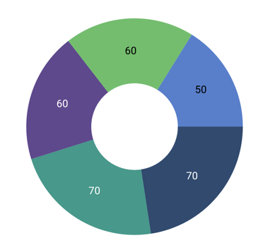
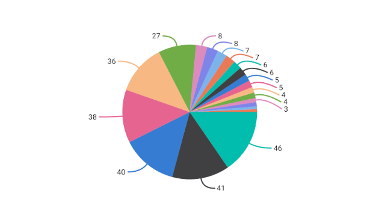
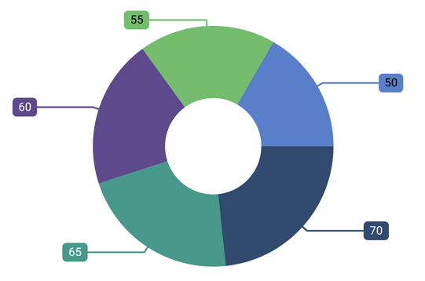
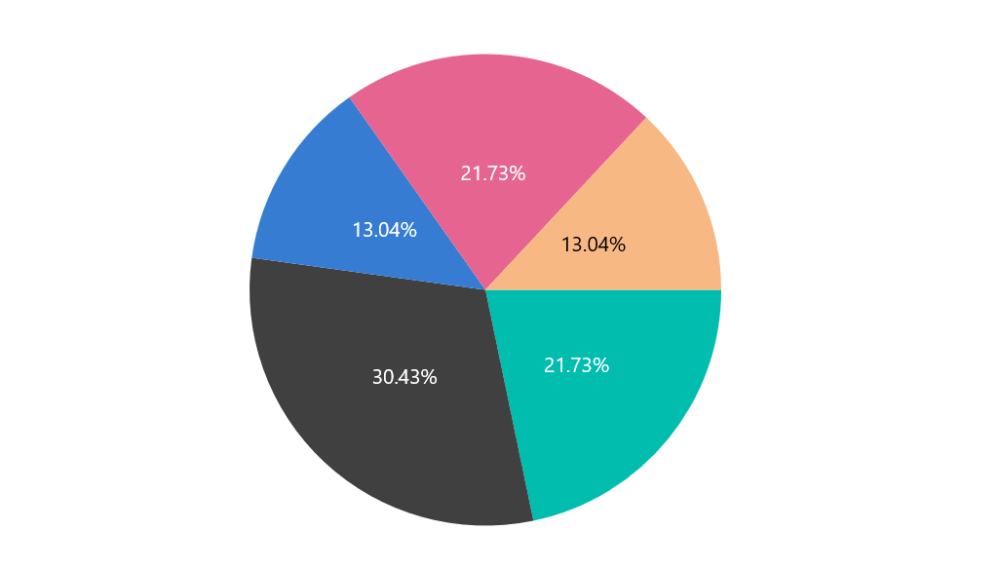
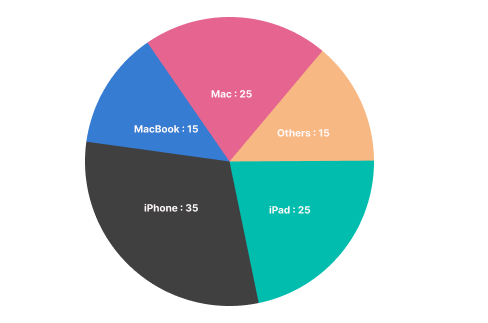
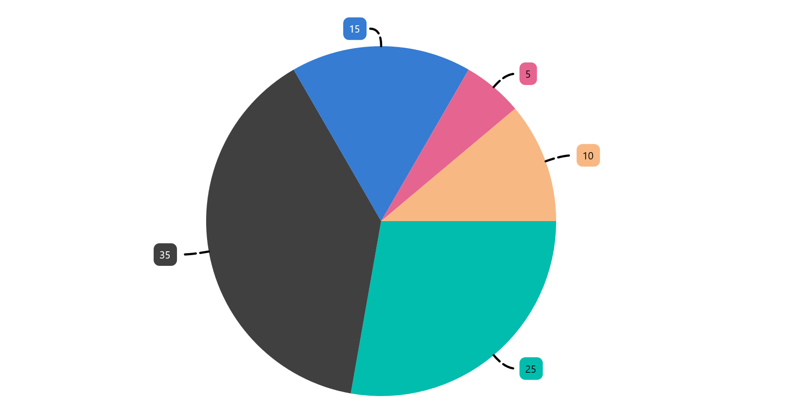

# Data Labels in .NET MAUI Circular Chart

Data labels are used to display values related to a chart segment. Values from data point(x, y) or other custom properties from a data source can be displayed. 

Each data label can be represented by the following:

* Label - displays the segment label content at the (X, Y) point.
* Connector line - used to connect the (X, Y) point and the label element.

N> **Prerequisite:** Ensure that the required NuGet package is installed, the necessary namespaces are imported, and the **SfCircularChart** control is properly configured in your application. For detailed setup and configuration instructions, refer to the **[Getting Started](https://help.syncfusion.com/maui/circular-charts/getting-started)** guide.

## Enable data labels

The [ShowDataLabels](https://help.syncfusion.com/cr/maui/Syncfusion.Maui.Charts.ChartSeries.html#Syncfusion_Maui_Charts_ChartSeries_ShowDataLabels) property of the series is used to enable the data labels.





<chart:SfCircularChart>
    <chart:PieSeries ItemsSource="{Binding Data}"  
                     XBindingPath="Product" 
                     YBindingPath="SalesRate"
                     ShowDataLabels="True"/>
</chart:SfCircularChart>





SfCircularChart chart = new SfCircularChart();

PieSeries series = new PieSeries()
{
    ItemsSource = new ViewModel().Data,
    XBindingPath = "Product",
    YBindingPath = "SalesRate",
    ShowDataLabels = true
};
chart.Series.Add(series);
this.Content = chart;



 

Data labels can be customized by using the [DataLabelSettings](https://help.syncfusion.com/cr/maui/Syncfusion.Maui.Charts.CircularSeries.html#Syncfusion_Maui_Charts_CircularSeries_DataLabelSettings) property of the chart series. To customize the data labels, create an instance of [CircularDataLabelSettings](https://help.syncfusion.com/cr/maui/Syncfusion.Maui.Charts.CircularDataLabelSettings.html) and assign it to the [DataLabelSettings](https://help.syncfusion.com/cr/maui/Syncfusion.Maui.Charts.CircularSeries.html#Syncfusion_Maui_Charts_CircularSeries_DataLabelSettings) property. The following properties are used to customize the data labels, which are available in the [CircularDataLabelSettings](https://help.syncfusion.com/cr/maui/Syncfusion.Maui.Charts.CircularDataLabelSettings.html) class:

* [LabelPosition](https://help.syncfusion.com/cr/maui/Syncfusion.Maui.Charts.CircularDataLabelSettings.html#Syncfusion_Maui_Charts_CircularDataLabelSettings_LabelPosition), of type [ChartDataLabelPosition](https://help.syncfusion.com/cr/maui/Syncfusion.Maui.Charts.ChartDataLabelPosition.html), determines the data label position, either inside or outside of the chart segment.
* [SmartLabelAlignment](https://help.syncfusion.com/cr/maui/Syncfusion.Maui.Charts.CircularDataLabelSettings.html#Syncfusion_Maui_Charts_CircularDataLabelSettings_SmartLabelAlignment), of type [SmartLabelAlignment](https://help.syncfusion.com/cr/maui/Syncfusion.Maui.Charts.SmartLabelAlignment.html), specifies how to smartly arrange the data labels to avoid intersection when labels overlap.
* [UseSeriesPalette](https://help.syncfusion.com/cr/maui/Syncfusion.Maui.Charts.ChartDataLabelSettings.html#Syncfusion_Maui_Charts_ChartDataLabelSettings_UseSeriesPalette), of type `bool`, indicates whether the data label background should reflect the series interior.
* [ConnectorLineSettings](https://help.syncfusion.com/cr/maui/Syncfusion.Maui.Charts.CircularDataLabelSettings.html#Syncfusion_Maui_Charts_CircularDataLabelSettings_ConnectorLineSettings), of type [ConnectorLineStyle](https://help.syncfusion.com/cr/maui/Syncfusion.Maui.Charts.ConnectorLineStyle.html), customizes the appearance of the data label connector line. 

N> Data label support is applicable only for [PieSeries](https://help.syncfusion.com/cr/maui/Syncfusion.Maui.Charts.PieSeries.html) and [DoughnutSeries](https://help.syncfusion.com/cr/maui/Syncfusion.Maui.Charts.DoughnutSeries.html) chart types.

## Data label position

The [LabelPosition](https://help.syncfusion.com/cr/maui/Syncfusion.Maui.Charts.CircularDataLabelSettings.html#Syncfusion_Maui_Charts_CircularDataLabelSettings_LabelPosition) property is used to place the data labels either [Inside](https://help.syncfusion.com/cr/maui/Syncfusion.Maui.Charts.ChartDataLabelPosition.html#Syncfusion_Maui_Charts_ChartDataLabelPosition_Inside) or [Outside](https://help.syncfusion.com/cr/maui/Syncfusion.Maui.Charts.ChartDataLabelPosition.html#Syncfusion_Maui_Charts_ChartDataLabelPosition_Outside) of the chart segment. By default, the data labels are placed inside the series.





<chart:SfCircularChart>
    <!-- code omitted for brevity -->
    <chart:PieSeries ItemsSource="{Binding Data}" 
                     XBindingPath="Product" 
                     YBindingPath="SalesRate"
                     ShowDataLabels="True">
        <chart:PieSeries.DataLabelSettings>
            <chart:CircularDataLabelSettings LabelPosition="Outside">
            </chart:CircularDataLabelSettings>
        </chart:PieSeries.DataLabelSettings>
    </chart:PieSeries>
</chart:SfCircularChart>





SfCircularChart chart = new SfCircularChart();
// code omitted for brevity
PieSeries series = new PieSeries();
series.ItemsSource = new ViewModel().Data;
series.XBindingPath = "Product";
series.YBindingPath = "SalesRate";
series.ShowDataLabels = true;

series.DataLabelSettings = new CircularDataLabelSettings()
{
    LabelPosition = ChartDataLabelPosition.Outside
};

chart.Series.Add(series);
this.Content = chart;





## Smart labels

The [SmartLabelAlignment](https://help.syncfusion.com/cr/maui/Syncfusion.Maui.Charts.CircularDataLabelSettings.html#Syncfusion_Maui_Charts_CircularDataLabelSettings_SmartLabelAlignment) property is used to arrange the data labels smartly to avoid intersection when labels overlap. The [SmartLabelAlignment](https://help.syncfusion.com/cr/maui/Syncfusion.Maui.Charts.SmartLabelAlignment.html) enum contains the following values:

* [Shift](https://help.syncfusion.com/cr/maui/Syncfusion.Maui.Charts.SmartLabelAlignment.html#Syncfusion_Maui_Charts_SmartLabelAlignment_Shift) - Smartly arranges the overlapped data labels.
* [Hide](https://help.syncfusion.com/cr/maui/Syncfusion.Maui.Charts.SmartLabelAlignment.html#Syncfusion_Maui_Charts_SmartLabelAlignment_Hide) - Hides the intersected data labels.
* [None](https://help.syncfusion.com/cr/maui/Syncfusion.Maui.Charts.SmartLabelAlignment.html#Syncfusion_Maui_Charts_SmartLabelAlignment_None) - Keeps the intersected data labels visible.

By default, the value for the [SmartLabelAlignment](https://help.syncfusion.com/cr/maui/Syncfusion.Maui.Charts.CircularDataLabelSettings.html#Syncfusion_Maui_Charts_CircularDataLabelSettings_SmartLabelAlignment) property is [Shift](https://help.syncfusion.com/cr/maui/Syncfusion.Maui.Charts.SmartLabelAlignment.html#Syncfusion_Maui_Charts_SmartLabelAlignment_Shift).

If the [LabelPosition](https://help.syncfusion.com/cr/maui/Syncfusion.Maui.Charts.CircularDataLabelSettings.html#Syncfusion_Maui_Charts_CircularDataLabelSettings_LabelPosition) is [Inside](https://help.syncfusion.com/cr/maui/Syncfusion.Maui.Charts.ChartDataLabelPosition.html#Syncfusion_Maui_Charts_ChartDataLabelPosition_Inside) and the [SmartLabelAlignment](https://help.syncfusion.com/cr/maui/Syncfusion.Maui.Charts.CircularDataLabelSettings.html#Syncfusion_Maui_Charts_CircularDataLabelSettings_SmartLabelAlignment) is [Shift](https://help.syncfusion.com/cr/maui/Syncfusion.Maui.Charts.SmartLabelAlignment.html#Syncfusion_Maui_Charts_SmartLabelAlignment_Shift), then the overlapped labels will shift to outside the slices and arrange smartly. If the [LabelPosition](https://help.syncfusion.com/cr/maui/Syncfusion.Maui.Charts.CircularDataLabelSettings.html#Syncfusion_Maui_Charts_CircularDataLabelSettings_LabelPosition) is [Inside](https://help.syncfusion.com/cr/maui/Syncfusion.Maui.Charts.ChartDataLabelPosition.html#Syncfusion_Maui_Charts_ChartDataLabelPosition_Inside) and the [SmartLabelAlignment](https://help.syncfusion.com/cr/maui/Syncfusion.Maui.Charts.CircularDataLabelSettings.html#Syncfusion_Maui_Charts_CircularDataLabelSettings_SmartLabelAlignment) is [Hide](https://help.syncfusion.com/cr/maui/Syncfusion.Maui.Charts.SmartLabelAlignment.html#Syncfusion_Maui_Charts_SmartLabelAlignment_Hide), then the overlapped labels will be hidden.

If the [LabelPosition](https://help.syncfusion.com/cr/maui/Syncfusion.Maui.Charts.CircularDataLabelSettings.html#Syncfusion_Maui_Charts_CircularDataLabelSettings_LabelPosition) is [Outside](https://help.syncfusion.com/cr/maui/Syncfusion.Maui.Charts.ChartDataLabelPosition.html#Syncfusion_Maui_Charts_ChartDataLabelPosition_Outside) and the [SmartLabelAlignment](https://help.syncfusion.com/cr/maui/Syncfusion.Maui.Charts.CircularDataLabelSettings.html#Syncfusion_Maui_Charts_CircularDataLabelSettings_SmartLabelAlignment) is [Shift](https://help.syncfusion.com/cr/maui/Syncfusion.Maui.Charts.SmartLabelAlignment.html#Syncfusion_Maui_Charts_SmartLabelAlignment_Shift), then the overlapped labels arrange smartly. If the [LabelPosition](https://help.syncfusion.com/cr/maui/Syncfusion.Maui.Charts.CircularDataLabelSettings.html#Syncfusion_Maui_Charts_CircularDataLabelSettings_LabelPosition) is [Outside](https://help.syncfusion.com/cr/maui/Syncfusion.Maui.Charts.ChartDataLabelPosition.html#Syncfusion_Maui_Charts_ChartDataLabelPosition_Outside) and the [SmartLabelAlignment](https://help.syncfusion.com/cr/maui/Syncfusion.Maui.Charts.CircularDataLabelSettings.html#Syncfusion_Maui_Charts_CircularDataLabelSettings_SmartLabelAlignment) is [Hide](https://help.syncfusion.com/cr/maui/Syncfusion.Maui.Charts.SmartLabelAlignment.html#Syncfusion_Maui_Charts_SmartLabelAlignment_Hide), then the overlapped labels will be hidden.

If the [SmartLabelAlignment](https://help.syncfusion.com/cr/maui/Syncfusion.Maui.Charts.CircularDataLabelSettings.html#Syncfusion_Maui_Charts_CircularDataLabelSettings_SmartLabelAlignment) is [None](https://help.syncfusion.com/cr/maui/Syncfusion.Maui.Charts.SmartLabelAlignment.html#Syncfusion_Maui_Charts_SmartLabelAlignment_None), then the overlapped labels will be visible irrespective of LabelPosition.

When the [SmartLabelAlignment](https://help.syncfusion.com/cr/maui/Syncfusion.Maui.Charts.CircularDataLabelSettings.html#Syncfusion_Maui_Charts_CircularDataLabelSettings_SmartLabelAlignment) is [Shift](https://help.syncfusion.com/cr/maui/Syncfusion.Maui.Charts.SmartLabelAlignment.html#Syncfusion_Maui_Charts_SmartLabelAlignment_Shift), and if the data label goes out of the chart area, then the labels are trimmed.





<chart:SfCircularChart>
    <chart:PieSeries ItemsSource="{Binding Data}"
                     XBindingPath="Product" 
                     YBindingPath="SalesRate"
                     ShowDataLabels="True">
        <chart:PieSeries.DataLabelSettings>
            <chart:CircularDataLabelSettings LabelPosition="Outside" SmartLabelAlignment="Shift">
            </chart:CircularDataLabelSettings>
        </chart:PieSeries.DataLabelSettings>
    </chart:PieSeries>
</chart:SfCircularChart>





SfCircularChart chart = new SfCircularChart();
// code omitted for brevity
PieSeries series = new PieSeries();
series.ItemsSource = new ViewModel().Data;
series.XBindingPath = "Product";
series.YBindingPath = "SalesRate";
series.ShowDataLabels = true;

series.DataLabelSettings = new CircularDataLabelSettings()
{
    LabelPosition = ChartDataLabelPosition.Outside,
    SmartLabelAlignment = SmartLabelAlignment.Shift
};

chart.Series.Add(series);
this.Content = chart;





## Applying series brush

The [UseSeriesPalette](https://help.syncfusion.com/cr/maui/Syncfusion.Maui.Charts.ChartDataLabelSettings.html#Syncfusion_Maui_Charts_ChartDataLabelSettings_UseSeriesPalette) property is used to set the interior of the series to the data label background. By default, its value is `false`.





<chart:SfCircularChart>
    <!-- code omitted for brevity -->
    <chart:PieSeries ItemsSource="{Binding Data}"
                     XBindingPath="Product"
                     YBindingPath="SalesRate"
                     ShowDataLabels="True">
        <chart:PieSeries.DataLabelSettings>
            <chart:CircularDataLabelSettings UseSeriesPalette="True"/>
        </chart:PieSeries.DataLabelSettings>
    </chart:PieSeries>
</chart:SfCircularChart>





SfCircularChart chart = new SfCircularChart();
// code omitted for brevity
PieSeries series = new PieSeries()
{
    ItemsSource = new ViewModel().Data,
    XBindingPath = "Product",
    YBindingPath = "SalesRate",
    ShowDataLabels = true
};
series.DataLabelSettings = new CircularDataLabelSettings()
{
    UseSeriesPalette = true
};

chart.Series.Add(series);
this.Content = chart;





## Formatting label context

The content of the label can be customized using the [LabelContext](https://help.syncfusion.com/cr/maui/Syncfusion.Maui.Charts.LabelContext.html) property of the series. The following two options are supported:

* [Percentage](https://help.syncfusion.com/cr/maui/Syncfusion.Maui.Charts.LabelContext.html#Syncfusion_Maui_Charts_LabelContext_Percentage) - Displays the percentage value of the corresponding data point Y value.
* [YValue](https://help.syncfusion.com/cr/maui/Syncfusion.Maui.Charts.LabelContext.html#Syncfusion_Maui_Charts_LabelContext_YValue) - Displays the corresponding Y value.

By default, the value for the [LabelContext](https://help.syncfusion.com/cr/maui/Syncfusion.Maui.Charts.LabelContext.html) property is [YValue](https://help.syncfusion.com/cr/maui/Syncfusion.Maui.Charts.LabelContext.html#Syncfusion_Maui_Charts_LabelContext_YValue).





<chart:SfCircularChart>
    <!-- code omitted for brevity -->
    <chart:PieSeries ItemsSource="{Binding Data}" 
                     XBindingPath="Product" 
                     YBindingPath="SalesRate"
                     ShowDataLabels="True"
                     LabelContext="Percentage"/>  
</chart:SfCircularChart>





SfCircularChart chart = new SfCircularChart();
// code omitted for brevity
PieSeries series = new PieSeries()
{
    ItemsSource = new ViewModel().Data,
    XBindingPath = "Product",
    YBindingPath = "SalesRate",
    ShowDataLabels = true,
    LabelContext = LabelContext.Percentage
};

chart.Series.Add(series);
this.Content = chart;





## Label template

The [SfCircularChart](https://help.syncfusion.com/cr/maui/Syncfusion.Maui.Charts.SfCircularChart.html) provides support to customize the appearance of the data labels using the [LabelTemplate](https://help.syncfusion.com/cr/maui/Syncfusion.Maui.Charts.ChartSeries.html#Syncfusion_Maui_Charts_ChartSeries_LabelTemplate) property of the series. The binding context of the label template is `Item`, which exposes the underlying data object's properties.





<chart:SfCircularChart>

    <chart:SfCircularChart.Resources>
        <DataTemplate x:Key="labelTemplate">
            <HorizontalStackLayout Spacing="5">
                <Label Text="{Binding Item.Product}" TextColor="White" FontSize="13"/>
                <Label Text=" : " TextColor="White" FontSize="13"/>
                <Label Text="{Binding Item.SalesRate}" TextColor="White" FontSize="13"/>
            </HorizontalStackLayout>
        </DataTemplate>
    </chart:SfCircularChart.Resources>

    <chart:PieSeries ItemsSource="{Binding Data}"
                     XBindingPath="Product" 
                     YBindingPath="SalesRate" 
                     ShowDataLabels="True"
                     LabelTemplate="{StaticResource labelTemplate}">
    </chart:PieSeries>

</chart:SfCircularChart>





SfCircularChart chart = new SfCircularChart();
// code omitted for brevity
PieSeries series = new PieSeries();
series.ItemsSource = new ViewModel().Data;
series.XBindingPath = "Product";
series.YBindingPath = "SalesRate";
series.ShowDataLabels = true;

DataTemplate labelTemplate = new DataTemplate(() =>
{
    var horizontalStackLayout = new HorizontalStackLayout { Spacing = 5 };

    var productLabel = new Label
    {
        TextColor = Colors.White,
        FontSize = 13
    };
    productLabel.SetBinding(Label.TextProperty, "Item.Product");

    var separatorLabel = new Label
    {
        Text = " : ",
        TextColor = Colors.White,
        FontSize = 13
    };

    var salesRateLabel = new Label
    {
        TextColor = Colors.White,
        FontSize = 13
    };
    salesRateLabel.SetBinding(Label.TextProperty, "Item.SalesRate");

    horizontalStackLayout.Add(productLabel);
    horizontalStackLayout.Add(separatorLabel);
    horizontalStackLayout.Add(salesRateLabel);

    return horizontalStackLayout;
});

series.LabelTemplate = labelTemplate;
chart.Series.Add(series);
this.Content = chart;





## Connector line style

The [ConnectorLineStyle](https://help.syncfusion.com/cr/maui/Syncfusion.Maui.Charts.ConnectorLineStyle.html) is used to customize the appearance of the line that connects data labels positioned outside the chart series. The connector line is drawn only when the [LabelPosition](https://help.syncfusion.com/cr/maui/Syncfusion.Maui.Charts.CircularDataLabelSettings.html#Syncfusion_Maui_Charts_CircularDataLabelSettings_LabelPosition) is set to [Outside](https://help.syncfusion.com/cr/maui/Syncfusion.Maui.Charts.ChartDataLabelPosition.html#Syncfusion_Maui_Charts_ChartDataLabelPosition_Outside). The following properties of the [ConnectorLineStyle](https://help.syncfusion.com/cr/maui/Syncfusion.Maui.Charts.ConnectorLineStyle.html) class are used to customize the connector line:

* [Stroke](https://help.syncfusion.com/cr/maui/Syncfusion.Maui.Charts.ChartLineStyle.html#Syncfusion_Maui_Charts_ChartLineStyle_Stroke), of type `Brush`, specifies the stroke color of the connector line.
* [StrokeWidth](https://help.syncfusion.com/cr/maui/Syncfusion.Maui.Charts.ChartLineStyle.html#Syncfusion_Maui_Charts_ChartLineStyle_StrokeWidth), of type `double`, specifies the stroke thickness of the connector line.
* [StrokeDashArray](https://help.syncfusion.com/cr/maui/Syncfusion.Maui.Charts.ChartLineStyle.html#Syncfusion_Maui_Charts_ChartLineStyle_StrokeDashArray), of type `DoubleCollection`, specifies the dashes for the connector line.
* [ConnectorType](https://help.syncfusion.com/cr/maui/Syncfusion.Maui.Charts.ConnectorLineStyle.html#Syncfusion_Maui_Charts_ConnectorLineStyle_ConnectorType), of type [ConnectorType](https://help.syncfusion.com/cr/maui/Syncfusion.Maui.Charts.ConnectorType.html), specifies the connector type. The [ConnectorType](https://help.syncfusion.com/cr/maui/Syncfusion.Maui.Charts.ConnectorType.html) enum contains the following values:
  * [Line](https://help.syncfusion.com/cr/maui/Syncfusion.Maui.Charts.ConnectorType.html#Syncfusion_Maui_Charts_ConnectorType_Line) - Draws a straight connector line (default).
  * [Curve](https://help.syncfusion.com/cr/maui/Syncfusion.Maui.Charts.ConnectorType.html#Syncfusion_Maui_Charts_ConnectorType_Curve) - Draws a curved (Bezier) connector line.

By default, the value for the [ConnectorType](https://help.syncfusion.com/cr/maui/Syncfusion.Maui.Charts.ConnectorLineStyle.html#Syncfusion_Maui_Charts_ConnectorLineStyle_ConnectorType) property is [Line](https://help.syncfusion.com/cr/maui/Syncfusion.Maui.Charts.ConnectorType.html#Syncfusion_Maui_Charts_ConnectorType_Line).





<chart:SfCircularChart>
    <chart:SfCircularChart.Resources>
        <DoubleCollection x:Key="dashArray">
            <x:Double>5</x:Double>
            <x:Double>2</x:Double>
        </DoubleCollection>
    </chart:SfCircularChart.Resources>
    <chart:PieSeries ItemsSource ="{Binding Data}" 
                     XBindingPath="XValue" 
                     YBindingPath="YValue"
                     ShowDataLabels="True">
        <chart:PieSeries.DataLabelSettings>
            <chart:CircularDataLabelSettings LabelPosition="Outside">
                <chart:CircularDataLabelSettings.ConnectorLineSettings>
                    <chart:ConnectorLineStyle StrokeDashArray="{StaticResource dashArray}" 
                                              ConnectorType="Curve" 
                                              Stroke="Black" 
                                              StrokeWidth="3"/>
                </chart:CircularDataLabelSettings.ConnectorLineSettings>
            </chart:CircularDataLabelSettings>
        </chart:PieSeries.DataLabelSettings>
    </chart:PieSeries>
</chart:SfCircularChart>





SfCircularChart chart = new SfCircularChart();
DoubleCollection doubleCollection = new DoubleCollection();
doubleCollection.Add(5);
doubleCollection.Add(2);
// code omitted for brevity
PieSeries series = new PieSeries()
{
    ItemsSource = new ViewModel().Data,
    XBindingPath = "XValue",
    YBindingPath = "YValue",
    ShowDataLabels = true
};

var connectorLineStyle = new ConnectorLineStyle
{
    StrokeDashArray = doubleCollection,
    ConnectorType = ConnectorType.Curve,
    Stroke = new SolidColorBrush(Colors.Black),
    StrokeWidth = 3
};
series.DataLabelSettings = new CircularDataLabelSettings()
{
    LabelPosition = ChartDataLabelPosition.Outside,
    ConnectorLineSettings = connectorLineStyle
};

chart.Series.Add(series);
this.Content = chart;





