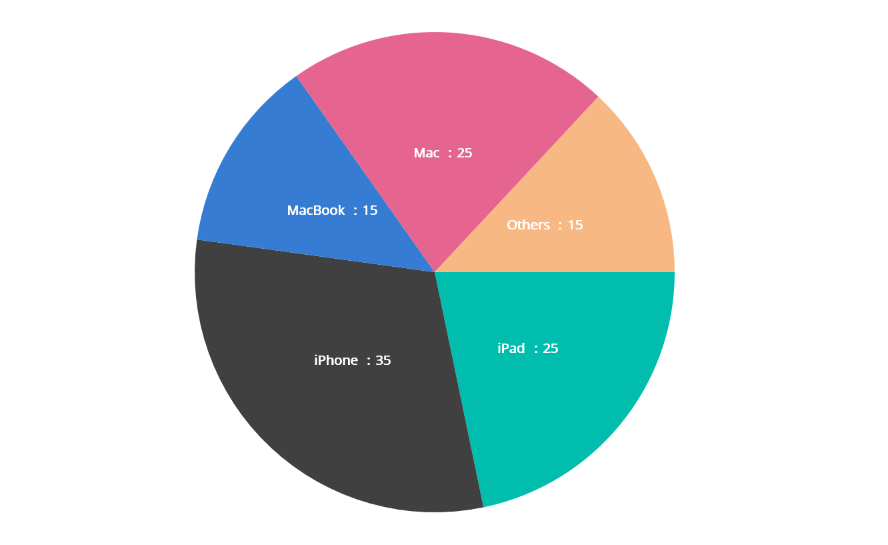
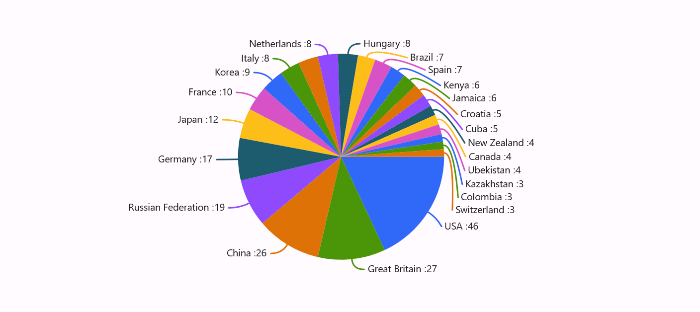

# Data Label in .NET MAUI Chart

Data labels are used to display values related to a chart segment. Values from data point(x, y) or other custom properties from a data source can be displayed. 

Each data label can be represented by the following:

* Label - displays the segment label content at the (X, Y) point.
* Connector line - used to connect the (X, Y) point and the label element.

## Enable Data Label 

[ShowDataLabels](https://help.syncfusion.com/cr/maui/Syncfusion.Maui.Charts.ChartSeries.html#Syncfusion_Maui_Charts_ChartSeries_ShowDataLabels) property of series is used to enable the data labels.





<chart:SfCircularChart>
. . .
<chart:PieSeries ShowDataLabels="True"
                ItemsSource="{Binding Data}"  
                XBindingPath="Product" 
                YBindingPath="SalesRate"/>
. . .
</chart:SfCircularChart>





SfCircularChart chart = new SfCircularChart();
. . .
PieSeries series = new PieSeries();
series.ShowDataLabels = true;
. . .
chart.Series.Add(series);



 

Data labels can be customized by using the [DataLabelSettings](https://help.syncfusion.com/cr/maui/Syncfusion.Maui.Charts.CircularSeries.html#Syncfusion_Maui_Charts_CircularSeries_DataLabelSettings) property of chart series. For customizing, need to create an instance of [CircularDataLabelSettings](https://help.syncfusion.com/cr/maui/Syncfusion.Maui.Charts.CircularDataLabelSettings.html) and set to the [DataLabelSettings](https://help.syncfusion.com/cr/maui/Syncfusion.Maui.Charts.CircularSeries.html#Syncfusion_Maui_Charts_CircularSeries_DataLabelSettings) property. Following properties are used to customize the data labels which are available in [CircularDataLabelSettings](https://help.syncfusion.com/cr/maui/Syncfusion.Maui.Charts.CircularDataLabelSettings.html).

* [ConnectorType](https://help.syncfusion.com/cr/maui/Syncfusion.Maui.Charts.CircularDataLabelSettings.html#Syncfusion_Maui_Charts_CircularDataLabelSettings_ConnectorType) - Gets or sets the type of connector line to be drawn.
* [LabelStyle](https://help.syncfusion.com/cr/maui/Syncfusion.Maui.Charts.ChartDataLabelSettings.html#Syncfusion_Maui_Charts_ChartDataLabelSettings_LabelStyle) - Gets or sets the options for customizing the data labels. 
* [UseSeriesPalette](https://help.syncfusion.com/cr/maui/Syncfusion.Maui.Charts.ChartDataLabelSettings.html#Syncfusion_Maui_Charts_ChartDataLabelSettings_UseSeriesPalette) - Gets or sets a value indicating whether the data label should reflect the series interior.

 

## Applying Series Brush

[UseSeriesPalette](https://help.syncfusion.com/cr/maui/Syncfusion.Maui.Charts.ChartDataLabelSettings.html#Syncfusion_Maui_Charts_ChartDataLabelSettings_UseSeriesPalette) property is used to set the interior of the series to the data label background. 





<chart:SfCircularChart>
. . .
<chart:PieSeries ShowDataLabels="True">
    <chart:PieSeries.DataLabelSettings>
        <chart:CircularDataLabelSettings UseSeriesPalette="True"/>
    </chart:PieSeries.DataLabelSettings>
</chart:PieSeries>

</chart:SfCircularChart>





SfCircularChart chart = new SfCircularChart();
. . .
PieSeries series = new PieSeries();
series.ShowDataLabels = true;
series.DataLabelSettings = new CircularDataLabelSettings()
{
    UseSeriesPalette = true,
};

chart.Series.Add(series);





## Formatting Label Context

The content of the label can be customized using the [LabelContext](https://help.syncfusion.com/cr/maui/Syncfusion.Maui.Charts.LabelContext.html) property. Following are the two options that are supported now,

* [Percentage](https://help.syncfusion.com/cr/maui/Syncfusion.Maui.Charts.LabelContext.html#Syncfusion_Maui_Charts_LabelContext_Percentage) - This will show the percentage value of corresponding data point Y value.

* [YValue](https://help.syncfusion.com/cr/maui/Syncfusion.Maui.Charts.LabelContext.html#Syncfusion_Maui_Charts_LabelContext_YValue) - This will show the corresponding Y value.





<chart:SfCircularChart>
 . . .   
<chart:PieSeries ItemsSource="{Binding Data}" 
                 LabelContext="Percentage"
                 ShowDataLabels="True"
                 XBindingPath="Product" 
                 YBindingPath="SalesRate"/>  

</chart:SfCircularChart>





SfCircularChart chart = new SfCircularChart();
. . .
PieSeries series = new PieSeries()
{
    ItemsSource = new ViewModel().Data,
    XBindingPath = "Product",
    YBindingPath = "SalesRate",
    ShowDataLabels = true,
    LabelContext = LabelContext.Percentage
};

chart.Series.Add(series);
this.Content = chart;
        




## Connector line style

This feature is used to customize the connector line. The following [ConnectorLineStyle]() property are used to customize the connector line.

* [Stroke]() – used to change the color of the line
* [StrokeWidth]() – used to change the stroke thickness of the line
* [StrokeDashArray]() – used to set the dashes for the line
* [ConnectorType]() - used to specify the connector type





<chart:SfCircularChart>
    <chart:SfCircularChart.Resources>
        <DoubleCollection x:Key="dashArray">
            <x:Double>5</x:Double>
            <x:Double>2</x:Double>
        </DoubleCollection>
    </chart:SfCircularChart.Resources>
    <chart:PieSeries ItemsSource ="{Binding Data}" 
                        XBindingPath="XValue" 
                        YBindingPath="YValue"
                        ShowDataLabels="True">
        <chart:PieSeries.DataLabelSettings>
            <chart:CircularDataLabelSettings LabelPosition="Outside">
                <chart:CircularDataLabelSettings.ConnectorLineSettings>
                    <chart:ConnectorLineStyle StrokeDashArray="{StaticResource dashArray}" 
                                              ConnectorType="Curve" 
                                              Stroke="Black" 
                                              StrokeWidth="3"></chart:ConnectorLineStyle>
                </chart:CircularDataLabelSettings.ConnectorLineSettings>
                </chart:CircularDataLabelSettings>
            </chart:PieSeries.DataLabelSettings>
        </chart:PieSeries.DataLabelSettings>
    </chart:PieSeries>

</chart:SfCircularChart>





SfCircularChart chart = new SfCircularChart();
DoubleCollection doubleCollection = new DoubleCollection();
doubleCollection.Add(5);
doubleCollection.Add(2);
. . .
PieSeries series = new PieSeries()
{
    ItemsSource = viewModel.Data,
    XBindingPath = "XValue",
    YBindingPath = "YValue",
    ShowDataLabels = true,
};

var connectorLineStyle = new ConnectorLineStyle
{
    StrokeDashArray = doubleCollection,
    ConnectorType = ConnectorType = ConnectorType.Curve,
    Stroke = Colors.Black,
    StrokeWidth = 3
};
series.DataLabelSettings = new CircularDataLabelSettings()
{
    LabelPosition="Outside"
    ConnectorLineSettings = connectorLineStyle
};

chart.Series.Add(series);
this.Content = chart;
        




## LabelTemplate

The [SfCircularChart](https://help.syncfusion.com/cr/maui/Syncfusion.Maui.Charts.SfCircularChart.html) provides support to customize the appearance of the data label using the [LabelTemplate](https://help.syncfusion.com/cr/maui/Syncfusion.Maui.Charts.ChartSeries.html#Syncfusion_Maui_Charts_ChartSeries_LabelTemplate) property.





<chart:SfCircularChart>

<chart:SfCircularChart.Resources>
    <DataTemplate x:Key="labelTemplate">
        <HorizontalStackLayout Spacing="5">
            <Label Text="{Binding Item.Product}" TextColor="White" FontSize="13"/>
            <Label Text=" : " TextColor="White" FontSize="13"/>
            <Label Text="{Binding Item.SalesRate}" TextColor="White" FontSize="13"/>
        </HorizontalStackLayout>
    </DataTemplate>
</chart:SfCircularChart.Resources>

<chart:PieSeries ItemsSource="{Binding Data}" 
                    ShowDataLabels="True"
                    LabelTemplate="{StaticResource labelTemplate}"
                    XBindingPath="Product" 
                    YBindingPath="SalesRate">
</chart:PieSeries>

</chart:SfCircularChart>





SfCircularChart chart = new SfCircularChart();
. . .
PieSeries series = new PieSeries();
series.ItemsSource = new ViewModel().Data;
series.XBindingPath = "Product";
series.YBindingPath = "SalesRate";
series.ShowDataLabels = true;

DataTemplate labelTemplate = new DataTemplate(() =>
{
    var horizontalStackLayout = new HorizontalStackLayout { Spacing = 5 };

    var productLabel = new Label
    {
        TextColor = Color.White,
        FontSize = 13
    };
    productLabel.SetBinding(Label.TextProperty, "Item.Product");

    var separatorLabel = new Label
    {
        Text = " : ",
        TextColor = Color.White,
        FontSize = 13,
    };

    var salesRateLabel = new Label
    {
        TextColor = Color.White,
        FontSize = 13,
    };
    salesRateLabel.SetBinding(Label.TextProperty, "Item.SalesRate");

    horizontalStackLayout.Children.Add(productLabel);
    horizontalStackLayout.Children.Add(separatorLabel);
    horizontalStackLayout.Children.Add(salesRateLabel);

    return horizontalStackLayout;
});

series.LabelTemplate = labelTemplate;
chart.Series.Add(series);
this.Content = chart;
        




## Smart Labels

This feature is used to arrange the data labels smartly and avoid the intersection when there is overlapping of labels. The [SmartLabelAlignment]() enum contains the following values.

* [Shift]() - smartly arranges the overlapped data labels.
* [Hide]() - hides the intersected data labels.
* [None]() - intersected data labels will be visible.

By default, value for [SmartLabelAlignment]() property [Shift]().

If the [LabelPosition]() is [Inside]() and the [SmartLabelAlignment]() is [Shift](), then the overlapped labels will shift to outside the slices and arrange smartly. If the [LabelPosition]() is [Inside]() and the [SmartLabelAlignment]() is [Hide](), then the overlapped labels will be hidden.

If the [LabelPosition]() is [Outside]() and the [SmartLabelAlignment]() is [Shift](), then the overlapped labels arrange smartly. If the [LabelPosition]() is [Outside]() and the [SmartLabelAlignment]() is [Hide](), then the overlapped labels will be hidden.

If the [SmartLabelAlignment]() is [None](), then the overlapped labels will be visible irrespective of LabelPosition.

When the [SmartLabelAlignment]() is [Shift](), and if the data label goes out of the chart area, then the labels got trimmed and the tooltip is shown when clicking/tapping the data label. 





<chart:SfCircularChart>

    <chart:PieSeries ItemsSource="{Binding Data}" 
                     ShowDataLabels="True"
                     XBindingPath="Product" 
                     YBindingPath="SalesRate">
            <chart:PieSeries.DataLabelSettings>
                <chart:CircularDataLabelSettings  LabelPosition="Outside" SmartLabelAlignment="Shift" >
                    <chart:CircularDataLabelSettings.ConnectorLineSettings>
                        <chart:ConnectorLineStyle ConnectorType="Curve"></chart:ConnectorLineStyle>
                    </chart:CircularDataLabelSettings.ConnectorLineSettings>
                </chart:CircularDataLabelSettings>
            </chart:PieSeries.DataLabelSettings>             
    </chart:PieSeries>

</chart:SfCircularChart>





SfCircularChart chart = new SfCircularChart();
. . .
PieSeries series = new PieSeries();
series.ItemsSource = new ViewModel().Data;
series.XBindingPath = "Product";
series.YBindingPath = "SalesRate";
series.ShowDataLabels = true;

var connectorLineStyle = new ConnectorLineStyle
{
    ConnectorType = ConnectorType = ConnectorType.Curve,
};

series.DataLabelSettings = new CircularDataLabelSettings()
{
    LabelPosition= ChartDataLabelPosition.Outside,
    SmartLabelAlignment = SmartLabelAlignment.Shift,
    ConnectorLineSettings = connectorLineStyle,
};

chart.Series.Add(series);
this.Content = chart;
        




