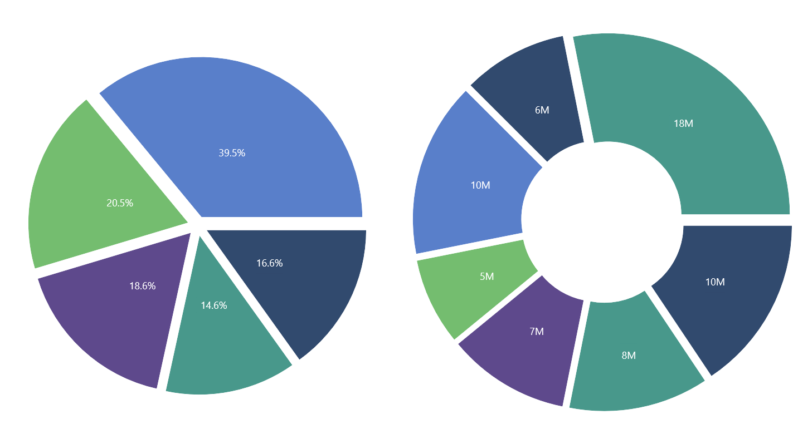

# Explode segments in .NET MAUI SfCircularChart

## Exploding a segment

Exploding a segment pulls attention to a specific area of the circular chart. The following properties, available on both [PieSeries](https://help.syncfusion.com/cr/maui/Syncfusion.Maui.Charts.PieSeries.html) and [DoughnutSeries](https://help.syncfusion.com/cr/maui/Syncfusion.Maui.Charts.DoughnutSeries.html), are used to explode the segments in the circular chart.

* [ExplodeIndex](https://help.syncfusion.com/cr/maui/Syncfusion.Maui.Charts.PieSeries.html#Syncfusion_Maui_Charts_PieSeries_ExplodeIndex), of type `int`, explodes any specific segment. The default value is `-1` (no segment exploded). The index is zero-based; out-of-range values are ignored.
* [ExplodeRadius](https://help.syncfusion.com/cr/maui/Syncfusion.Maui.Charts.PieSeries.html#Syncfusion_Maui_Charts_PieSeries_ExplodeRadius), of type `double`, defines the explode distance in pixels (px). The default value is `0`. A positive value moves the segment outward from the center.
* [ExplodeOnTouch](https://help.syncfusion.com/cr/maui/Syncfusion.Maui.Charts.PieSeries.html#Syncfusion_Maui_Charts_PieSeries_ExplodeOnTouch), of type `bool`, enables a segment to be exploded on tap interaction. The default value is `false`. The explosion is animated when tapped.

N> **Prerequisite:** Ensure that the required NuGet package is installed, the necessary namespaces are imported, and the **SfCircularChart** control is properly configured in your application. For detailed setup and configuration instructions, refer to the **[Getting Started](https://help.syncfusion.com/maui/circularchart/getting-started)** guide.





<chart:SfCircularChart>
    <!-- code omitted for brevity -->
    <chart:DoughnutSeries x:Name="DoughnutSeries"
                          ItemsSource="{Binding Data}"
                          XBindingPath="XValue"
                          YBindingPath="YValue"
                          ExplodeIndex="2"
                          ExplodeRadius="10"
                          ExplodeOnTouch="True"/>
</chart:SfCircularChart>





SfCircularChart chart = new SfCircularChart();
// code omitted for brevity
DoughnutSeries series = new DoughnutSeries()
{
    ItemsSource = new ViewModel().Data,
    XBindingPath = "XValue",
    YBindingPath = "YValue",
    ExplodeIndex = 2,
    ExplodeRadius = 10,
    ExplodeOnTouch = true
};

chart.Series.Add(series);
this.Content = chart;





## Exploding all segments

By setting the [ExplodeAll](https://help.syncfusion.com/cr/maui/Syncfusion.Maui.Charts.PieSeries.html#Syncfusion_Maui_Charts_PieSeries_ExplodeAll), of type `bool`, property of the [PieSeries](https://help.syncfusion.com/cr/maui/Syncfusion.Maui.Charts.PieSeries.html) to `true`, all segments in a circular chart are visually exploded and highlighted. Combine this with [ExplodeOnTouch](https://help.syncfusion.com/cr/maui/Syncfusion.Maui.Charts.PieSeries.html#Syncfusion_Maui_Charts_PieSeries_ExplodeOnTouch) to trigger the explosion on tap interaction. The default value is `false`. This property is shared by both [PieSeries](https://help.syncfusion.com/cr/maui/Syncfusion.Maui.Charts.PieSeries.html) and [DoughnutSeries](https://help.syncfusion.com/cr/maui/Syncfusion.Maui.Charts.DoughnutSeries.html).





<chart:SfCircularChart>
    <!-- code omitted for brevity -->
    <chart:DoughnutSeries x:Name="DoughnutSeries"
                          ItemsSource="{Binding Data}"
                          XBindingPath="XValue"
                          YBindingPath="YValue"
                          ExplodeAll="True"/>
</chart:SfCircularChart>





SfCircularChart chart = new SfCircularChart();
// code omitted for brevity
DoughnutSeries series = new DoughnutSeries()
{
    ItemsSource = new ViewModel().Data,
    XBindingPath = "XValue",
    YBindingPath = "YValue",
    ExplodeAll = true
};

chart.Series.Add(series);
this.Content = chart;





