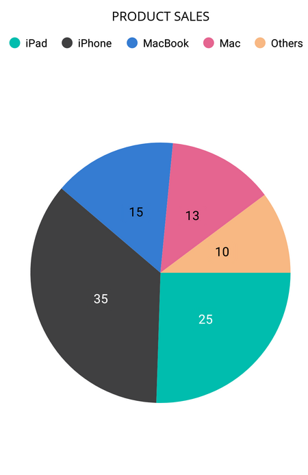

> **Notice**: After **Volume 1 2025 (Mid of March 2025)**, updates, bug fixes, and feature enhancements for this control will no longer be available in the Syncfusion® package. Please switch to the **Syncfusion® Toolkit for .NET MAUI** for continued support. For a smooth transition refer this [migration document](https://help.syncfusion.com/maui-toolkit/migration).

# Getting Started with .NET MAUI Chart

This section explains how to populate the circular chart with data, a title, data labels, a legend, and tooltips, as well as the essential aspects for getting started with the circular chart.

To get start quickly with our [.NET MAUI Circular Chart](https://help.syncfusion.com/cr/maui/Syncfusion.Maui.Charts.SfCircularChart.html), you can check the below video.






## Prerequisites

Before proceeding, ensure that the following are set up:

1. Install [.NET 8 SDK](https://dotnet.microsoft.com/en-us/download/dotnet/8.0) or later is installed.
2. Set up a .NET MAUI environment with Visual Studio 2022 (v17.8 or later).

## Step 1: Create a new .NET MAUI project

1. Go to **File > New > Project** and choose the **.NET MAUI App** template.
2. Name the project and choose a location. Click **Next**.
3. Select the .NET framework version and click **Create**.

## Step 2: Install the Syncfusion® .NET MAUI Charts Package

1. In **Solution Explorer**, right-click the project and choose **Manage NuGet Packages**.
2. Search for [Syncfusion.Maui.Charts](https://www.nuget.org/packages/Syncfusion.Maui.Charts/) and install the latest version.
3. Ensure the necessary dependencies are installed correctly, and the project is restored.

## Step 3: Register the handler

Syncfusion.Maui.Core nuget is a dependent package for all Syncfusion® controls of .NET MAUI. In the **MauiProgram.cs** file, register the handler for Syncfusion® core.




using Microsoft.Maui;
using Microsoft.Maui.Hosting;
using Microsoft.Maui.Controls.Compatibility;
using Microsoft.Maui.Controls.Hosting;
using Microsoft.Maui.Controls.Xaml;
using Syncfusion.Maui.Core.Hosting;

namespace ChartGettingStarted
{
    public static class MauiProgram
    {
        public static MauiApp CreateMauiApp()
        {
            var builder = MauiApp.CreateBuilder();
            builder
            .UseMauiApp<App>()
            .ConfigureSyncfusionCore()
            .ConfigureFonts(fonts =>
            {
                fonts.AddFont("OpenSans-Regular.ttf", "OpenSansRegular");
            });

            return builder.Build();
        }
    }
}


 

## Step 4: Add .NET MAUI Circular Chart

1. To initialize the control, import the `Syncfusion.Maui.Charts` namespace.
2. Initialize [SfCircularChart](https://help.syncfusion.com/cr/maui/Syncfusion.Maui.Charts.SfCircularChart.html).





<ContentPage   
    . . .
    xmlns:chart="clr-namespace:Syncfusion.Maui.Charts;assembly=Syncfusion.Maui.Charts">

    <chart:SfCircularChart/>
</ContentPage>
 




using Syncfusion.Maui.Charts;
. . .

public partial class MainPage : ContentPage
{
    public MainPage()
    {
        this.InitializeComponent();
        SfCircularChart chart = new SfCircularChart();
        this.Content = chart;
    }
}   








## Prerequisites

Before proceeding, ensure that the following are set up:

1. Install [.NET 8 SDK](https://dotnet.microsoft.com/en-us/download/dotnet/8.0) or later is installed.
2. Set up a .NET MAUI environment with Visual Studio Code.
3. Ensure that the .NET MAUI extension is installed and configured as described [here.](https://learn.microsoft.com/en-us/dotnet/maui/get-started/installation?view=net-maui-8.0&tabs=visual-studio-code)

## Step 1: Create a new .NET MAUI project

1. Open the command palette by pressing `Ctrl+Shift+P` and type **.NET:New Project** and enter.
2. Choose the **.NET MAUI App** template.
3. Select the project location, type the project name and press **Enter.**
4. Then choose **Create project.**

## Step 2: Install the Syncfusion® .NET MAUI Charts Package

1. Press <kbd>Ctrl</kbd> + <kbd>`</kbd> (backtick) to open the integrated terminal in Visual Studio Code.
2. Ensure you're in the project root directory where your .csproj file is located.
3. Run the command `dotnet add package Syncfusion.Maui.Charts` to install the Syncfusion® .NET MAUI Charts NuGet package.
4. To ensure all dependencies are installed, run `dotnet restore`.

## Step 3: Register the handler

Syncfusion.Maui.Core nuget is a dependent package for all Syncfusion® controls of .NET MAUI. In the **MauiProgram.cs** file, register the handler for Syncfusion® core.




using Microsoft.Maui;
using Microsoft.Maui.Hosting;
using Microsoft.Maui.Controls.Compatibility;
using Microsoft.Maui.Controls.Hosting;
using Microsoft.Maui.Controls.Xaml;
using Syncfusion.Maui.Core.Hosting;

namespace ChartGettingStarted
{
    public static class MauiProgram
    {
        public static MauiApp CreateMauiApp()
        {
            var builder = MauiApp.CreateBuilder();
            builder
            .UseMauiApp<App>()
            .ConfigureSyncfusionCore()
            .ConfigureFonts(fonts =>
            {
                fonts.AddFont("OpenSans-Regular.ttf", "OpenSansRegular");
            });

            return builder.Build();
        }
    }
}

 


## Step 4: Add .NET MAUI Circular Chart

1. To initialize the control, import the `Syncfusion.Maui.Charts` namespace.
2. Initialize [SfCircularChart](https://help.syncfusion.com/cr/maui/Syncfusion.Maui.Charts.SfCircularChart.html).




<ContentPage   
    . . .
    xmlns:chart="clr-namespace:Syncfusion.Maui.Charts;assembly=Syncfusion.Maui.Charts">

    <chart:SfCircularChart/>
</ContentPage>
 




using Syncfusion.Maui.Charts;
. . .

public partial class MainPage : ContentPage
{
    public MainPage()
    {
        this.InitializeComponent();
        SfCircularChart chart = new SfCircularChart();
        this.Content = chart;
    }
}   








## Prerequisites

Before proceeding, ensure the following are set up:

1. Ensure you have the latest version of JetBrains Rider.
2. Install [.NET 8 SDK](https://dotnet.microsoft.com/en-us/download/dotnet/8.0) or later is installed.
3. Make sure the MAUI workloads are installed and configured as described [here.](https://www.jetbrains.com/help/rider/MAUI.html#before-you-start)

## Step 1: Create a new .NET MAUI Project

1. Go to **File > New Solution,** Select .NET (C#) and choose the .NET MAUI App template.
2. Enter the Project Name, Solution Name, and Location.
3. Select the .NET framework version and click Create.

## Step 2: Install the Syncfusion® MAUI Charts NuGet Package

1. In **Solution Explorer,** right-click the project and choose **Manage NuGet Packages.**
2. Search for [Syncfusion.Maui.Charts](https://www.nuget.org/packages/Syncfusion.Maui.Charts/) and install the latest version.
3. Ensure the necessary dependencies are installed correctly, and the project is restored. If not, Open the Terminal in Rider and manually run: `dotnet restore`

## Step 3: Register the handler

[Syncfusion.Maui.Core](https://www.nuget.org/packages/Syncfusion.Maui.Core/) NuGet is a dependent package for all Syncfusion® controls of .NET MAUI. In the MauiProgram.cs file, register the handler for Syncfusion® core.


using Microsoft.Maui;
using Microsoft.Maui.Hosting;
using Microsoft.Maui.Controls.Compatibility;
using Microsoft.Maui.Controls.Hosting;
using Microsoft.Maui.Controls.Xaml;
using Syncfusion.Maui.Core.Hosting;

namespace ChartsSample
{
  public static class MauiProgram
  {
	public static MauiApp CreateMauiApp()
	{
		var builder = MauiApp.CreateBuilder();
		builder
		.UseMauiApp<App>()
		.ConfigureSyncfusionCore()
		.ConfigureFonts(fonts =>
		{
			fonts.AddFont("OpenSans-Regular.ttf", "OpenSansRegular");
		});

		return builder.Build();
	 }

  }

}     



## Step 4: Add a Basic Circular Chart

1. To initialize the control, import the Core namespace into your code.
2. Initialize [SfCircularChart](https://help.syncfusion.com/cr/maui/Syncfusion.Maui.Charts.SfCircularChart.html?tabs=tabid-1).





<ContentPage
    . . .    
    xmlns:sfchart ="clr-namespace:Syncfusion.Maui.Charts;assembly=Syncfusion.Maui.Charts">
    <Grid>
        <sfchart:SfCircularChart />
    </Grid>
</ContentPage>





    using Syncfusion.Maui.Charts;
    namespace ChartsGettingStarted
    {
        public partial class MainPage : ContentPage
        {
            public MainPage()
            {
                InitializeComponent();           
                SfCircularChart  chart = new SfCircularChart();
            }
        }   
    }









### Initialize view model

Now, let us define a simple data model that represents a data point in the chart.

  



public class SalesModel
{
    public string Product { get; set; }
    public double SalesRate { get; set; }
}

 

 

Next, create a SalesViewModel class and initialize a list of `SalesModel` objects as follows.

  



public class SalesViewModel
{
    public List<SalesModel> Data { get; set; }

    public SalesViewModel()
    {
        Data = new List<SalesModel>()
        {
            new SalesModel(){Product = "iPad", SalesRate = 25},
            new SalesModel(){Product = "iPhone", SalesRate = 35},
            new SalesModel(){Product = "MacBook", SalesRate = 15},
            new SalesModel(){Product = "Mac", SalesRate = 5},
            new SalesModel(){Product = "Others", SalesRate = 10},
        };
    }
}

 

 

Create a `SalesViewModel` instance and set it as the chart's `BindingContext`. This enables property binding from `SalesViewModel` class.

N> Add namespace of `SalesViewModel` class to your XAML Page, if you prefer to set `BindingContext` in XAML.

 



<ContentPage
    . . .
    xmlns:chart="clr-namespace:Syncfusion.Maui.Charts;assembly=Syncfusion.Maui.Charts"
    xmlns:model="clr-namespace:ChartGettingStarted">

    <chart:SfCircularChart>
        <chart:SfCircularChart.BindingContext>
            <model:SalesViewModel/>
        </chart:SfCircularChart.BindingContext>
    </chart:SfCircularChart>
</ContentPage>





SfCircularChart chart = new SfCircularChart();
this.BindingContext = new SalesViewModel();
this.Content = chart;



 

### Populate chart with data

Adding [PieSeries](https://help.syncfusion.com/cr/maui/Syncfusion.Maui.Charts.PieSeries.html) to the charts [Series](https://help.syncfusion.com/cr/maui/Syncfusion.Maui.Charts.SfCircularChart.html#Syncfusion_Maui_Charts_SfCircularChart_Series) collection and binding `Data` to the series [ItemsSource](https://help.syncfusion.com/cr/maui/Syncfusion.Maui.Charts.ChartSeries.html#Syncfusion_Maui_Charts_ChartSeries_ItemsSource) property from its BindingContext to create our own Product Sales Pie chart.

N> The circular chart has [Series](https://help.syncfusion.com/cr/maui/Syncfusion.Maui.Charts.SfCircularChart.html#Syncfusion_Maui_Charts_SfCircularChart_Series) as its default content.

N> To plot the series, the [XBindingPath](https://help.syncfusion.com/cr/maui/Syncfusion.Maui.Charts.ChartSeries.html#Syncfusion_Maui_Charts_ChartSeries_XBindingPath) and [YBindingPath](https://help.syncfusion.com/cr/maui/Syncfusion.Maui.Charts.CircularSeries.html#Syncfusion_Maui_Charts_CircularSeries_YBindingPath) properties must be configured so that the chart may get values from the respective properties in the data model.

   



<chart:SfCircularChart>
    . . .
    <chart:PieSeries ItemsSource="{Binding Data}" 
                     XBindingPath="Product" 
                     YBindingPath="SalesRate"/>
</chart:SfCircularChart>





SfCircularChart chart = new SfCircularChart();
SalesViewModel viewModel = new SalesViewModel();
. . .
PieSeries series = new PieSeries();
series.ItemsSource = viewModel.Data;
series.XBindingPath = "Product";
series.YBindingPath = "SalesRate";
chart.Series.Add(series);
this.Content = chart;



 

### Add a title

The title of the chart acts as the title to provide quick information to the user about the data being plotted in the chart. You can set title using the [Title](https://help.syncfusion.com/cr/maui/Syncfusion.Maui.Charts.ChartBase.html#Syncfusion_Maui_Charts_ChartBase_Title) property of circular chart as follows.

 



<chart:SfCircularChart>
    <chart:SfCircularChart.Title>
        <Label Text="PRODUCT SALES"/>
    </chart:SfCircularChart.Title>
    . . .
</chart:SfCircularChart>





SfCircularChart chart = new SfCircularChart();
chart.Title = new Label()
{
    Text = "PRODUCT SALES"
};
. . .
this.Content = chart;



  

### Enable the data labels

The [ShowDataLabels](https://help.syncfusion.com/cr/maui/Syncfusion.Maui.Charts.ChartSeries.html#Syncfusion_Maui_Charts_ChartSeries_ShowDataLabels) property of series can be used to enable data labels to improve the readability of the circular chart. The label visibility is set to `False` by default.

 



<chart:SfCircularChart>
    . . .
    <chart:PieSeries ShowDataLabels="True"/>
</chart:SfCircularChart>





SfCircularChart chart = new SfCircularChart();
. . .
PieSeries series = new PieSeries();
series.ShowDataLabels = true;
chart.Series.Add(series);
this.Content = chart;



 

### Enable a legend

The legend provides information about the data point displayed in the circular chart. The [Legend](https://help.syncfusion.com/cr/maui/Syncfusion.Maui.Charts.ChartBase.html#Syncfusion_Maui_Charts_ChartBase_Legend) property of the chart was used to enable it.

 



<chart:SfCircularChart>
    . . .
    <chart:SfCircularChart.Legend>
    	<chart:ChartLegend/>
    </chart:SfCircularChart.Legend>
</chart:SfCircularChart>





SfCircularChart chart = new SfCircularChart();
. . .
chart.Legend = new ChartLegend();
this.Content = chart;



 

### Enable Tooltip

Tooltips are used to show information about the segment, when mouse over on it. Enable tooltip by setting series [EnableTooltip](https://help.syncfusion.com/cr/maui/Syncfusion.Maui.Charts.ChartSeries.html#Syncfusion_Maui_Charts_ChartSeries_EnableTooltip) property as true.

 



<chart:SfCircularChart>
    . . .
    <chart:PieSeries EnableTooltip="True"/>
</chart:SfCircularChart>





SfCircularChart chart = new SfCircularChart();
. . .
PieSeries series = new PieSeries();
series.EnableTooltip = true;
chart.Series.Add(series);
this.Content = chart;





The following code example gives you the complete code of above configurations.

 



<ContentPage
    xmlns="http://schemas.microsoft.com/dotnet/2021/maui"
    xmlns:x="http://schemas.microsoft.com/winfx/2009/xaml"
    x:Class="ChartGettingStarted.MainPage"
    xmlns:chart="clr-namespace:Syncfusion.Maui.Charts;assembly=Syncfusion.Maui.Charts"
    xmlns:model="clr-namespace:ChartGettingStarted">

    <chart:SfCircularChart>
        <chart:SfCircularChart.Title>
            <Label Text="PRODUCT SALES"/>
        </chart:SfCircularChart.Title>

        <chart:SfCircularChart.BindingContext>
            <model:SalesViewModel/>
        </chart:SfCircularChart.BindingContext>

        <chart:SfCircularChart.Legend>
            <chart:ChartLegend/>
        </chart:SfCircularChart.Legend>

        <chart:PieSeries ItemsSource="{Binding Data}"
                         XBindingPath="Product" 
                         YBindingPath="SalesRate"
                         ShowDataLabels="True"
                         EnableTooltip="True"/>
    </chart:SfCircularChart>
    
</ContentPage>





using Syncfusion.Maui.Charts;
. . .
public partial class MainPage : ContentPage
{   
    public MainWindow()
    {
        SfCircularChart chart = new SfCircularChart();
        chart.Title = new Label()
        {
            Text = "PRODUCT SALES"
        };
        chart.Legend = new ChartLegend();
        SalesViewModel viewModel = new SalesViewModel();
        chart.BindingContext = viewModel;

        PieSeries series = new PieSeries();
        series.ItemsSource = viewModel.Data;
        series.XBindingPath = "Product";
        series.YBindingPath = "SalesRate";
        series.EnableTooltip = true;
        series.ShowDataLabels = true;
        chart.Series.Add(series);
        this.Content = chart;
    }
}





You can find the complete getting started sample from this [link](https://github.com/SyncfusionExamples/GettingStarted_CircularChart_MAUI).
