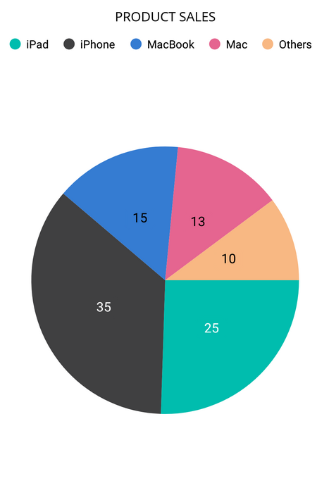

# Getting Started with .NET MAUI Circular Chart

This section explains how to populate the circular chart with data, a title, data labels, a legend, and tooltips, as well as the essential aspects for getting started with the circular chart.

To get started quickly with our [.NET MAUI Circular Chart](https://help.syncfusion.com/cr/maui/Syncfusion.Maui.Charts.SfCircularChart.html), you can check the below video.






## Prerequisites

Before proceeding, ensure the following are set up:

1. Install [.NET 9 SDK](https://dotnet.microsoft.com/en-us/download/dotnet/9.0) or later.
2. Set up a .NET MAUI environment with Visual Studio 2022 v17.12 or later.

## Step 1: Create a new .NET MAUI project

1. Go to **File > New > Project** and choose the **.NET MAUI App** template.
2. Name the project and choose a location. Click **Next**.
3. Select the .NET framework version and click **Create**.

## Step 2: Install the Syncfusion® MAUI Charts NuGet package

1. In **Solution Explorer**, right-click the project and choose **Manage NuGet Packages**.
2. Search for [Syncfusion.Maui.Charts](https://www.nuget.org/packages/Syncfusion.Maui.Charts/) and install the latest version.
3. Ensure the necessary dependencies are installed correctly, and the project is restored.





## Prerequisites

Before proceeding, ensure the following are set up:

1. Install [.NET 9 SDK](https://dotnet.microsoft.com/en-us/download/dotnet/9.0) or later.
2. Set up a .NET MAUI environment with Visual Studio Code.
3. Ensure that the .NET MAUI workloads are installed and configured as described [here](https://learn.microsoft.com/en-us/dotnet/maui/get-started/installation?view=net-maui-9.0&tabs=visual-studio-code).

## Step 1: Create a new .NET MAUI project

1. Open the command palette by pressing `Ctrl+Shift+P`, type **.NET: New Project**, and press **Enter**.
2. Choose the **.NET MAUI App** template.
3. Select the project location, type the project name, and press **Enter.**
4. Then choose **Create project.**

## Step 2: Install the Syncfusion® MAUI Charts NuGet package

1. Press <kbd>Ctrl</kbd> + <kbd>`</kbd> (backtick) to open the integrated terminal in Visual Studio Code.
2. Ensure you're in the project root directory where your .csproj file is located.
3. Run the command `dotnet add package Syncfusion.Maui.Charts` to install the Syncfusion® MAUI Charts NuGet package.
4. To ensure all dependencies are installed, run `dotnet restore`.





## Prerequisites

Before proceeding, ensure the following are set up:

1. Install [.NET 9 SDK](https://dotnet.microsoft.com/en-us/download/dotnet/9.0) or later.
2. Set up a .NET MAUI environment with JetBrains Rider 2024.3 or later.
3. Make sure the MAUI workloads are installed and configured as described [here.](https://www.jetbrains.com/help/rider/MAUI.html#before-you-start)

## Step 1: Create a new .NET MAUI project

1. Go to **File > New Solution.** Select .NET (C#) and choose the .NET MAUI App template.
2. Enter the Project Name, Solution Name, and Location.
3. Select the .NET framework version and click **Create**.

## Step 2: Install the Syncfusion® MAUI Charts NuGet package

1. In **Solution Explorer,** right-click the project and choose **Manage NuGet Packages.**
2. Search for [Syncfusion.Maui.Charts](https://www.nuget.org/packages/Syncfusion.Maui.Charts/) and install the latest version.
3. Ensure the necessary dependencies are installed correctly, and the project is restored. If not, open the Terminal in Rider and manually run: `dotnet restore`





## Step 3: Register the Syncfusion® handler

Make sure to add the namespace.




using Syncfusion.Maui.Core.Hosting;




Register the Syncfusion core handler in your `CreateMauiApp` method of `MauiProgram.cs` file to use Syncfusion controls.




public static class MauiProgram
{
    public static MauiApp CreateMauiApp()
    {
        var builder = MauiApp.CreateBuilder();
        builder
            .UseMauiApp<App>()
            .ConfigureSyncfusionCore()
            .ConfigureFonts(fonts =>
            {
                fonts.AddFont("OpenSans-Regular.ttf", "OpenSansRegular");
                fonts.AddFont("OpenSans-Semibold.ttf", "OpenSansSemibold");
            });

#if DEBUG
        builder.Logging.AddDebug();
#endif

        return builder.Build();
    }
}




N> If Syncfusion controls render as a blank screen, verify that `builder.ConfigureSyncfusionCore();` is called inside `CreateMauiApp` before `return builder.Build();`.

## Step 4: Define the model and view model

Now, define a simple data model that represents a data point in the chart. Add the following `SalesModel` class to your project (for example, in a `Models` folder).

### Model

  


public class SalesModel
{
    public string? Product { get; set; }
    public double SalesRate { get; set; }
}

 
 

### View model

Next, create a `SalesViewModel` class and initialize a list of `SalesModel` objects as follows. Add this class to your project (for example, in a `ViewModels` folder).

  


public class SalesViewModel
{
    public List<SalesModel> Data { get; set; }

    public SalesViewModel()
    {
        Data = new List<SalesModel>()
        {
            new SalesModel(){Product = "iPad", SalesRate = 25},
            new SalesModel(){Product = "iPhone", SalesRate = 35},
            new SalesModel(){Product = "MacBook", SalesRate = 15},
            new SalesModel(){Product = "Mac", SalesRate = 5},
            new SalesModel(){Product = "Others", SalesRate = 10},
        };
    }
}

 
 

## Step 5: Import the Circular Chart namespace

Add the following namespace in your XAML or C#.




xmlns:chart="clr-namespace:Syncfusion.Maui.Charts;assembly=Syncfusion.Maui.Charts"




using Syncfusion.Maui.Charts;




## Step 6: Add the Circular Chart component

Create an instance of the Circular Chart control. Then create a `SalesViewModel` instance and set it as the chart's `BindingContext`. This enables property binding from the `SalesViewModel` class.

N> Add the namespace of the `SalesViewModel` class to your XAML page if you prefer to set `BindingContext` in XAML.

Add [PieSeries](https://help.syncfusion.com/cr/maui/Syncfusion.Maui.Charts.PieSeries.html) to the chart's [Series](https://help.syncfusion.com/cr/maui/Syncfusion.Maui.Charts.SfCircularChart.html#Syncfusion_Maui_Charts_SfCircularChart_Series) collection, and bind `Data` to the series [ItemsSource](https://help.syncfusion.com/cr/maui/Syncfusion.Maui.Charts.ChartSeries.html#Syncfusion_Maui_Charts_ChartSeries_ItemsSource) property from its `BindingContext` to create a Product Sales Pie chart.

 


<chart:SfCircularChart>
    <chart:SfCircularChart.Title>
        <Label Text="PRODUCT SALES"/>
    </chart:SfCircularChart.Title>

    <chart:SfCircularChart.BindingContext>
        <model:SalesViewModel/>
    </chart:SfCircularChart.BindingContext>

    <chart:SfCircularChart.Legend>
        <chart:ChartLegend/>
    </chart:SfCircularChart.Legend>

    <chart:PieSeries ItemsSource="{Binding Data}"
                     XBindingPath="Product"
                     YBindingPath="SalesRate"
                     ShowDataLabels="True"
                     EnableTooltip="True"/>
</chart:SfCircularChart>



SfCircularChart chart = new SfCircularChart();
chart.Title = new Label()
{
    Text = "PRODUCT SALES"
};
chart.Legend = new ChartLegend();
SalesViewModel viewModel = new SalesViewModel();
chart.BindingContext = viewModel;

PieSeries series = new PieSeries();
series.ItemsSource = viewModel.Data;
series.XBindingPath = "Product";
series.YBindingPath = "SalesRate";
series.EnableTooltip = true;
series.ShowDataLabels = true;
chart.Series.Add(series);

this.Content = chart;




N> The circular chart has [Series](https://help.syncfusion.com/cr/maui/Syncfusion.Maui.Charts.SfCircularChart.html#Syncfusion_Maui_Charts_SfCircularChart_Series) as its default content.

N> To plot the series, the [XBindingPath](https://help.syncfusion.com/cr/maui/Syncfusion.Maui.Charts.ChartSeries.html#Syncfusion_Maui_Charts_ChartSeries_XBindingPath) and [YBindingPath](https://help.syncfusion.com/cr/maui/Syncfusion.Maui.Charts.CircularSeries.html#Syncfusion_Maui_Charts_CircularSeries_YBindingPath) properties must be configured so that the chart can read values from the respective properties in the data model.

## Step 7: Run the application

Run the application on your target platform (Windows, Android, iOS, or macOS) to view the Product Sales Pie chart.

The following screenshot illustrates the result of the above code.

You can download the Circular Chart Getting Started sample from [GitHub](https://github.com/SyncfusionExamples/GettingStarted_CircularChart_MAUI).
