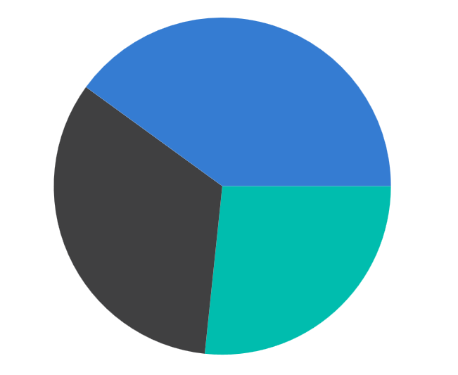

# Grouping Data Points in .NET MAUI SfCircularChart

The small segments in the circular chart can be grouped into an `Others` category using the [GroupTo]() and [GroupMode]() properties of the circular chart. The [GroupMode]() property is used to specify the grouping type based on slice angle, actual data point value, or percentage. The [GroupTo]() property is used to set the limit to group data points into a single slice. The grouped segment is labeled as `Others` in the chart legend.





<chart:SfCircularChart>

        <chart:PieSeries ItemsSource="{Binding Data}" 
                         GroupMode="Value"
                         GroupTo="15"
                         XBindingPath="Product" 
                         YBindingPath="SalesRate"/>
  
</chart:SfCircularChart>





SfCircularChart chart = new SfCircularChart();
. . .
PieSeries series = new PieSeries()
{
    ItemsSource = new ViewModel().Data,
    XBindingPath="Product", 
    YBindingPath="SalesRate",
    GroupMode=Value,
    GroupTo=15
};

chart.Series.Add(series);





