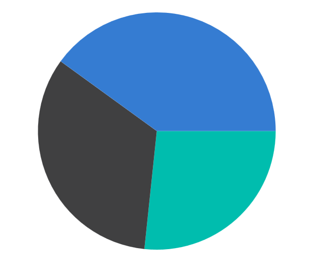

# Grouping Data Points in .NET MAUI SfCircularChart

The small segments in the circular chart can be grouped into an `Others` category using the [GroupTo](https://help.syncfusion.com/cr/maui/Syncfusion.Maui.Charts.PieSeries.html#Syncfusion_Maui_Charts_PieSeries_GroupTo) and [GroupMode](https://help.syncfusion.com/cr/maui/Syncfusion.Maui.Charts.PieSeries.html#Syncfusion_Maui_Charts_PieSeries_GroupMode) properties of the [PieSeries](https://help.syncfusion.com/cr/maui/Syncfusion.Maui.Charts.PieSeries.html). The [GroupMode](https://help.syncfusion.com/cr/maui/Syncfusion.Maui.Charts.PieSeries.html#Syncfusion_Maui_Charts_PieSeries_GroupMode) property is used to specify the grouping type based on slice angle (`Angle`), actual data point value (`Value`), or percentage (`Percentage`). The [GroupTo](https://help.syncfusion.com/cr/maui/Syncfusion.Maui.Charts.PieSeries.html#Syncfusion_Maui_Charts_PieSeries_GroupTo) property is used to set the limit to group data points into a single slice. The grouped segment is labeled as `Others` in the chart legend.

N> **Prerequisite:** Ensure that the required NuGet package is installed, the necessary namespaces are imported, and the **SfCircularChart** control is properly configured in your application. For detailed setup and configuration instructions, refer to the **[Getting Started](https://help.syncfusion.com/maui/circularchart/getting-started)** guide.

## Group mode

[GroupMode](https://help.syncfusion.com/cr/maui/Syncfusion.Maui.Charts.PieSeries.html#Syncfusion_Maui_Charts_PieSeries_GroupMode), of type `ChartGroupMode`, specifies how the data points are grouped. The default value is `ChartGroupMode.Value`. The `ChartGroupMode` enum has the following values:

- `Angle` - Groups data points whose slice angle is less than the [GroupTo](https://help.syncfusion.com/cr/maui/Syncfusion.Maui.Charts.PieSeries.html#Syncfusion_Maui_Charts_PieSeries_GroupTo) value.
- `Value` - Groups data points whose actual value is less than the [GroupTo](https://help.syncfusion.com/cr/maui/Syncfusion.Maui.Charts.PieSeries.html#Syncfusion_Maui_Charts_PieSeries_GroupTo) value.
- `Percentage` - Groups data points whose percentage value is less than the [GroupTo](https://help.syncfusion.com/cr/maui/Syncfusion.Maui.Charts.PieSeries.html#Syncfusion_Maui_Charts_PieSeries_GroupTo) value.

## Group to

[GroupTo](https://help.syncfusion.com/cr/maui/Syncfusion.Maui.Charts.PieSeries.html#Syncfusion_Maui_Charts_PieSeries_GroupTo), of type `double`, sets the threshold value against which data points are grouped. The default value is `double.NaN`, which means no grouping is applied.

The following code sample demonstrates how to group the small segments of a pie series using the [GroupTo](https://help.syncfusion.com/cr/maui/Syncfusion.Maui.Charts.PieSeries.html#Syncfusion_Maui_Charts_PieSeries_GroupTo) and [GroupMode](https://help.syncfusion.com/cr/maui/Syncfusion.Maui.Charts.PieSeries.html#Syncfusion_Maui_Charts_PieSeries_GroupMode) properties.

N> [GroupTo](https://help.syncfusion.com/cr/maui/Syncfusion.Maui.Charts.PieSeries.html#Syncfusion_Maui_Charts_PieSeries_GroupTo) is only supported for the [PieSeries](https://help.syncfusion.com/cr/maui/Syncfusion.Maui.Charts.PieSeries.html) and [DoughnutSeries](https://help.syncfusion.com/cr/maui/Syncfusion.Maui.Charts.DoughnutSeries.html).





<chart:SfCircularChart>
    <chart:PieSeries ItemsSource="{Binding Data}"
                     XBindingPath="Product"
                     YBindingPath="SalesRate"
                     GroupMode="Value"
                     GroupTo="15"/>
</chart:SfCircularChart>





SfCircularChart chart = new SfCircularChart();
PieSeries series = new PieSeries()
{
    ItemsSource = (new SalesViewModel()).Data,
    XBindingPath = "Product",
    YBindingPath = "SalesRate",
    GroupMode = ChartGroupMode.Value,
    GroupTo = 15
};

chart.Series.Add(series);





The following screenshot illustrates the grouped `Others` segment of a pie chart.

