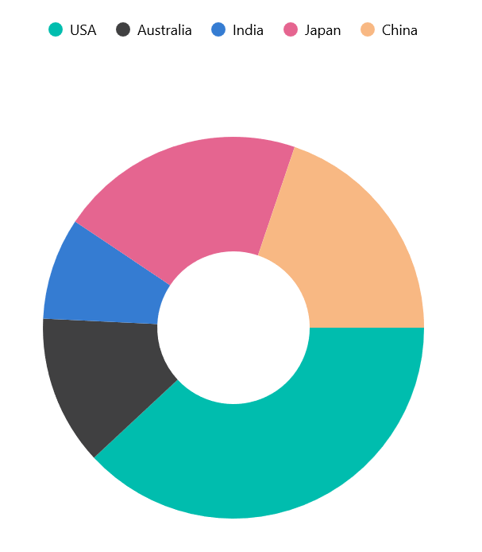
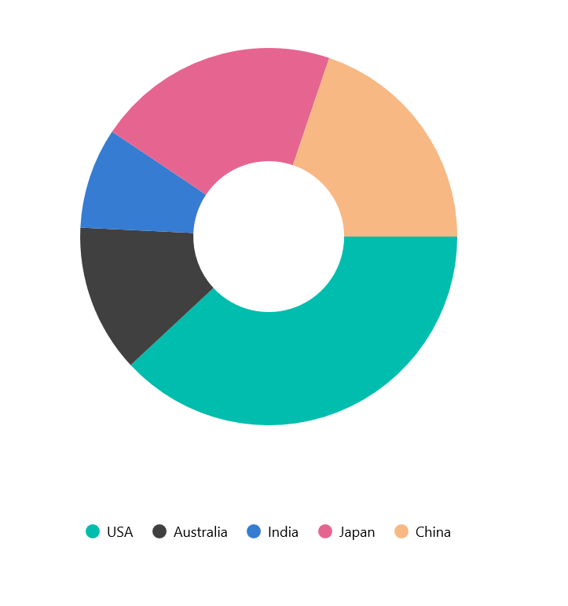
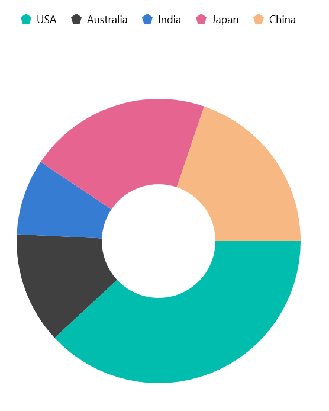
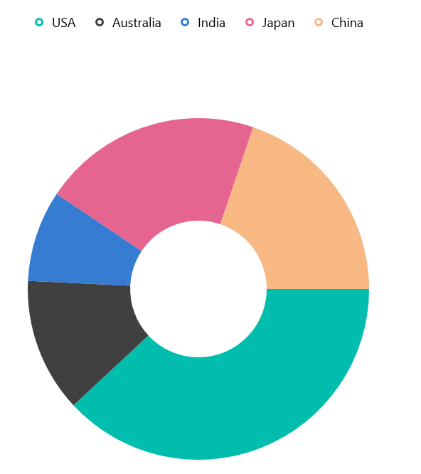

# Legend in .NET MAUI Chart

A legend is a graphical representation that explains the meaning of the  data segments in a chart. It typically consists of a key or symbol associated with each data segment and a label that describes what that segment represents. The legend helps users understand the data being presented in the chart by providing a visual reference for the different categories or data points.





    <chart:SfCircularChart >
            <chart:DoughnutSeries ItemsSource="{Binding Product}"
                                  XBindingPath="Country"
                                  YBindingPath="Value">
            </chart:DoughnutSeries>
            
    </chart:SfCircularChart>
    





        SfCircularChart chart = new SfCircularChart();
        chart.WidthRequest = 400;
        chart.HeightRequest = 500;
        
        DoughnutSeries coffeeSeries = new DoughnutSeries()
        {
            ItemsSource = this.Product,
            XBindingPath = "Country",
            YBindingPath = "Value",
            
        };

        chart.Series.Add(coffeeSeries);

        ChartLegend legend = new ChartLegend();
        legend.IsVisible = true;
        legend.ToggleSeriesVisibility = true;
        chart.Legend = legend;
        Content = chart;





## Legend Visibility

To control the visibility of the legend in a chart control, the [IsVisible]() property can be used. Here's an example of how to define the legend visibility in a chart control:





    <chart:SfCircularChart.Legend>
         <chart:ChartLegend IsVisible="True"></chart:ChartLegend>
    </chart:SfCircularChart.Legend>
   




 
    ChartLegend legend = new ChartLegend();
    legend.IsVisible = true;
    chart.Legend = legend;





## Legend Placement

The Legend were Placed anywhere in the Chart using the [LegendPlacement]() Property.
We can adjust the placement by assigning one of the following values to [legendPlacement]().

* [LegendPlacement.Top]()- Places the legend at the top of the chart.
* [LegendPlacement.Bottom]()- Places the legend at the Bottom of the chart.
* [LegendPlacement.Right]()- Places the legend at the right side of the chart.
* [LegendPlacement.Left]()- Places the legend at the left side of the chart.

N> By default, the [LegendPlacement]() is [LegendPlacement.Top]()





    <chart:SfCircularChart.Legend>
        <chart:ChartLegend Placement="Bottom"></chart:ChartLegend>
    </chart:SfCircularChart.Legend>
   




    
    ChartLegend legend = new ChartLegend();
    legend.Placement=LegendPlacement.Bottom;
    chart.Legend = legend;





## Legend Toggle Series Visibility

We can control the visibility of the segments by enabling the [ToggleSeriesVisibility]() property of the ChartLegend. This allows us to toggle the visibility of the segment when the legend items are tapped.





    <chart:SfCircularChart.Legend>
        <chart:ChartLegend ToggleSeriesVisibility="True"></chart:ChartLegend>
    </chart:SfCircularChart.Legend>




 
    ChartLegend legend = new ChartLegend();
    legend.ToggleSeriesVisibility = true;
    chart.Legend = legend;





## Legend Icon Customization

We can able to customize the appearence of the Legend Icon using the [LegendIcon]() in the series.
In [LegendIcon]() property we can use below listed Shapes to Customize the Legend Icon:

| Icon Shapes | Icon Shapes       | Icon Shapes   |
| --------    | --------          | --------      |
| Circle      | Horizontal Line   | Rectangle     |
| Cross       | Inverted Triangle | Triangle      |
| Diamond     | Pentagon          | Vertical Line |
| Hexagon     | Plus              |        |

N> The default value for the LegendIcon in the Series is circular in shape.





    <chart:DoughnutSeries ItemsSource="{Binding Product}"
                          XBindingPath="Country"
                          YBindingPath="Value"
                          LegendIcon="Pentagon">
    </chart:DoughnutSeries>




 
    DoughnutSeries coffeeSeries = new DoughnutSeries()
    {
      ItemsSource = this.Product,
      XBindingPath = "Country",
      YBindingPath = "Value",
      LegendIcon = ChartLegendIconType.Pentagon 
    };

    chart.Series.Add(coffeeSeries);







### Series Type Legend Icon

We can Customize the Legend Icon based on the Series type in the Chart.
Each series  has its own legend icon. This can be achieve through the [LegendIcon]() of the series is set to be [SeriesType]().





    <chart:DoughnutSeries ItemsSource="{Binding Product}"
                          XBindingPath="Country"
                          YBindingPath="Value"
                          LegendIcon="SeriesType">
    </chart:DoughnutSeries>

   



 
    DoughnutSeries coffeeSeries = new DoughnutSeries()
    {
      ItemsSource = this.Product,
      XBindingPath = "Country",
      YBindingPath = "Value",
      LegendIcon = ChartLegendIconType.SeriesType 
    };

    chart.Series.Add(coffeeSeries);





