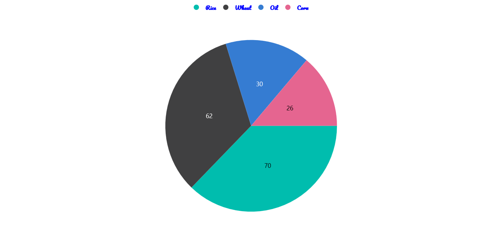
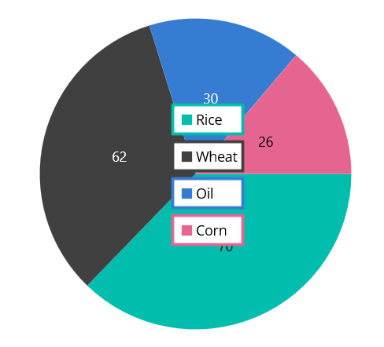
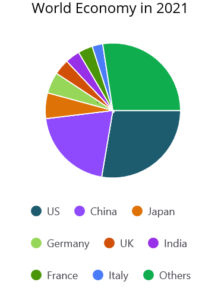

# Legend in .NET MAUI Circular Chart (SfCircularChart)

The [Legend](https://help.syncfusion.com/cr/maui/Syncfusion.Maui.Charts.ChartBase.html#Syncfusion_Maui_Charts_ChartBase_Legend) provides a list of data points, helping to identify the corresponding data points in the chart. This guide explains how to define and customize the legend in the circular chart.

N> **Prerequisite:** Ensure that the required NuGet package is installed, the necessary namespaces are imported, and the **SfCircularChart** control is properly configured in your application. For detailed setup and configuration instructions, refer to the **[Getting Started](https://help.syncfusion.com/maui/circular-charts/getting-started)** guide.

## Defining the legend
To define the legend in the chart, initialize the [ChartLegend](https://help.syncfusion.com/cr/maui/Syncfusion.Maui.Charts.ChartLegend.html) class and assign it to the [Legend](https://help.syncfusion.com/cr/maui/Syncfusion.Maui.Charts.ChartBase.html#Syncfusion_Maui_Charts_ChartBase_Legend) property.





<chart:SfCircularChart>
    <chart:SfCircularChart.Legend>
        <chart:ChartLegend/>
    </chart:SfCircularChart.Legend>
    <!-- code omitted for brevity -->
</chart:SfCircularChart>





SfCircularChart chart = new SfCircularChart();
chart.Legend = new ChartLegend();
// code omitted for brevity
this.Content = chart;





## Legend visibility
The visibility of the chart legend can be controlled using the [IsVisible](https://help.syncfusion.com/cr/maui/Syncfusion.Maui.Charts.ChartLegend.html#Syncfusion_Maui_Charts_ChartLegend_IsVisible) property. By default, the IsVisible property is set to `true`.




    
<chart:SfCircularChart>
    <chart:SfCircularChart.Legend>
        <chart:ChartLegend IsVisible="True"/>
    </chart:SfCircularChart.Legend>
    <!-- code omitted for brevity -->
</chart:SfCircularChart>





SfCircularChart chart = new SfCircularChart();

chart.Legend = new ChartLegend()
{ 
    IsVisible = true 
};
// code omitted for brevity
this.Content = chart;





## Legend item visibility

The visibility of individual legend items for specific series can be controlled using the [IsVisibleOnLegend](https://help.syncfusion.com/cr/maui/Syncfusion.Maui.Charts.ChartSeries.html#Syncfusion_Maui_Charts_ChartSeries_IsVisibleOnLegend) property of the series. The default value for IsVisibleOnLegend is `true`.




    
<chart:SfCircularChart>
    <chart:SfCircularChart.Legend>
        <chart:ChartLegend/>
    </chart:SfCircularChart.Legend>

    <chart:PieSeries ItemsSource="{Binding Data}"
                     XBindingPath="XValue"
                     IsVisibleOnLegend="True"
                     YBindingPath="YValue"/>
</chart:SfCircularChart>





SfCircularChart chart = new SfCircularChart();
chart.Legend = new ChartLegend();
PieSeries series = new PieSeries()
{
    ItemsSource = (new ViewModel()).Data,
    XBindingPath = "XValue",
    IsVisibleOnLegend = true,
    YBindingPath = "YValue",
};

chart.Series.Add(series);
this.Content = chart;





## Customizing labels

The appearance of the legend label can be customized using the [`LabelStyle`](https://help.syncfusion.com/cr/maui/Syncfusion.Maui.Charts.ChartLegend.html#Syncfusion_Maui_Charts_ChartLegend_LabelStyle) property of the [`ChartLegendLabelStyle`](https://help.syncfusion.com/cr/maui/Syncfusion.Maui.Charts.ChartLegendLabelStyle.html) class:

* [`TextColor`](https://help.syncfusion.com/cr/maui/Syncfusion.Maui.Charts.ChartLegendLabelStyle.html#Syncfusion_Maui_Charts_ChartLegendLabelStyle_TextColor), of type `Color`, specifies the color of the label.
* [`FontFamily`](https://help.syncfusion.com/cr/maui/Syncfusion.Maui.Charts.ChartLegendLabelStyle.html#Syncfusion_Maui_Charts_ChartLegendLabelStyle_FontFamily), of type `string`, specifies the font family for the legend label.
* [`FontAttributes`](https://help.syncfusion.com/cr/maui/Syncfusion.Maui.Charts.ChartLegendLabelStyle.html#Syncfusion_Maui_Charts_ChartLegendLabelStyle_FontAttributes), of type `FontAttributes`, specifies the font style for the legend label.
* [`FontSize`](https://help.syncfusion.com/cr/maui/Syncfusion.Maui.Charts.ChartLegendLabelStyle.html#Syncfusion_Maui_Charts_ChartLegendLabelStyle_FontSize), of type `double`, specifies the font size for the legend label.
* [`Margin`](https://help.syncfusion.com/cr/maui/Syncfusion.Maui.Charts.ChartLegendLabelStyle.html#Syncfusion_Maui_Charts_ChartLegendLabelStyle_Margin), of type `Thickness`, specifies the margin size of labels.

 



<chart:SfCircularChart>
    <chart:SfCircularChart.Legend>
        <chart:ChartLegend>
            <chart:ChartLegend.LabelStyle>
                <chart:ChartLegendLabelStyle TextColor="Blue" Margin="5" FontSize="18" FontAttributes="Bold" FontFamily="PlaywriteAR-Regular"/>
            </chart:ChartLegend.LabelStyle>
        </chart:ChartLegend>
    </chart:SfCircularChart.Legend>
    <!-- code omitted for brevity -->
</chart:SfCircularChart>





SfCircularChart chart = new SfCircularChart();
chart.Legend = new ChartLegend();
ChartLegendLabelStyle labelStyle = new ChartLegendLabelStyle()
{
    TextColor = Colors.Blue,
    FontSize = 18,
    FontAttributes = FontAttributes.Bold,
    Margin = 5,
    FontFamily = "PlaywriteAR-Regular"
};
chart.Legend.LabelStyle = labelStyle;
// code omitted for brevity
this.Content = chart;





## Legend icon
To specify the legend icon based on the associated series type, use the [LegendIcon](https://help.syncfusion.com/cr/maui/Syncfusion.Maui.Charts.ChartSeries.html#Syncfusion_Maui_Charts_ChartSeries_LegendIcon) property and set the icon type using the [ChartLegendIconType](https://help.syncfusion.com/cr/maui/Syncfusion.Maui.Charts.ChartLegendIconType.html) enum values. The default value of the LegendIcon property is `Circle`.

The `ChartLegendIconType` enum provides the following values:

* `Circle` - Displays a circular legend icon (default).
* `Rectangle` - Displays a rectangular legend icon.
* `Diamond` - Displays a diamond-shaped legend icon.
* `Triangle` - Displays a triangular legend icon.
* `Cross` - Displays a cross-shaped legend icon.
* `Pentagon` - Displays a pentagon-shaped legend icon.
* `Hexagon` - Displays a hexagon-shaped legend icon.
* `SeriesType` - Displays a legend icon based on the associated series type.





<chart:SfCircularChart>
    <chart:SfCircularChart.Legend>
       <chart:ChartLegend/>
    </chart:SfCircularChart.Legend>

    <chart:PieSeries ItemsSource="{Binding Data}"
                     XBindingPath="XValue"
                     YBindingPath="YValue"
                     LegendIcon = "Diamond"/>
</chart:SfCircularChart>





SfCircularChart chart = new SfCircularChart();
chart.Legend = new ChartLegend();

PieSeries pieSeries = new PieSeries()
{
    ItemsSource = (new ViewModel()).Data,
    XBindingPath = "XValue",
    YBindingPath = "YValue",
    LegendIcon = ChartLegendIconType.Diamond,
};
// code omitted for brevity
chart.Series.Add(pieSeries);
this.Content = chart;





## Placement
The legend can be positioned to the left, right, top, or bottom of the chart area using the [Placement](https://help.syncfusion.com/cr/maui/Syncfusion.Maui.Charts.ChartLegend.html#Syncfusion_Maui_Charts_ChartLegend_Placement) property in the ChartLegend class. The default placement is `Top`.

The `Placement` property uses the [LegendPlacement](https://help.syncfusion.com/cr/maui/Syncfusion.Maui.Charts.LegendPlacement.html) enum, which provides the following values:

* `Top` - Positions the legend at the top of the chart area (default).
* `Bottom` - Positions the legend at the bottom of the chart area.
* `Left` - Positions the legend to the left of the chart area.
* `Right` - Positions the legend to the right of the chart area.





<chart:SfCircularChart>
    <chart:SfCircularChart.Legend>
        <chart:ChartLegend Placement="Bottom">
        </chart:ChartLegend>
    </chart:SfCircularChart.Legend>
    <!-- code omitted for brevity -->
</chart:SfCircularChart>





SfCircularChart chart = new SfCircularChart();

chart.Legend = new ChartLegend()
{ 
    Placement = LegendPlacement.Bottom 
};
// code omitted for brevity
this.Content = chart;





## Floating legend

The floating legend feature allows you to position the legend inside the chart area based on its defined placement. When [IsFloating](https://help.syncfusion.com/cr/maui/Syncfusion.Maui.Charts.ChartLegend.html#Syncfusion_Maui_Charts_ChartLegend_IsFloating) is set to true, the legend will start from the specified [Placement](https://help.syncfusion.com/cr/maui/Syncfusion.Maui.Charts.ChartLegend.html#Syncfusion_Maui_Charts_ChartLegend_Placement) (such as Top, Bottom, Left, or Right) and then move according to the offset values, enabling precise control over the legend’s location.

* [OffsetX](https://help.syncfusion.com/cr/maui/Syncfusion.Maui.Charts.ChartLegend.html#Syncfusion_Maui_Charts_ChartLegend_OffsetX): Specifies the horizontal distance (in px) from the defined placement position. A negative value moves the legend to the left. The default value is `0`.
* [OffsetY](https://help.syncfusion.com/cr/maui/Syncfusion.Maui.Charts.ChartLegend.html#Syncfusion_Maui_Charts_ChartLegend_OffsetY): Specifies the vertical distance (in px) from the defined placement position. A negative value moves the legend upward. The default value is `0`.





<chart:SfCircularChart>
    <chart:SfCircularChart.Legend>
        <chart:ChartLegend Placement="Right" IsFloating="True" OffsetX="-480" OffsetY="10"/>
    </chart:SfCircularChart.Legend>
</chart:SfCircularChart>





SfCircularChart chart = new SfCircularChart();

chart.Legend = new ChartLegend()
{ 
    Placement = LegendPlacement.Right,
    IsFloating = true,
    OffsetX = -480,
    OffsetY = 10
};
// code omitted for brevity
this.Content = chart;





## Toggle the series visibility
The visibility of circular series data points can be controlled by tapping the legend item using the [ToggleSeriesVisibility](https://help.syncfusion.com/cr/maui/Syncfusion.Maui.Charts.ChartLegend.html#Syncfusion_Maui_Charts_ChartLegend_ToggleSeriesVisibility) property. The default value of ToggleSeriesVisibility is `false`.





<chart:SfCircularChart>
    <chart:SfCircularChart.Legend>
        <chart:ChartLegend           
            ToggleSeriesVisibility="True">
        </chart:ChartLegend>
    </chart:SfCircularChart.Legend>
    <!-- code omitted for brevity -->
</chart:SfCircularChart>





SfCircularChart chart = new SfCircularChart();
chart.Legend = new ChartLegend()
{ 
    ToggleSeriesVisibility = true 
};
// code omitted for brevity
this.Content = chart;





## Legend maximum size request
To set the maximum size request for the legend view, override the [GetMaximumSizeCoefficient](https://help.syncfusion.com/cr/maui/Syncfusion.Maui.Charts.ChartLegend.html#Syncfusion_Maui_Charts_ChartLegend_GetMaximumSizeCoefficient) protected method in the [ChartLegend](https://help.syncfusion.com/cr/maui/Syncfusion.Maui.Charts.ChartLegend.html) class. The value should be a `double` between 0 and 1, representing the maximum size coefficient for the legend view relative to the chart area (not the desired size for the legend items layout).

N> Using this property requires creating a custom subclass of `ChartLegend` and overriding the `GetMaximumSizeCoefficient` method.




    
<chart:SfCircularChart >
    <chart:SfCircularChart.Legend>
        <chart:LegendExt/>
    </chart:SfCircularChart.Legend>
    <!-- code omitted for brevity -->
</chart:SfCircularChart>





public class LegendExt : ChartLegend
{
    protected override double GetMaximumSizeCoefficient()
    {
        return 0.7;
    }
}

SfCircularChart chart = new SfCircularChart();
chart.Legend = new LegendExt();
// code omitted for brevity
this.Content = chart;





## Items layout

The [ItemsLayout](https://help.syncfusion.com/cr/maui/Syncfusion.Maui.Charts.ChartLegend.html#Syncfusion_Maui_Charts_ChartLegend_ItemsLayout) property is used to customize the arrangement and position of each legend item. The default value is `null`. This property accepts any layout type.

For more details about the layout alignment refer to this [article](https://support.syncfusion.com/kb/article/16201/how-to-align-the-chart-legend-items-in-net-maui-circular-chart).





<chart:SfCircularChart>
    <chart:SfCircularChart.Legend>
        <chart:ChartLegend>
            <chart:ChartLegend.ItemsLayout>
                <FlexLayout Wrap="Wrap"
                            WidthRequest="400">
                </FlexLayout>
            </chart:ChartLegend.ItemsLayout>
        </chart:ChartLegend>
    </chart:SfCircularChart.Legend>
    <!-- code omitted for brevity -->
</chart:SfCircularChart>





SfCircularChart chart = new SfCircularChart();
// code omitted for brevity
ChartLegend legend = new ChartLegend();
legend.ItemsLayout = new FlexLayout()
{
    Wrap = FlexWrap.Wrap,
    WidthRequest = 400
};

chart.Legend = legend;
this.Content = chart;
        




## Item template
The [ChartLegend](https://help.syncfusion.com/cr/maui/Syncfusion.Maui.Charts.ChartLegend.html) supports customizing the appearance of legend items using the [ItemTemplate](https://help.syncfusion.com/cr/maui/Syncfusion.Maui.Charts.ChartLegend.html#Syncfusion_Maui_Charts_ChartLegend_ItemTemplate) property. The default value of ItemTemplate is `null`.

N> The BindingContext of the template is the corresponding underlying legend item provided in the [ChartLegendItem](https://help.syncfusion.com/cr/maui/Syncfusion.Maui.Charts.ChartLegendItem.html) class. The following bindable properties are available on the legend item: `IconBrush`, `Text`, `Item`, and `Index`.





<chart:SfCircularChart>
    <chart:SfCircularChart.Resources>
        <DataTemplate x:Key="legendTemplate">
            <HorizontalStackLayout>
                <Rectangle HeightRequest="12" 
                           WidthRequest="12" Margin="3"
                           Background="{Binding IconBrush}"/>
                <Label Text="{Binding Text}" 
                       Margin="3"/>
            </HorizontalStackLayout>
        </DataTemplate>
    </chart:SfCircularChart.Resources>  
    
    <chart:SfCircularChart.Legend>
        <chart:ChartLegend ItemTemplate="{StaticResource legendTemplate}">
        </chart:ChartLegend>
    </chart:SfCircularChart.Legend>
    <!-- code omitted for brevity -->
</chart:SfCircularChart>





SfCircularChart chart = new SfCircularChart();
ChartLegend legend = new ChartLegend();
legend.ItemTemplate = chart.Resources["legendTemplate"] as DataTemplate;
// code omitted for brevity
chart.Legend = legend;
this.Content = chart;
        




## Events

### LegendItemCreated event

The [`LegendItemCreated`](https://help.syncfusion.com/cr/maui/Syncfusion.Maui.Charts.ChartLegend.html#Syncfusion_Maui_Charts_ChartLegend_LegendItemCreated) event is triggered when the chart legend item is created. The argument contains the [`LegendItem`](https://help.syncfusion.com/cr/maui/Syncfusion.Maui.Core.LegendItemEventArgs.html#Syncfusion_Maui_Core_LegendItemEventArgs_LegendItem) object. The following properties are available in the [`LegendItem`](https://help.syncfusion.com/cr/maui/Syncfusion.Maui.Core.LegendItemEventArgs.html#Syncfusion_Maui_Core_LegendItemEventArgs_LegendItem) class:

* [`Text`](https://help.syncfusion.com/cr/maui/Syncfusion.Maui.Core.ILegendItem.html#Syncfusion_Maui_Core_ILegendItem_Text), of type `string`, specifies the text of the label.
* [`TextColor`](https://help.syncfusion.com/cr/maui/Syncfusion.Maui.Core.ILegendItem.html#Syncfusion_Maui_Core_ILegendItem_TextColor), of type `Color`, specifies the color of the label.
* [`FontFamily`](https://help.syncfusion.com/cr/maui/Syncfusion.Maui.Core.ILegendItem.html#Syncfusion_Maui_Core_ILegendItem_FontFamily), of type `string`, specifies the font family for the legend label.
* [`FontAttributes`](https://help.syncfusion.com/cr/maui/Syncfusion.Maui.Core.ILegendItem.html#Syncfusion_Maui_Core_ILegendItem_FontAttributes), of type `FontAttributes`, specifies the font style for the legend label.
* [`FontSize`](https://help.syncfusion.com/cr/maui/Syncfusion.Maui.Core.ILegendItem.html#Syncfusion_Maui_Core_ILegendItem_FontSize), of type `double`, specifies the font size for the legend label.
* [`TextMargin`](https://help.syncfusion.com/cr/maui/Syncfusion.Maui.Core.ILegendItem.html#Syncfusion_Maui_Core_ILegendItem_TextMargin), of type `Thickness`, specifies the margin size of labels.
* [`IconBrush`](https://help.syncfusion.com/cr/maui/Syncfusion.Maui.Core.ILegendItem.html#Syncfusion_Maui_Core_ILegendItem_IconBrush), of type `Brush`, specifies the color of the legend icon.
* [`IconType`](https://help.syncfusion.com/cr/maui/Syncfusion.Maui.Core.ILegendItem.html#Syncfusion_Maui_Core_ILegendItem_IconType), of type `ChartLegendIconType`, specifies the icon type for the legend icon.
* [`IconHeight`](https://help.syncfusion.com/cr/maui/Syncfusion.Maui.Core.ILegendItem.html#Syncfusion_Maui_Core_ILegendItem_IconHeight), of type `double`, specifies the height of the legend icon.
* [`IconWidth`](https://help.syncfusion.com/cr/maui/Syncfusion.Maui.Core.ILegendItem.html#Syncfusion_Maui_Core_ILegendItem_IconWidth), of type `double`, specifies the width of the legend icon.
* [`IsToggled`](https://help.syncfusion.com/cr/maui/Syncfusion.Maui.Core.ILegendItem.html#Syncfusion_Maui_Core_ILegendItem_IsToggled), of type `bool`, specifies the toggle visibility of the legend.
* [`DisableBrush`](https://help.syncfusion.com/cr/maui/Syncfusion.Maui.Core.ILegendItem.html#Syncfusion_Maui_Core_ILegendItem_DisableBrush), of type `Brush`, specifies the color of the legend when toggled.
* [`Index`](https://help.syncfusion.com/cr/maui/Syncfusion.Maui.Core.ILegendItem.html#Syncfusion_Maui_Core_ILegendItem_Index), of type `int`, specifies the index position of the legend.
* [`Item`](https://help.syncfusion.com/cr/maui/Syncfusion.Maui.Core.ILegendItem.html#Syncfusion_Maui_Core_ILegendItem_Item), of type `object`, specifies the corresponding series for the legend item.





<chart:SfCircularChart>
    <chart:SfCircularChart.Legend>
        <chart:ChartLegend LegendItemCreated="ChartLegend_LegendItemCreated"/>
    </chart:SfCircularChart.Legend>
    <!-- code omitted for brevity -->
</chart:SfCircularChart>





SfCircularChart chart = new SfCircularChart();
ChartLegend legend = new ChartLegend();
legend.LegendItemCreated += ChartLegend_LegendItemCreated;

this.Content = chart;

private void ChartLegend_LegendItemCreated(object sender, LegendItemEventArgs e)
{
    if (e.LegendItem != null)
    {
        e.LegendItem.TextColor = Colors.Red;
    }
}





## Limitations
* Do not add items explicitly.
* When using BindableLayouts, do not bind ItemsSource explicitly.
* For better UX, arrange items vertically for left and right dock positions, and horizontally for top and bottom dock positions.
* If the layout's measured size is larger than the MaximumHeightRequest, scrolling will be enabled.
* If MaximumHeightRequest is set to 1 and the chart's available size is smaller than the layout's measured size, the series may not have enough space to draw properly.
