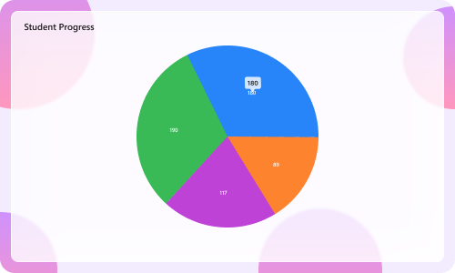

# Liquid Glass Effect in .NET MAUI Circular Chart

The Liquid Glass Effect is a modern design style that provides a sleek, minimalist appearance with clean lines, subtle visual effects, and elegant styling. It features smooth rounded corners and sophisticated visual treatments that create a polished, professional look for your charts.

N> **Prerequisite:** 
- Ensure that the required NuGet package is installed, the necessary namespaces are imported, and the **SfCircularChart** control is properly configured in your application. For detailed setup and configuration instructions, refer to the **[Getting Started](https://help.syncfusion.com/maui/circularchart/getting-started)** guide.
- To use **SfGlassEffectView**, ensure that the Syncfusion.Maui.Core package is installed and import the Syncfusion.Maui.Core namespace.

N> The liquid glass effect is supported with `.NET 10` and on iOS and macOS versions 26 or later.

## How it enhances chart UI on macOS and iOS

The Liquid Glass Effect enhances MAUI [SfCircularChart](https://help.syncfusion.com/cr/maui/Syncfusion.Maui.Charts.SfCircularChart.html) with a sleek, glassy look and improved interactivity.

- **Tooltip:** Applies a glassy appearance to tooltips for clearer data highlights.
- **Chart Background:** Wrap the chart in an [SfGlassEffectView](https://help.syncfusion.com/cr/maui/Syncfusion.Maui.Core.SfGlassEffectView.html) to give the chart surface a blurred or clear glass background.

## Apply Liquid Glass Effect to SfCircularChart

Wrap the [SfCircularChart](https://help.syncfusion.com/cr/maui/Syncfusion.Maui.Charts.SfCircularChart.html) inside an [SfGlassEffectView](https://help.syncfusion.com/cr/maui/Syncfusion.Maui.Core.SfGlassEffectView.html) to give the chart surface a glass (blurred or clear) appearance. `SfGlassEffectView` is available in the [Syncfusion.Maui.Core](https://www.nuget.org/packages/Syncfusion.Maui.Core/) package.





<core:SfGlassEffectView CornerRadius="20"
                        Padding="12"
                        EffectType="Regular"
                        EnableShadowEffect="True">
    <chart:SfCircularChart>
        <chart:PieSeries ItemsSource="{Binding Data}" 
                         XBindingPath="Category"
                         YBindingPath="Value"/>
    </chart:SfCircularChart>
</core:SfGlassEffectView>





SfCircularChart chart = new SfCircularChart();
chart.Series.Add(new PieSeries
{
    ItemsSource = viewModel.Data,
    XBindingPath = "Category",
    YBindingPath = "Value"
});

var glass = new SfGlassEffectView
{
    CornerRadius = 20,
    Padding = new Thickness(12),
    EffectType = GlassEffectType.Regular, // Regular (blurrier) or Clear (glassy)
    EnableShadowEffect = true,
    Content = chart
};

this.Content = glass;





For detailed guidance on [SfGlassEffectView](https://help.syncfusion.com/cr/maui/Syncfusion.Maui.Core.SfGlassEffectView.html), refer to the Getting Started [documentation](https://help.syncfusion.com/maui/liquid-glass-ui/getting-started).

### Enable Liquid Glass Effect for the Tooltip

To enable the liquid glass effect for the tooltip, set the [EnableLiquidGlassEffect](https://help.syncfusion.com/cr/maui/Syncfusion.Maui.Charts.ChartBase.html#Syncfusion_Maui_Charts_ChartBase_EnableLiquidGlassEffect) property of [SfCircularChart](https://help.syncfusion.com/cr/maui/Syncfusion.Maui.Charts.SfCircularChart.html) and the [EnableTooltip](https://help.syncfusion.com/cr/maui/Syncfusion.Maui.Charts.ChartSeries.html#Syncfusion_Maui_Charts_ChartSeries_EnableTooltip) property of [ChartSeries](https://help.syncfusion.com/cr/maui/Syncfusion.Maui.Charts.ChartSeries.html) to `true`. The default value of `EnableLiquidGlassEffect` is `false`.





<chart:SfCircularChart EnableLiquidGlassEffect="True">
    <!-- code omitted for brevity -->
    <chart:PieSeries ItemsSource="{Binding Data}" 
                     XBindingPath="Category"
                     YBindingPath="Value"
                     EnableTooltip="True">
    </chart:PieSeries>
</chart:SfCircularChart>





SfCircularChart chart = new SfCircularChart();
chart.EnableLiquidGlassEffect = true;
// code omitted for brevity
PieSeries series = new PieSeries
{
    ItemsSource = viewModel.Data,
    XBindingPath = "Category",
    YBindingPath = "Value",
    EnableTooltip = true
};

chart.Series.Add(series);
this.Content = chart;





### Best Practices and Tips

- Liquid glass effects are most visible over images or colorful backgrounds.
- Set [EffectType](https://help.syncfusion.com/cr/maui/Syncfusion.Maui.Core.SfGlassEffectView.html#Syncfusion_Maui_Core_SfGlassEffectView_EffectType) property of [SfGlassEffectView](https://help.syncfusion.com/cr/maui/Syncfusion.Maui.Core.SfGlassEffectView.html) to `Regular` for a blurrier look and `Clear` for a crisper, glassy look.
- Adjust [CornerRadius](https://help.syncfusion.com/cr/maui/Syncfusion.Maui.Core.SfGlassEffectView.html#Syncfusion_Maui_Core_SfGlassEffectView_CornerRadius) and [Padding](https://help.syncfusion.com/cr/maui/Syncfusion.Maui.Core.SfGlassEffectView.html#Syncfusion_Maui_Core_SfGlassEffectView_Padding) properties to balance content density and visual polish.
- When using a custom template for the tooltip with [TooltipTemplate](https://help.syncfusion.com/cr/maui/Syncfusion.Maui.Charts.ChartSeries.html#Syncfusion_Maui_Charts_ChartSeries_TooltipTemplate), set the background to `Transparent` to display the liquid glass effect properly.

The following code example shows how to use a custom tooltip template with a transparent background:





<Grid x:Name="grid">
    <Grid.Resources>
        <DataTemplate x:Key="tooltipTemplate">
            <Label Text="{Binding Item.Value}"
                   TextColor="White"
                   FontAttributes="Bold"
                   Padding="8"
                   BackgroundColor="Transparent"/>
        </DataTemplate>
    </Grid.Resources>

    <chart:SfCircularChart EnableLiquidGlassEffect="True">
        <chart:PieSeries ItemsSource="{Binding Data}"
                         XBindingPath="Category"
                         YBindingPath="Value"
                         EnableTooltip="True"
                         TooltipTemplate="{StaticResource tooltipTemplate}"/>
    </chart:SfCircularChart>
</Grid>





// In your DataTemplate for the tooltip, set Background to Transparent
var tooltipTemplate = new DataTemplate(() =>
{
    var label = new Label
    {
        TextColor = Colors.White,
        FontAttributes = FontAttributes.Bold,
        Padding = 8,
        BackgroundColor = Colors.Transparent  // Ensure transparent background
    };
    label.SetBinding(Label.TextProperty, "Item.Value");
    return label;
});

SfCircularChart chart = new SfCircularChart();
chart.EnableLiquidGlassEffect = true;
// code omitted for brevity
PieSeries series = new PieSeries
{
    ItemsSource = viewModel.Data,
    XBindingPath = "Category",
    YBindingPath = "Value",
    EnableTooltip = true,
    TooltipTemplate = tooltipTemplate
};

chart.Series.Add(series);
this.Content = chart;



