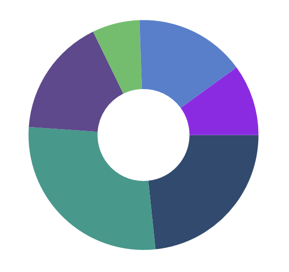

# Selection in .NET MAUI SfCircularChart

[SfCircularChart]() provides selection behavior, which allows you to select or highlight a chart segment using [DataPointSelectionBehavior]().

## Enable Selection

To enable the data point selection in the [SfCircularChart](), create an instance of [DataPointSelectionBehavior]() and specify a color value for the [SelectionBrush]() property to highlight the selected segment in the series. The selection instance should then be set to the chart series [SelectionBehavior]() property.





<chart:SfCircularChart>
    <chart:SfCircularChart.Series>
        <chart:PieSeries>
            <chart:PieSeries.SelectionBehavior>
                <chart:DataPointSelectionBehavior SelectionBrush="BlueViolet"/>
            </chart:PieSeries.SelectionBehavior>
        </chart:PieSeries>
    </chart:SfCircularChart.Series>
</chart:SfCircularChart>





SfCircularChart chart = new SfCircularChart();

DataPointSelectionBehavior selection = new DataPointSelectionBehavior();
selection.SelectionBrush = Brush.BlueViolet;

PieSeries series = new PieSeries();
series.SelectionBehavior = selection;
chart.Series.Add(series);





## Properties

The Selection feature can be configured using the following properties:

* [Type]() - Gets or Sets the ChartSelectionType Enum value for the Selection Behavior.     
The following ChartSelectionType can be achieved during Selection:
    * Single
    * SingleDeselect
    * Multiple
    * None
* [SelectionBrush]() - Gets or Sets  the SelectionBrush color value for Selection Behavior.
* [SelectedIndex]() - Gets or Sets  the index value of the segment that should be selected during the Selection.
* [SelectedIndexes]() - Gets or Sets  the list of indexes of the segments that should be selected during the Selection.

## Rendering Selection Programmatically

[SfCircularChart]() provides support to select a point programmatically on a chart using the [SelectionBrush](), [SelectedIndex]() and [Type]() properties of [ChartSelectionBehavior]().





<chart:PieSeries>
    <chart:PieSeries.SelectionBehavior>
        <chart:DataPointSelectionBehavior SelectionBrush="BlueViolet" SelectedIndex="5" Type="Single"/>
    </chart:PieSeries.SelectionBehavior>
</chart:PieSeries>





SfCircularChart chart = new SfCircularChart();

DataPointSelectionBehavior selection = new DataPointSelectionBehavior();
selection.SelectionBrush = Brush.BlueViolet;
selection.SelectedIndex = 5;
selection.Type = ChartSelectionType.Single;

PieSeries series = new PieSeries();
series.SelectionBehavior = selection;
chart.Series.Add(series);





## ClearSelection Method

The Selection Behavior has a public method called [ClearSelection ()](), which resets all current Selection Behavior property values to their default values.





SfCircularChart chart = new SfCircularChart();

DataPointSelectionBehavior selection = new DataPointSelectionBehavior();

PieSeries series = new PieSeries();
series.SelectionBehavior = selection;
chart.Series.Add(series);

selection.ClearSelection();





## Events

The following public Chart Selection Events are available in [ChartSelectionBehavior]().

### SelectionChanging

The [SelectionChanging]() event is triggered before any data point has been selected. This event is cancelable because it inherits CancelEventArgs which has a public property [Cancel]() that holds a Boolean value indicating whether to continue the segment selection or not, and below properties are contained in the following event arguments.

* [NewIndexes]() - Holds the index of the selected data point.
* [OldIndexes]() - Holds the index of the deselected data point.

### SelectionChanged

The [SelectionChanged]() event is triggered after a data point has been selected. And these following details are contained in the following event arguments.

* [NewIndexes]() - Holds the index of the selected data point.
* [OldIndexes]() - Holds the index of the deselected data point.
