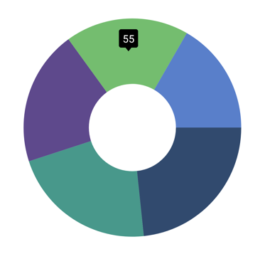
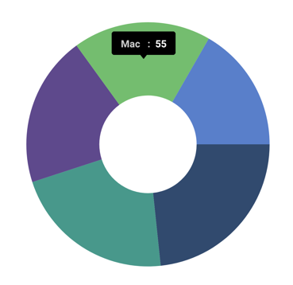

# Tooltip in .NET MAUI Chart

Tooltip is used to display any information or metadata of the tapped segment. The Circular Chart provides tooltip support for all series. 

## Define Tooltip

To define the tooltip in the chart, set the [EnableTooltip](https://help.syncfusion.com/cr/maui/Syncfusion.Maui.Charts.ChartSeries.html#Syncfusion_Maui_Charts_ChartSeries_EnableTooltip) property of series to true. The default value of [EnableTooltip](https://help.syncfusion.com/cr/maui/Syncfusion.Maui.Charts.ChartSeries.html#Syncfusion_Maui_Charts_ChartSeries_EnableTooltip) property is false.





<chart:SfCircularChart>
	. . .
	<chart:PieSeries EnableTooltip="True"/>   
</chart:SfCircularChart>





SfCircularChart chart = new SfCircularChart();
. . .
PieSeries series = new PieSeries();
series.EnableTooltip = true;
chart.Series.Add(series);
this.Content = chart;





The [ChartTooltipBehavior](https://help.syncfusion.com/cr/maui/Syncfusion.Maui.Charts.ChartTooltipBehavior.html) is used to customize the tooltip. For customizing the tooltip, create an instance [ChartTooltipBehavior](https://help.syncfusion.com/cr/maui/Syncfusion.Maui.Charts.ChartTooltipBehavior.html) and set it to the [TooltipBehavior](https://help.syncfusion.com/cr/maui/Syncfusion.Maui.Charts.ChartBase.html#Syncfusion_Maui_Charts_ChartBase_TooltipBehavior) property of [SfCircularChart](https://help.syncfusion.com/cr/maui/Syncfusion.Maui.Charts.SfCircularChart.html). The following properties are used to customize the tooltip:

* [Background](https://help.syncfusion.com/cr/maui/Syncfusion.Maui.Charts.ChartTooltipBehavior.html#Syncfusion_Maui_Charts_ChartTooltipBehavior_Background) - Gets or sets the background color to the tooltip label.
* [FontAttributes](https://help.syncfusion.com/cr/maui/Syncfusion.Maui.Charts.ChartTooltipBehavior.html#Syncfusion_Maui_Charts_ChartTooltipBehavior_FontAttributes) - Gets or sets the font style for the label.
* [FontFamily](https://help.syncfusion.com/cr/maui/Syncfusion.Maui.Charts.ChartTooltipBehavior.html#Syncfusion_Maui_Charts_ChartTooltipBehavior_FontFamily) - Gets or sets the font family name for the label.
* [FontSize](https://help.syncfusion.com/cr/maui/Syncfusion.Maui.Charts.ChartTooltipBehavior.html#Syncfusion_Maui_Charts_ChartTooltipBehavior_FontSize) - Gets or sets the font size for the label.
* [Duration](https://help.syncfusion.com/cr/maui/Syncfusion.Maui.Charts.ChartTooltipBehavior.html#Syncfusion_Maui_Charts_ChartTooltipBehavior_Duration) - Gets or sets the duration of the tooltip text in seconds.
* [Margin](https://help.syncfusion.com/cr/maui/Syncfusion.Maui.Charts.ChartTooltipBehavior.html#Syncfusion_Maui_Charts_ChartTooltipBehavior_Margin) - Gets or sets the margin of the label to customize the appearance of label.
* [TextColor](https://help.syncfusion.com/cr/maui/Syncfusion.Maui.Charts.ChartTooltipBehavior.html#Syncfusion_Maui_Charts_ChartTooltipBehavior_TextColor) - Used to set the color for the text of the label.





<chart:SfCircularChart>
	. . .
	<chart:SfCircularChart.TooltipBehavior>
		<chart:ChartTooltipBehavior Duration="2000"/>
	</chart:SfCircularChart.TooltipBehavior>
</chart:SfCircularChart>





SfCircularChart chart = new SfCircularChart();
. . .
chart.TooltipBehavior = new ChartTooltipBehavior()
{
	Duration = 2000,
};
this.Content = chart;
this.Content = chart;





## Template

Circular chart provides support to customize the appearance of the tooltip by using the [TooltipTemplate](https://help.syncfusion.com/cr/maui/Syncfusion.Maui.Charts.ChartSeries.html#Syncfusion_Maui_Charts_ChartSeries_TooltipTemplate) property.





<chart:SfCircularChart>
    . . .
    <chart:SfCircularChart.Resources>
        <DataTemplate x:Key="tooltipTemplate">
            <StackLayout Orientation="Horizontal">
				<Label Text="{Binding Item.Product}"
				       TextColor="Black"
				       FontAttributes="Bold"
				       FontSize="12"
				       HorizontalOptions="Center"
				       VerticalOptions="Center"/>
				<Label Text=" : " 
				       TextColor="Black"
				       FontAttributes="Bold"
				       FontSize="12"
				       HorizontalOptions="Center"
				       VerticalOptions="Center"/>
                		<Label Text="{Binding Item.SalesRate}"
			  	       TextColor="Black"
				       FontAttributes="Bold"
				       FontSize="12"
				       HorizontalOptions="Center"
				       VerticalOptions="Center"/>
            </StackLayout>
        </DataTemplate>
    </chart:SfCircularChart.Resources>

    <chart:PieSeries EnableTooltip="True"
		     ItemsSource="{Binding Data}" 
		     XBindingPath="Product" 
		     YBindingPath="SalesRate"
		     TooltipTemplate="{StaticResource tooltipTemplate}"/>
    . . .
</chart:SfCircularChart>





SfCircularChart chart = new SfCircularChart();
. . .
PieSeries series = new PieSeries();
series.EnableTooltip = true;
series.TooltipTemplate = chart.Resources["tooltipTemplate"] as DataTemplate;
. . .     

this.Content = chart;





