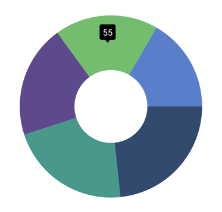
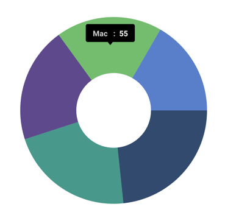

# Tooltip in .NET MAUI Circular Chart

Tooltip is used to display any information or metadata of the tapped segment. The Circular Chart provides tooltip support for all series.

N> **Prerequisite:** Ensure that the required NuGet package is installed, the necessary namespaces are imported, and the **SfCircularChart** control is properly configured in your application. For detailed setup and configuration instructions, refer to the **[Getting Started](https://help.syncfusion.com/maui/circular-charts/getting-started)** guide.

## Define Tooltip

To define the tooltip in the chart, set the [EnableTooltip](https://help.syncfusion.com/cr/maui/Syncfusion.Maui.Charts.ChartSeries.html#Syncfusion_Maui_Charts_ChartSeries_EnableTooltip) property of series to true. The default value of [EnableTooltip](https://help.syncfusion.com/cr/maui/Syncfusion.Maui.Charts.ChartSeries.html#Syncfusion_Maui_Charts_ChartSeries_EnableTooltip) property is false.





<chart:SfCircularChart>
    <!-- code omitted for brevity -->
    <chart:PieSeries EnableTooltip="True"/>   
</chart:SfCircularChart>





SfCircularChart chart = new SfCircularChart();
// code omitted for brevity
PieSeries series = new PieSeries();
series.EnableTooltip = true;
chart.Series.Add(series);
this.Content = chart;





The [ChartTooltipBehavior](https://help.syncfusion.com/cr/maui/Syncfusion.Maui.Charts.ChartTooltipBehavior.html) is used to customize the tooltip by creating an instance and setting it to the [TooltipBehavior](https://help.syncfusion.com/cr/maui/Syncfusion.Maui.Charts.ChartBase.html#Syncfusion_Maui_Charts_ChartBase_TooltipBehavior) property of [SfCircularChart](https://help.syncfusion.com/cr/maui/Syncfusion.Maui.Charts.SfCircularChart.html). The following properties are used to customize the tooltip:

* [Background](https://help.syncfusion.com/cr/maui/Syncfusion.Maui.Charts.ChartTooltipBehavior.html#Syncfusion_Maui_Charts_ChartTooltipBehavior_Background) - Gets or sets the background color to the tooltip label.
* [FontAttributes](https://help.syncfusion.com/cr/maui/Syncfusion.Maui.Charts.ChartTooltipBehavior.html#Syncfusion_Maui_Charts_ChartTooltipBehavior_FontAttributes) - Gets or sets the font style for the label.
* [FontFamily](https://help.syncfusion.com/cr/maui/Syncfusion.Maui.Charts.ChartTooltipBehavior.html#Syncfusion_Maui_Charts_ChartTooltipBehavior_FontFamily) - Gets or sets the font family name for the label.
* [FontSize](https://help.syncfusion.com/cr/maui/Syncfusion.Maui.Charts.ChartTooltipBehavior.html#Syncfusion_Maui_Charts_ChartTooltipBehavior_FontSize) - Gets or sets the font size for the label.
* [Duration](https://help.syncfusion.com/cr/maui/Syncfusion.Maui.Charts.ChartTooltipBehavior.html#Syncfusion_Maui_Charts_ChartTooltipBehavior_Duration) - Gets or sets the duration of the tooltip text in seconds.
* [Margin](https://help.syncfusion.com/cr/maui/Syncfusion.Maui.Charts.ChartTooltipBehavior.html#Syncfusion_Maui_Charts_ChartTooltipBehavior_Margin) - Gets or sets the margin of the label to customize the appearance of label.
* [TextColor](https://help.syncfusion.com/cr/maui/Syncfusion.Maui.Charts.ChartTooltipBehavior.html#Syncfusion_Maui_Charts_ChartTooltipBehavior_TextColor) - Gets or sets the color for the text of the label.
* [Stroke](https://help.syncfusion.com/cr/maui/Syncfusion.Maui.Charts.ChartTooltipBehavior.html#Syncfusion_Maui_Charts_ChartTooltipBehavior_Stroke) - Gets or sets the border color of the tooltip.
* [StrokeWidth](https://help.syncfusion.com/cr/maui/Syncfusion.Maui.Charts.ChartTooltipBehavior.html#Syncfusion_Maui_Charts_ChartTooltipBehavior_StrokeWidth) - Gets or sets the thickness of the tooltip border.
* [UseSeriesFillColor](https://help.syncfusion.com/cr/maui/Syncfusion.Maui.Charts.ChartTooltipBehavior.html#Syncfusion_Maui_Charts_ChartTooltipBehavior_UseSeriesFillColor) - Gets or sets a value indicating whether the tooltip background should use the fill color of the associated series. When set to `true`, the tooltip adopts the series color as its background.





<chart:SfCircularChart>
    <chart:SfCircularChart.TooltipBehavior>
        <chart:ChartTooltipBehavior Duration="10"/>
    </chart:SfCircularChart.TooltipBehavior>
    <!-- code omitted for brevity -->
</chart:SfCircularChart>





SfCircularChart chart = new SfCircularChart();
// code omitted for brevity
chart.TooltipBehavior = new ChartTooltipBehavior()
{
    Duration = 10,
};
this.Content = chart;





## Template

Circular chart provides support to customize the appearance of the tooltip by using the [TooltipTemplate](https://help.syncfusion.com/cr/maui/Syncfusion.Maui.Charts.ChartSeries.html#Syncfusion_Maui_Charts_ChartSeries_TooltipTemplate) property. The tooltip binding context provides access to the data point's `Item` property, which contains the original data object with all bound properties (e.g., `Item.Product`, `Item.SalesRate`).





<chart:SfCircularChart>
    <chart:SfCircularChart.Resources>
        <DataTemplate x:Key="tooltipTemplate">
            <HorizontalStackLayout>
                <Label Text="{Binding Item.Product}"
                       TextColor="Black"
                       FontAttributes="Bold"
                       FontSize="12"
                       HorizontalOptions="Center"
                       VerticalOptions="Center"/>
                <Label Text=" : " 
                       TextColor="Black"
                       FontAttributes="Bold"
                       FontSize="12"
                       HorizontalOptions="Center"
                       VerticalOptions="Center"/>
                <Label Text="{Binding Item.SalesRate}"
                       TextColor="Black"
                       FontAttributes="Bold"
                       FontSize="12"
                       HorizontalOptions="Center"
                       VerticalOptions="Center"/>
            </HorizontalStackLayout>
        </DataTemplate>
    </chart:SfCircularChart.Resources>

    <chart:PieSeries EnableTooltip="True"
             ItemsSource="{Binding Data}" 
             XBindingPath="Product" 
             YBindingPath="SalesRate"
             TooltipTemplate="{StaticResource tooltipTemplate}"/>
    <!-- code omitted for brevity -->
</chart:SfCircularChart>





SfCircularChart chart = new SfCircularChart();
// code omitted for brevity
PieSeries series = new PieSeries();
series.EnableTooltip = true;
series.TooltipTemplate = chart.Resources["tooltipTemplate"] as DataTemplate; 

this.Content = chart;





