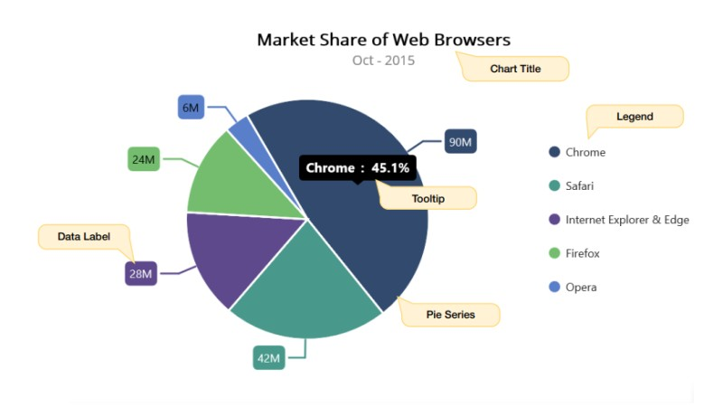

# Visual structure of the .NET MAUI Chart

The following image shows the most common elements of the Circular chart.

## Description of the chart elements

* `Title` - The text that will be used to describe the chart's use case. 
* `Legend` - The name of the field described by each data point in the series is listed in the chart legend, which is visible next to the chart plot area (can be placed at the top, right, bottom, or left).
* `Pie Series` - The actual visual representation of data.
* `Tooltip` -  A text element known as a tooltip appears when the cursor is over a data point. used to show more details about the point.
* `Data label` - A text element appears near the data points and is used to show more details about the point.
