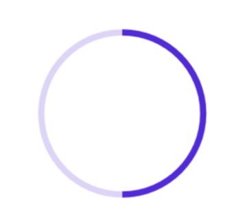

# Range in .NET MAUI Circular Progress Bar

The Range represents the entire span of the Circular Progress Bar and can be defined using the [`Minimum`](https://help.syncfusion.com/cr/maui/Syncfusion.Maui.ProgressBar.ProgressBarBase.html#Syncfusion_Maui_ProgressBar_ProgressBarBase_Minimum) and [`Maximum`](https://help.syncfusion.com/cr/maui/Syncfusion.Maui.ProgressBar.ProgressBarBase.html#Syncfusion_Maui_ProgressBar_ProgressBarBase_Maximum) properties. By default, the range is from 0 to 100.

The following code sample demonstrates how to customize the range as factor value to the Circular Progress Bar.





<progressBar:SfCircularProgressBar Minimum="0"
                                   Progress="0.5"
                                   Maximum="1"/>





using Syncfusion.Maui.ProgressBar;

SfCircularProgressBar circularProgressBar = new SfCircularProgressBar();
circularProgressBar.Minimum = 0;
circularProgressBar.Maximum = 1;
circularProgressBar.Progress = 0.5;
this.Content = circularProgressBar;





N> Refer to our [.NET MAUI Circular Progress Bar](https://www.syncfusion.com/maui-controls/maui-progressbar) feature tour page for its groundbreaking feature representations. Also explore our [.NET MAUI Circular Progress Bar example](https://github.com/syncfusion/maui-demos/) that shows how to configure a SfCircularProgressBar in .NET MAUI.