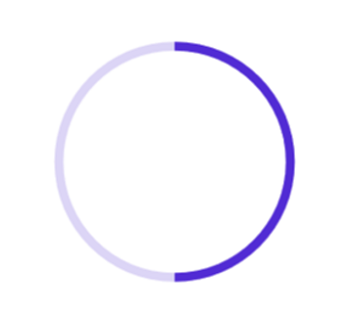

# Define Range in .NET MAUI ProgressBar (Progress Bar)

The Range represents the entire span of the progress bar and can be defined using the `Minimum` and `Maximum` properties. The default value of the range is 0 to 100.

The following code sample demonstrates how to customize the range as factor value to the progress bar.

  



<progressBar:SfCircularProgressBar Minimum="0" 
                                   Progress="0.5" 
                                   Maximum="1"/>





SfCircularProgressBar circularProgressBar = new SfCircularProgressBar();
circularProgressBar.Minimum = 0;
circularProgressBar.Maximum = 1;
circularProgressBar.Progress = 0.5;
this.Content = circularProgressBar;



 

N> Refer to our `.NET MAUI ProgressBar` feature tour page for its groundbreaking feature representations. Also explore our [.NET MAUI ProgressBar example](https://github.com/syncfusion/maui-demos/) that shows how to configure a ProgressBar in .NET MAUI.