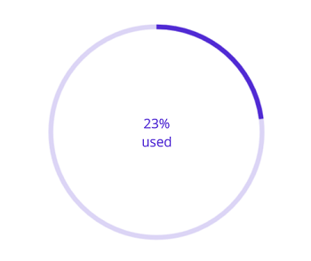

# Custom Content in .NET MAUI Circular ProgressBar

In the circular progress bar, add any view to the center using the [`Content`](https://help.syncfusion.com/cr/maui/Syncfusion.Maui.ProgressBar.SfCircularProgressBar.html#Syncfusion_Maui_ProgressBar_SfCircularProgressBar_Content) property. 

For example, include add, start, or pause button to control the progress. Also add an image that indicates the actual task in progress or add custom text that conveys how far the task is completed. 

The following code sample demonstrates how to add custom text content.

 



<progressBar:SfCircularProgressBar x:Name="customContentCircularProgressBar" 
                                   Progress="23">
    <progressBar:SfCircularProgressBar.Content>
        <Grid>
            <Grid.RowDefinitions>
                <RowDefinition />
                <RowDefinition />
            </Grid.RowDefinitions>
            <Label TextColor="#007cee"  
                   Text="{Binding Source={x:Reference customContentCircularProgressBar},Path=Progress,StringFormat='{0}%'}"
                   HorizontalTextAlignment="Center" 
                   VerticalTextAlignment="End">
            </Label>
            <Label Grid.Row="1" 
                   TextColor="#007cee" 
                   Text="used" 
                   VerticalOptions="Start" 
                   HorizontalTextAlignment="Center" 
                   VerticalTextAlignment="Start">
            </Label>
        </Grid>
    </progressBar:SfCircularProgressBar.Content>
</progressBar:SfCircularProgressBar>





SfCircularProgressBar circularProgressBar = new SfCircularProgressBar();
circularProgressBar.Progress = 23;
Grid grid = new Grid();
grid.RowDefinitions.Add(new RowDefinition());
grid.RowDefinitions.Add(new RowDefinition());
Label label = new Label();
label.BindingContext = circularProgressBar;
Binding binding = new Binding();
binding.Path = "Progress";
binding.StringFormat = "{0}%";
label.SetBinding(Label.TextProperty, binding);
label.HorizontalTextAlignment = TextAlignment.Center;
label.VerticalOptions = LayoutOptions.End;
label.TextColor = Color.FromArgb("007cee");
Grid.SetRow(label, 0);
grid.Children.Add(label);
Label textLabel = new Label();
textLabel.Text = "used";
textLabel.HorizontalTextAlignment = TextAlignment.Center;
textLabel.VerticalOptions = LayoutOptions.Start;
textLabel.TextColor = Color.FromArgb("007cee");
Grid.SetRow(textLabel, 1);
grid.Children.Add(textLabel);
circularProgressBar.Content = grid;
this.Content = circularProgressBar;



 

N> Refer to our [.NET MAUI Circular ProgressBar](https://www.syncfusion.com/maui-controls/maui-progressbar) feature tour page for its groundbreaking feature representations. Also explore our [.NET MAUI Circular ProgressBar example](https://github.com/syncfusion/maui-demos/) that shows how to configure a SfCircularProgressBar in .NET MAUI.