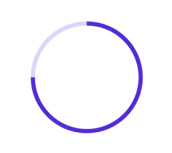
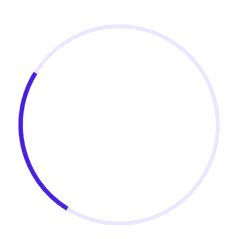

# Getting started with .NET MAUI Circular ProgressBar

This section explains the steps required to add the circular progress bar control with the progress and its customizable elements such as indeterminate, segment, progress fill, and track fill. This section covers only the basic features needed to know and gets started with the Syncfusion circular progress bar.

To get start quickly with our .NET MAUI Circular ProgressBar, check the following video.



## Creating an application using the .NET MAUI Circular ProgressBar

* Create a new .NET MAUI application in the Visual Studio.

* The Syncfusion .NET MAUI components are available on [nuget.org](https://www.nuget.org/). To add SfCircularProgressBar to your project, open the NuGet package manager in Visual Studio, and search for [Syncfusion.Maui.ProgressBar] then install that.

### Register the handler

The Syncfusion.Maui.Core NuGet is a dependent package for all Syncfusion controls of .NET MAUI. In the MauiProgram.cs file, register the handler for the Syncfusion core.



using Microsoft.Maui;
using Microsoft.Maui.Hosting;
using Microsoft.Maui.Controls.Compatibility;
using Microsoft.Maui.Controls.Hosting;
using Microsoft.Maui.Controls.Xaml;
using Syncfusion.Maui.Core.Hosting;

namespace MyProject
{
    public static class MauiProgram
    {
        public static MauiApp CreateMauiApp()
        {
            var builder = MauiApp.CreateBuilder();
            builder
            .UseMauiApp<App>()
            .ConfigureSyncfusionCore()
            .ConfigureFonts(fonts =>
            {
                fonts.AddFont("OpenSans-Regular.ttf", "OpenSansRegular");
            });

            return builder.Build();
        }
    }
}



## Initializing circular progress bar

Add the following namespace.





xmlns:progressBar="clr-namespace:Syncfusion.Maui.ProgressBar;assembly=Syncfusion.Maui.ProgressBar"





using Syncfusion.Maui.ProgressBar;





Create an instance for the circular progress bar control, and add it as content.





<progressBar:SfCircularProgressBar Progress="75"/>





SfCircularProgressBar circularProgressBar = new SfCircularProgressBar { Progress = 75 };
this.Content = circularProgressBar;





N> By default, the value of progress should be specified between 0 and 100. To determine the progress value between 0 and 1, set the Minimum property to 0 and the Maximum property to 1.

Run the project, and check if you get following output to make sure that the project has been configured properly to add the circular progress bar.

## Enabling indeterminate state

When the progress of a task cannot be shown determinately, you can enable the indeterminate state using the [`IsIndeterminate`](https://help.syncfusion.com/cr/maui/Syncfusion.Maui.ProgressBar.ProgressBarBase.html#Syncfusion_Maui_ProgressBar_ProgressBarBase_IsIndeterminate) property to know if any progress is happening in the background.

 

 

<progressBar:SfCircularProgressBar IsIndeterminate="True"/>



 

SfCircularProgressBar circularProgressBar = new SfCircularProgressBar { IsIndeterminate = true };
this.Content = circularProgressBar;



 

## Enable segments

To visualize the progress of a multiple sequential task, split the circular progress bar into the multiple segments by defining the [`SegmentCount`](https://help.syncfusion.com/cr/maui/Syncfusion.Maui.ProgressBar.ProgressBarBase.html#Syncfusion_Maui_ProgressBar_ProgressBarBase_SegmentCount) property as demonstrated in the following code sample.

 

 

<progressBar:SfCircularProgressBar SegmentCount="4" Progress="75"/>



 

SfCircularProgressBar circularProgressBar = new SfCircularProgressBar { Progress = 75, SegmentCount = 4 };
this.Content = circularProgressBar;





## Apply colors

Customize the color of the progress indicator and track by defining the [`ProgressFill`](https://help.syncfusion.com/cr/maui/Syncfusion.Maui.ProgressBar.ProgressBarBase.html#Syncfusion_Maui_ProgressBar_ProgressBarBase_ProgressFill) and [`TrackFill`](https://help.syncfusion.com/cr/maui/Syncfusion.Maui.ProgressBar.ProgressBarBase.html#Syncfusion_Maui_ProgressBar_ProgressBarBase_TrackFill) properties, respectively.

 

 

<progressBar:SfCircularProgressBar Progress="75" 
                                   TrackFill="#33c15244" 
                                   ProgressFill="#FFc15244"/>

<progressBar:SfCircularProgressBar Progress="75" 
                                   TrackFill="#3390a84e" 
                                   ProgressFill="#FF90a84e"/>



 

SfCircularProgressBar circularProgressBar = new SfCircularProgressBar
{
    Progress = 75, 
    TrackFill = new SolidColorBrush(Color.FromArgb("#33c15244")), 
    ProgressFill = new SolidColorBrush(Color.FromArgb("#FFc15244"))
};

SfCircularProgressBar sfCircularProgressBar = new SfCircularProgressBar
{
    Progress = 75, 
    TrackFill = new SolidColorBrush(Color.FromArgb("#3390a84e")), 
    ProgressFill = new SolidColorBrush(Color.FromArgb("#FF90a84e"))
};



 

N> 
* Get the complete getting started sample from [GitHub](https://github.com/SyncfusionExamples/Getting-Started-with-.NET-MAUI-Circular-ProgressBar-control.-) link.
* You can refer to our [.NET MAUI ProgressBar](https://www.syncfusion.com/maui-controls/maui-progressbar) feature tour page for its groundbreaking feature representations. You can also explore our [.NET MAUI ProgressBar Example](https://github.com/syncfusion/maui-demos/tree/master/MAUI/ProgressBar) that shows you how to render the ProgressBar in .NET MAUI.