# Customization in .NET MAUI Color Picker (SfColorPicker)

## Selected color

The [SelectedColor](https://help.syncfusion.com/cr/maui/Syncfusion.Maui.Inputs.SfColorPicker.html#Syncfusion_Maui_Inputs_SfColorPicker_SelectedColor) property of the Color Picker is used to display a default color during initial load. You can also select a color value in the UI using built-in elements like the color spectrum, sliders, palette, or HEX input.





<inputs:SfColorPicker SelectedColor="DodgerBlue"/>       





SfColorPicker colorPicker = new SfColorPicker()
{
    SelectedColor = Colors.DodgerBlue
};
 




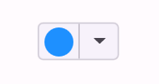

## Show recent colors

You can display the recently selected colors in the Color Picker when in [Palette](https://help.syncfusion.com/cr/maui/Syncfusion.Maui.Inputs.ColorPickerMode.html#Syncfusion_Maui_Inputs_ColorPickerMode_Palette) mode by enabling the [ShowRecentColors](https://help.syncfusion.com/cr/maui/Syncfusion.Maui.Inputs.SfColorPicker.html#Syncfusion_Maui_Inputs_SfColorPicker_ShowRecentColors) property. By default, it is set to `True`.





<inputs:SfColorPicker ShowRecentColors="True"/>





SfColorPicker colorPicker = new SfColorPicker()
{
    ShowRecentColors = true
};





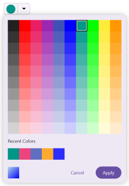

## ClearRecentColors

You can clear all colors shown in the Recent Colors section of the Color Picker by calling the [ClearRecentColors](https://help.syncfusion.com/cr/maui/Syncfusion.Maui.Inputs.SfColorPicker.html#Syncfusion_Maui_Inputs_SfColorPicker_ClearRecentColors) method. This method removes all previously selected colors and resets the Recent Colors list.





SfColorPicker colorPicker = new SfColorPicker();

// Clear all recent colors
colorPicker.ClearRecentColors();





## Show input area

You can show or hide the input area of the Color Picker by adjusting the [ShowInputArea](https://help.syncfusion.com/cr/maui/Syncfusion.Maui.Inputs.SfColorPicker.html#Syncfusion_Maui_Inputs_SfColorPicker_ShowInputArea) property. By default, it is set to `True`.





<inputs:SfColorPicker ShowInputArea="False"/>





SfColorPicker colorPicker = new SfColorPicker()
{
    ShowInputArea = false
};
    




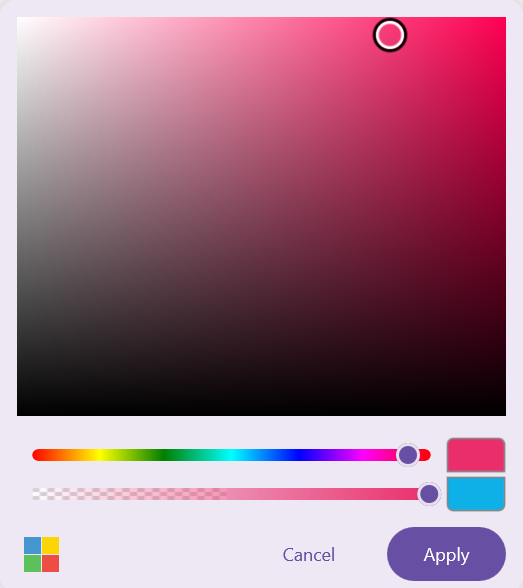

## Alpha slider

The alpha slider is used to control the transparency of the selected color. You can show or hide the alpha slider by adjusting the [ShowAlphaSlider](https://help.syncfusion.com/cr/maui/Syncfusion.Maui.Inputs.SfColorPicker.html#Syncfusion_Maui_Inputs_SfColorPicker_ShowAlphaSlider) property. By default, it is set to `True`.





<inputs:SfColorPicker ShowAlphaSlider="True"/>





SfColorPicker colorPicker = new SfColorPicker()
{
    ShowAlphaSlider = true
};
    




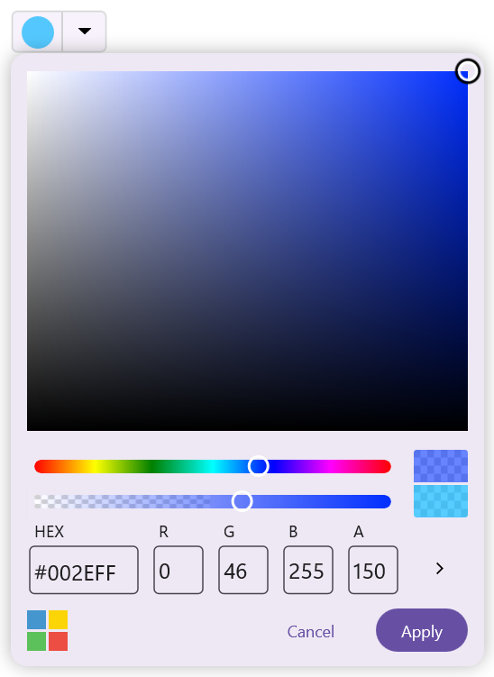

## Action buttons

You can render the Color Picker without the Apply and Cancel buttons for a seamless color selection experience. When the control buttons are hidden, the selected color is applied instantly, and the Color Picker popup closes automatically upon selection. To enable this, simply set the [IsActionButtonsVisible](https://help.syncfusion.com/cr/maui/Syncfusion.Maui.Inputs.SfColorPicker.html#Syncfusion_Maui_Inputs_SfColorPicker_IsActionButtonsVisible) property to `False`.





<inputs:SfColorPicker IsActionButtonsVisible="False"/>





SfColorPicker colorPicker = new SfColorPicker()
{
    IsActionButtonsVisible = false
};
    




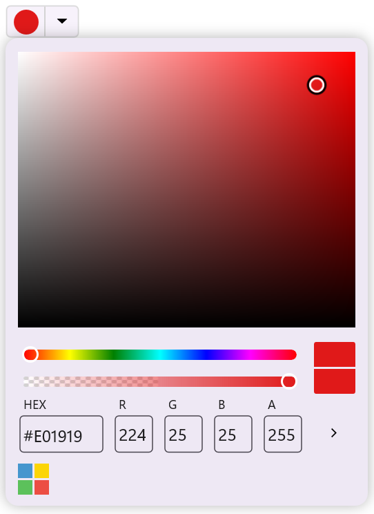

## Customize action buttons

You can customize the background color for the action buttons by specifying a suitable color for the [ApplyButtonBackground](https://help.syncfusion.com/cr/maui/Syncfusion.Maui.Inputs.SfColorPicker.html#Syncfusion_Maui_Inputs_SfColorPicker_ApplyButtonBackground) and [CancelButtonBackground](https://help.syncfusion.com/cr/maui/Syncfusion.Maui.Inputs.SfColorPicker.html#Syncfusion_Maui_Inputs_SfColorPicker_CancelButtonBackground) properties.





<inputs:SfColorPicker ApplyButtonBackground="Navy"
                      CancelButtonBackground="LightGrey">
</inputs:SfColorPicker>





SfColorPicker colorPicker = new SfColorPicker()
{
    ApplyButtonBackground = Colors.Navy,
    CancelButtonBackground = Colors.LightGrey
};
    




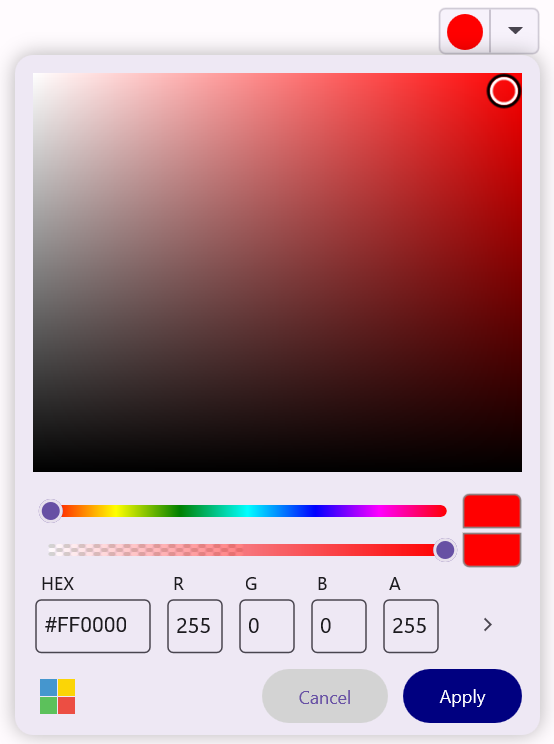

Also you can customize the text appearance of the action buttons by defining a suitable label style for the [ApplyButtonLabelStyle](https://help.syncfusion.com/cr/maui/Syncfusion.Maui.Inputs.SfColorPicker.html#Syncfusion_Maui_Inputs_SfColorPicker_ApplyButtonLabelStyle) and [CancelButtonLabelStyle](https://help.syncfusion.com/cr/maui/Syncfusion.Maui.Inputs.SfColorPicker.html#Syncfusion_Maui_Inputs_SfColorPicker_CancelButtonLabelStyle) properties.





<inputs:SfColorPicker>
    <inputs:SfColorPicker.ApplyButtonLabelStyle>
        <inputs:LabelStyle
            FontSize="16"
            TextColor="White"
            FontAttributes="Bold" />
    </inputs:SfColorPicker.ApplyButtonLabelStyle>
    <inputs:SfColorPicker.CancelButtonLabelStyle>
        <inputs:LabelStyle
            FontSize="14"
            TextColor="Gray"
            FontAttributes="None" />
    </inputs:SfColorPicker.CancelButtonLabelStyle>
</inputs:SfColorPicker>





SfColorPicker colorPicker = new SfColorPicker();

// Set Apply button label style
colorPicker.ApplyButtonLabelStyle = new LabelStyle
{
    FontSize = 16,
    TextColor = Colors.White,
    FontAttributes = FontAttributes.Bold
};

// Set Cancel button label style
colorPicker.CancelButtonLabelStyle = new LabelStyle
{
    FontSize = 14,
    TextColor = Colors.Gray,
    FontAttributes = FontAttributes.None
};
    




## Customize Recent Colors and Spectrum Input View Label Style

You can customize the text appearance of the recent colors label and the labels displayed in the spectrum input view by defining suitable label styles for the [RecentColorsLabelStyle]
(https://help.syncfusion.com/cr/maui/Syncfusion.Maui.Inputs.SfColorPicker.html#Syncfusion_Maui_Inputs_SfColorPicker_RecentColorsLabelStyle) and [SpectrumInputViewLabelStyle]
(https://help.syncfusion.com/cr/maui/Syncfusion.Maui.Inputs.SfColorPicker.html#Syncfusion_Maui_Inputs_SfColorPicker_SpectrumInputViewLabelStyle) properties.

- `RecentColorsLabelStyle` applies to the “Recent Colors” text displayed above the recent color palette.
- `SpectrumInputViewLabelStyle` applies to the label texts displayed in the spectrum input view, such as HEX, R, G, B, H, S, V, and A modify labels.





<syncfusion:SfColorPicker>
    <!-- Recent colors label style -->
    <syncfusion:SfColorPicker.RecentColorsLabelStyle>
        <syncfusion:LabelStyle
            FontSize="14"
            TextColor="DarkGray"
            FontAttributes="Italic" />
    </syncfusion:SfColorPicker.RecentColorsLabelStyle>
    <!-- Spectrum input view label style (HEX, RGBA labels) -->
    <syncfusion:SfColorPicker.SpectrumInputViewLabelStyle>
        <syncfusion:LabelStyle
            FontSize="14"
            TextColor="Black"
            FontFamily="Arial" />
    </syncfusion:SfColorPicker.SpectrumInputViewLabelStyle>
</syncfusion:SfColorPicker>





SfColorPicker colorPicker = new SfColorPicker();

// Set recent colors label style
colorPicker.RecentColorsLabelStyle = new LabelStyle
{
    FontSize = 14,
    TextColor = Colors.DarkGray,
    FontAttributes = FontAttributes.Italic
};

// Set spectrum input view label style (HEX, RGBA, HSV labels)
colorPicker.SpectrumInputViewLabelStyle = new LabelStyle
{
    FontSize = 14,
    TextColor = Colors.Black,
    FontFamily = "Arial"
};
    




## No color option

The [ShowNoColor](https://help.syncfusion.com/cr/maui/Syncfusion.Maui.Inputs.SfColorPicker.html#Syncfusion_Maui_Inputs_SfColorPicker_ShowNoColor) property determines whether the `No Color` option is displayed in the Color Picker UI. This option allows users to clear their selection from the palette, effectively choosing no color. By default, this property is set to `False`.





<inputs:SfColorPicker ShowNoColor="True"/>    





SfColorPicker colorPicker = new SfColorPicker()
{
    ShowNoColor = true
};
    




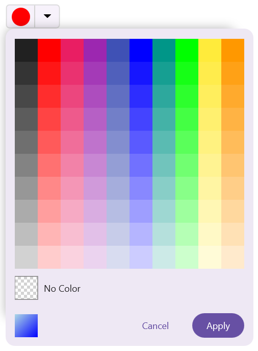

## Palette count

The [PaletteColumnCount](https://help.syncfusion.com/cr/maui/Syncfusion.Maui.Inputs.SfColorPicker.html#Syncfusion_Maui_Inputs_SfColorPicker_PaletteColumnCount) and [PaletteRowCount](https://help.syncfusion.com/cr/maui/Syncfusion.Maui.Inputs.SfColorPicker.html#Syncfusion_Maui_Inputs_SfColorPicker_PaletteRowCount) properties define the number of columns and rows displayed in the palette grid. By default, both are set to 10.





<inputs:SfColorPicker PaletteColumnCount="6" PaletteRowCount="5"/>    





SfColorPicker colorPicker = new SfColorPicker()
{
    PaletteColumnCount = 6,
    PaletteRowCount = 5
};
    




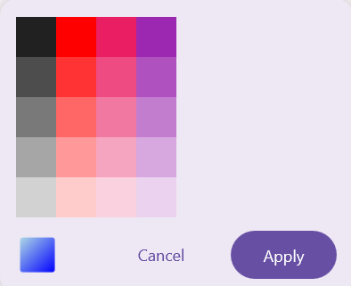

## Palette spacing

The [PaletteColumnSpacing](https://help.syncfusion.com/cr/maui/Syncfusion.Maui.Inputs.SfColorPicker.html#Syncfusion_Maui_Inputs_SfColorPicker_PaletteColumnSpacing) property defines the horizontal spacing between columns, while the [PaletteRowSpacing](https://help.syncfusion.com/cr/maui/Syncfusion.Maui.Inputs.SfColorPicker.html#Syncfusion_Maui_Inputs_SfColorPicker_PaletteRowSpacing) property defines the vertical spacing between rows in [Palette](https://help.syncfusion.com/cr/maui/Syncfusion.Maui.Inputs.ColorPickerMode.html#Syncfusion_Maui_Inputs_ColorPickerMode_Palette) mode. By default, both properties are set to 0, meaning the swatches are placed directly next to each other without any spacing.




<inputs:SfColorPicker PaletteColumnSpacing="10"
                      PaletteRowSpacing="10"/>




SfColorPicker colorPicker = new SfColorPicker()
{
    PaletteColumnSpacing = 10,
    PaletteRowSpacing = 10
};




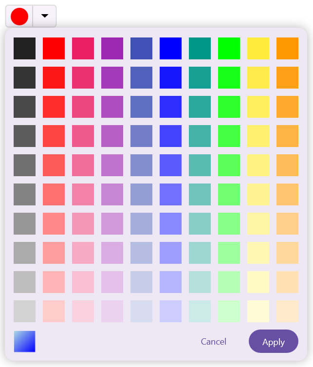

## Palette cell customization

### PaletteCellCornerRadius

The [PaletteCellCornerRadius](https://help.syncfusion.com/cr/maui/Syncfusion.Maui.Inputs.SfColorPicker.html#Syncfusion_Maui_Inputs_SfColorPicker_PaletteCellCornerRadius) specifies the corner radius of individual palette cells, allowing you to create rounded or custom‑shaped cells.





<syncfusion:SfColorPicker PaletteCellCornerRadius="15, 12, 15, 7" />  





SfColorPicker colorPicker = new SfColorPicker()
{
    PaletteCellCornerRadius = new CornerRadius(15, 12, 15, 7)
};
    




### PaletteCellShape

The [PaletteCellShape](https://help.syncfusion.com/cr/maui/Syncfusion.Maui.Inputs.SfColorPicker.html#Syncfusion_Maui_Inputs_SfColorPicker_PaletteCellShape) specifies the shape of the palette cells. It supports the following shapes.

- [Circle](https://help.syncfusion.com/cr/maui/Syncfusion.Maui.Inputs.PaletteCellShape.html#Syncfusion_Maui_Inputs_PaletteCellShape_Circle)
- [Square](https://help.syncfusion.com/cr/maui/Syncfusion.Maui.Inputs.PaletteCellShape.html#Syncfusion_Maui_Inputs_PaletteCellShape_Square)
- [Default](https://help.syncfusion.com/cr/maui/Syncfusion.Maui.Inputs.PaletteCellShape.html#Syncfusion_Maui_Inputs_PaletteCellShape_Default)





<syncfusion:SfColorPicker PaletteCellShape="Circle" />   





SfColorPicker colorPicker = new SfColorPicker()
{
    PaletteCellShape = PaletteCellShape.Circle
};
    




### PaletteCellSize

The [PaletteCellSize](https://help.syncfusion.com/cr/maui/Syncfusion.Maui.Inputs.SfColorPicker.html#Syncfusion_Maui_Inputs_SfColorPicker_PaletteCellSize) specifies the width and height of each palette cell, allowing you to increase or decrease the overall size of the color palette items.





<syncfusion:SfColorPicker PaletteCellSize="40" />





SfColorPicker colorPicker = new SfColorPicker()
{
    PaletteCellSize = 40
};
    




### PaletteColors

The [PaletteColors](https://help.syncfusion.com/cr/maui/Syncfusion.Maui.Inputs.SfColorPicker.html#Syncfusion_Maui_Inputs_SfColorPicker_PaletteColors) allows us to define a custom collection of colors to be displayed in the color picker’s palette view.





<syncfusion:SfColorPicker>
    <syncfusion:SfColorPicker.PaletteColors>
        <x:Array Type="{x:Type Color}">
            <x:Static Member="Colors.Red" />
            <x:Static Member="Colors.Green" />
            <x:Static Member="Colors.Blue" />
            <x:Static Member="Colors.Yellow" />
        </x:Array>
    </syncfusion:SfColorPicker.PaletteColors>
</syncfusion:SfColorPicker>





SfColorPicker colorPicker = new SfColorPicker();

// Set custom palette colors
colorPicker.PaletteColors = new List<Color>
{
    Colors.Red,
    Colors.Green,
    Colors.Blue,
    Colors.Yellow,
    Colors.Purple,
    Colors.Orange
};

// Add a color to the existing palette
colorPicker.PaletteColors.Add(Colors.Pink);
    




## Selection indicator customization

### SelectionIndicatorRadius

The [SelectionIndicatorRadius](https://help.syncfusion.com/cr/maui/Syncfusion.Maui.Inputs.SfColorPicker.html#Syncfusion_Maui_Inputs_SfColorPicker_SelectionIndicatorRadius) specifies the corner radius of the selection indicator displayed over the selected color in the palette and spectrum views.





<syncfusion:SfColorPicker SelectionIndicatorRadius="6" />





SfColorPicker colorPicker = new SfColorPicker()
{
    SelectionIndicatorRadius = 6
};
    




### SelectionIndicatorStroke

The [SelectionIndicatorStroke](https://help.syncfusion.com/cr/maui/Syncfusion.Maui.Inputs.SfColorPicker.html#Syncfusion_Maui_Inputs_SfColorPicker_SelectionIndicatorStroke) specifies the stroke color of the selection indicator.





<syncfusion:SfColorPicker SelectionIndicatorStroke="White" />  





SfColorPicker colorPicker = new SfColorPicker()
{
    SelectionIndicatorStroke = Colors.White
};
    




### SelectionIndicatorStrokeThickness

The [SelectionIndicatorStrokeThickness](https://help.syncfusion.com/cr/maui/Syncfusion.Maui.Inputs.SfColorPicker.html#Syncfusion_Maui_Inputs_SfColorPicker_SelectionIndicatorStrokeThickness) specifies the thickness of the selection indicator stroke, allowing us to modify the selection outline.





<syncfusion:SfColorPicker SelectionIndicatorStrokeThickness="2" />





SfColorPicker colorPicker = new SfColorPicker()
{
    SelectionIndicatorStrokeThickness = 2
};
    




## Slider thumb customization

The slider thumb represents the `Hue` and `Alpha` sliders in the color picker. You can customize its appearance using the following properties.

### SliderThumbFill

The [SliderThumbFill](https://help.syncfusion.com/cr/maui/Syncfusion.Maui.Inputs.SfColorPicker.html#Syncfusion_Maui_Inputs_SfColorPicker_SliderThumbFill) specifies the fill brush for the slider thumb.





<syncfusion:SfColorPicker SliderThumbFill="Blue" />





SfColorPicker colorPicker = new SfColorPicker()
{
    SliderThumbFill = new SolidColorBrush(Colors.Blue)
};
    




### SliderThumbRadius

The [SliderThumbRadius](https://help.syncfusion.com/cr/maui/Syncfusion.Maui.Inputs.SfColorPicker.html#Syncfusion_Maui_Inputs_SfColorPicker_SliderThumbRadius) specifies the radius of the slider thumb.





<syncfusion:SfColorPicker SliderThumbRadius="12" />





SfColorPicker colorPicker = new SfColorPicker()
{
    SliderThumbRadius = 12
};
    




### SliderThumbStroke

The [SliderThumbStroke](https://help.syncfusion.com/cr/maui/Syncfusion.Maui.Inputs.SfColorPicker.html#Syncfusion_Maui_Inputs_SfColorPicker_SliderThumbStroke) specifies the stroke color of the slider thumb.





<syncfusion:SfColorPicker SliderThumbStroke="Black" />





SfColorPicker colorPicker = new SfColorPicker()
{
    SliderThumbStroke = Colors.Black
};
    




### SliderThumbStrokeThickness

The [SliderThumbStrokeThickness](https://help.syncfusion.com/cr/maui/Syncfusion.Maui.Inputs.SfColorPicker.html#Syncfusion_Maui_Inputs_SfColorPicker_SliderThumbStrokeThickness) specifies the thickness of the slider thumb stroke.





<syncfusion:SfColorPicker SliderThumbStrokeThickness="3" />





SfColorPicker colorPicker = new SfColorPicker()
{
    SliderThumbStrokeThickness = 3
};
    




## Popup customization

### IsOpen

The [IsOpen](https://help.syncfusion.com/cr/maui/Syncfusion.Maui.Inputs.SfColorPicker.html#Syncfusion_Maui_Inputs_SfColorPicker_IsOpen) property in the Color Picker control allows you to programmatically open the popup by setting it to `True.` By default, this property is set to `False.`




<inputs:SfColorPicker x:Name="colorPicker" IsOpen="True"/>




SfColorPicker colorPicker = new SfColorPicker()
{
    IsOpen = true
};




### Popup background

The [PopupBackground](https://help.syncfusion.com/cr/maui/Syncfusion.Maui.Inputs.SfColorPicker.html#Syncfusion_Maui_Inputs_SfColorPicker_PopupBackground) property specifies the background color of the popup panel in the Color Picker control.




<inputs:SfColorPicker x:Name="colorPicker" PopupBackground="Thistle"/>




SfColorPicker colorPicker = new SfColorPicker()
{
    PopupBackground = Colors.Thistle
};




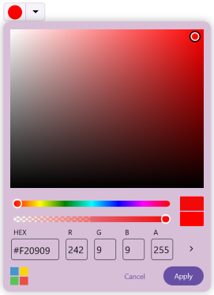

### Popup relative position

The [PopupRelativePosition](https://help.syncfusion.com/cr/maui/Syncfusion.Maui.Inputs.SfColorPicker.html#Syncfusion_Maui_Inputs_SfColorPicker_PopupRelativePosition) property specifies the placement of the popup in the Color Picker control. It supports the following eight positioning options:

* [AlignBottom](https://help.syncfusion.com/cr/maui/Syncfusion.Maui.Popup.PopupRelativePosition.html#Syncfusion_Maui_Popup_PopupRelativePosition_AlignBottom)
* [AlignBottomLeft](https://help.syncfusion.com/cr/maui/Syncfusion.Maui.Popup.PopupRelativePosition.html#Syncfusion_Maui_Popup_PopupRelativePosition_AlignBottomLeft)
* [AlignBottomRight](https://help.syncfusion.com/cr/maui/Syncfusion.Maui.Popup.PopupRelativePosition.html#Syncfusion_Maui_Popup_PopupRelativePosition_AlignBottomRight)
* [AlignToLeftOf](https://help.syncfusion.com/cr/maui/Syncfusion.Maui.Popup.PopupRelativePosition.html#Syncfusion_Maui_Popup_PopupRelativePosition_AlignToLeftOf)
* [AlignTop](https://help.syncfusion.com/cr/maui/Syncfusion.Maui.Popup.PopupRelativePosition.html#Syncfusion_Maui_Popup_PopupRelativePosition_AlignTop)
* [AlignTopLeft](https://help.syncfusion.com/cr/maui/Syncfusion.Maui.Popup.PopupRelativePosition.html#Syncfusion_Maui_Popup_PopupRelativePosition_AlignTopLeft)
* [AlignTopRight](https://help.syncfusion.com/cr/maui/Syncfusion.Maui.Popup.PopupRelativePosition.html#Syncfusion_Maui_Popup_PopupRelativePosition_AlignTopRight)
* [AlignTopRightOf](https://help.syncfusion.com/cr/maui/Syncfusion.Maui.Popup.PopupRelativePosition.html#Syncfusion_Maui_Popup_PopupRelativePosition_AlignToRightOf)

The default position is [AlignBottom](https://help.syncfusion.com/cr/maui/Syncfusion.Maui.Popup.PopupRelativePosition.html#Syncfusion_Maui_Popup_PopupRelativePosition_AlignBottom).




<inputs:SfColorPicker x:Name="colorPicker" PopupRelativePosition="AlignTop"/>




SfColorPicker colorPicker = new SfColorPicker()
{
    PopupRelativePosition = PopupRelativePosition.AlignTop
};




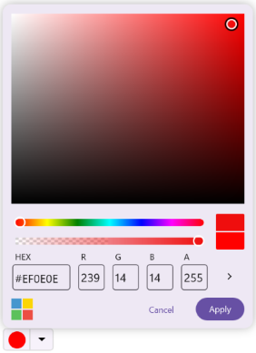
