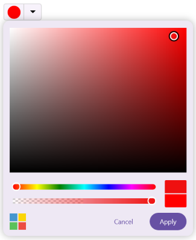
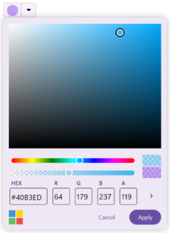
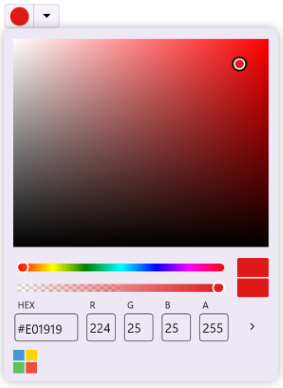
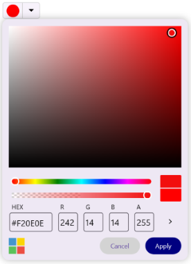
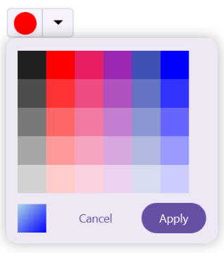

# Customization in .NET MAUI Color Picker (SfColorPicker)

## Show recent colors

You can display the recently selected colors in the Color Picker when in `Palette` mode by enabling the `ShowRecentColors` property. By default, it is set to `True`.





<inputs:SfColorPicker ShowRecentColors="True"/>





SfColorPicker colorPicker = new SfColorPicker()
{
    ShowRecentColors = true
};





## Show input area

You can show or hide the input area of the Color Picker by adjusting the `ShowInputArea` property. By default, it is set to `True`.





<inputs:SfColorPicker ShowInputArea="False"/>





SfColorPicker colorPicker = new SfColorPicker()
{
    ShowInputArea = false
};
    




## Alpha slider

The alpha slider is used to control the transparency of the selected color. You can show or hide the alpha slider by adjusting the `ShowAlphaSlider` property. By default, it is set to `True`.





<inputs:SfColorPicker ShowAlphaSlider="True"/>





SfColorPicker colorPicker = new SfColorPicker()
{
    ShowAlphaSlider = true
};
    




## Switch color mode

To display the Color Picker in a single mode without allowing users to switch between different modes, set the `ColorMode` property to `Palette` (or Spectrum), and disable the mode switcher UI by setting the `IsColorModeSwitcherVisible` property to `False`. By default, `IsColorModeSwitcherVisible` is set to `True`, allowing users to toggle between modes.





<inputs:SfColorPicker ColorMode="Palette" IsColorModeSwitcherVisible="False"/>





SfColorPicker colorPicker = new SfColorPicker()
{
    ColorMode = ColorPickerMode.Palette,
    IsColorModeSwitcherVisible = false
};
    




## Action buttons

You can render the Color Picker without the Apply and Cancel buttons for a seamless color selection experience. When the control buttons are hidden, the selected color is applied instantly, and the Color Picker popup closes automatically upon selection. To enable this, simply set the `IsActionButtonsVisible` property to `False`.





<inputs:SfColorPicker IsActionButtonsVisible="False"/>





SfColorPicker colorPicker = new SfColorPicker()
{
    IsActionButtonsVisible = false
};
    




## Customize action buttons

You can customize the backgroun color for the action buttons by specifying a suitable color for the `ApplyButtonBackground` and `CancelButtonBackground` properties.





<inputs:SfColorPicker ApplyButtonBackground="Navy"
                      CancelButtonBackground="LightGrey">
</inputs:SfColorPicker>





SfColorPicker colorPicker = new SfColorPicker()
{
    ApplyButtonBackground = Colors.Navy,
    CancelButtonBackground = Colors.LightGrey
};
    




## No color option

The `ShowNoColor` property determines whether the `No Color` option is displayed in the Color Picker UI. This option allows users to clear their selection from the palette, effectively choosing no color. By default, this property is set to `False`.





<inputs:SfColorPicker ShowNoColor="True"/>    





SfColorPicker colorPicker = new SfColorPicker()
{
    ShowNoColor = true
};
    




## Palette count

The `PaletteColumnCount` and `PaletteRowCount` properties define the number of columns and rows displayed in the palette grid. By default, both are set to 10.





<inputs:SfColorPicker PaletteColumnCount="4" PaletteRowCount="5"/>    





SfColorPicker colorPicker = new SfColorPicker()
{
    PaletteColumnCount = 4,
    PaletteRowCount = 5
};
    




## Palette spacing

The `PaletteColumnSpacing` property defines the horizontal spacing between columns, while the `PaletteRowSpacing` property defines the vertical spacing between rows in `Palette` mode. By default, both properties are set to 0, meaning the swatches are placed directly next to each other without any spacing.




<inputs:SfColorPicker PaletteColumnSpacing="10"
                      PaletteRowSpacing="10"/>




SfColorPicker colorPicker = new SfColorPicker()
{
    PaletteColumnSpacing = 10,
    PaletteRowSpacing = 10
};




