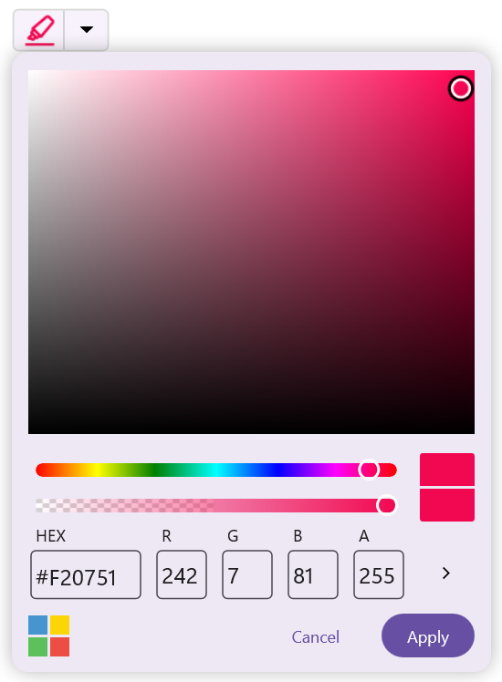
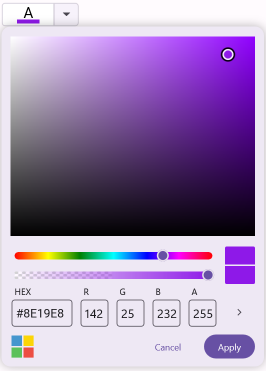
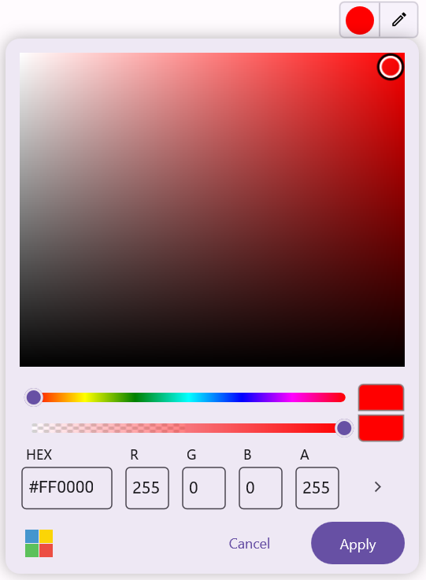

# Display View Customization

The display view of the .NET MAUI Color Picker (`SfColorPicker`) is the header area that shows the currently selected color, a drop-down button that opens the picker, and optional icons. This topic explains how to customize that header — its icon, template, dimensions, and border.

## Selected color customization

Use the properties in this section to customize how the currently selected color is presented in the display view.

### Selected color icon

You can customize the selected color icon in the Color Picker using the [SelectedColorIcon](https://help.syncfusion.com/cr/maui/Syncfusion.Maui.Inputs.SfColorPicker.html#Syncfusion_Maui_Inputs_SfColorPicker_SelectedColorIcon) property.





<inputs:SfColorPicker x:Name="colorPicker">
    <inputs:SfColorPicker.SelectedColorIcon>
        <FontImageSource FontFamily="MauiMaterialAssets" Glyph="&#xe760;" Color="{Binding Source={x:Reference colorPicker},Path=SelectedColor}"/>
    </inputs:SfColorPicker.SelectedColorIcon>
</inputs:SfColorPicker>





SfColorPicker colorPicker = new SfColorPicker();

var fontIcon = new FontImageSource
{
    FontFamily = "MauiMaterialAssets",
    Glyph = "\ue760",
    Color = colorPicker.SelectedColor
};

colorPicker.SelectedColorIcon = fontIcon;

colorPicker.ColorChanged += (s, e) =>
{
    fontIcon.Color = e.NewColor;
};

this.Content = colorPicker;





> Subscribe to the [ColorChanged](https://help.syncfusion.com/cr/maui/Syncfusion.Maui.Inputs.SfColorPicker.html#Syncfusion_Maui_Inputs_SfColorPicker_ColorChanged) event when you update the icon color in code-behind, so the icon stays in sync with the user-selected color.

### Selected color icon size

You can customize the size of the selected color icon displayed in the Color Picker using the [SelectedColorIconSize](https://help.syncfusion.com/cr/maui/Syncfusion.Maui.Inputs.SfColorPicker.html#Syncfusion_Maui_Inputs_SfColorPicker_SelectedColorIconSize) property.





<inputs:SfColorPicker SelectedColorIconSize="32" />





SfColorPicker colorPicker = new SfColorPicker()
{
    SelectedColorIconSize = 32
};

this.Content = colorPicker;





### Selected color template

To customize the appearance of the selected color, use the [SelectedColorTemplate](https://help.syncfusion.com/cr/maui/Syncfusion.Maui.Inputs.SfColorPicker.html#Syncfusion_Maui_Inputs_SfColorPicker_SelectedColorTemplate) property to define a custom template.





<inputs:SfColorPicker x:Name="colorPicker">
    <inputs:SfColorPicker.SelectedColorTemplate>
        <DataTemplate>
            <VerticalStackLayout WidthRequest="70" Background="White">
                <Label Text="A" HorizontalOptions="Center" TextColor="Black"/>
                <BoxView HeightRequest="5" WidthRequest="30" Background="{Binding Source={x:Reference colorPicker},Path=SelectedColor}" />
            </VerticalStackLayout>
        </DataTemplate>
    </inputs:SfColorPicker.SelectedColorTemplate>
</inputs:SfColorPicker>





SfColorPicker colorPicker = new SfColorPicker();

colorPicker.SelectedColorTemplate = new DataTemplate(() =>
{
    var label = new Label
    {
        Text = "A",
        HorizontalOptions = LayoutOptions.Center,
        TextColor = Colors.Black
    };

    // Create the box view and bind its Background to colorPicker.SelectedColor.
    var boxView = new BoxView
    {
        HeightRequest = 5,
        WidthRequest = 30
    };

    boxView.SetBinding(BoxView.BackgroundProperty, new Binding
    {
        Source = colorPicker,
        Path = "SelectedColor",
        Mode = BindingMode.OneWay
    });

    // Create the layout.
    var stackLayout = new VerticalStackLayout
    {
        WidthRequest = 70,
        BackgroundColor = Colors.White,
        Children = { label, boxView }
    };

    return stackLayout;
});

this.Content = colorPicker;





---

## Drop-down icon customization

Use the properties in this section to customize the drop-down button that opens the color picker.

### Drop-down icon

The drop-down icon of the Color Picker can be customized using the [DropDownButtonTemplate](https://help.syncfusion.com/cr/maui/Syncfusion.Maui.Inputs.SfColorPicker.html#Syncfusion_Maui_Inputs_SfColorPicker_DropDownButtonTemplate) property.





<inputs:SfColorPicker x:Name="colorPicker">
    <inputs:SfColorPicker.DropDownButtonTemplate>
        <DataTemplate>
            <Label Text="&#xe705;" FontFamily="MauiMaterialAssets" FontSize="14" TextColor="Black" VerticalTextAlignment="Center" HorizontalTextAlignment="Center" />
        </DataTemplate>
    </inputs:SfColorPicker.DropDownButtonTemplate>
</inputs:SfColorPicker>





SfColorPicker colorPicker = new SfColorPicker();

var dropDownTemplate = new DataTemplate(() =>
{
    return new Label
    {
        Text = "\ue705",
        FontFamily = "MauiMaterialAssets",
        TextColor = Colors.Black,
        FontSize = 14,
        VerticalTextAlignment = TextAlignment.Center,
        HorizontalTextAlignment = TextAlignment.Center
    };
});

colorPicker.DropDownButtonTemplate = dropDownTemplate;

this.Content = colorPicker;





### Drop-down width

You can set the width of the drop-down button displayed in the Color Picker using the [DropDownWidth](https://help.syncfusion.com/cr/maui/Syncfusion.Maui.Inputs.SfColorPicker.html#Syncfusion_Maui_Inputs_SfColorPicker_DropDownWidth) property.





<inputs:SfColorPicker DropDownWidth="48" />





SfColorPicker colorPicker = new SfColorPicker()
{
    DropDownWidth = 48
};

this.Content = colorPicker;





---

## Display view appearance

Use the properties in this section to control the size and border of the display view.

### Display view height

You can control the height of the display view shown in the Color Picker using the [DisplayViewHeight](https://help.syncfusion.com/cr/maui/Syncfusion.Maui.Inputs.SfColorPicker.html#Syncfusion_Maui_Inputs_SfColorPicker_DisplayViewHeight) property.





<inputs:SfColorPicker DisplayViewHeight="48" />





SfColorPicker colorPicker = new SfColorPicker()
{
    DisplayViewHeight = 48
};

this.Content = colorPicker;





### Display view stroke color

You can customize the border color of the display view in the Color Picker using the [DisplayViewStroke](https://help.syncfusion.com/cr/maui/Syncfusion.Maui.Inputs.SfColorPicker.html#Syncfusion_Maui_Inputs_SfColorPicker_DisplayViewStroke) property.





<inputs:SfColorPicker DisplayViewStroke="Red" />





SfColorPicker colorPicker = new SfColorPicker()
{
    DisplayViewStroke = Colors.Red
};

this.Content = colorPicker;





### Display view stroke thickness

You can define the thickness of the display view border using the [DisplayViewStrokeThickness](https://help.syncfusion.com/cr/maui/Syncfusion.Maui.Inputs.SfColorPicker.html#Syncfusion_Maui_Inputs_SfColorPicker_DisplayViewStrokeThickness) property.





<inputs:SfColorPicker DisplayViewStrokeThickness="3" />





SfColorPicker colorPicker = new SfColorPicker()
{
    DisplayViewStrokeThickness = 3
};

this.Content = colorPicker;



