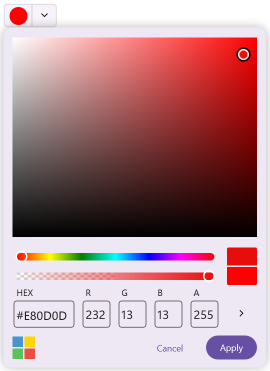

# Display View Customization

## Selected color customization

### Selected color icon

You can customize the selected color icon in the Color Picker using the `SelectedColorIcon` property.





<inputs:SfColorPicker x:Name="colorPicker">
    <inputs:SfColorPicker.SelectedColorIcon>
        <FontImageSource FontFamily="MauiMaterialAssets" Glyph="&#xe760;" Color="{Binding Source={x:Reference colorPicker},Path=SelectedColor}"/>
    </inputs:SfColorPicker.SelectedColorIcon>
</inputs:SfColorPicker>





var fontIcon = new FontImageSource
{
    FontFamily = "MauiMaterialAssets",
    Glyph = "\ue760", 
    Color = colorPicker.SelectedColor 
};

colorPicker.SelectedColorIcon = fontIcon;

colorPicker.ColorChanged += (s, e) =>
{
    fontIcon.Color = e.NewColor;
};





### Selected color template

To customize the appearance of the selected color, use the `SelectedColorTemplate` property to define a custom template.





<inputs:SfColorPicker x:Name="colorPicker">
    <inputs:SfColorPicker.SelectedColorTemplate>
        <DataTemplate>
            <Border BackgroundColor="{Binding SelectedColor}">
            <Label Text="Looks Good!" FontAttributes="Bold" HorizontalTextAlignment="Center" VerticalTextAlignment="Center"/>
            </Border>
        </DataTemplate>
    </inputs:SfColorPicker.SelectedColorTemplate>
</inputs:SfColorPicker>





colorPicker.SelectedColorTemplate = new DataTemplate(() =>
{
    var border = new Border();
    border.SetBinding(Border.BackgroundColorProperty, "SelectedColor");

    var label = new Label
    {
        Text = "Looks Good!",
        FontAttributes = FontAttributes.Bold,
        HorizontalTextAlignment = TextAlignment.Center,
        VerticalTextAlignment = TextAlignment.Center
    };

    border.Content = label;
    return border;
});

Content = colorPicker;    





## Drop-down icon

The drop-down icon of the Color Picker can be customized using the `DropDownButtonTemplate` property.





<inputs:SfColorPicker x:Name="colorPicker">
    <inputs:SfColorPicker.DropDownButtonTemplate>
        <DataTemplate>
            <Label Text="&#xe710;" FontFamily="MauiMaterialAssets" FontSize="14" TextColor="Black" VerticalTextAlignment="Center" HorizontalTextAlignment="Center" />
        </DataTemplate>
    </inputs:SfColorPicker.DropDownButtonTemplate>
</inputs:SfColorPicker>





var dropDownTemplate = new DataTemplate(() =>
{
    return new Label
    {
        Text = "\ue710", 
        FontFamily = "MauiMaterialAssets",
        TextColor = Colors.Black,
        FontSize = 14,
        VerticalTextAlignment = TextAlignment.Center,
        HorizontalTextAlignment = TextAlignment.Center
    };
});

SfColorPicker colorPicker = new SfColorPicker
{
    DropDownButtonTemplate = dropDownTemplate
};

Content = colorPicker;
    




