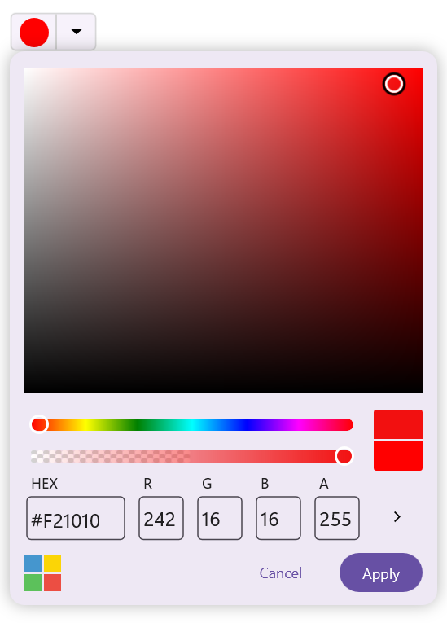

# Getting Started with .NET MAUI Color Picker

This section guides you through setting up and configuring a `SfColorPicker` in your .NET MAUI application. Follow the steps below to add a basic Color Picker to your project.




## Prerequisites

Before proceeding, ensure the following are set up:

1. Install [.NET 8 SDK](https://dotnet.microsoft.com/en-us/download/dotnet/8.0) or later.
2. Set up a .NET MAUI environment with Visual Studio 2022 (v17.3 or later).

## Step 1: Create a new .NET MAUI project

1. Go to **File > New > Project** and choose the **.NET MAUI App** template.
2. Name the project and choose a location. Then, click **Next**.
3. Select the .NET framework version and click **Create**.

## Step 2: Install the Syncfusion® MAUI Inputs NuGet package

1.  In **Solution Explorer**, right-click the project and choose **Manage NuGet Packages**.
2.  Search for [Syncfusion.Maui.Inputs](https://www.nuget.org/packages/Syncfusion.Maui.Inputs) and install the latest version.
3.  Ensure the necessary dependencies are installed correctly, and the project is restored.

## Step 3: Register the handler

[Syncfusion.Maui.Core](https://www.nuget.org/packages/Syncfusion.Maui.Core/) NuGet is a dependent package for all Syncfusion® controls of .NET MAUI. In the `MauiProgram.cs` file, register the handler for Syncfusion® core.



using Syncfusion.Maui.Core.Hosting;

namespace ColorPickerSample
{
    public static class MauiProgram
    {
    public static MauiApp CreateMauiApp()
    {
        var builder = MauiApp.CreateBuilder();
        builder
        .UseMauiApp<App>()
        .ConfigureSyncfusionCore() 
        .ConfigureFonts(fonts =>
        {
            fonts.AddFont("OpenSans-Regular.ttf", "OpenSansRegular");
        });

        return builder.Build();
        }      
    }
}     

 

## Step 4: Add a basic Color Picker

1. To initialize the control, import the Inputs namespace.

2. Initialize the `SfColorPicker`.





<ContentPage 
            ...
            xmlns:inputs="clr-namespace:Syncfusion.Maui.Inputs;assembly=Syncfusion.Maui.Inputs">

    <ContentPage.Content> 
	 	<inputs:SfColorPicker x:Name="colorPicker"/>
	</ContentPage.Content> 

</ContentPage>
	




using Syncfusion.Maui.Inputs;

namespace ColorPickerSample   
{  
	public partial class MainPage : ContentPage                  
	{ 
		public MainPage()   
		{   
			InitializeComponent();       
			SfColorPicker colorPicker = new SfColorPicker();
            Content = colorPicker;
		}  
	}  
}  








## Prerequisites

Before proceeding, ensure the following are set up:

1. Install [.NET 8 SDK](https://dotnet.microsoft.com/en-us/download/dotnet/8.0) or later.
2. Set up a .NET MAUI environment with Visual Studio Code.
3. Ensure that the .NET MAUI extension is installed and configured as described [here](https://learn.microsoft.com/en-us/dotnet/maui/get-started/installation?view=net-maui-8.0&tabs=visual-studio-code).

## Step 1: Create a new .NET MAUI project

1. Open the command palette by pressing `Ctrl+Shift+P` and type **.NET:New Project** and enter.
2. Choose the **.NET MAUI App** template.
3. Select the project location, type the project name and press **Enter**.
4. Then choose **Create project**.

## Step 2: Install the Syncfusion® MAUI Inputs NuGet package

1. Press <kbd>Ctrl</kbd> + <kbd>`</kbd> (backtick) to open the integrated terminal in Visual Studio Code.
2. Ensure you're in the project root directory where your .csproj file is located.
3. Run the command `dotnet add package Syncfusion.Maui.Inputs` to install the Syncfusion® .NET MAUI Inputs package.
4. To ensure all dependencies are installed, run `dotnet restore`.

## Step 3: Register the handler

[Syncfusion.Maui.Core](https://www.nuget.org/packages/Syncfusion.Maui.Core/) NuGet is a dependent package for all Syncfusion® controls of .NET MAUI. In the `MauiProgram.cs` file, register the handler for Syncfusion® core.



using Syncfusion.Maui.Core.Hosting;

namespace ColorPickerSample
{
    public static class MauiProgram
    {
    public static MauiApp CreateMauiApp()
    {
        var builder = MauiApp.CreateBuilder();
        builder
        .UseMauiApp<App>()
        .ConfigureSyncfusionCore() 
        .ConfigureFonts(fonts =>
        {
            fonts.AddFont("OpenSans-Regular.ttf", "OpenSansRegular");
        });

        return builder.Build();
        }      
    }
}     

 

## Step 4: Add a basic Color Picker

1. To initialize the control, import the Inputs namespace.

2. Initialize the `SfColorPicker`.





<ContentPage 
            ...
            xmlns:inputs="clr-namespace:Syncfusion.Maui.Inputs;assembly=Syncfusion.Maui.Inputs">
    
    <ContentPage.Content> 
	 	<core:SfColorPicker x:Name="colorPicker"/>
	</ContentPage.Content> 

</ContentPage>
	




using Syncfusion.Maui.Inputs;

namespace ColorPickerSample   
{  
	public partial class MainPage : ContentPage                  
	{ 
		public MainPage()   
		{   
			InitializeComponent();       
			SfColorPicker colorPicker = new SfColorPicker();
            Content = colorPicker;   
		}  
	}
}  









## Prerequisites

Before proceeding, ensure the following are set up:

1. Ensure you have the latest version of JetBrains Rider.
2. Install [.NET 8 SDK](https://dotnet.microsoft.com/en-us/download/dotnet/8.0) or later.
3. Make sure the MAUI workloads are installed and configured as described [here](https://www.jetbrains.com/help/rider/MAUI.html#before-you-start).

## Step 1: Create a new .NET MAUI project

1. Go to **File > New Solution,** Select .NET (C#) and choose the **.NET MAUI App** template.
2. Enter the Project Name, Solution Name, and Location.
3. Select the .NET framework version and click **Create**.

## Step 2: Install the Syncfusion® MAUI Inputs NuGet package

1. In **Solution Explorer**, right-click the project and choose **Manage NuGet Packages**.
2. Search for [Syncfusion.Maui.Inputs](https://www.nuget.org/packages/Syncfusion.Maui.Inputs) and install the latest version.
3. Ensure the necessary dependencies are installed correctly, and the project is restored. If not, open the terminal in Rider and manually run: `dotnet restore`.

## Step 3: Register the handler

[Syncfusion.Maui.Core](https://www.nuget.org/packages/Syncfusion.Maui.Core/) NuGet is a dependent package for all Syncfusion® controls of .NET MAUI. In the `MauiProgram.cs` file, register the handler for Syncfusion® core.



using Syncfusion.Maui.Core.Hosting;

namespace ColorPickerSample
{
    public static class MauiProgram
    {
    public static MauiApp CreateMauiApp()
    {
        var builder = MauiApp.CreateBuilder();
        builder
        .UseMauiApp<App>()
        .ConfigureSyncfusionCore() 
        .ConfigureFonts(fonts =>
        {
            fonts.AddFont("OpenSans-Regular.ttf", "OpenSansRegular");
        });

        return builder.Build();
        }      
    }
}     

 

## Step 4: Add a basic Color Picker

1. To initialize the control, import the Inputs namespace.

2. Initialize the `SfColorPicker`.





<ContentPage 
            ...
            xmlns:inputs="clr-namespace:Syncfusion.Maui.Inputs;assembly=Syncfusion.Maui.Inputs">
    <ContentPage.Content> 
	 	<core:SfColorPicker x:Name="colorPicker"/>
	</ContentPage.Content> 
</ContentPage>
	




using Syncfusion.Maui.Inputs;

namespace ColorPickerSample   
{  
	public partial class MainPage : ContentPage                  
	{ 
		public MainPage()   
		{   
			InitializeComponent();       
			SfColorPicker colorPicker = new SfColorPicker();
            Content = colorPicker;
		}  
	}  
}  








The following gif image illustrates the result of the above code.

{:width="524" height="681" loading="lazy"}