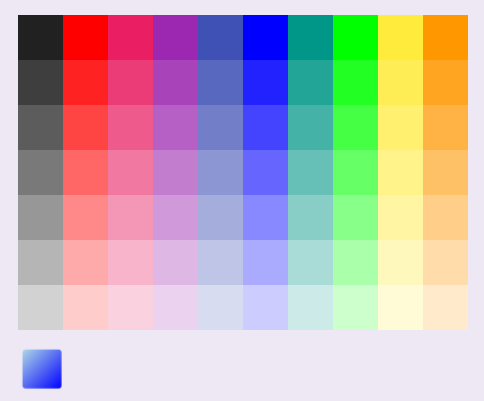

# Inline Rendering in .NET MAUI Color Picker

The [.NET MAUI Color Picker](https://help.syncfusion.com/cr/maui/Syncfusion.Maui.Inputs.SfColorPicker.html) supports an inline rendering mode that embeds the color editor directly within the page layout, rather than opening it in a pop-up or flyout. By default, `IsInline` is `false`, so the picker is shown inside a pop-up triggered from the drop-down button.

## Behavior

When [`IsInline`](https://help.syncfusion.com/cr/maui/Syncfusion.Maui.Inputs.SfColorPicker.html#Syncfusion_Maui_Inputs_SfColorPicker_IsInline) is set to `true`, the color editor is rendered as part of the page layout. The following changes apply:

- The drop-down button and selected-color display view are **not** shown.
- The color editor (palette, spectrum, sliders, and so on) takes up the space allocated to the picker in the layout.
- The [`IsActionButtonsVisible`](https://help.syncfusion.com/cr/maui/Syncfusion.Maui.Inputs.SfColorPicker.html#Syncfusion_Maui_Inputs_SfColorPicker_IsActionButtonsVisible) property has no effect in inline mode (OK/Cancel buttons are only meaningful in pop-up mode).

## Enable inline rendering

Set the `IsInline` property to `true` in your XAML or C# code, as shown in the following example:





<inputs:SfColorPicker IsInline="True" />





SfColorPicker colorPicker = new SfColorPicker()
{
    IsInline = true
};

this.Content = colorPicker;





## Embed the inline picker in a layout

The inline picker participates in the page layout like any other view, so you can size and place it with a `Grid`, `StackLayout`, or any other parent layout:





<Grid Padding="12" RowDefinitions="Auto,*" RowSpacing="8">

    <Label Grid.Row="0"
           Text="Pick a background color"
           FontAttributes="Bold" />

    <inputs:SfColorPicker Grid.Row="1"
                              IsInline="True"
                              ColorChanged="OnColorChanged" />

</Grid>





SfColorPicker colorPicker = new SfColorPicker
{
    IsInline = true
};
colorPicker.ColorChanged += (s, e) =>
{
    this.BackgroundColor = e.NewColor;
};

Content = new Grid
{
    Padding = 12,
    RowDefinitions =
    {
        new RowDefinition { Height = GridLength.Auto },
        new RowDefinition { Height = new GridLength(1, GridUnitType.Star) }
    },
    Children =
    {
        new Label { Text = "Pick a background color", FontAttributes = FontAttributes.Bold },
        colorPicker
    }
};



