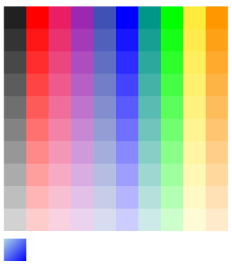

# Inline Rendering in .NET MAUI Color Picker (SfColorPicker)

The [.NET MAUI Color Picker](https://help.syncfusion.com/cr/maui/Syncfusion.Maui.Inputs.SfColorPicker.html) provides an inline support feature, which determines how the Color Picker is embedded directly within the UI layout, rather than appearing in a popup or flyout. By default, this feature is set to `False`, meaning that the Color Picker is not initially embedded inline within the layout.

To enable inline rendering, you can set the [IsInline](https://help.syncfusion.com/cr/maui/Syncfusion.Maui.Inputs.SfColorPicker.html#Syncfusion_Maui_Inputs_SfColorPicker_IsInline) property to `True` in your XAML or C# code, as demonstrated below:





<inputs:SfColorPicker IsInline="True"/>          





SfColorPicker colorPicker = new SfColorPicker()
{
    IsInline = true
};





