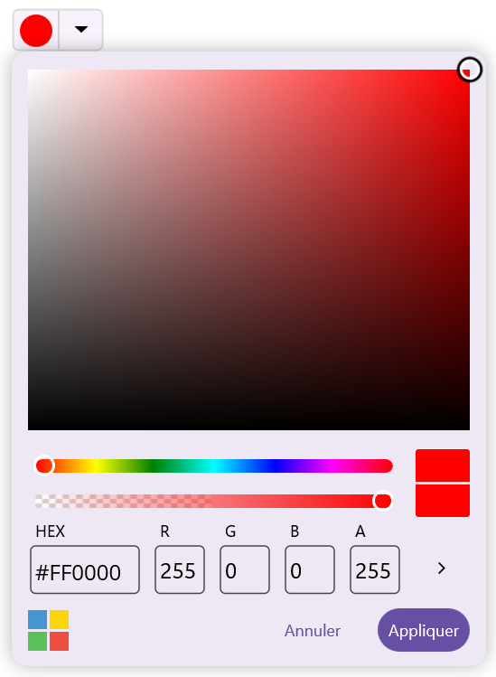
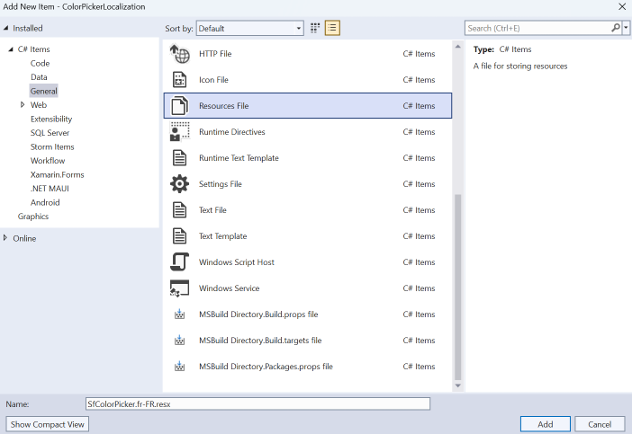
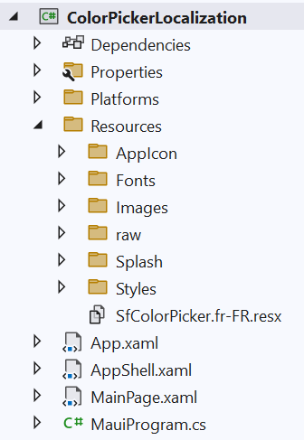
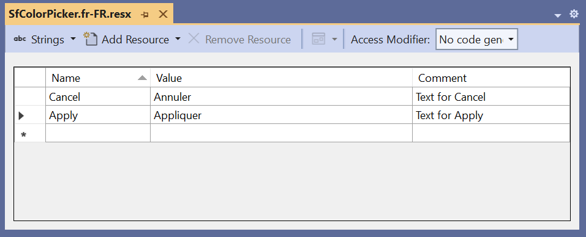

# Localization in .NET MAUI Color Picker

Localization is the process of translating application resources into different languages for specific cultures. The [SfColorPicker](https://help.syncfusion.com/cr/maui/Syncfusion.Maui.Inputs.SfColorPicker.html) ships with a default `SfColorPickerResources` resource manager that exposes a set of localizable strings. You can override those strings for any culture by adding a culture-specific `.resx` file and pointing the resource manager at it.

## Set the UI culture

Set the application's UI culture in `App.xaml.cs` (or in `MauiProgram.CreateMauiApp` before any UI loads) so the resource manager resolves the right `.resx` at startup.




using System.Globalization;
using Microsoft.Maui.Controls;

public partial class App : Application
{
    public App()
    {
        InitializeComponent();

        // Set the UI culture that the resource manager will use to resolve strings.
        CultureInfo.CurrentUICulture = new CultureInfo("fr-FR");
        // Also set the culture used for number/date formatting.
        CultureInfo.CurrentCulture = new CultureInfo("fr-FR");
    }
}




N> Setting `CurrentUICulture` after the resource manager is initialized has no effect for the current process. Restart the app to switch cultures.

## Register a custom resource manager

If you want to override the default `SfColorPickerResources` strings, register a custom `ResourceManager` that points at your own `.resx`. The `ResXPath` is the fully-qualified base name of the resource set (without the `.resources` extension and without the culture suffix).




using System.Globalization;
using System.Resources;
using Syncfusion.Maui.Inputs;
using Microsoft.Maui.Controls;

public partial class App : Application
{
    public App()
    {
        InitializeComponent();

        CultureInfo.CurrentUICulture = new CultureInfo("fr-FR");
        CultureInfo.CurrentCulture = new CultureInfo("fr-FR");

        // Replace this with the base name of your resource set.
        // For a .resx located at /Resources/SfColorPicker.fr-FR.resx in an assembly
        // whose default namespace is "ColorPickerLocalization", the base name is:
        //   "ColorPickerLocalization.Resources.SfColorPicker"
        const string ResXPath = "ColorPickerLocalization.Resources.SfColorPicker";

        SfColorPickerResources.ResourceManager = new ResourceManager(
            ResXPath,
            Application.Current.GetType().Assembly);
    }
}




N> Ensure the required `.resx` files are included with **Build Action** set to `EmbeddedResource`, the **Access Modifier** is set to `Public`, and the file name contains the culture code, inside the `Resources` folder.

## Add a culture-specific resource file

To localize the color picker based on `CurrentUICulture` using `.resx` files, follow the steps below.

1. **Create the neutral resource file first.** Add a default `SfColorPicker.resx` to the `Resources` folder. The picker falls back to this file when a culture-specific `.resx` is not present.

2. **Add a culture-specific resource file.** Right-click the `Resources` folder, select **Add**, and then **New Item**.

3. In the **Add New Item** wizard, select **Resources File** and name the file `SfColorPicker.<culture name>.resx`. For example, name it `SfColorPicker.fr-FR.resx` for the French (France) culture. The culture name combines the language and country codes (e.g., `de-DE`, `es-ES`, `ja-JP`).

   

4. Click **Add** to include the resource file in the **Resources** folder.

   

5. Select the new `.resx` file in **Solution Explorer**, open the **Properties** window, and set:
   - **Build Action** to `EmbeddedResource`
   - **Custom Tool** to `PublicResXFileCodeGenerator`
   - **Access Modifier** to `Public`

6. Add Name/Value pairs in the resource designer. Use the same `Name` values that `SfColorPickerResources` exposes, and set the `Value` column to the translated string.

   

   Example for `SfColorPicker.fr-FR.resx`:

   | Name | Value (en-US default) | Value (fr-FR) |
   | --- | --- | --- |
   | `Red` | Red | Rouge |
   | `Green` | Green | Vert |
   | `Blue` | Blue | Bleu |
   | `OK` | OK | OK |
   | `Cancel` | Cancel | Annuler |

7. Rebuild the project so the resource generator emits the strongly-typed `SfColorPicker` (or your custom) resource class.

8. Run the app. The color picker reads strings from the `.resx` that matches `CurrentUICulture`. If no match is found, the neutral `SfColorPicker.resx` is used.
